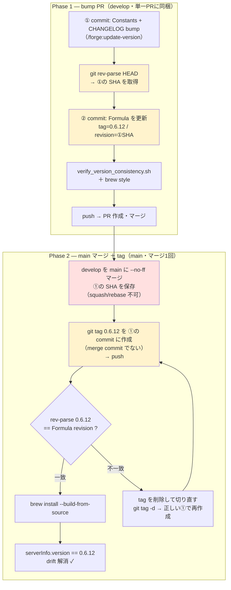
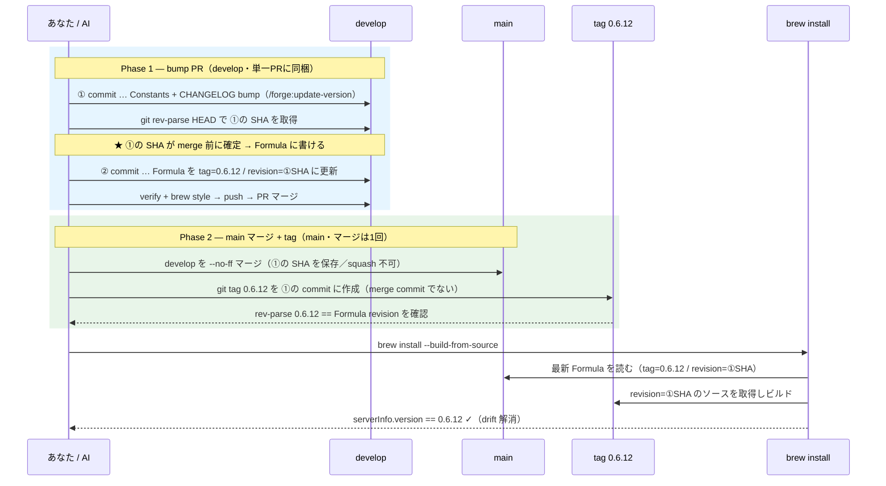

# コントリビューション

Issue、Pull Request を歓迎します！

ビルド・セットアップ・使い方は [README](README.ja.md) を参照してください。

English version: [CONTRIBUTING.md](CONTRIBUTING.md)

## リリース手順（メンテナ向け）

バージョン更新と Homebrew Formula の更新手順です。**正規かつ実行可能な手順は [CLAUDE.md](CLAUDE.md)**（release 運用順序のセクション）を出典とし、以下の図は理解補助です。

> **3 つの肝**
> 1. `git rev-parse HEAD` で **①の SHA を merge 前に確定**する（だから Formula を先に書ける）
> 2. Formula の `revision` に **①の SHA** を書き、**tag も①に打つ**（merge commit ではない）
> 3. main へは **`--no-ff` マージ**（squash / rebase は①の SHA が消えるため不可）

### フロー図（手順チェックリスト）

### シーケンス図（時系列と「なぜ」）

