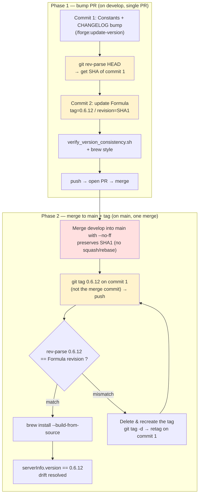
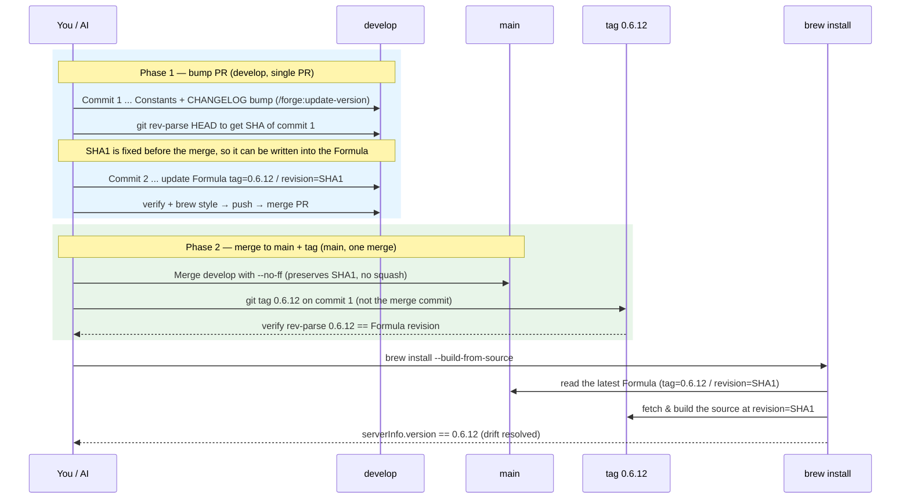

# Contributing

Issues and Pull Requests are welcome!

For build, setup, and usage instructions, see the [README](README.md).

Japanese version: [CONTRIBUTING.ja.md](CONTRIBUTING.ja.md)

## Release procedure (maintainers)

Steps for bumping the version and the Homebrew Formula. **The authoritative, executable procedure lives in [CLAUDE.md](CLAUDE.md)** (the release-flow section); the diagrams below are a visual aid.

> **Three key points**
> 1. Capture **commit 1's SHA before the merge** with `git rev-parse HEAD` — this is why the Formula can be written up front.
> 2. Write **commit 1's SHA** into the Formula's `revision`, and **tag commit 1** (not the merge commit).
> 3. Merge into `main` with **`--no-ff`** — a squash / rebase merge would discard commit 1's SHA.

### Flowchart (step checklist)

### Sequence diagram (timing and the "why")

