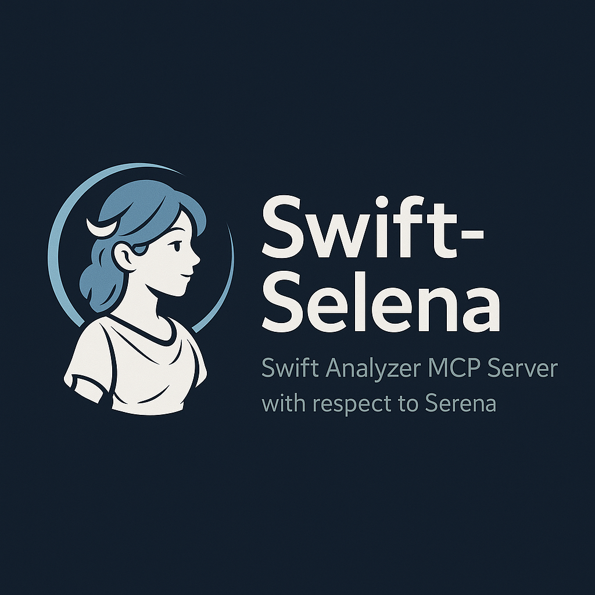

# Swift Selena - Swift Analyzer MCP Server with respect to Serena



**Swift Selena**は、Swiftプロジェクトのコード解析をClaude（AI）に提供するMCP (Model Context Protocol) サーバーです。ビルドエラーがあるコードでも動作し、SwiftUIアプリ開発を強力にサポートします。

[](https://swift.org)
[](https://www.apple.com/macos/)
[](LICENSE)

[English version](README.md)

## 主な特徴

- **ビルド不要**: SwiftSyntaxベースの静的解析により、ビルドエラーがあっても動作
- **LSP統合**: ビルド可能時はSourceKit-LSPで高度な機能を提供（v0.5.1+）
- **SwiftUI対応**: Property Wrapper（@State, @Binding等）を自動検出
- **高速検索**: ファイルシステムベースの検索で大規模プロジェクトでも高速
- **プロジェクト記憶**: 解析結果とメモを永続化し、セッション間で共有
- **複数クライアント対応**: Claude CodeとClaude Desktopを同時使用可能

## 提供ツール

### プロジェクト管理
- **`initialize_project`** - プロジェクトを初期化（最初に必ず実行）

### ファイル検索
- **`find_files`** - ワイルドカードパターンでファイル検索（例: `*ViewModel.swift`）
- **`search_code`** - 正規表現でコード内容を検索

### SwiftSyntax解析
- **`list_symbols`** - Class, Struct, Function等のシンボル一覧
- **`find_symbol_definition`** - プロジェクト全体でシンボル定義を検索
- **`list_property_wrappers`** - SwiftUI Property Wrapper（@State, @Binding等）を検出
- **`list_protocol_conformances`** - Protocol準拠と継承関係を解析（UITableViewDelegate, ObservableObject等）
- **`list_extensions`** - Extension解析（拡張対象の型、プロトコル準拠、メンバー一覧）
- **`analyze_imports`** - プロジェクト全体のImport依存関係を解析（モジュール使用統計、キャッシュ利用）
- **`get_type_hierarchy`** - 型の継承階層を取得（スーパークラス、サブクラス、Protocol準拠型、キャッシュ利用）
- **`find_test_cases`** - XCTestケースとテストメソッドを検出
- **`find_type_usages`** - 型の使用箇所を検出（変数宣言、関数パラメータ、戻り値型）

### 効率的な読み取り
- **`read_symbol`** - シンボル単位で読み取り（関数、クラス、構造体等）

### LSP統合機能（v0.5.2+、ビルド可能時のみ）
- **`find_symbol_references`** - シンボル参照検索（型情報ベース、LSP使用）
  - 型情報を使った正確な参照検索
  - ビルド可能なプロジェクトでのみ利用可能
  - LSP利用不可時: find_type_usages または search_code を代替として使用

### 分析モード
- **`set_analysis_mode`** - 分析モード設定（SwiftUI/Architecture/Testing/Refactoring/General）
- **`think_about_analysis`** - 分析進捗の振り返り

### プロジェクトメモ
- **`add_note`** - 設計決定や重要事項をメモとして保存
- **`search_notes`** - 保存したメモを検索

## インストール

### 必要要件

- macOS 13.0以上
- Swift 5.9以上
- [Claude Desktop](https://claude.ai/download) または [Claude Code](https://docs.claude.com/claude-code)

### ビルド手順

```bash
# リポジトリをクローン
git clone https://github.com/BlueEventHorizon/Swift-Selena.git
cd Swift-Selena

# ビルド（本番用リリースモード）
swift build -c release -Xswiftc -Osize

# セットアップスクリプトに実行権限を付与
chmod +x register-mcp-to-claude-desktop.sh
chmod +x register-selena-to-claude-code.sh
chmod +x register-selena-to-claude-code-debug.sh

# 実行可能ファイルのパスを確認
pwd
# 出力例: /Users/yourname/Swift-Selena
```

ビルド成果物は `.build/release/Swift-Selena` に生成されます。

## デバッグ・ログ機能

### ログファイル監視（v0.5.3+）

Swift-Selenaはデバッグとトラブルシューティングのためにログファイルに出力します：

**ログファイル位置:**
```
~/.swift-selena/logs/server.log
```

**リアルタイムでログを監視:**
```bash
tail -f ~/.swift-selena/logs/server.log
```

**確認できる内容:**
- サーバー起動メッセージ
- ツール実行ログ
- LSP接続状態（成功/失敗）
- エラーメッセージと診断情報

**ログ出力例:**
```
[17:29:24] ℹ️ [info] Starting Swift MCP Server...
[17:29:50] ℹ️ [info] Tool called: initialize_project
[17:29:50] ℹ️ [info] Attempting LSP connection...
[17:29:51] ℹ️ [info] ✅ LSP connected successfully
```

**ヒント:** Swift-Selena使用中は、別のターミナルで`tail -f`を実行し続けておくと、リアルタイムデバッグが可能です。

## セットアップ

### 簡単セットアップ（推奨）

プロジェクトルートで以下のスクリプトを実行すると、自動的に設定が完了します。

#### Claude Desktopの場合
```bash
./register-mcp-to-claude-desktop.sh
```

このスクリプトは以下を自動実行します：
- 実行ファイルの存在確認
- 既存設定のバックアップ
- `claude_desktop_config.json`に設定を追加
- 既存の設定を保持（jqがインストールされている場合）

#### Claude Codeの場合

Swift-SelenaをClaude Codeに接続するには：

```bash
# Swift-Selenaディレクトリから実行（本番用）
./register-selena-to-claude-code.sh

# 開発・テスト用（本番環境と分離）
./register-selena-to-claude-code-debug.sh
```

このスクリプトは以下を自動実行します：
- 実行ファイルの存在確認
- Swift-Selenaプロジェクト自体に登録
- Debug版は`swift-selena-debug`として別名登録（本番用`swift-selena`に影響なし）

**別の方法：makefileを使用**（プロジェクトにmakefileがある場合）

プロジェクトのmakefileに追加：
```make
connect_swift-selena:
	@if [ -n "$$SWIFT_SELENA_PATH" ]; then \
		claude mcp add swift-selena -- $$SWIFT_SELENA_PATH/.build/release/Swift-Selena; \
	else \
		echo "SWIFT_SELENA_PATHを設定してください"; \
	fi
```

使用方法：
```bash
export SWIFT_SELENA_PATH=/path/to/Swift-Selena
make connect_swift-selena
```

### 手動セットアップ

スクリプトを使わず手動で設定する場合：

#### Claude Desktop の設定

1. 設定ファイルを開く（存在しない場合は作成）:
```bash
open ~/Library/Application\ Support/Claude/claude_desktop_config.json
```

2. 以下の内容を追加:
```json
{
  "mcpServers": {
    "swift-selena": {
      "command": "/path/to/Swift-Selena/.build/release/Swift-Selena",
      "env": {
        "MCP_CLIENT_ID": "claude-desktop"
      }
    }
  },
  "isUsingBuiltInNodeForMcp": true
}
```

**重要**: `/path/to/Swift-Selena` を実際のパスに置き換えてください。

3. Claude Desktopを再起動

#### Claude Code 手動設定

ターゲットプロジェクトのディレクトリで：

```bash
cd /path/to/your/project
claude mcp add swift-selena -- /path/to/Swift-Selena/.build/release/Swift-Selena
```

これでそのプロジェクトのみで有効なローカル設定が作成されます。

**グローバルに使用する場合**（全プロジェクトで有効）：
```bash
cd ~
claude mcp add -s user swift-selena -- /path/to/Swift-Selena/.build/release/Swift-Selena
```

詳細は[Claude Codeドキュメント](https://docs.claude.com/claude-code)を参照してください。

## 使い方

### 基本的なワークフロー

1. **プロジェクトを初期化**
```
Claudeに「このSwiftプロジェクトを解析して」と依頼
→ initialize_project が自動実行される
```

2. **コードを検索・解析**
```
「ViewModelを探して」
→ find_files で *ViewModel.swift を検索

「@Stateを使っているファイルは？」
→ list_property_wrappers で検出
```

3. **メモを保存**
```
「このViewControllerはログイン画面専用とメモして」
→ add_note で保存
```

### 実践例

#### SwiftUIのProperty Wrapperを確認
```
あなた: ContentView.swiftで使われているProperty Wrapperを教えて

Claude: list_property_wrappers を実行
結果:
[@State] counter: Int (line 12)
[@ObservedObject] viewModel: ViewModel (line 13)
[@EnvironmentObject] appState: AppState (line 14)
```

#### 特定の関数を探す
```
あなた: fetchDataという関数がどこにあるか探して

Claude: find_symbol_definition を実行
結果:
[Function] fetchData
  File: /path/to/NetworkManager.swift
  Line: 45
```

#### Protocol準拠を確認
```
あなた: ViewControllerがどのプロトコルに準拠しているか教えて

Claude: list_protocol_conformances を実行
結果:
[Class] ViewController (line 25)
  Inherits from: UIViewController
  Conforms to: UITableViewDelegate, UITableViewDataSource
```

#### プロジェクト全体でエラーハンドリングを検索
```
あなた: do-catchブロックを全部探して

Claude: search_code を実行（正規表現: do\s*\{）
結果: 15箇所のdo-catchブロックを発見
```

## データ保存場所

解析結果とメモは以下のディレクトリに保存されます:

```
~/.swift-selena/
└── clients/
    ├── default/              # Claude Code（デフォルト）
    │   └── projects/
    │       └── YourProject-abc12345/
    │           └── memory.json
    └── claude-desktop/       # Claude Desktop
        └── projects/
            └── YourProject-abc12345/
                └── memory.json
```

- プロジェクトパスのSHA256ハッシュで同一プロジェクトを識別
- 異なるプロジェクトは自動的に分離
- Claude Code（`default`）とClaude Desktop（`claude-desktop`）は`MCP_CLIENT_ID`により自動的にデータが分離される

**注意**: 同じ`MCP_CLIENT_ID`（例: 複数のClaude Codeウィンドウ）で同じプロジェクトを同時に開くと、メモリファイルへの書き込み競合が発生する可能性があります。同じプロジェクトを複数のウィンドウで作業する場合は、異なる`MCP_CLIENT_ID`を設定してください。

## トラブルシューティング

### MCPサーバーが起動しない

```bash
# ビルドを確認
swift build

# 実行テスト
.build/release/Swift-Selena
# "Starting Swift MCP Server..." が表示されればOK
# Ctrl+Cで終了
```

### ツールが見つからない

1. Claude Desktop/Codeを再起動
2. 設定ファイルのパスが正しいか確認
3. ログを確認:
```bash
tail -f ~/Library/Logs/Claude/mcp*.log
```

### 古いキャッシュをクリア

```bash
rm -rf ~/.swift-selena/
```

次回`initialize_project`実行時に再構築されます。

## アーキテクチャ

### コアコンポーネント

- **FileSearcher**: ファイルシステムベースの高速検索
- **SwiftSyntaxAnalyzer**: AST解析によるシンボル抽出
- **ProjectMemory**: 解析結果の永続化とキャッシュ管理

### 技術スタック

- **[MCP Swift SDK](https://github.com/modelcontextprotocol/swift-sdk)** (0.10.2) - MCPプロトコル実装
- **[SwiftSyntax](https://github.com/apple/swift-syntax)** (602.0.0) - 構文解析
- **CryptoKit** - プロジェクトパスのハッシュ化
- **swift-log** - ロギング

## ドキュメント

### ユーザー向け
- [README (English)](README.md) - 英語版
- [README (Japanese)](README.ja.md) - このファイル

### 開発者向け
- **[CLAUDE.md](CLAUDE.md)** - プロジェクト概要とClaude Code用コマンド
- **[Swift-Selena Design](docs/Swift-Selena%20Design.md)** - アーキテクチャと設計思想

## コントリビューション

Issue、Pull Requestを歓迎します！

開発者向けの詳細な情報は[CLAUDE.md](CLAUDE.md)を参照してください。

## ライセンス

MIT License - 詳細は[LICENSE](LICENSE)ファイルを参照

## 参考

- [Model Context Protocol](https://modelcontextprotocol.io/) - MCPプロトコル仕様
- [SwiftSyntax](https://github.com/apple/swift-syntax) - Swift構文解析ライブラリ
- [Anthropic](https://www.anthropic.com/) - Claude AI
