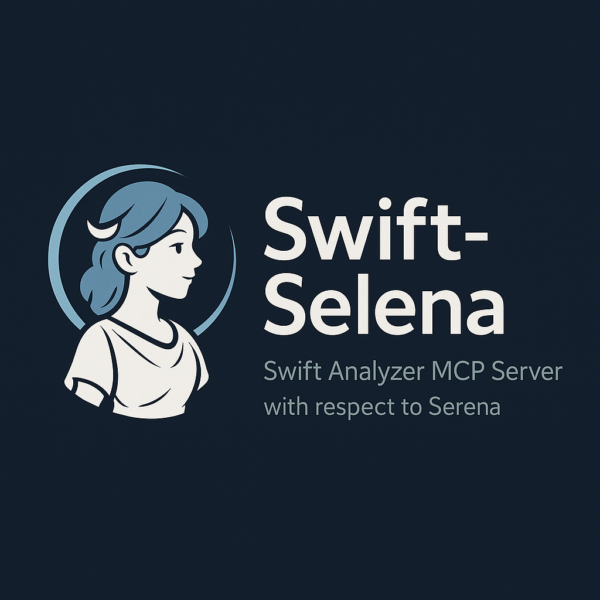

# Swift Selena - Swift Analyzer MCP Server with respect to Serena



**Swift Selena**は、Swiftプロジェクトのコード解析をClaude（AI）に提供するMCP (Model Context Protocol) サーバーです。ビルドエラーがあるコードでも動作し、SwiftUIアプリ開発を強力にサポートします。

[](https://swift.org)
[](https://www.apple.com/macos/)
[](LICENSE)

[English version](README.md)

## 主な特徴

- **ビルド不要**: SwiftSyntaxベースの静的解析により、ビルドエラーがあっても動作
- **LSP統合**: 利用可能な場合はSourceKit-LSPで対応ツールを強化し、不可の場合はSwiftSyntaxで動作
- **メタツールモード**: 動的ツールロードでコンテキストウィンドウ使用量を削減（v0.6.3+）
- **Swift Testing対応**: XCTestとSwift Testing（@Test, @Suite）の両方を検出
- **SwiftUI対応**: Property Wrapper（@State, @Binding等）を自動検出
- **高速検索**: ファイルシステムベースの検索で大規模プロジェクトでも高速
- **スマートキャッシュ**: 解析結果をキャッシュし、繰り返しクエリを高速化
- **複数クライアント対応**: Claude CodeとClaude Desktopを同時使用可能

## 提供ツール

### メタツールモード（v0.6.3+）

Swift-Selenaは**メタツールモード**を採用しており、Claudeには4つのツールのみを公開します。これによりコンテキストウィンドウの使用量を削減します。実際の解析ツールはオンデマンドで動的にロードされます。

**公開ツール:**
- **`initialize_project`** - プロジェクトを初期化（最初に必ず実行）
- **`list_available_tools`** - 利用可能な解析ツール一覧と説明を表示
- **`get_tool_schema`** - 特定ツールのJSONスキーマを取得
- **`execute_tool`** - 解析ツールを名前で実行

### 利用可能な解析ツール（execute_tool経由）

#### ファイル検索
- **`find_files`** - ワイルドカードパターンでファイル検索（例: `*ViewModel.swift`）
- **`search_code`** - 正規表現でコード内容を検索。`output_mode`、`limit`、`include_patterns`、`exclude_patterns` に対応
- **`search_files_without_pattern`** - パターンにマッチしないファイルを検索（grep -L相当）。`include_patterns`、`exclude_patterns` に対応

#### シンボル解析
- **`list_symbols`** - Class, Struct, Function等のシンボル一覧
- **`find_symbol_definition`** - プロジェクト全体でシンボル定義を検索。`symbol_kinds` とスコープ情報に対応

#### SwiftUI解析
- **`list_property_wrappers`** - SwiftUI Property Wrapper（@State, @Binding等）を検出
- **`list_protocol_conformances`** - Protocol準拠と継承関係を解析（UITableViewDelegate, ObservableObject等）
- **`list_extensions`** - Extension解析（拡張対象の型、プロトコル準拠、メンバー一覧）

#### コード解析
- **`analyze_imports`** - プロジェクト全体のImport依存関係を解析（モジュール使用統計、キャッシュ利用）
- **`get_type_hierarchy`** - 型の継承階層を取得（スーパークラス、サブクラス、Protocol準拠型、キャッシュ利用）
- **`find_test_cases`** - XCTestとSwift Testing（@Test, @Suite）のテストケースを検出

### 現行ツール仕様の補足

- `search_code` の `output_mode` は `match_detail`（既定）、`file_list`、`count_only`
- `search_code` の `limit` は 1〜10,000。10,000 を超える値は内部上限に切り詰められ、結果に通知される
- `search_code` と `search_files_without_pattern` は `include_patterns` / `exclude_patterns` を使用。旧 `file_pattern` は意図的に廃止済みで、指定されても無視される
- `find_symbol_definition` の `symbol_kinds` は `struct`、`class`、`enum`、`protocol`、`actor`、`function`、`variable`、`typealias`、`extension` を指定可能
- `search_code` と `find_symbol_definition` は、人間向けテキスト出力の末尾に `--- structured ---` JSONブロックを付加する
- LSP強化はベストエフォート。`.xcodeproj` を含むXcodeプロジェクトディレクトリでは現在LSPを無効化し、SwiftSyntax解析にフォールバックする

## インストール

### 必要要件

- macOS 13.0以上
- Swift 5.9以上
- [Claude Desktop](https://claude.ai/download) または [Claude Code](https://docs.claude.com/claude-code)

### Homebrew（推奨）

**tap と install**（明示 URL 形式の `brew tap` により、本リポジトリ自体を tap として利用できます。専用の `homebrew-*` リポジトリは不要です）:

```bash
brew tap blueeventhorizon/swift-selena https://github.com/BlueEventHorizon/Swift-Selena
brew install blueeventhorizon/swift-selena/swift-selena
# tap 後は短縮形も使えます:
# brew install swift-selena
```

`brew install` 後、`swift-selena` バイナリが `PATH` 上（通常 `$(brew --prefix)/bin/swift-selena`）に配置されます。

> **Swift toolchain 要件:** ビルドには macOS 13.0+ 上で Swift 5.9+ が必要です。フル Xcode 15+ で Swift 5.9+ を提供する環境で動作確認済み。Command Line Tools のみによるビルドは技術的に成立する見込みですが、**本リリース時点では未検証**です。CLT のみインストールしている環境で `brew install` が失敗する場合は、回避策として Xcode 15+ をインストールしてください。

#### Claude Code への登録

バイナリは `PATH` 上にあるため、絶対パスは不要です。スコープを選んでください:

| スコープ | コマンド | 有効範囲 |
| --- | --- | --- |
| `local`（デフォルト） | `claude mcp add swift-selena -- swift-selena` | このプロジェクトのみ・自分だけ |
| `project` | `claude mcp add -s project swift-selena -- swift-selena` | このプロジェクト・`.mcp.json` でチーム共有 |
| `user` | `claude mcp add -s user swift-selena -- swift-selena` | 自分の全プロジェクト |

```bash
# このプロジェクトのみ（local・デフォルト）
claude mcp add swift-selena -- swift-selena
```

> **`project` スコープの注意:** `-s project` は `.mcp.json` をリポジトリにコミットしてチーム共有します。登録される `command` が `swift-selena`（`PATH` で解決）なので、**チームメンバー全員が `swift-selena` を `PATH` 上に持っている**（例: この Homebrew formula で導入）必要があります。未インストールのメンバーでは起動しません。

#### Claude Desktop への登録

Claude Desktop は GUI から起動されるため、対話シェルの `PATH` を必ずしも継承しません。`brew --prefix` で得られる**絶対パス**を使用してください:

```bash
# インストール先 prefix を確認（典型例: Apple Silicon → /opt/homebrew / Intel → /usr/local）
brew --prefix
```

`~/Library/Application Support/Claude/claude_desktop_config.json` を編集し、**実際のパス**を貼り付けます（シェル展開はされないので、シェル式をそのまま書いてはいけません）:

```json
{
  "mcpServers": {
    "swift-selena": {
      "command": "/opt/homebrew/bin/swift-selena",
      "env": { "MCP_CLIENT_ID": "claude-desktop" }
    }
  }
}
```

> ⚠️ JSON 内に `$(brew --prefix)` をそのまま書かないでください — JSON は shell 展開されません。`brew --prefix` を実行し、得られた絶対パスを貼り付けてください。

編集後、Claude Desktop を再起動します。

### ビルド手順（代替: ソースビルド）

```bash
# リポジトリをクローン
git clone https://github.com/BlueEventHorizon/Swift-Selena.git
cd Swift-Selena

# ビルド（本番用リリースモード）
make build-release

# または直接swiftコマンドを使用：
# swift build -c release -Xswiftc -Osize
```

ビルド成果物は `.build/release/Swift-Selena` に生成されます。

### 利用可能なMakeコマンド

```bash
make help  # 全コマンドを表示
```

#### ビルド

| コマンド | 説明 |
|---------|------|
| `make build` | DEBUGビルド |
| `make build-release` | RELEASEビルド |
| `make clean` | ビルド成果物をクリーン |

#### MCP補助

| コマンド | 対象 | 説明 |
|---------|------|------|
| `make connect_gemini` | Claude Code | gemini-cli MCPサーバーを接続 |
| `make disconnect_gemini` | Claude Code | gemini-cli MCPサーバーを切断 |

#### 登録・解除

| コマンド | 対象 | 説明 |
|---------|------|------|
| `make register-release` | Claude Code | RELEASE版を登録（プロジェクトパスを入力） |
| `make unregister-release` | Claude Code | RELEASE版の登録を解除（プロジェクトパスを入力） |
| `make register-debug` | Claude Code | DEBUG版をビルド＆Swift-Selenaプロジェクトに登録 |
| `make unregister-debug` | Claude Code | DEBUG版をSwift-Selenaプロジェクトから解除 |
| `make register-desktop` | Claude Desktop | Claude Desktopに登録 |
| `make unregister-desktop` | Claude Desktop | Claude Desktopから解除 |

## デバッグ・ログ機能

### ログファイル監視（v0.5.3+）

Swift-Selenaはデバッグとトラブルシューティングのためにログファイルに出力します：

**ログファイル位置:**
```
~/.swift-selena/logs/server.log
```

**リアルタイムでログを監視:**
```bash
tail -f ~/.swift-selena/logs/server.log
```

**確認できる内容:**
- サーバー起動メッセージ
- ツール実行ログ
- LSP接続状態（成功/失敗）
- エラーメッセージと診断情報

**ログ出力例:**
```
[17:29:24] ℹ️ [info] Starting Swift MCP Server...
[17:29:50] ℹ️ [info] Tool called: initialize_project
[17:29:50] ℹ️ [info] Attempting LSP connection...
[17:29:51] ℹ️ [info] ✅ LSP connected successfully
```

**ヒント:** Swift-Selena使用中は、別のターミナルで`tail -f`を実行し続けておくと、リアルタイムデバッグが可能です。

## セットアップ

### 簡単セットアップ（ソースビルド時）

Swift-Selenaプロジェクトルートでmakeコマンドを使用します：

#### Claude Desktopの場合
```bash
make register-desktop
```

#### Claude Codeの場合

```bash
# 本番用（ターゲットプロジェクトに登録）
make register-release
# → プロンプト: 登録先プロジェクトのパスを入力

# 開発・テスト用（Swift-Selenaプロジェクト自体に登録）
make register-debug
```

#### 登録解除

```bash
# Claude Desktopから解除
make unregister-desktop

# ターゲットプロジェクトから解除
make unregister-release
# → プロンプト: 登録解除するプロジェクトのパスを入力（空白でカレントディレクトリ）

# DEBUG版をこのプロジェクトから解除
make unregister-debug
```

### 手動セットアップ

スクリプトを使わず手動で設定する場合：

#### Claude Desktop の設定

1. 設定ファイルを開く（存在しない場合は作成）:
```bash
open ~/Library/Application\ Support/Claude/claude_desktop_config.json
```

2. 以下の内容を追加:
```json
{
  "mcpServers": {
    "swift-selena": {
      "command": "/path/to/Swift-Selena/.build/release/Swift-Selena",
      "env": {
        "MCP_CLIENT_ID": "claude-desktop"
      }
    }
  },
  "isUsingBuiltInNodeForMcp": true
}
```

**重要**: `/path/to/Swift-Selena` を実際のパスに置き換えてください。

3. Claude Desktopを再起動

#### Claude Code 手動設定

ターゲットプロジェクトのディレクトリで：

```bash
cd /path/to/your/project
claude mcp add swift-selena -- /path/to/Swift-Selena/.build/release/Swift-Selena
```

これでそのプロジェクトのみで有効なローカル設定が作成されます。

**グローバルに使用する場合**（全プロジェクトで有効）：
```bash
cd ~
claude mcp add -s user swift-selena -- /path/to/Swift-Selena/.build/release/Swift-Selena
```

詳細は[Claude Codeドキュメント](https://docs.claude.com/claude-code)を参照してください。

## 使い方

### 基本的なワークフロー

1. **プロジェクトを初期化**
```
Claudeに「このSwiftプロジェクトを解析して」と依頼
→ initialize_project が自動実行される
```

2. **コードを検索・解析**
```
「ViewModelを探して」
→ find_files で *ViewModel.swift を検索

「@Stateを使っているファイルは？」
→ list_property_wrappers で検出
```

3. **コード構造を解析**
```
「ViewControllerの型階層を表示して」
→ get_type_hierarchy で継承関係を表示
```

### 実践例

#### SwiftUIのProperty Wrapperを確認
```
あなた: ContentView.swiftで使われているProperty Wrapperを教えて

Claude: list_property_wrappers を実行
結果:
[@State] counter: Int (line 12)
[@ObservedObject] viewModel: ViewModel (line 13)
[@EnvironmentObject] appState: AppState (line 14)
```

#### 特定の関数を探す
```
あなた: fetchDataという関数がどこにあるか探して

Claude: find_symbol_definition を実行
結果:
[Function] fetchData
  File: /path/to/NetworkManager.swift
  Line: 45
```

#### Protocol準拠を確認
```
あなた: ViewControllerがどのプロトコルに準拠しているか教えて

Claude: list_protocol_conformances を実行
結果:
[Class] ViewController (line 25)
  Inherits from: UIViewController
  Conforms to: UITableViewDelegate, UITableViewDataSource
```

#### プロジェクト全体でエラーハンドリングを検索
```
あなた: do-catchブロックを全部探して

Claude: search_code を実行（正規表現: do\s*\{）
結果: 15箇所のdo-catchブロックを発見
```

#### 本番コードのSwiftファイルだけを検索
```
Claude: search_code を実行
Params:
{
  "pattern": "URLSession\\.shared",
  "output_mode": "file_list",
  "include_patterns": ["Sources/**/*.swift"],
  "exclude_patterns": ["*Tests*"],
  "limit": 100
}
```

#### シンボル定義を種別で絞り込む
```
Claude: find_symbol_definition を実行
Params:
{
  "symbol_name": "Button",
  "symbol_kinds": ["struct", "class"]
}
結果には Scope 行と structured JSON ブロックが含まれます。
```

## データ保存場所

解析キャッシュは以下のディレクトリに保存されます:

```
~/.swift-selena/
└── clients/
    ├── default/              # Claude Code（デフォルト）
    │   └── projects/
    │       └── YourProject-abc12345/
    │           └── memory.json
    └── claude-desktop/       # Claude Desktop
        └── projects/
            └── YourProject-abc12345/
                └── memory.json
```

- プロジェクトパスのSHA256ハッシュで同一プロジェクトを識別
- 異なるプロジェクトは自動的に分離
- Claude Code（`default`）とClaude Desktop（`claude-desktop`）は`MCP_CLIENT_ID`により自動的にデータが分離される

**注意**: 同じ`MCP_CLIENT_ID`（例: 複数のClaude Codeウィンドウ）で同じプロジェクトを同時に開くと、メモリファイルへの書き込み競合が発生する可能性があります。同じプロジェクトを複数のウィンドウで作業する場合は、異なる`MCP_CLIENT_ID`を設定してください。

## トラブルシューティング

### MCPサーバーが起動しない

```bash
# DEBUGビルドを確認
swift build

# またはRELEASEビルドを確認
swift build -c release -Xswiftc -Osize

# RELEASE実行ファイルをテスト
.build/release/Swift-Selena
# "Starting Swift MCP Server..." が表示されればOK
# Ctrl+Cで終了
```

### ツールが見つからない

1. Claude Desktop/Codeを再起動
2. 設定ファイルのパスが正しいか確認
3. ログを確認:
```bash
tail -f ~/Library/Logs/Claude/mcp*.log
```

### 古いキャッシュをクリア

```bash
rm -rf ~/.swift-selena/
```

次回`initialize_project`実行時に再構築されます。

## 高度な設定

### レガシーモード（全ツール直接公開）

デフォルトでは Swift-Selena は**メタツールモード**（v0.6.3+）を使用します。メタツールを経由せず12個のツールを直接公開したい場合は、`SWIFT_SELENA_LEGACY=1` 環境変数を設定してください：

#### Claude Desktop
```json
{
  "mcpServers": {
    "swift-selena": {
      "command": "/path/to/Swift-Selena/.build/release/Swift-Selena",
      "env": {
        "MCP_CLIENT_ID": "claude-desktop",
        "SWIFT_SELENA_LEGACY": "1"
      }
    }
  }
}
```

#### Claude Code
```bash
claude mcp add swift-selena -e SWIFT_SELENA_LEGACY=1 -- /path/to/Swift-Selena/.build/release/Swift-Selena
```

レガシーモードでは、以下12個のツールが直接公開されます：
`initialize_project`、`find_files`、`search_code`、`search_files_without_pattern`、`list_symbols`、`find_symbol_definition`、`list_property_wrappers`、`list_protocol_conformances`、`list_extensions`、`analyze_imports`、`get_type_hierarchy`、`find_test_cases`

## アーキテクチャ

### コアコンポーネント

- **FileSearcher**: ファイルシステムベースの高速検索
- **SwiftSyntaxAnalyzer**: AST解析によるシンボル抽出
- **ProjectMemory**: 解析結果の永続化とキャッシュ管理

### 技術スタック

- **[MCP Swift SDK](https://github.com/modelcontextprotocol/swift-sdk)** (0.12.0) - MCPプロトコル実装
- **[SwiftSyntax](https://github.com/apple/swift-syntax)** (602.0.0) - 構文解析
- **CryptoKit** - プロジェクトパスのハッシュ化
- **swift-log** (MCP Swift SDK経由) - ロギング

## コントリビューション

Issue、Pull Requestを歓迎します！

メンテナ向けのリリース手順（バージョン更新 + Homebrew Formula、図解付き）は [CONTRIBUTING.ja.md](CONTRIBUTING.ja.md) を参照してください。

## ライセンス

MIT License - 詳細は[LICENSE](LICENSE)ファイルを参照

## 参考

- [Model Context Protocol](https://modelcontextprotocol.io/) - MCPプロトコル仕様
- [SwiftSyntax](https://github.com/apple/swift-syntax) - Swift構文解析ライブラリ
- [Anthropic](https://www.anthropic.com/) - Claude AI
