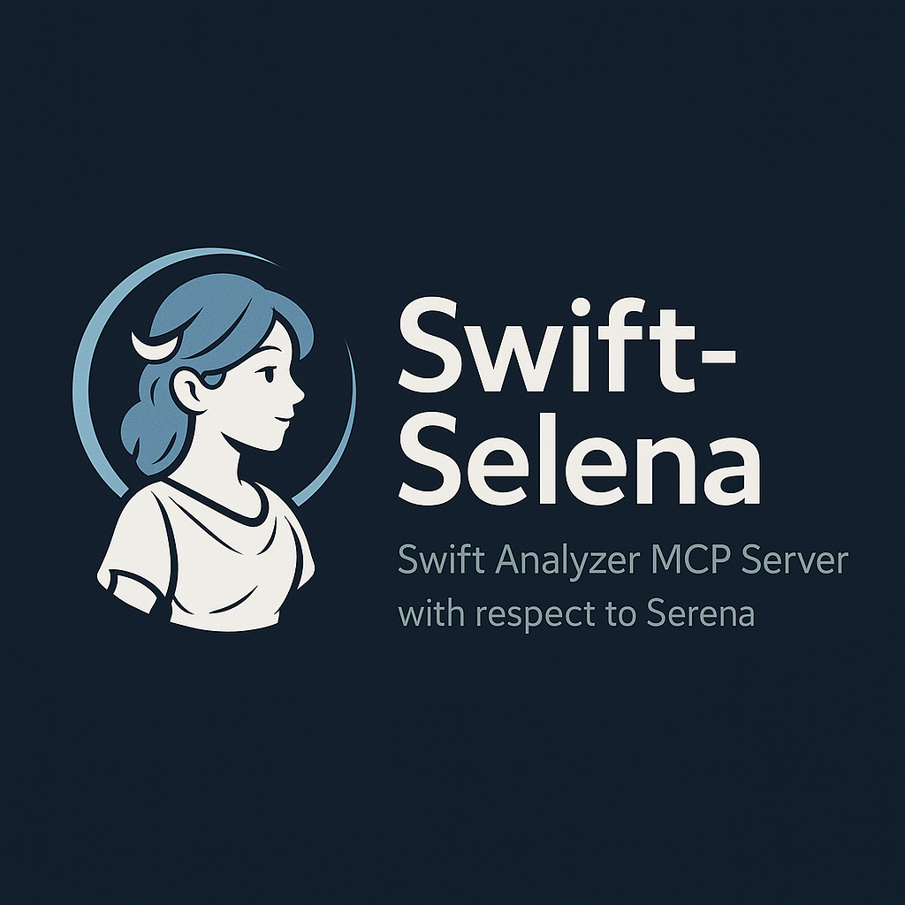

# Swift Selena - Swift Analyzer MCP Server with respect to Serena



**Swift Selena** is an MCP (Model Context Protocol) server that provides Swift code analysis capabilities to Claude AI. It works even with build errors and strongly supports SwiftUI app development.

[](https://swift.org)
[](https://www.apple.com/macos/)
[](LICENSE)

[日本語版はこちら / Japanese version](README.ja.md)

## Key Features

- **Build-Free**: Works even with build errors through SwiftSyntax-based static analysis
- **LSP Integration**: Advanced features with SourceKit-LSP when project is buildable (v0.5.1+)
- **SwiftUI Support**: Automatically detects Property Wrappers (@State, @Binding, etc.)
- **Fast Search**: Filesystem-based search for fast performance even on large projects
- **Project Memory**: Persists analysis results and notes across sessions
- **Multi-Client Support**: Use with Claude Code and Claude Desktop simultaneously

## Provided Tools

### Project Management
- **`initialize_project`** - Initialize a project (must be called first)

### File Search
- **`find_files`** - Search files by wildcard pattern (e.g., `*ViewModel.swift`)
- **`search_code`** - Search code content using regex

### SwiftSyntax Analysis
- **`list_symbols`** - List all symbols (Class, Struct, Function, etc.)
- **`find_symbol_definition`** - Find symbol definitions across the project
- **`list_property_wrappers`** - Detect SwiftUI Property Wrappers (@State, @Binding, etc.)
- **`list_protocol_conformances`** - Analyze protocol conformances and inheritance (UITableViewDelegate, ObservableObject, etc.)
- **`list_extensions`** - Analyze extensions (extended type, protocol conformance, members)
- **`analyze_imports`** - Analyze import dependencies across the project (module usage statistics, cached)
- **`get_type_hierarchy`** - Get type inheritance hierarchy (superclass, subclasses, conforming types, cached)
- **`find_test_cases`** - Detect XCTest test cases and test methods
- **`find_type_usages`** - Find where a type is used (variable declarations, function parameters, return types)

### Efficient Reading
- **`read_symbol`** - Read specific symbol (function, class, struct, etc.)

### LSP Integration (v0.5.2+, buildable projects only)
- **`find_symbol_references`** - Find all references to a symbol (type-based, requires LSP)
  - Precise reference search using type information
  - Available only when project is buildable
  - Fallback: use `find_type_usages` or `search_code` when LSP unavailable

### Analysis Modes
- **`set_analysis_mode`** - Set analysis mode (SwiftUI/Architecture/Testing/Refactoring/General)
- **`think_about_analysis`** - Reflect on analysis progress

### Project Notes
- **`add_note`** - Save design decisions and important notes
- **`search_notes`** - Search saved notes

## Installation

### Requirements

- macOS 13.0 or later
- Swift 5.9 or later
- [Claude Desktop](https://claude.ai/download) or [Claude Code](https://docs.claude.com/claude-code)

### Build Steps

```bash
# Clone the repository
git clone https://github.com/BlueEventHorizon/Swift-Selena.git
cd Swift-Selena

# Build (release mode for production)
swift build -c release -Xswiftc -Osize

# Grant execute permission to setup scripts
chmod +x register-mcp-to-claude-desktop.sh
chmod +x register-selena-to-claude-code.sh

# Verify executable path
pwd
# Example output: /Users/yourname/Swift-Selena
```

The build artifact is generated at `.build/release/Swift-Selena`.

## Debugging & Logging

### Log File Monitoring (v0.5.3+)

Swift-Selena outputs logs to a file for debugging and troubleshooting:

**Log file location:**
```
~/.swift-selena/logs/server.log
```

**Monitor logs in real-time:**
```bash
tail -f ~/.swift-selena/logs/server.log
```

**What you can see:**
- Server startup messages
- Tool execution logs
- LSP connection status (success/failure)
- Error messages and diagnostics

**Example log output:**
```
[17:29:24] ℹ️ [info] Starting Swift MCP Server...
[17:29:50] ℹ️ [info] Tool called: initialize_project
[17:29:50] ℹ️ [info] Attempting LSP connection...
[17:29:51] ℹ️ [info] ✅ LSP connected successfully
```

**Tip:** Keep `tail -f` running in a separate terminal while using Swift-Selena for real-time debugging.

## Setup

### Easy Setup (Recommended)

Run the following scripts from the project root for automatic setup:

#### For Claude Desktop
```bash
./register-mcp-to-claude-desktop.sh
```

This script automatically:
- Verifies executable existence
- Backs up existing configuration
- Adds settings to `claude_desktop_config.json`
- Preserves existing settings (if jq is installed)

#### For Claude Code (Connect to Specific Project)

To connect Swift-Selena to a specific project:

```bash
# From Swift-Selena directory
./register-selena-to-claude-code.sh /path/to/your/project
```

This script automatically:
- Verifies executable existence
- Moves to target project directory
- Registers with `claude mcp add` (local to that project)

**Alternative: Using makefile** (if your project has one)

Add to your project's makefile:
```make
connect_swift-selena:
	@if [ -n "$$SWIFT_SELENA_PATH" ]; then \
		claude mcp add swift-selena -- $$SWIFT_SELENA_PATH/.build/release/Swift-Selena; \
	else \
		echo "Set SWIFT_SELENA_PATH first"; \
	fi
```

Then:
```bash
export SWIFT_SELENA_PATH=/path/to/Swift-Selena
make connect_swift-selena
```

### Manual Setup

If you prefer manual configuration:

#### Claude Desktop Setup

1. Open the config file (create if it doesn't exist):
```bash
open ~/Library/Application\ Support/Claude/claude_desktop_config.json
```

2. Add the following content:
```json
{
  "mcpServers": {
    "swift-selena": {
      "command": "/path/to/Swift-Selena/.build/release/Swift-Selena",
      "env": {
        "MCP_CLIENT_ID": "claude-desktop"
      }
    }
  },
  "isUsingBuiltInNodeForMcp": true
}
```

**Important**: Replace `/path/to/Swift-Selena` with the actual path.

3. Restart Claude Desktop

#### Claude Code Manual Setup

In your target project directory:

```bash
cd /path/to/your/project
claude mcp add swift-selena -- /path/to/Swift-Selena/.build/release/Swift-Selena
```

This creates a local configuration for that project only.

**To use globally** (all projects):
```bash
cd ~
claude mcp add -s user swift-selena -- /path/to/Swift-Selena/.build/release/Swift-Selena
```

Refer to [Claude Code documentation](https://docs.claude.com/claude-code) for more MCP server configuration options.

## Usage

### Basic Workflow

1. **Initialize project**
```
Ask Claude: "Analyze this Swift project"
→ initialize_project is automatically executed
```

2. **Search and analyze code**
```
"Find ViewModels"
→ find_files searches for *ViewModel.swift

"Which files use @State?"
→ list_property_wrappers detects them
```

3. **Save notes**
```
"Note that this ViewController is for the login screen"
→ add_note saves it
```

### Practical Examples

#### Check SwiftUI Property Wrappers
```
You: Tell me what Property Wrappers are used in ContentView.swift

Claude: Executes list_property_wrappers
Result:
[@State] counter: Int (line 12)
[@ObservedObject] viewModel: ViewModel (line 13)
[@EnvironmentObject] appState: AppState (line 14)
```

#### Find a specific function
```
You: Find where the fetchData function is defined

Claude: Executes find_symbol_definition
Result:
[Function] fetchData
  File: /path/to/NetworkManager.swift
  Line: 45
```

#### Check protocol conformance
```
You: Tell me what protocols ViewController conforms to

Claude: Executes list_protocol_conformances
Result:
[Class] ViewController (line 25)
  Inherits from: UIViewController
  Conforms to: UITableViewDelegate, UITableViewDataSource
```

#### Search for error handling across the project
```
You: Find all do-catch blocks

Claude: Executes search_code (regex: do\s*\{)
Result: Found 15 do-catch blocks
```

## Data Storage

Analysis results and notes are stored in the following directory:

```
~/.swift-selena/
└── clients/
    ├── default/              # Claude Code (default)
    │   └── projects/
    │       └── YourProject-abc12345/
    │           └── memory.json
    └── claude-desktop/       # Claude Desktop
        └── projects/
            └── YourProject-abc12345/
                └── memory.json
```

- Projects are identified by SHA256 hash of project path
- Different projects are automatically separated
- Claude Code (`default`) and Claude Desktop (`claude-desktop`) data is automatically separated by `MCP_CLIENT_ID`

**Note**: When the same `MCP_CLIENT_ID` (e.g., multiple Claude Code windows) opens the same project simultaneously, memory file write conflicts may occur. If working on the same project in multiple windows, set different `MCP_CLIENT_ID` values.

## Troubleshooting

### MCP server won't start

```bash
# Verify build
swift build

# Test execution
.build/release/Swift-Selena
# "Starting Swift MCP Server..." should appear
# Press Ctrl+C to exit
```

### Tools not found

1. Restart Claude Desktop/Code
2. Verify config file paths are correct
3. Check logs:
```bash
tail -f ~/Library/Logs/Claude/mcp*.log
```

### Clear old cache

```bash
rm -rf ~/.swift-selena/
```

Will be rebuilt on next `initialize_project` execution.

## Architecture

### Core Components

- **FileSearcher**: Fast filesystem-based search
- **SwiftSyntaxAnalyzer**: Symbol extraction via AST analysis
- **ProjectMemory**: Persists analysis results and manages cache

### Technology Stack

- **[MCP Swift SDK](https://github.com/modelcontextprotocol/swift-sdk)** (0.10.2) - MCP protocol implementation
- **[SwiftSyntax](https://github.com/apple/swift-syntax)** (602.0.0) - Syntax parsing
- **CryptoKit** - Project path hashing
- **swift-log** - Logging

## Documentation

### For Users
- [README (English)](README.md) - This file
- [README (Japanese)](README.ja.md) - 日本語版

### For Developers
- **[CLAUDE.md](CLAUDE.md)** - Project overview and commands for Claude Code
- **[Swift-Selena Design](docs/Swift-Selena%20Design.md)** - Architecture and design principles

## Contributing

Issues and Pull Requests are welcome!

For detailed developer information, see [CLAUDE.md](CLAUDE.md).

## License

MIT License - See [LICENSE](LICENSE) file for details

## Acknowledgments

- [Model Context Protocol](https://modelcontextprotocol.io/) - MCP protocol specification
- [SwiftSyntax](https://github.com/apple/swift-syntax) - Swift syntax parsing library
- [Anthropic](https://www.anthropic.com/) - Claude AI
