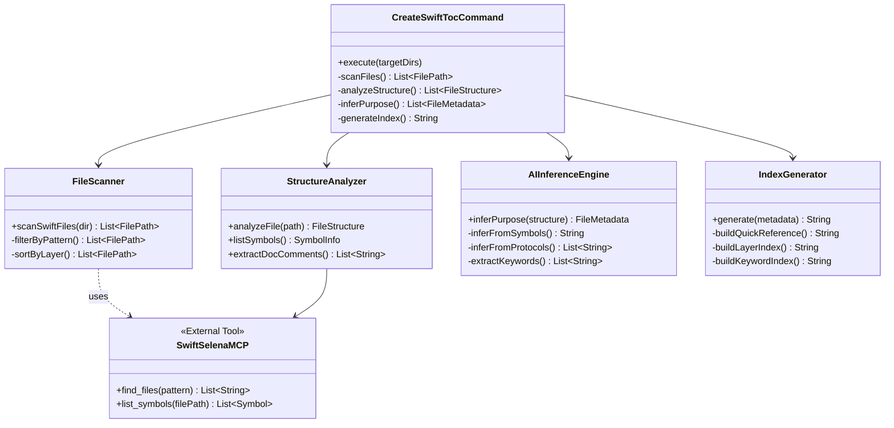
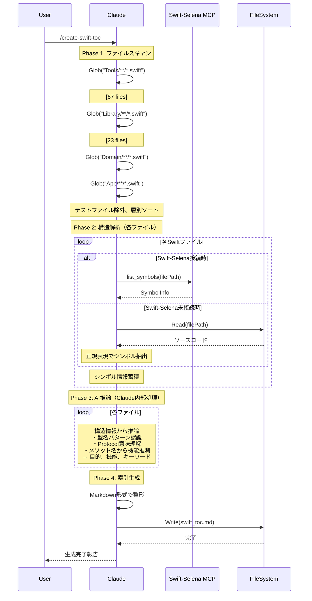
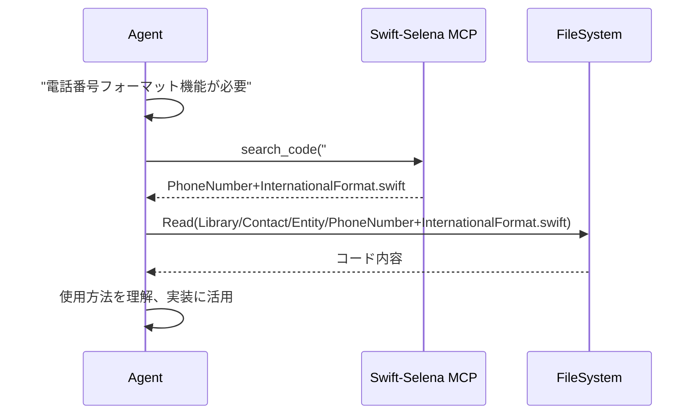

# Swiftコード索引生成システム 設計書

**設計ID**: DES-004
**関連要件ID**: なし（開発効率化ツール）
**作成日**: 2025-10-19
**更新日**: 2025-10-19

---

## 1. 概要

### 1.1 目的

Swiftコードベース（App/Domain/Infrastructure/DI/Tools/Library）の全ファイルを自動解析し、AI検索最適化されたコード索引（swift_toc.md）を生成する。

### 1.2 背景

**現状の問題**:
- Tools/: 67ファイル、Library/: 48ファイルの既存コードが存在
- `search_code("phone")`で50箇所ヒット → **何ができるかわからない**
- 1ファイルに多様な機能が搭載、検索だけでは理解困難
- DocCコメント存在率約30%、コメントに依存できない

**解決アプローチ**:
- Swiftコード構造（型、メソッド、Protocol準拠）から**AI推論**で機能を特定
- docs/toc.md（ドキュメント索引）と同じパターンでswift_toc.md（コード索引）生成
- Swift-Selena MCPとの共生（将来的に内部DB化）

### 1.3 設計方針

1. **DocCコメント非依存**: コード構造から推論（70%がコメントなしでも機能）
2. **自動生成**: `/create-swift-toc`コマンド1回実行で完結
3. **AI検索最適化**: キーワード、タグ、目的別の索引構造
4. **拡張性**: 将来のSwift-Selena DB化に対応可能な形式

---

## 2. モジュールリスト

| モジュール名 | 責務 | 入力インターフェース | 出力インターフェース | 依存モジュール |
|------------|------|-------------------|-------------------|--------------|
| **ファイルスキャナー** | 対象Swiftファイルの列挙 | ディレクトリパス（Tools/, Library/, Domain/, App/） | ファイルパスリスト | Glob（Swift-Selenaは補助） |
| **構造解析器** | 各ファイルのシンボル構造抽出 | ファイルパス | シンボル情報（型、メソッド、Protocol） | Swift-Selena（推奨）/ Read（代替） |
| **AI推論エンジン** | 構造から目的・機能を推論 | シンボル情報、ファイル名 | 目的、機能、使用パターン、キーワード | Claude自身 |
| **索引生成器** | AI検索最適化されたMarkdown生成 | 推論結果リスト | swift_toc.md | なし |
| **コマンドコントローラー** | 全体フロー制御、エラーハンドリング | コマンド引数 | 完了報告 | 上記全モジュール |

---

## 3. クラス図



---

## 4. ユースケース一覧

| UC-ID | ユースケース名 | アクター | 事前条件 | 事後条件 | 基本フロー概要 |
|-------|--------------|---------|---------|---------|--------------|
| UC001 | Swift索引生成 | Claude/開発者 | Swiftファイルが存在 | swift_toc.md生成完了 | コマンド実行 → ファイルスキャン → 構造解析 → AI推論 → 索引生成 |
| UC002 | 既存コード検索 | Claude/Agent | swift_toc.md存在 | 目的のコード発見 | swift_toc.md内をsearch_code → ファイルパス特定 → Read |
| UC003 | 索引更新 | Claude/開発者 | 新規ファイル追加 | 最新索引に更新 | /create-swift-toc再実行 |

---

## 5. シーケンス図

### UC001: Swift索引生成



### UC002: 既存コード検索



---

## 6. データ構造設計

### 6.1 FileStructure（構造解析結果）

```swift
struct FileStructure {
    let filePath: String                    // 例: "Tools/Core/AppVersion.swift"
    let layer: Layer                        // Tools/Library/Domain/App
    let symbols: [SymbolInfo]               // 型、メソッド、プロパティ
    let docComments: [String]?              // DocCコメント（あれば）
}

struct SymbolInfo {
    let kind: SymbolKind                    // struct/class/enum/extension/protocol
    let name: String                        // シンボル名
    let protocols: [String]                 // 準拠Protocol
    let members: [MemberInfo]               // メソッド、プロパティ
}

enum Layer {
    case tools, library, domain, app
}
```

### 6.2 FileMetadata（AI推論結果）

```swift
struct FileMetadata {
    let filePath: String                    // "Tools/Core/AppVersion.swift"
    let layer: Layer                        // .tools
    let purpose: String                     // "セマンティックバージョン管理"
    let features: [String]                  // ["バージョン比較", "文字列解析"]
    let mainAPIs: [String]                  // ["init?(_:)", "compare操作"]
    let usagePattern: String                // "AppVersion(\"1.2.3\")"
    let protocols: [String]                 // ["Comparable", "Hashable"]
    let keywords: [String]                  // ["version", "semantic", "compare"]
    let criticalCount: Int                  // [CRITICAL]出現数（重要度指標）
}
```

### 6.3 swift_toc.md出力フォーマット

```markdown
# Swift Code Index

**目的**: AI検索用のSwiftコード索引
**最終更新日**: YYYY-MM-DD
**対象**: Tools/, Library/, Domain/, App/
**総ファイル数**: XXX件

---

## Quick Reference（高頻度使用）

| ファイル | 目的 | 主要API | 層 |
|---------|------|---------|-----|
| Tools/Core/StreamManager.swift | AsyncStream自動管理 | createStream(), broadcast() | Tools |
| Tools/Core/MockAssertion.swift | Mock本番環境防止 | assertIfProductionOrStaging() | Tools |
| Library/Contact/PhoneNumber+InternationalFormat.swift | 国際電話番号フォーマット | formatInternationalForDisplay() | Library |

---

## 層別インデックス

### Tools/Core/

#### AppVersion.swift
- **目的**: セマンティックバージョン管理
- **主要機能**:
  - バージョン比較（Comparable準拠）
  - 文字列解析（"1.2.3"形式）
  - 表示用文字列変換
- **主要API**: `init?(_: String)`, 比較演算子
- **使用パターン**: `AppVersion("1.2.3")`
- **Protocol**: Comparable, Hashable, CustomStringConvertible
- **キーワード**: version, semantic, compare, parse

#### StreamManager.swift
- **目的**: AsyncStream自動管理、リソース解放
- **主要機能**:
  - Stream生成と購読者管理
  - 自動リソースクリーンアップ
  - 購読者数制限
- **主要API**: `createStream()`, `broadcast()`
- **使用パターン**: 全DataStore必須
- **[CRITICAL]**: maxSubscribers、continuation.onTermination
- **キーワード**: async, stream, datastore, broadcast

### Library/Contact/

#### PhoneNumber+InternationalFormat.swift
- **目的**: 国際電話番号の表示用フォーマット
- **主要機能**:
  - 7カ国の番号体系対応
  - 国別表示フォーマット
- **主要API**: `formatInternationalForDisplay()`
- **対応国**: 日本(81), 米国(1), 中国(86), 韓国(82), 英国(44), 仏国(33), 独国(49)
- **キーワード**: phone, international, format, country

---

## キーワードインデックス

### async
- Tools/Core/StreamManager.swift
- Domain/Service/*Service.swift

### phone
- Library/Contact/PhoneNumber+InternationalFormat.swift
- Library/Contact/PhoneNumber.swift

### validation
- Tools/Core/Validation/EmailValidator.swift
- Tools/Core/Validation/PhoneValidator.swift

---

## タグ別インデックス

### #Tools-Core
- AppVersion.swift, StreamManager.swift, MockAssertion.swift...

### #Library-Contact
- PhoneNumber+InternationalFormat.swift...

### #Library-Speech
- SpeechFactory.swift, AppleSpeechRecognition.swift...
```

---

## 7. AI推論アルゴリズム詳細

### 7.1 推論ルール

#### ルール1: 型名からの推論
```
型名パターン:
- *Manager → 「〜の管理」（例: StreamManager → Stream管理）
- *Validator → 「〜のバリデーション」
- *Factory → 「〜の生成」
- *Extension → 「〜の拡張機能」
- *+* (Extension) → 「〜への機能追加」
```

#### ルール2: Protocol準拠からの推論
```
Protocol → 機能推論:
- Comparable → 比較演算機能
- Codable → シリアライズ機能
- Sendable → 並行処理安全
- CustomStringConvertible → 文字列変換
```

#### ルール3: メソッド名からの推論
```
メソッドパターン:
- format* → フォーマット機能
- validate* → バリデーション機能
- create* → 生成機能
- broadcast* → 配信機能
```

#### ルール4: ファイル名からの推論
```
ファイル名パターン:
- *+InternationalFormat → 国際対応フォーマット
- Email* → メール関連
- Phone* → 電話関連
```

### 7.2 Claude推論の実行方法

**Claude自身が構造情報を見て直接推論**:

```markdown
入力（list_symbolsから）:
- ファイルパス: Tools/Core/AppVersion.swift
- 層: Tools
- 型: struct AppVersion
- Protocol準拠: Comparable, Hashable, CustomStringConvertible
- 公開メソッド: init?(_: String), <, ==, ...
- 公開プロパティ: major, minor, patch

Claude内部推論:
1. 型名 "AppVersion" → バージョン管理
2. Protocol "Comparable" → 比較機能
3. プロパティ "major, minor, patch" → セマンティックバージョン
4. メソッド "init?(_: String)" → 文字列解析

推論結果:
- 目的: "セマンティックバージョン管理"
- 主要機能: ["バージョン比較", "文字列解析", "文字列変換"]
- 使用パターン: "AppVersion(\"1.2.3\")"
- キーワード: ["version", "semantic", "compare", "parse"]
```

**利点**:
- ✅ 外部API呼び出し不要
- ✅ 処理時間ほぼゼロ
- ✅ トークン消費少
- ✅ JSON解析不要

### 7.3 推論精度の期待値

| ファイル種別 | 推論精度 | 根拠 |
|------------|---------|------|
| Utility/Tool系 | 90%+ | 型名・メソッド名が明示的 |
| Extension系 | 95%+ | 拡張対象の型から自明 |
| Factory系 | 95%+ | 生成パターンから明確 |
| Service系 | 80%+ | Protocol名から推測可能 |
| View系 | 70%+ | 構造から推測、UI詳細は不明 |

**全体平均**: 85%以上の精度を期待

---

## 8. 出力仕様

### 8.1 swift_toc.md構造

**セクション構成**（docs/toc.mdと同パターン）:
1. ヘッダー情報
2. **Quick Reference**（高頻度使用、最上部）
3. 層別インデックス（Tools/Library/Domain/App）
4. キーワードインデックス
5. タグ別インデックス
6. 検索のヒント
7. メンテナンス情報

### 8.2 各エントリーのフォーマット

```markdown
#### {FileName}.swift
- **目的**: {purpose}
- **主要機能**:
  - {feature1}
  - {feature2}
  ...
- **主要API**: {mainAPIs}
- **使用パターン**: {usagePattern}
- **Protocol**: {protocols}（あれば）
- **[CRITICAL]**: {criticalPoints}（あれば）
- **キーワード**: {keywords}
```

### 8.3 検索最適化

**AI検索パターン**:
```
search_code("## 目的.*電話")        → 電話関連機能発見
search_code("## キーワード.*async") → 非同期処理関連発見
search_code("\[CRITICAL\]")         → 重要な制約事項確認
```

---

## 9. 実装フロー

### 9.1 コマンド実行フロー

```
/create-swift-toc
    ↓
引数解析（デフォルト: Tools/ Library/ Domain/ App/ Infrastructure/ DI/）
    ↓
Phase 1: ファイルスキャン
  - Glob("**/*.swift") × 6ディレクトリ
  - フィルタリング（テストファイル、Mock除外）
  - 層別ソート
    ↓
Phase 2: 構造解析
  【Swift-Selena接続時】
    - list_symbols() × 全ファイル
    - list_protocol_conformances() × 全ファイル
  【Swift-Selena未接続時】
    - Read() × 全ファイル
    - 正規表現でシンボル抽出
    ↓
Phase 3: AI推論（Claude内部処理）
  - Claude: 構造情報から直接推論
  - 型名・Protocol・メソッド名から目的・機能・キーワードを推論
  - 推論結果を内部データ構造に格納
    ↓
Phase 4: 索引生成
  - Quick Reference構築
  - 層別インデックス構築
  - キーワード・タグインデックス構築
  - Markdown整形
    ↓
Phase 5: ファイル出力
  - Write(swift_toc.md)
  - 完了報告
```

### 9.2 エラーハンドリング

```
ファイルスキャンエラー:
- ディレクトリ不存在 → 警告表示、スキップ
- 権限エラー → エラー報告、処理中断

構造解析エラー:
- list_symbols失敗 → 該当ファイルスキップ、警告
- 解析不能 → ファイル名のみ記録

AI推論エラー:
- 推論困難なファイル → 構造情報のみ記録、推論スキップ
- （Claude内部処理のため、タイムアウトなし）

出力エラー:
- 書き込み失敗 → エラー報告、処理中断
```

---

## 10. 性能要件

### 10.1 処理時間目標

| フェーズ | ファイル数 | 目標時間 | 根拠 |
|---------|-----------|---------|------|
| ファイルスキャン | 200件 | 10秒 | Glob × 6 |
| 構造解析 | 200件 | 100秒 | list_symbols × 200（0.5秒/件）※Swift-Selena使用時 |
| AI推論 | 200件 | **即座** | Claude内部処理（外部API呼び出しなし） |
| 索引生成 | - | 5秒 | Markdown整形 |
| **合計** | **200件** | **約2分** | - |

**現実的な期待**: 90ファイル（現状）で約1分

### 10.2 更新頻度

```
推奨更新タイミング:
- 新規ファイル追加時（月1-2回）
- 大規模リファクタリング後（四半期1回）
- 定期メンテナンス（不要、必要時のみ）
```

---

## 11. 拡張性設計

### 11.1 Swift-Selena DB化対応（Phase 2）

**現在の設計がサポート**:
```markdown
swift_toc.md（Markdown形式）
    ↓ Swift-Selenaが読み込み
内部DB構築（Swift-Selena側実装）
    ↓ 新規MCP tool
mcp__swift-selena__search_by_purpose(query)
mcp__swift-selena__search_by_keyword(keyword)
mcp__swift-selena__list_by_layer(layer)
```

**Markdown形式を選ぶ理由**:
- 人間が読んでも理解可能
- search_codeで即座に検索可能（Phase 1）
- 構造化データ抽出容易（Phase 2への移行）

### 11.2 JSON併用オプション

**`/create-swift-toc -format both`**:
```
出力:
- swift_toc.md（人間・AI可読）
- swift_toc.json（機械可読、Swift-Selena DB用）
```

---

## 12. 代替案との比較

| 方式 | 実装コスト | 運用コスト | 検索精度 | メンテナンス | 判定 |
|------|-----------|-----------|---------|-------------|------|
| **DocC充実化** | 高（全ファイル手動） | 高（更新忘れ） | 70%（コメント依存） | 困難 | ❌ 非推奨 |
| **README.md方式** | 中（ディレクトリ単位） | 高（手動更新） | 60%（古くなる） | 困難 | ❌ 非推奨 |
| **構造化メタデータ** | 高（全ファイル手動） | 高（二重管理） | 80%（更新忘れ） | 困難 | ❌ 非推奨 |
| **swift_toc.md自動生成** | 低（コマンド1本） | 低（月1回×1分） | **85-90%**（AI推論） | **容易（自動）** | ✅ **推奨** |

---

## 13. リスク分析

### リスク1: AI推論の精度不足

**発生確率**: 低（15%程度が不正確）
**影響度**: 中（誤った索引で検索ミス）
**対策**:
- 推論結果の人間レビュー（初回のみ）
- 不正確なエントリーは手動修正
- 修正内容を次回生成時に反映（学習機構）

### リスク2: Claude推論の限界

**発生確率**: 低（10-15%程度）
**影響度**: 低（一部エントリーの推論精度低下、構造情報は正確）
**対策**:
- 推論困難なファイルは構造情報のみ記録
- 初回生成後、人間レビューで精度確認
- Claude自身のSwift/iOS知識で85-90%は推論可能

### リスク3: 生成コスト増大

**発生確率**: 低（ファイル数が1000超で顕在化）
**影響度**: 中（生成時間10分超）
**対策**:
- 差分更新機能追加（変更ファイルのみ再解析）
- バッチ処理の並列化

---

## 14. 成功指標

| 指標 | 目標値 | 測定方法 |
|------|--------|---------|
| 検索時間削減 | 90%以上（5分→30秒） | タスク実行時の計測 |
| 重複実装防止 | 月0-1件（現状2-3件） | コードレビューで確認 |
| 索引精度 | 85%以上 | 人間による検証 |
| 更新頻度 | 月1-2回 | git log確認 |
| 生成時間 | 1分以内 | コマンド実行時計測 |

---

## 15. 実装優先度

### 即座に実施（Phase 1）

1. **`.claude/commands/create-swift-toc.md`作成**
   - ファイルスキャン、構造解析、AI推論、索引生成の実装
   - swift_toc.md出力（Markdown形式）

2. **CLAUDE.mdに追記**
   ```markdown
   ## Code Discovery
   **Swiftコード検索**: `swift_toc.md`（AI生成コード索引）
   - search_code("## 目的.*キーワード")で意図ベース検索
   - Quick Referenceで高頻度使用コード即座に発見
   ```

3. **初回生成実行**
   - `/create-swift-toc`実行
   - swift_toc.md生成
   - 人間レビュー（精度確認）

### 将来検討（Phase 2）

4. **Swift-Selena内部DB化**
   - Swift-Selena側で専用検索tool追加
   - ベクトル検索実装（意味的検索）

---

## 16. まとめ

**swift_toc.md自動生成は、長期的に最適な解決策**

**理由**:
1. ✅ DocCコメント不要（70%がコメントなしでも機能）
2. ✅ 自動生成（メンテナンスフリー）
3. ✅ **Claude自身が推論**（外部API不要、高速、安定）
4. ✅ 運用コスト極小（月1回×1分）
5. ✅ 拡張性（Swift-Selena DB化に対応）
6. ✅ 検索速度革命（5分→30秒、90%削減）
7. ✅ 標準準拠（Markdown、既存パターン）
8. ✅ Swift-Selenaは補助（未接続でも動作）

**次のステップ**: `.claude/commands/create-swift-toc.md`の詳細仕様策定
