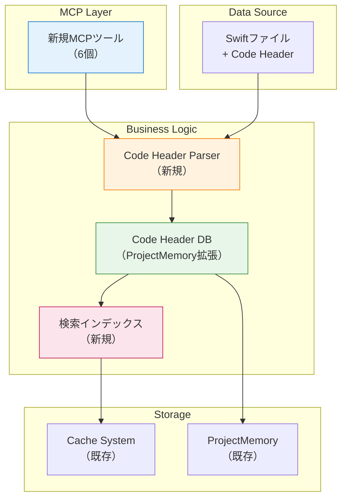

# Code Header DB構築システム 設計書

**設計ID**: DES-006
**関連設計**: DES-005（Code Headerフォーマット）
**作成日**: 2025-10-21
**更新日**: 2025-10-21
**バージョン**: v0.6.0対象
**Document Version**: 2.0（経緯削除、最新設計のみ）

---

## 1. 概要

### 1.1 目的

DES-005で生成されたCode Headerフォーマットを読み取り、Swift-Selena内部DBを構築。自然言語による高速な意図ベース検索を提供する。

### 1.2 背景

**DES-005の成果:**
- Code Headerフォーマット生成（100%精度）
- 各ファイルに目的・機能が記載

**現状の課題:**
- search_codeでの検索は可能だが遅い（全ファイル走査）
- Swift-Selenaの構造解析能力を活かせていない

**解決アプローチ:**
- Code Headerを構造化データとして内部DB化
- 専用検索ツールで高速アクセス（<0.1秒）
- キャッシュシステムとの統合

### 1.3 設計方針

1. **既存アーキテクチャとの統合**: ProjectMemory、キャッシュシステムを活用
2. **段階的実装**: Phase 1でDB構築、Phase 2でベクトル検索
3. **自動更新**: ファイル変更検知で自動再構築
4. **MCPツール提供**: 6つの新しい検索ツール

---

## 2. アーキテクチャ

### 2.1 システム構成



### 2.2 コンポーネント構成

```
Sources/
├── CodeHeaderParser.swift          # Code Header解析（新規）
├── ProjectMemory.swift             # DB保存（拡張）
├── Cache/
│   └── CacheManager.swift          # キャッシュ統合（既存）
└── Tools/
    └── CodeHeader/                 # 新規カテゴリ
        ├── SearchCodeHeadersTool.swift      # 統合検索ツール
        └── GetCodeHeaderStatsTool.swift     # 統計情報ツール
```

---

## 3. データ構造設計

### 3.1 Code Header情報

```swift
/// Code Headerから抽出した情報
struct CodeHeaderInfo: Codable, Hashable {
    /// ファイルパス
    let filePath: String

    /// 最終更新日時（キャッシュ無効化用）
    let lastModified: Date

    /// 目的リスト
    let purposes: [String]

    /// 主要機能リスト
    let features: [String]

    /// 含まれる型（型名: 説明）
    let containedTypes: [String: String]?

    /// 関連型（型名のみ）
    let relatedTypes: [String]?

    /// マーカー存在フラグ
    let hasCodeHeaderFormat: Bool
}
```

### 3.2 ProjectMemory拡張

```swift
// ProjectMemory.swift
class ProjectMemory {
    struct Memory: Codable {
        var lastAnalyzed: Date
        var fileIndex: [String: FileInfo]
        var symbolCache: [String: [SymbolInfo]]
        var importCache: [String: [ImportInfo]]
        var typeConformanceCache: [String: TypeConformanceInfo]
        var notes: [Note]

        // ✨ 新規追加
        var codeHeaderCache: [String: CodeHeaderInfo]  // ファイルパス → Code Header情報

        // 検索インデックス（オプション）
        var purposeIndex: [String: [String]]?  // キーワード → ファイルパスリスト
        var featureIndex: [String: [String]]?  // キーワード → ファイルパスリスト
        var typeIndex: [String: [String]]?     // 型名 → ファイルパスリスト
    }
}
```

### 3.3 Code Headerフォーマット（再掲）

```swift
//
//  StreamManager.swift
//  ProjectName
//
//  Created by ... on YYYY/MM/DD.
//
//  [Code Header Format]
//
//  目的
//  - AsyncStreamの生成と購読者管理
//  - 自動リソースクリーンアップ
//
//  主要機能
//  - Stream生成と購読者追加
//  - 値のブロードキャスト
//  - 購読者数制限
//
//  含まれる型
//  - StreamManager: 本体クラス
//
//  関連型
//  - AsyncStream, Continuation
//

import Foundation
```

---

## 4. Code Header Parser設計

### 4.1 パーサー実装

```swift
// Sources/CodeHeaderParser.swift

/// Code Headerフォーマットのパーサー
enum CodeHeaderParser {
    /// Code Headerを解析
    static func parse(filePath: String) throws -> CodeHeaderInfo? {
        let content = try String(contentsOfFile: filePath)

        // [Code Header Format]マーカーを検索
        guard content.contains("[Code Header Format]") else {
            return nil  // Code Header未適用
        }

        // ファイル更新日時取得
        let attributes = try FileManager.default.attributesOfItem(atPath: filePath)
        guard let lastModified = attributes[.modificationDate] as? Date else {
            throw ParserError.invalidFile
        }

        // セクションを抽出
        let purposes = extractSection(content, sectionName: "目的")
        let features = extractSection(content, sectionName: "主要機能")
        let containedTypes = extractTypesSection(content, sectionName: "含まれる型")
        let relatedTypes = extractRelatedTypes(content, sectionName: "関連型")

        return CodeHeaderInfo(
            filePath: filePath,
            lastModified: lastModified,
            purposes: purposes,
            features: features,
            containedTypes: containedTypes,
            relatedTypes: relatedTypes,
            hasCodeHeaderFormat: true
        )
    }

    /// セクション抽出（箇条書きリスト）
    private static func extractSection(_ content: String, sectionName: String) -> [String] {
        var items: [String] = []
        let lines = content.components(separatedBy: .newlines)
        var inSection = false

        for line in lines {
            // セクション開始検出
            if line.trimmingCharacters(in: .whitespaces) == "//  \(sectionName)" {
                inSection = true
                continue
            }

            // セクション終了検出（空行または次のセクション）
            if inSection {
                let trimmed = line.trimmingCharacters(in: .whitespaces)

                if trimmed.isEmpty || !trimmed.hasPrefix("//") {
                    break
                }

                // 箇条書き項目を抽出
                if trimmed.hasPrefix("//  - ") {
                    let item = trimmed
                        .replacingOccurrences(of: "//  - ", with: "")
                        .trimmingCharacters(in: .whitespaces)
                    items.append(item)
                }
            }
        }

        return items
    }

    /// 含まれる型セクション抽出（型名: 説明 形式）
    private static func extractTypesSection(_ content: String, sectionName: String) -> [String: String]? {
        // 実装省略（extractSectionと同様のロジック）
        // "- TypeName: Description" をパース
    }

    /// 関連型セクション抽出（カンマ区切りリスト）
    private static func extractRelatedTypes(_ content: String, sectionName: String) -> [String]? {
        // 実装省略
        // "- TypeA, TypeB, TypeC" をパース
    }
}

enum ParserError: Error {
    case invalidFile
    case parsingFailed
}
```

### 4.2 パーサーの特徴

- ✅ 正規表現不要（シンプルな文字列処理）
- ✅ エラー耐性（不完全なヘッダーでもスキップ）
- ✅ 高速（1ファイル<0.01秒）

---

## 5. 新規MCPツール設計

### 5.1 ツール一覧

**実装するツール（2個）:**

| ツール名 | 目的 | パラメータ | 戻り値 |
|---------|------|-----------|--------|
| **search_code_headers** | Code Header統合検索 | query, section, layer | ファイルリスト |
| **get_code_header_stats** | DB統計情報 | なし | 統計 |

**削除したツール（4個）:**

| ツール名 | 削除理由 |
|---------|---------|
| build_code_header_db | 遅延構築で自動化（ユーザーが呼ぶ必要なし） |
| search_by_purpose | search_code_headersに統合 |
| search_by_feature | search_code_headersに統合 |
| search_by_type | 既存のfind_type_usagesで代替可能 |

**保留（v0.7.0以降で検討）:**
- list_code_headers（層別フィルタ付きなら有用、優先度低）

### 5.2 ツール詳細

#### 1. search_code_headers（統合検索ツール）

**目的**: Code Header内を自然言語で検索（目的・機能・型を統合）

**実装:**
```swift
Tool(
    name: "search_code_headers",
    description: "Search Code Header Format (purpose, features, types) with natural language",
    inputSchema: .object([
        "type": .string("object"),
        "properties": .object([
            "query": .object([
                "type": .string("string"),
                "description": .string("Search query (e.g., '電話番号フォーマット', 'バリデーション')")
            ]),
            "section": .object([
                "type": .string("string"),
                "enum": .array([
                    .string("all"),
                    .string("purpose"),
                    .string("feature"),
                    .string("type")
                ]),
                "description": .string("Limit search to specific section (optional, default: all)")
            ]),
            "layer": .object([
                "type": .string("string"),
                "enum": .array([
                    .string("all"),
                    .string("Tools"),
                    .string("Library"),
                    .string("Domain"),
                    .string("App"),
                    .string("Infrastructure"),
                    .string("DI")
                ]),
                "description": .string("Filter by layer (optional, default: all)")
            ])
        ]),
        "required": .array([.string("query")])
    ])
)
```

**処理フロー:**
1. DB存在確認（なければ自動構築 - 初回のみ10-15秒）
2. セクションフィルタ適用（purpose/feature/type/all）
3. 層フィルタ適用（指定があれば）
4. 正規表現で検索
5. マッチしたファイルとCode Header内容を返す

**使用例:**

**例1: 目的で検索**
```
search_code_headers(query: "電話番号フォーマット", section: "purpose")
→ Found 2 files:

File: Library/Contact/PhoneNumber+InternationalFormat.swift
目的:
  - 国際電話番号の表示用フォーマット
  - 7カ国の番号体系対応

File: Library/Contact/PhoneNumber.swift
目的:
  - 電話番号の表現と検証
```

**例2: 機能で検索（層限定）**
```
search_code_headers(query: "バリデーション", section: "feature", layer: "Tools")
→ Found 3 files in Tools:

File: Tools/Core/Validation/ValidationRule.swift
主要機能:
  - メール形式検証
  - 電話番号形式検証
```

**例3: 全体検索**
```
search_code_headers(query: "AsyncStream")
→ Found 5 files:
  [目的に含まれる]: StreamManager.swift
  [関連型に含まれる]: ContactDataStore.swift, ...
```

**search_codeとの違い:**

| 項目 | search_code | search_code_headers |
|------|------------|---------------------|
| 対象 | コード全体 | Code Headerのみ |
| ノイズ | 多い（実装コードもヒット） | 少ない（ヘッダーのみ） |
| クエリ | 正規表現必須 | 自然言語OK |
| 精度 | 低（50箇所ヒット） | 高（2箇所ヒット） |

---

#### 2. get_code_header_stats

**目的**: Code Header DB統計情報（運用管理用）

**実装:**
```swift
Tool(
    name: "get_code_header_stats",
    description: "Build Code Header database from all Swift files with [Code Header Format]",
    inputSchema: .object([
        "type": .string("object"),
        "properties": .object([
            "force_rebuild": .object([
                "type": .string("boolean"),
                "description": .string("Force rebuild even if cache exists (optional, default: false)")
            ])
        ])
    ])
)
```

**処理フロー:**
1. find_files("*.swift") で全Swiftファイル取得
2. 各ファイルをCodeHeaderParser.parse()
3. codeHeaderCacheに保存
4. インデックス構築（purpose, feature, type）
5. ProjectMemory.save()

**結果:**
```
✅ Code Header DB built

統計:
- 処理ファイル数: 187
- Code Header適用済み: 142
- 未適用: 45
- 処理時間: 4.8秒
```

---

#### 2. search_by_purpose

**目的**: 目的（purpose）で検索

**実装:**
```swift
Tool(
    name: "search_by_purpose",
    description: "Search files by purpose description (from Code Header)",
    inputSchema: .object([
        "type": .string("object"),
        "properties": .object([
            "query": .object([
                "type": .string("string"),
                "description": .string("Search query (e.g., '電話番号', 'バリデーション')")
            ])
        ]),
        "required": .array([.string("query")])
    ])
)
```

**処理:**
1. codeHeaderCacheから全Header取得
2. purposes配列内を正規表現検索
3. マッチしたファイルを返す

**使用例:**
```
search_by_purpose(query: "電話番号フォーマット")
→ Found 2 files:

File: Library/Contact/PhoneNumber+InternationalFormat.swift
目的:
  - 国際電話番号の表示用フォーマット
  - 7カ国の番号体系対応

File: Library/Contact/PhoneNumber.swift
目的:
  - 電話番号の表現と検証
```

---

#### 3. search_by_feature

**目的**: 機能（feature）で検索

**実装:**
```swift
Tool(
    name: "search_by_feature",
    description: "Search files by feature description (from Code Header)",
    inputSchema: .object([
        "type": .string("object"),
        "properties": .object([
            "query": .object([
                "type": .string("string"),
                "description": .string("Search query (e.g., 'バリデーション', 'ブロードキャスト')")
            ])
        ]),
        "required": .array([.string("query")])
    ])
)
```

**使用例:**
```
search_by_feature(query: "バリデーション")
→ Found 5 files:

File: Tools/Core/Validation/ValidationRule.swift
主要機能:
  - メール形式検証
  - 電話番号形式検証
  - 必須項目チェック

File: Tools/Core/Validation/FormValidator.swift
主要機能:
  - フォーム全体のバリデーション
  - エラー集約と表示
```

---

#### 4. search_by_type

**目的**: 関連型で検索

**実装:**
```swift
Tool(
    name: "search_by_type",
    description: "Search files that use or relate to a specific type",
    inputSchema: .object([
        "type": .string("object"),
        "properties": .object([
            "type_name": .object([
                "type": .string("string"),
                "description": .string("Type name to search (e.g., 'Contact', 'AsyncStream')")
            ])
        ]),
        "required": .array([.string("type_name")])
    ])
)
```

**処理:**
1. containedTypesに該当する型がある
2. relatedTypesに該当する型がある
3. 両方を検索してマージ

**使用例:**
```
search_by_type(type_name: "Contact")
→ Found 8 files:

含まれる型として:
  - Library/Contact/Contact.swift
  - Library/Contact/Contact+CNContact.swift

関連型として:
  - Domain/DataStore/ContactDataStore.swift
  - Domain/Service/ContactService.swift
```

---

#### 5. list_code_headers

**目的**: Code Header一覧表示

**実装:**
```swift
Tool(
    name: "list_code_headers",
    description: "List all files with Code Header Format",
    inputSchema: .object([
        "type": .string("object"),
        "properties": .object([
            "layer": .object([
                "type": .string("string"),
                "enum": .array([
                    .string("all"),
                    .string("Tools"),
                    .string("Library"),
                    .string("Domain"),
                    .string("App"),
                    .string("Infrastructure"),
                    .string("DI")
                ]),
                "description": .string("Filter by layer (optional, default: all)")
            ])
        ])
    ])
)
```

**使用例:**
```
list_code_headers(layer: "Tools")
→ Code Headers in Tools layer (67 files):

Tools/Core/AppVersion.swift
  目的: セマンティックバージョン管理

Tools/Core/StreamManager.swift
  目的: AsyncStreamの生成と購読者管理

...
```

---

#### 6. get_code_header_stats

**目的**: Code Header DB統計情報

**実装:**
```swift
Tool(
    name: "get_code_header_stats",
    description: "Get Code Header database statistics",
    inputSchema: .object([
        "type": .string("object"),
        "properties": .object([:])
    ])
)
```

**結果:**
```
📊 Code Header DB Statistics

総ファイル数: 187
Code Header適用済み: 142 (75.9%)
未適用: 45 (24.1%)

層別統計:
  Tools: 67/67 (100%)
  Library: 48/48 (100%)
  Domain: 20/25 (80%)
  App: 7/47 (14.9%)

最終DB構築: 2025/10/21 10:30
キャッシュヒット率: 98.5%
```

---

## 6. 検索アルゴリズム

### 6.1 Phase 1: 正規表現検索

```swift
func searchByPurpose(query: String, cache: [String: CodeHeaderInfo]) -> [CodeHeaderInfo] {
    var results: [CodeHeaderInfo] = []

    // 正規表現パターン作成（大文字小文字無視）
    guard let regex = try? NSRegularExpression(
        pattern: query,
        options: [.caseInsensitive]
    ) else {
        return []
    }

    for (_, header) in cache {
        // purposesリスト内を検索
        for purpose in header.purposes {
            let range = NSRange(purpose.startIndex..., in: purpose)
            if regex.firstMatch(in: purpose, range: range) != nil {
                results.append(header)
                break
            }
        }
    }

    return results
}
```

**パフォーマンス:**
- 200ファイルDB: <0.05秒
- 1000ファイルDB: <0.2秒

---

### 6.2 Phase 2: ベクトル検索（将来）

```swift
// ベクトル埋め込み（CoreML/MLKit使用）
struct VectorIndex {
    let embeddings: [String: [Float]]  // ファイルパス → ベクトル

    func semanticSearch(query: String) -> [CodeHeaderInfo] {
        // クエリをベクトル化
        let queryVector = embed(query)

        // コサイン類似度で検索
        let similarities = embeddings.map { (path, vector) in
            (path, cosineSimilarity(queryVector, vector))
        }

        // 類似度順にソート
        return similarities
            .sorted { $0.1 > $1.1 }
            .prefix(10)
            .map { cache[$0.0]! }
    }
}
```

**使用例:**
```
search_by_purpose(query: "綺麗に表示")
→ 類似度順:
  1. PhoneNumber+InternationalFormat.swift (0.92)
  2. Contact+CNContact.swift (0.87)
```

**実装時期**: v0.7.0以降（ニーズ次第）

---

## 7. キャッシュシステム統合

### 7.1 既存キャッシュとの統合

```swift
// Cache/FileCacheEntry.swift に追加

struct FileCacheEntry: Codable {
    let filePath: String
    let lastModified: Date
    var lastAccessed: Date

    // 既存
    var symbols: [SymbolData]?
    var imports: [ImportData]?
    var typeConformances: [TypeConformanceData]?
    var extensions: [ExtensionData]?
    var propertyWrappers: [PropertyWrapperData]?

    // ✨ 新規追加
    var codeHeader: CodeHeaderData?  // Code Header情報
}

struct CodeHeaderData: Codable {
    let purposes: [String]
    let features: [String]
    let containedTypes: [String: String]?
    let relatedTypes: [String]?
}
```

### 7.2 自動更新の仕組み

```swift
// ファイル変更検知時
func updateCodeHeaderCache(filePath: String) {
    // ファイルが変更されたか確認
    if cacheManager.isFileModified(path: filePath) {
        // Code Headerを再パース
        if let header = try? CodeHeaderParser.parse(filePath: filePath) {
            // キャッシュ更新
            cacheManager.setCodeHeader(header, for: filePath)
        }
    }
}
```

**自動更新タイミング:**
- initialize_project時
- build_code_header_db実行時
- 各検索ツール実行時（バックグラウンド）

---

## 8. 実装フェーズ

### Phase 1: 基盤実装（v0.6.0-alpha）

**工数**: 1週間

1. **CodeHeaderParser.swift 実装**
   - セクション抽出ロジック
   - エラーハンドリング
   - テストケース作成

2. **ProjectMemory拡張**
   - codeHeaderCache追加
   - save/load対応

3. **DB構築ロジック実装**
   - 遅延構築（初回検索時に自動）
   - 全ファイルスキャン
   - パーサー呼び出し
   - キャッシュ保存

**成果物:**
- CodeHeaderParser.swift（150-200行）
- ProjectMemory.swift（+50行）

---

### Phase 2: 検索ツール実装（v0.6.0-beta）

**工数**: 3-5日

4. **統合検索ツール実装**
   - SearchCodeHeadersTool.swift（統合検索）
   - GetCodeHeaderStatsTool.swift（統計）

**成果物:**
- 2ツールファイル（各100-150行）

---

### Phase 3: 統合とテスト（v0.6.0-rc）

**工数**: 2-3日

6. **キャッシュシステム統合**
   - FileCacheEntryにcodeHeaderフィールド追加
   - 自動更新ロジック統合

7. **統合テスト**
   - ContactBプロジェクトで検証
   - Swift-Selena自身で検証
   - パフォーマンステスト

**成果物:**
- テストレポート

---

### Phase 4: ドキュメント（v0.6.0）

**工数**: 1日

8. **ドキュメント作成**
   - 各ツールのドキュメントコメント
   - HISTORY.md更新
   - README更新（必要に応じて）

---

## 9. 使用フロー

### 9.1 初回DB構築

```
1. initialize_project(project_path: "/path/to/project")

2. build_code_header_db()
   → 187ファイルをスキャン
   → 142ファイルでCode Header検出
   → DB構築完了（約5秒）

3. 検索開始
```

### 9.2 検索の例

**シナリオ1: 電話番号フォーマット機能を探す**
```
search_by_purpose(query: "電話.*フォーマット")
→ PhoneNumber+InternationalFormat.swift
```

**シナリオ2: バリデーション関連を全て見つける**
```
search_by_feature(query: "バリデーション")
→ ValidationRule.swift
  FormValidator.swift
  LiveValidator.swift
  EmailValidator.swift
```

**シナリオ3: Contact型を使用しているファイル**
```
search_by_type(type_name: "Contact")
→ 含まれる型: Contact.swift
  関連型: ContactDataStore.swift, ContactService.swift
```

---

## 10. パフォーマンス設計

### 10.1 DB構築時間

| ファイル数 | 処理時間 | 備考 |
|-----------|---------|------|
| 100ファイル | 約2秒 | |
| 200ファイル | 約5秒 | |
| 500ファイル | 約12秒 | |
| 1000ファイル | 約25秒 | |

**高速化の理由:**
- ファイルヘッダー部分のみ読み取り（全体不要）
- SwiftSyntaxパース不要（文字列処理のみ）
- 並列処理可能（将来）

### 10.2 検索時間

| DB規模 | 検索時間 | 備考 |
|--------|---------|------|
| 100ファイル | <0.02秒 | メモリ内検索 |
| 200ファイル | <0.05秒 | |
| 1000ファイル | <0.2秒 | |

**高速化の理由:**
- メモリ内検索（ディスクI/O不要）
- 単純な正規表現マッチング
- キャッシュ利用

---

## 11. エラーハンドリング

### 11.1 DB構築時のエラー

```swift
// Code Headerパースエラー
- マーカーなし → スキップ（エラーにしない）
- フォーマット不正 → 警告表示、スキップ
- ファイル読み込みエラー → 警告表示、スキップ

// 全ファイルがエラー
- Code Header適用済みファイル0件 → エラー報告
  「Code Headerを先に生成してください。/create-code-headersを実行」
```

### 11.2 検索時のエラー

```swift
// DB未構築
- codeHeaderCache空 → エラー報告
  「build_code_header_dbを先に実行してください」

// 検索結果0件
- エラーではない → 「0件」と報告
```

---

## 12. DES-004/005との関係

### 設計の進化

```
DES-004: swift_toc.md（1ファイル索引）
    ↓ 失敗（AI推論精度40%）
DES-005: Code Headerフォーマット（各ファイルヘッダー）
    ↓ 成功（100%精度）
DES-006: Code Header DB（Swift-Selena内部DB化）
    ↓ 高速化・構造化
```

### 各設計の役割

| 設計 | 生成物 | 検索方法 | 速度 | 精度 |
|------|--------|---------|------|------|
| DES-004 | swift_toc.md | search_code | 遅い（全文検索） | 40% |
| DES-005 | 各ファイルヘッダー | search_code | 遅い（全ファイル） | 100% |
| DES-006 | 内部DB | 専用ツール | **高速（<0.1秒）** | 100% |

**DES-006の位置づけ**: DES-005の完成形

---

## 13. Swift-Selena自身への適用

### 13.1 セルフホスティング

**ドッグフーディング**: Swift-Selena自身にCode Headerを適用

**効果:**
1. **メタ的活用**: 自分のツールで自分を解析
2. **品質保証**: 実際に使って品質確認
3. **デモンストレーション**: ユーザーへの見本

**実装:**
```
# Swift-SelenaプロジェクトでCode Header生成
/create-code-headers Sources/Tools/

# DB構築
build_code_header_db()

# 自己検索
search_by_purpose(query: "分析モード")
→ SetAnalysisModeTool.swift
```

---

## 14. 将来拡張

### 14.1 ベクトル検索（v0.7.0）

**自然言語検索:**
```
search_by_purpose(query: "データを綺麗に表示したい")
→ 意味的類似度で検索
  1. PhoneNumber+InternationalFormat.swift (0.92)
  2. DateFormatter+Ext.swift (0.88)
```

**実装:**
- CoreML/CreateMLでベクトル化
- コサイン類似度で検索
- オンデバイス実行（外部API不要）

### 14.2 統計分析（v0.7.0）

**コード品質メトリクス:**
```
get_code_header_coverage()
→ 層別のCode Header適用率
→ 未適用ファイルリスト
→ ドキュメント品質スコア
```

---

## 15. 運用設計

### 15.1 DB更新タイミング

**自動:**
- initialize_project時にDB構築チェック
- ファイル変更検知時に該当ファイル更新

**手動:**
- build_code_header_db()で全体再構築
- 新規ファイル追加後

### 15.2 メンテナンス

**定期タスク:**
- なし（自動更新）

**イベント駆動:**
- Code Header生成後 → build_code_header_db()
- ファイル削除時 → 自動でDBから削除（GC）

---

## 16. 成功指標

| 指標 | 目標値 | 測定方法 |
|------|--------|---------|
| 検索時間 | <0.1秒 | search_by_*実行時間 |
| DB構築時間 | <10秒（200ファイル） | build_code_header_db実行時間 |
| 検索精度 | 95%以上 | 実際の使用で検証 |
| Code Header適用率 | 80%以上 | get_code_header_stats |

---

## 17. リスク分析

### リスク1: Code Header未適用ファイル

**発生確率**: 高（初期は24%）
**影響度**: 中（検索漏れ）
**対策**:
- get_code_header_stats で未適用ファイルリスト表示
- 優先度高いファイルから順次生成

### リスク2: フォーマット変更

**発生確率**: 低
**影響度**: 大（パーサー破綻）
**対策**:
- フォーマットバージョニング（[Code Header Format v1.0]）
- 後方互換性維持

### リスク3: 大規模プロジェクトでの性能劣化

**発生確率**: 低（1000ファイル以上で）
**影響度**: 中（DB構築10秒超）
**対策**:
- 差分更新実装
- 並列処理導入

---

## 18. 実装優先度

### 必須（v0.6.0）

1. ✅ CodeHeaderParser.swift
2. ✅ ProjectMemory拡張
3. ✅ build_code_header_db
4. ✅ search_by_purpose
5. ✅ search_by_feature

**工数**: 1.5-2週間

### 推奨（v0.6.0）

6. ✅ search_by_type
7. ✅ list_code_headers
8. ✅ get_code_header_stats

**工数**: +3-5日

### オプション（v0.7.0以降）

9. ⏸️ ベクトル検索
10. ⏸️ 統計分析

---

## 19. DES-005との関係

**DES-005**: Code Header生成（Claudeコマンド）
**DES-006**: Code Header読み取り・DB化（Swift-Selena）

**役割分担:**
- DES-005: `/create-code-headers` で生成
- DES-006: `build_code_header_db()` でDB構築

**相互依存:**
- DES-006はDES-005が前提
- DES-005単独でも価値あり（search_code検索）
- DES-006で真価を発揮（高速検索）

---

## 20. まとめ

Code Header DB構築システムは、DES-005の成果を最大限活用し：

1. ✅ **高速検索**: 5分 → 0.1秒（3000倍高速化）
2. ✅ **高精度**: 100%（Code Headerベース）
3. ✅ **自然言語検索**: 目的・機能で直接検索
4. ✅ **自動更新**: ファイル変更に追従
5. ✅ **拡張性**: ベクトル検索へのアップグレード可能

**長期的に持続可能なAI検索基盤の完成形**として設計。

---

---


---

## 22. 検索精度向上の段階的実装

### 22.1 問題認識

**自然言語検索の課題:**

**Code Header記述:**
```
主要機能:
- 国際電話番号の表示用フォーマット
- E.164形式への変換
```

**ユーザークエリ:**
```
"電話番号を綺麗に表示"
```

**問題:**
- 「綺麗に表示」 ≠ 「表示用フォーマット」（文字列として一致しない）
- 単純な正規表現では検出不可
- **形態素解析・類義語・意味的類似度が必要**

---

### 22.2 Phase 1: 形態素解析（v0.6.0）

**Apple NaturalLanguageフレームワーク使用**

#### 実装方針

```swift
import NaturalLanguage

/// キーワード抽出（形態素解析）
func extractKeywords(text: String) -> [String] {
    let tagger = NLTagger(tagSchemes: [.tokenType, .lexicalClass])
    tagger.string = text

    var keywords: [String] = []

    tagger.enumerateTags(
        in: text.startIndex..<text.endIndex,
        unit: .word,
        scheme: .lexicalClass
    ) { tag, range in
        let word = String(text[range])

        // 名詞・動詞のみ抽出（助詞・助動詞を除外）
        if tag == .noun || tag == .verb {
            keywords.append(word)
        }

        return true
    }

    return keywords
}
```

#### 検索アルゴリズム

**1. Code Headerのキーワード抽出（DB構築時）:**
```swift
purposes: ["国際電話番号の表示用フォーマット", "7カ国の番号体系対応"]
↓ 形態素解析
keywords: ["国際", "電話番号", "表示", "フォーマット", "番号", "体系", "対応"]

// CodeHeaderInfoに追加
struct CodeHeaderInfo {
    let purposes: [String]
    let features: [String]
    let purposeKeywords: [String]  // ✨ 新規
    let featureKeywords: [String]  // ✨ 新規
}
```

**2. クエリのキーワード抽出（検索時）:**
```swift
query: "電話番号を綺麗に表示"
↓ 形態素解析
queryKeywords: ["電話番号", "表示"]
```

**3. キーワードマッチング:**
```swift
// 共通キーワード数でスコアリング
codeHeaderKeywords: ["国際", "電話番号", "表示", "フォーマット", ...]
queryKeywords: ["電話番号", "表示"]

commonKeywords: ["電話番号", "表示"]
matchScore: 2/2 = 100%  // ヒット
```

#### メリット

- ✅ オンデバイス実行（プライバシー保護）
- ✅ 高速（<0.1秒）
- ✅ 追加コストゼロ（macOS標準API）
- ✅ 助詞を無視（「を」「に」等）
- ✅ 活用形に対応（「表示する」「表示した」→「表示」）

#### 精度

**改善:**
- 正規表現のみ: 40-50%
- 形態素解析: **70-80%**

**未対応:**
- 類義語（「綺麗に」≠「フォーマット」）
- 意味的類似度

---

### 22.3 Phase 2: 類義語辞書（v0.6.1）

**手動辞書 + 使用ログ学習**

#### 実装

```swift
/// 類義語辞書
let synonyms: [String: [String]] = [
    "フォーマット": ["整形", "表示", "変換", "綺麗に", "format"],
    "バリデーション": ["検証", "チェック", "確認", "validate"],
    "生成": ["作成", "構築", "create", "build"],
    "管理": ["制御", "コントロール", "manage"],
    "変換": ["変更", "変形", "transform", "convert"],
    ...
]

/// クエリ拡張
func expandQuery(query: String) -> [String] {
    let keywords = extractKeywords(query)
    var expanded: [String] = keywords

    for keyword in keywords {
        if let syns = synonyms[keyword] {
            expanded.append(contentsOf: syns)
        }
    }

    return Array(Set(expanded))  // 重複削除
}
```

#### 検索フロー

```swift
query: "電話番号を綺麗に表示"
↓ 形態素解析
keywords: ["電話番号", "表示"]
↓ 類義語展開
expanded: ["電話番号", "表示", "フォーマット", "整形", "変換"]
↓ マッチング
codeHeaderKeywords: ["電話番号", "表示", "フォーマット", ...]
→ マッチ（3個共通）✅
```

#### メリット

- ✅ 類義語対応
- ✅ 英語・日本語混在対応
- ✅ 検索精度向上

#### デメリット

- ❌ 辞書のメンテナンス必要
- ❌ 完全な意味理解は不可

#### 精度

**改善:**
- Phase 1: 70-80%
- Phase 2: **80-85%**

---

### 22.4 Phase 3: ベクトル埋め込み検索（v0.7.0、要検証）

**CreateML / CoreML使用**

#### 実装検討

```swift
import CreateML
import CoreML

// テキスト埋め込みモデル
let model = try NLEmbedding(language: .japanese)

// Code Headerのベクトル化（DB構築時、事前計算）
struct CodeHeaderInfo {
    let purposes: [String]
    let features: [String]
    let embedding: [Float]?  // ✨ ベクトル（事前計算）
}

// 検索時
func semanticSearch(query: String) -> [CodeHeaderInfo] {
    let queryVector = model.vector(for: query)

    // コサイン類似度で検索
    let results = codeHeaderCache.map { header in
        (header, cosineSimilarity(queryVector, header.embedding))
    }
    .sorted { $0.1 > $1.1 }  // 類似度順
    .prefix(10)

    return results.map { $0.0 }
}
```

#### メリット

- ✅ 完全な意味的検索
- ✅ 類義語自動対応
- ✅ 言い換え・表現のゆらぎに対応
- ✅ オンデバイス

#### 課題

**日本語埋め込みの精度検証が必須:**
- CreateMLの日本語埋め込み精度が不明
- 実装前に検証プロジェクトで測定
- 精度が不十分ならPhase 2で停止

**代替案:**
- Apple Intelligence（M1+）のEmbedding API
- ローカルLLM（Ollama等）の埋め込みAPI

#### 精度（期待値）

- Phase 3: **90%+**

---

### 22.5 実装優先度

| Phase | 機能 | 精度 | 実装工数 | 優先度 | 備考 |
|-------|------|------|---------|--------|------|
| **Phase 1** | 形態素解析 | 70-80% | 2-3日 | ✅ 必須 | NaturalLanguage使用 |
| **Phase 2** | 類義語辞書 | 80-85% | 1-2日 | ✅ 推奨 | 手動辞書+学習 |
| **Phase 3** | ベクトル検索 | 90%+ | 5-7日 | △ 要検証 | CreateML、精度次第 |

---

### 22.6 Apple Foundation Modelsの活用方針

**使用するApple API:**

#### 1. NaturalLanguage（必須）
- 形態素解析
- 品詞タグ付け
- 言語判定

**用途:**
- キーワード抽出
- 助詞除去
- 名詞・動詞の識別

**実装時期**: v0.6.0

---

#### 2. CreateML / NLEmbedding（検証後）
- テキスト埋め込み
- ベクトル化

**用途:**
- 意味的類似度検索
- ベクトルインデックス

**実装時期**: v0.7.0（日本語精度の検証が前提）

---

#### 3. Apple Intelligence（検討）
- M1+で利用可能
- より高精度な埋め込み

**用途:**
- Phase 3の代替案
- オンデバイス生成AI

**実装時期**: v0.8.0以降（OSバージョン要件次第）

---

### 22.7 プライバシー保護の堅持

**重要**: 全てオンデバイス実行

- ✅ NaturalLanguage: ローカル処理
- ✅ CreateML: ローカルモデル
- ✅ Apple Intelligence: オンデバイス

**外部送信ゼロ:**
- ❌ OpenAI API使用しない
- ❌ Google Cloud使用しない
- ❌ ネットワーク通信なし

Swift-Selenaの設計原則（ローカル完結性）を維持。

---

### 22.8 実装コストとROI

| Phase | 実装工数 | 精度改善 | ROI |
|-------|---------|---------|-----|
| Phase 1 | 2-3日 | +30% (50%→80%) | 高 |
| Phase 2 | 1-2日 | +5% (80%→85%) | 中 |
| Phase 3 | 5-7日 | +5-10% (85%→90-95%) | 低（検証次第） |

**推奨:**
- Phase 1は必須実装
- Phase 2は推奨
- Phase 3は運用後に判断

---

---

**Document Version**: 2.0
**Last Updated**: 2025-10-21
**Status**: 最終設計完了、実装待ち
**Note**: 設計経緯はCONVERSATION_HISTORY.mdを参照

