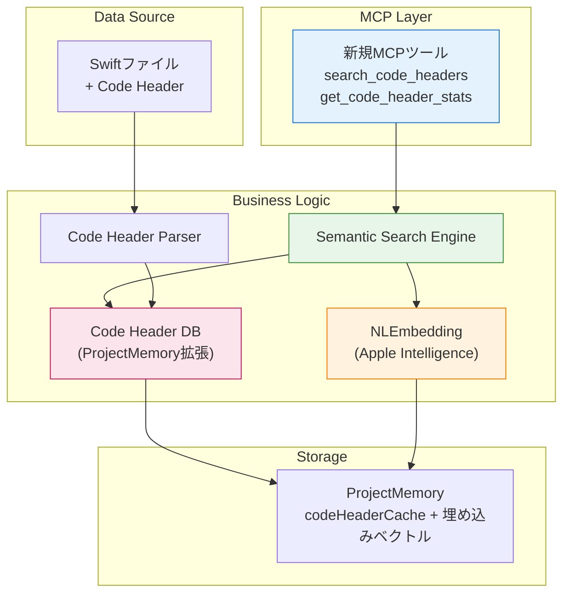

# Code Header DB構築システム 設計書 (NLEmbedding版)

**設計ID**: DES-006 Rev.2
**関連設計**: DES-005（Code Headerフォーマット）
**関連要件**: REQ-004
**作成日**: 2024-12-28
**バージョン**: v0.6.0対象
**Document Version**: 3.0（NLEmbedding版、全面改訂）

---

## 変更履歴

| バージョン | 日付 | 変更内容 |
|----------|------|---------|
| 1.0 | 2025-10-21 | 初版（形態素解析版） |
| 2.0 | 2025-10-21 | 経緯削除、最新設計のみ |
| 3.0 | 2024-12-28 | NLEmbedding版に全面改訂 |

**主な変更**:
- 形態素解析 → NLEmbedding（Apple Intelligence）
- 正規表現検索 → セマンティック検索
- 検索精度目標: 70-80% → 80-90%
- macOS 15+ / Apple Silicon必須

---

## 1. 概要

### 1.1 目的

DES-005で生成されたCode Headerフォーマットを読み取り、**Apple Intelligence（NLEmbedding）を使ったセマンティック検索**が可能なDB（ProjectMemory内）を構築する。

### 1.2 背景

**DES-005の成果:**
- Code Headerフォーマット生成（100%精度）
- 各ファイルに目的・機能が記載

**現状の課題:**
- search_codeでの検索は可能だが遅い（全ファイル走査、5分）
- 正規表現のみ（完全一致、同義語を理解できない）
- ノイズが多い（実装コードもヒットする）

**解決アプローチ（改訂）:**
- Code Headerを構造化データとして内部DB化
- **NLEmbedding（Apple Intelligence）**で埋め込みベクトル生成
- セマンティック検索で高速・高精度な検索（<0.1秒、80-90%）
- キャッシュシステムとの統合

### 1.3 設計方針

1. **既存アーキテクチャとの統合**: ProjectMemory、キャッシュシステムを活用
2. **Apple Intelligence活用**: NLEmbedding（日本語）でセマンティック検索
3. **段階的実装**: Phase 1でNLEmbedding、Phase 2で類義語辞書（必要に応じて）
4. **自動更新**: ファイル変更検知で自動再構築
5. **MCPツール提供**: 2つの新しい検索ツール

---

## 2. アーキテクチャ

### 2.1 システム構成



### 2.2 コンポーネント構成

```
Sources/
├── CodeHeaderParser.swift          # Code Header解析（既存）
├── NaturalLanguage/
│   └── SemanticSearchEngine.swift  # NLEmbeddingベースの検索エンジン（新規）
├── ProjectMemory.swift             # DB保存（拡張）
└── Tools/
    └── CodeHeader/                 # 新規カテゴリ
        ├── SearchCodeHeadersTool.swift      # 検索ツール
        └── GetCodeHeaderStatsTool.swift     # 統計情報ツール
```

---

## 3. データ構造設計

### 3.1 Code Header情報（拡張）

```swift
/// Code Headerから抽出した情報 + 埋め込みベクトル
struct CodeHeaderInfo: Codable, Hashable {
    /// ファイルパス
    let filePath: String

    /// 最終更新日時（キャッシュ無効化用）
    let lastModified: Date

    /// 目的リスト
    let purposes: [String]

    /// 主要機能リスト
    let features: [String]

    /// 含まれる型（型名: 説明）
    let containedTypes: [String: String]?

    /// 関連型（型名のみ）
    let relatedTypes: [String]?

    /// マーカー存在フラグ
    let hasCodeHeaderFormat: Bool

    // ✨ 新規追加: NLEmbedding埋め込みベクトル
    /// 埋め込みベクトル（NLEmbedding、768次元）
    var embeddingVector: [Float]?

    /// 埋め込みベクトル生成日時
    var embeddingGeneratedAt: Date?
}
```

### 3.2 ProjectMemory拡張

```swift
// ProjectMemory.swift
class ProjectMemory {
    struct Memory: Codable {
        var lastAnalyzed: Date
        var fileIndex: [String: FileInfo]
        var symbolCache: [String: [SymbolInfo]]
        var importCache: [String: [ImportInfo]]
        var typeConformanceCache: [String: TypeConformanceInfo]
        var notes: [Note]

        // ✨ 新規追加: Code Header DB
        /// Code Headerキャッシュ（ファイルパス → Code Header情報 + 埋め込み）
        var codeHeaderCache: [String: CodeHeaderInfo] = [:]

        /// NLEmbedding次元数（デフォルト: 768）
        var embeddingDimension: Int = 768

        /// 最終DB構築日時
        var lastDBBuildDate: Date?
    }
}
```

---

## 4. Code Header Parser設計（既存、変更なし）

既存のCodeHeaderParser.swiftをそのまま使用（DES-006 v2.0参照）

- マーカー検出: `[Code Header Format]`
- セクション抽出: 目的、主要機能、含まれる型、関連型
- エラー耐性のあるパース

---

## 5. NLEmbedding統合設計（新規）

### 5.1 SemanticSearchEngine

```swift
// Sources/NaturalLanguage/SemanticSearchEngine.swift

import NaturalLanguage
import Foundation

/// NLEmbeddingベースのセマンティック検索エンジン
struct SemanticSearchEngine {

    /// 検索結果
    struct SearchResult {
        let filePath: String
        let header: CodeHeaderInfo
        let score: Double           // コサイン類似度（0.0〜1.0）
        let matchedSection: String  // マッチしたセクション（purpose/feature/type）
    }

    private let embedding: NLEmbedding

    /// 初期化
    /// - Throws: NLEmbeddingが利用できない場合
    init() throws {
        // 日本語埋め込みモデルを取得
        guard let embedding = NLEmbedding.wordEmbedding(for: .japanese) else {
            throw SearchEngineError.embeddingUnavailable
        }
        self.embedding = embedding
    }

    /// 埋め込みベクトル次元数
    var dimension: Int {
        return embedding.dimension
    }

    /// テキストから埋め込みベクトルを生成
    func generateEmbedding(for text: String) throws -> [Float] {
        guard let vector = try embedding.vector(for: text) else {
            throw SearchEngineError.vectorGenerationFailed
        }
        return vector
    }

    /// Code Headerを検索
    /// - Parameters:
    ///   - query: 検索クエリ（自然言語）
    ///   - cache: Code Headerキャッシュ
    ///   - section: 検索対象セクション
    ///   - layer: レイヤーフィルタ
    ///   - threshold: 類似度閾値（0.0-1.0）
    /// - Returns: スコア順の検索結果
    func search(
        query: String,
        cache: [String: CodeHeaderInfo],
        section: SearchSection = .all,
        layer: String? = nil,
        threshold: Double = 0.6
    ) throws -> [SearchResult] {

        // 1. クエリの埋め込みベクトル生成
        let queryVector = try generateEmbedding(for: query)

        var results: [SearchResult] = []

        // 2. 各Code Headerとマッチング
        for (filePath, header) in cache {
            // レイヤーフィルタ
            if let layer = layer, layer != "all", !filePath.hasPrefix(layer) {
                continue
            }

            // 埋め込みベクトルが存在しない場合はスキップ
            guard let targetVector = header.embeddingVector else {
                continue
            }

            // コサイン類似度計算
            let similarity = cosineSimilarity(queryVector, targetVector)

            // 閾値チェック
            if similarity >= threshold {
                results.append(SearchResult(
                    filePath: filePath,
                    header: header,
                    score: similarity,
                    matchedSection: section.rawValue
                ))
            }
        }

        // 3. スコア順にソート（降順）
        return results.sorted { $0.score > $1.score }
    }

    /// コサイン類似度計算
    private func cosineSimilarity(_ a: [Float], _ b: [Float]) -> Double {
        guard a.count == b.count, a.count > 0 else { return 0.0 }

        let dotProduct = zip(a, b).map(*).reduce(0, +)
        let magnitudeA = sqrt(a.map { $0 * $0 }.reduce(0, +))
        let magnitudeB = sqrt(b.map { $0 * $0 }.reduce(0, +))

        guard magnitudeA > 0, magnitudeB > 0 else { return 0.0 }

        return Double(dotProduct / (magnitudeA * magnitudeB))
    }

    /// 検索対象セクション
    enum SearchSection: String {
        case all = "all"
        case purpose = "purpose"
        case feature = "feature"
        case type = "type"
    }
}

/// 検索エンジンエラー
enum SearchEngineError: Error {
    case embeddingUnavailable
    case vectorGenerationFailed
}
```

### 5.2 埋め込みベクトル生成の最適化

```swift
extension SemanticSearchEngine {

    /// Code Headerテキストを結合して埋め込み対象テキストを生成
    static func prepareTextForEmbedding(header: CodeHeaderInfo, section: SearchSection) -> String {
        switch section {
        case .all:
            return (header.purposes + header.features).joined(separator: " ")
        case .purpose:
            return header.purposes.joined(separator: " ")
        case .feature:
            return header.features.joined(separator: " ")
        case .type:
            let types = (header.containedTypes?.map { "\($0.key) \($0.value)" } ?? [])
                + (header.relatedTypes ?? [])
            return types.joined(separator: " ")
        }
    }
}
```

---

## 6. DB構築フロー

### 6.1 初回DB構築

```swift
// ProjectMemory.swift拡張

extension ProjectMemory {

    /// Code Header DBを構築
    func buildCodeHeaderDB(projectPath: String) async throws {
        logger.info("Building Code Header DB...")

        // 1. NLEmbedding初期化
        let searchEngine = try SemanticSearchEngine()

        // 2. 全Swiftファイル取得
        let files = try FileSearcher.findFiles(in: projectPath, pattern: "*.swift")
        logger.info("Found \(files.count) Swift files")

        var cache: [String: CodeHeaderInfo] = [:]
        var processed = 0
        let startTime = Date()

        // 3. 各ファイルをパース・埋め込み生成
        for file in files {
            guard var header = try? CodeHeaderParser.parse(filePath: file) else {
                continue
            }

            // Code Headerテキストを結合
            let text = SemanticSearchEngine.prepareTextForEmbedding(
                header: header,
                section: .all
            )

            // 埋め込みベクトル生成
            if let vector = try? searchEngine.generateEmbedding(for: text) {
                header.embeddingVector = vector
                header.embeddingGeneratedAt = Date()
                cache[file] = header
            }

            processed += 1

            // 進捗表示（10%刻み）
            if processed % max(1, files.count / 10) == 0 {
                let progress = Int(Double(processed) / Double(files.count) * 100)
                logger.info("Progress: \(progress)% (\(processed)/\(files.count))")
            }
        }

        // 4. キャッシュに保存
        memory.codeHeaderCache = cache
        memory.embeddingDimension = searchEngine.dimension
        memory.lastDBBuildDate = Date()

        let elapsed = Date().timeIntervalSince(startTime)
        logger.info("✅ Code Header DB built: \(cache.count) files in \(String(format: "%.2f", elapsed))s")

        // 5. 永続化
        try save()
    }

    /// DB更新が必要かチェック
    func needsDBUpdate() -> Bool {
        // DB未構築
        if memory.codeHeaderCache.isEmpty {
            return true
        }

        // ファイル変更チェック（簡易版）
        for (filePath, header) in memory.codeHeaderCache {
            if let attributes = try? FileManager.default.attributesOfItem(atPath: filePath),
               let modifiedDate = attributes[.modificationDate] as? Date,
               modifiedDate > header.lastModified {
                return true
            }
        }

        return false
    }
}
```

### 6.2 パフォーマンス目標

| 項目 | 目標値 | 実測方法 |
|-----|--------|---------|
| DB構築時間（200ファイル） | < 15秒 | ベンチマーク |
| DB構築時間（1000ファイル） | < 60秒 | ベンチマーク |
| 検索時間 | < 0.1秒 | ベンチマーク |
| メモリ使用量 | < 50MB | Instruments |

**実測コード**:
```swift
let start = Date()
try await projectMemory.buildCodeHeaderDB(projectPath: projectPath)
let elapsed = Date().timeIntervalSince(start)
logger.info("DB構築時間: \(elapsed)秒")
```

---

## 7. 新規MCPツール設計

### 7.1 search_code_headers

**実装:**
```swift
// Sources/Tools/CodeHeader/SearchCodeHeadersTool.swift

struct SearchCodeHeadersTool: MCPTool {
    static var definition: Tool {
        Tool(
            name: "search_code_headers",
            description: "Search Code Header Format with natural language using semantic search (Apple Intelligence)",
            inputSchema: .object([
                "type": .string("object"),
                "properties": .object([
                    "query": .object([
                        "type": .string("string"),
                        "description": .string("Search query in natural language (e.g., '電話番号のフォーマット')")
                    ]),
                    "section": .object([
                        "type": .string("string"),
                        "enum": .array([.string("all"), .string("purpose"), .string("feature"), .string("type")]),
                        "description": .string("Search target section (optional, default: all)")
                    ]),
                    "layer": .object([
                        "type": .string("string"),
                        "enum": .array([.string("all"), .string("Tools"), .string("Library"), .string("Domain"), .string("App"), .string("Infrastructure"), .string("DI")]),
                        "description": .string("Filter by layer (optional, default: all)")
                    ]),
                    "threshold": .object([
                        "type": .string("number"),
                        "description": .string("Similarity threshold (0.0-1.0, default: 0.6)")
                    ])
                ]),
                "required": .array([.string("query")])
            ])
        )
    }

    static func execute(params: Tool.CallParams, projectMemory: ProjectMemory) async throws -> Tool.CallResult {
        // パラメータ抽出
        guard let query = params.arguments["query"] as? String else {
            throw MCPError.invalidParams("query is required")
        }

        let sectionStr = params.arguments["section"] as? String ?? "all"
        let layer = params.arguments["layer"] as? String ?? "all"
        let threshold = params.arguments["threshold"] as? Double ?? 0.6

        // DB構築チェック
        if projectMemory.needsDBUpdate() {
            try await projectMemory.buildCodeHeaderDB(projectPath: projectMemory.projectPath)
        }

        // 検索実行
        let searchEngine = try SemanticSearchEngine()
        let section = SemanticSearchEngine.SearchSection(rawValue: sectionStr) ?? .all

        let results = try searchEngine.search(
            query: query,
            cache: projectMemory.memory.codeHeaderCache,
            section: section,
            layer: layer,
            threshold: threshold
        )

        // 結果フォーマット
        var output = "🔍 Search Results for \"\(query)\"\n\n"
        output += "Found \(results.count) files:\n\n"

        for (index, result) in results.prefix(10).enumerated() {
            output += "\(index + 1). \(result.filePath) (Score: \(String(format: "%.2f", result.score)))\n"
            output += "   目的:\n"
            for purpose in result.header.purposes {
                output += "   - \(purpose)\n"
            }
            output += "   主要機能:\n"
            for feature in result.header.features {
                output += "   - \(feature)\n"
            }
            output += "\n"
        }

        return Tool.CallResult(content: [.text(output)])
    }
}
```

---

### 7.2 get_code_header_stats

**実装:**
```swift
// Sources/Tools/CodeHeader/GetCodeHeaderStatsTool.swift

struct GetCodeHeaderStatsTool: MCPTool {
    static var definition: Tool {
        Tool(
            name: "get_code_header_stats",
            description: "Get Code Header database statistics and coverage",
            inputSchema: .object([
                "type": .string("object"),
                "properties": .object([:])
            ])
        )
    }

    static func execute(params: Tool.CallParams, projectMemory: ProjectMemory) async throws -> Tool.CallResult {
        // DB構築チェック
        if projectMemory.needsDBUpdate() {
            try await projectMemory.buildCodeHeaderDB(projectPath: projectMemory.projectPath)
        }

        // 統計情報収集
        let cache = projectMemory.memory.codeHeaderCache
        let totalFiles = try FileSearcher.findFiles(in: projectMemory.projectPath, pattern: "*.swift").count
        let headerFiles = cache.count
        let coverage = Double(headerFiles) / Double(totalFiles) * 100

        // 層別統計
        var layerStats: [String: (total: Int, covered: Int)] = [:]
        // ... 実装省略

        // 出力フォーマット
        var output = "📊 Code Header DB Statistics\n\n"
        output += "総ファイル数: \(totalFiles)\n"
        output += "Code Header適用済み: \(headerFiles) (\(String(format: "%.1f", coverage))%)\n"
        output += "未適用: \(totalFiles - headerFiles) (\(String(format: "%.1f", 100 - coverage))%)\n\n"

        output += "DB情報:\n"
        output += "  埋め込み次元数: \(projectMemory.memory.embeddingDimension)\n"
        if let lastBuild = projectMemory.memory.lastDBBuildDate {
            let formatter = DateFormatter()
            formatter.dateFormat = "yyyy-MM-dd HH:mm"
            output += "  最終DB構築: \(formatter.string(from: lastBuild))\n"
        }

        let cacheSize = try? JSONEncoder().encode(cache).count
        if let size = cacheSize {
            output += "  キャッシュサイズ: \(String(format: "%.2f", Double(size) / 1024 / 1024))MB\n"
        }

        return Tool.CallResult(content: [.text(output)])
    }
}
```

---

## 8. エラーハンドリング

### 8.1 エラー定義

```swift
enum CodeHeaderDBError: Error, LocalizedError {
    case embeddingUnavailable
    case nlembeddingNotSupported
    case vectorGenerationFailed
    case dbBuildFailed(reason: String)
    case searchFailed(reason: String)

    var errorDescription: String? {
        switch self {
        case .embeddingUnavailable:
            return "NLEmbedding (Japanese) is not available. Requires macOS 15+ and Apple Silicon."
        case .nlembeddingNotSupported:
            return "NLEmbedding is not supported on this system."
        case .vectorGenerationFailed:
            return "Failed to generate embedding vector."
        case .dbBuildFailed(let reason):
            return "DB build failed: \(reason)"
        case .searchFailed(let reason):
            return "Search failed: \(reason)"
        }
    }
}
```

### 8.2 グレースフルデグレード

```swift
// NLEmbedding利用不可時のエラーメッセージ
if NLEmbedding.wordEmbedding(for: .japanese) == nil {
    logger.error("NLEmbedding (Japanese) is not available")
    logger.info("Requirements: macOS 15+ and Apple Silicon")
    logger.info("Alternative: Use search_code or find_symbol_definition")
    throw CodeHeaderDBError.embeddingUnavailable
}
```

---

## 9. テスト計画

### 9.1 単体テスト

```swift
import XCTest
import NaturalLanguage

class SemanticSearchEngineTests: XCTestCase {

    func testEmbeddingGeneration() throws {
        let engine = try SemanticSearchEngine()
        let text = "電話番号のフォーマット機能"
        let vector = try engine.generateEmbedding(for: text)

        XCTAssertEqual(vector.count, engine.dimension)
        XCTAssertFalse(vector.allSatisfy { $0 == 0 })
    }

    func testCosineSimilarity() throws {
        let engine = try SemanticSearchEngine()
        let text1 = "電話番号のフォーマット"
        let text2 = "電話番号を綺麗に表示"
        let text3 = "データの永続化"

        let v1 = try engine.generateEmbedding(for: text1)
        let v2 = try engine.generateEmbedding(for: text2)
        let v3 = try engine.generateEmbedding(for: text3)

        let sim12 = engine.cosineSimilarity(v1, v2)
        let sim13 = engine.cosineSimilarity(v1, v3)

        XCTAssertGreaterThan(sim12, 0.7) // 類似
        XCTAssertLessThan(sim13, 0.5)    // 非類似
    }
}
```

### 9.2 統合テスト

実プロジェクト（ContactB）でのテスト：

```swift
func testSearchAccuracy() async throws {
    // 1. DB構築
    try await projectMemory.buildCodeHeaderDB(projectPath: contactBPath)

    // 2. 検索テスト
    let queries = [
        ("電話番号のフォーマット", "PhoneNumber+Format.swift"),
        ("バリデーション機能", "ValidationRule.swift"),
        ("データの永続化", "DataStore.swift"),
        // ... 10-20クエリ
    ]

    var correctCount = 0
    for (query, expectedFile) in queries {
        let results = try await searchCodeHeaders(query: query)
        if results.prefix(3).contains(where: { $0.filePath.contains(expectedFile) }) {
            correctCount += 1
        }
    }

    let accuracy = Double(correctCount) / Double(queries.count)
    XCTAssertGreaterThan(accuracy, 0.8) // 80%以上
}
```

---

## 10. パフォーマンス最適化

### 10.1 並行処理

```swift
// 複数ファイルの埋め込み生成を並行処理
await withTaskGroup(of: (String, CodeHeaderInfo?).self) { group in
    for file in files {
        group.addTask {
            guard var header = try? CodeHeaderParser.parse(filePath: file) else {
                return (file, nil)
            }

            let text = SemanticSearchEngine.prepareTextForEmbedding(header: header, section: .all)
            if let vector = try? searchEngine.generateEmbedding(for: text) {
                header.embeddingVector = vector
                return (file, header)
            }

            return (file, nil)
        }
    }

    for await (file, header) in group {
        if let header = header {
            cache[file] = header
        }
    }
}
```

### 10.2 キャッシュ最適化

- 埋め込みベクトルをProjectMemoryに永続化
- ファイル変更時のみ再生成
- メモリ使用量の監視

---

## 11. 制約・前提条件

### 11.1 システム要件

- **macOS**: 15+ (Sequoia)
- **Hardware**: Apple Silicon (M1+)
- **NLEmbedding**: 日本語対応必須

### 11.2 前提条件

- Code Headerが適用されているファイルのみ対象
- 日本語テキストのみサポート（v0.6.0時点）

---

## 12. リリース基準

### v0.6.0リリース条件

- [ ] 全機能実装完了
- [ ] パフォーマンス目標達成（DB構築<15秒、検索<0.1秒）
- [ ] 検索精度80%以上
- [ ] 統合テスト完了
- [ ] ドキュメント整備

---

## 13. 参考資料

- **REQ-004**: Code Header DB要求仕様書
- **code_header_format.md**: Code Headerフォーマット仕様
- **Apple NaturalLanguage Framework**: https://developer.apple.com/documentation/naturallanguage
- **Gemini回答**: 2024年12月時点のNLEmbedding最新情報

---

**Document Version**: 3.0
**最終更新**: 2024-12-28
