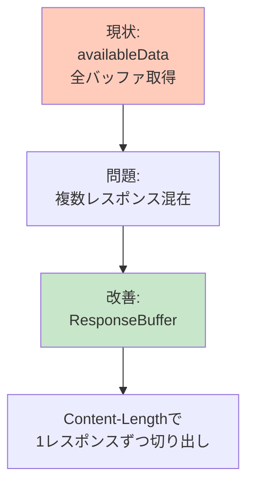
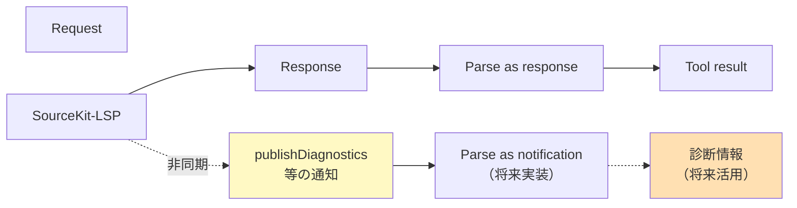

# DES-102: LSP統合設計書

**設計ID**: DES-102
**作成日**: 2025-10-24
**対象**: v0.5.1〜v0.5.5（LSP統合フェーズ）
**ステータス**: 承認待ち
**関連文書**: REQ-002, DES-101

## メタデータ

| 項目 | 値 |
|-----|-----|
| 設計ID | DES-102 |
| 対象バージョン | v0.5.1〜v0.5.5 |
| 関連要件 | REQ-002（LSP統合要件） |
| 主要コンポーネント | LSPState, LSPClient, FileLogHandler, DebugRunner |
| LSP API | initialize, initialized, didOpen, findReferences, documentSymbol, typeHierarchy |

---

## 1. LSP統合の設計方針

### 1.1 ハイブリッドアーキテクチャ


**設計判断:**
- SwiftSyntax = ベースライン（削除しない）
- LSP = オプション強化
- ビルド非依存性の原則を維持

---

### 1.2 グレースフルデグレード


**保証:**
- どのケースでも結果を返す
- エラーで終わらない
- 代替案を提示

---

## 2. v0.5.x系 実装ロードマップ

### 2.1 バージョン別実装内容


---

### 2.2 実装済み vs 計画中


---

## 3. LSPプロトコル実装

### 3.1 完全なプロトコルフロー


---

### 3.2 重要な発見（v0.5.3）


---

## 4. LSPClient設計

### 4.1 クラス構造


---

### 4.2 LSP APIメソッド一覧

| メソッド | LSP Method | 入力 | 出力 | バージョン |
|---------|-----------|------|------|-----------|
| findReferences | textDocument/references | filePath, line, column | [LSPLocation] | v0.5.2 |
| documentSymbol | textDocument/documentSymbol | filePath | [LSPDocumentSymbol] | v0.5.4（計画） |
| typeHierarchy | textDocument/prepareTypeHierarchy | filePath, line, column | LSPTypeHierarchy? | v0.5.4（計画） |
| callHierarchy | textDocument/prepareCallHierarchy | filePath, line, column | CallHierarchyItem? | v0.5.5（将来） |

---

## 5. LSPプロトコル詳細

### 5.1 initialize/initialized


---

### 5.2 textDocument/didOpen


---

### 5.3 textDocument/references


---

## 6. エラーハンドリング設計

### 6.1 エラー発生ポイントと対策


---

### 6.2 SIGPIPE対策（v0.5.3）


---

## 7. デバッグ環境設計（v0.5.3）

### 7.1 FileLogHandler


**ログ形式:**
```
[2025-10-24T09:30:49Z] ℹ️ [info] Starting Swift MCP Server...
[2025-10-24T09:30:51Z] ℹ️ [info] Attempting LSP connection...
[2025-10-24T09:30:51Z] ✅ [info] LSP connected successfully
```

---

### 7.2 DebugRunner設計


**利点:**
- 本番と同じLSPState共有
- Xcodeデバッガでブレークポイント設定可能
- 自動テストシーケンス

---

## 8. 動的ツールリスト設計

### 8.1 問題と解決策


**採用方式（v0.5.3）:**
- find_symbol_referencesを常にツールリストに含める
- 実行時にLSP利用可能性をチェック
- 利用不可ならエラーメッセージで代替案提示

---

## 9. v0.5.4実装ガイド

### 9.1 実装するもの


---

### 9.2 実装パターン（findReferencesと同じ）


**全LSP APIがこのパターンを踏襲**

---

## 10. 学んだ教訓

### 10.1 v0.5.2/v0.5.3で学んだこと


---

## 11. 将来の改善（v0.5.5+）

### 11.1 レスポンスバッファリング



---

### 11.2 非同期通知の処理



---

## 12. v0.5.4詳細設計

### 12.1 documentSymbol実装

```mermaid
sequenceDiagram
    participant Tool as ListSymbolsTool
    participant Client as LSPClient
    participant LSP as SourceKit-LSP

    Tool->>Client: documentSymbolv0.5.4+

    Client->>Client: sendDidOpenv0.5.4+
    Client->>LSP: textDocument/didOpen

    Client->>Client: messageId++
    Client->>LSP: textDocument/documentSymbol

    LSP->>Client: {"result":[<br/>  {"name":"Foo","kind":5,"detail":"class Foo"},<br/>  {"name":"bar","kind":6,"detail":"func barv0.5.4+"}...]}

    Client->>Client: Parse & Convert

    Client->>Tool: [LSPDocumentSymbol]

    Tool->>Tool: Format with type info

    Tool->>Tool: Return "Symbols v0.5.4+"
```

---

### 12.2 typeHierarchy実装

```mermaid
sequenceDiagram
    participant Tool as GetTypeHierarchyTool
    participant Syntax as SwiftSyntaxAnalyzer
    participant Client as LSPClient
    participant LSP as SourceKit-LSP

    Tool->>Syntax: getTypeHierarchyv0.5.4+
    Syntax-->>Tool: TypeInfo v0.5.4+

    Tool->>Client: typeHierarchyv0.5.4+

    Client->>Client: sendDidOpenv0.5.4+
    Client->>LSP: textDocument/didOpen

    Client->>LSP: textDocument/prepareTypeHierarchy

    LSP->>Client: {"result":[{"name":"Foo","detail":"class Foo: Bar"}]}

    Client-->>Tool: LSPTypeHierarchy

    Tool->>Tool: Combine SwiftSyntax + LSP info

    Tool->>Tool: Return "Type Hierarchy v0.5.4+:<br/>Type Detail: class Foo: Bar"
```

---

## 13. テスト戦略

### 13.1 DebugRunnerテストフロー

```mermaid
sequenceDiagram
    participant Xcode
    participant SMCP as SwiftMCPServer
    participant DR as DebugRunner
    participant Tool as FindSymbolReferencesTool
    participant LSP as LSPClient

    Xcode->>SMCP: Run v0.5.4+

    SMCP->>DR: Task.detached<br/>v0.5.4+

    Note over SMCP,DR: MCPサーバー起動<br/>LSP接続

    DR->>DR: Wait 5 seconds

    loop Test Sequence
        DR->>Tool: Call with test data
        Tool->>LSP: LSP API
        LSP-->>Tool: Result
        Tool-->>DR: Success/Failure
        DR->>DR: Log result
    end

    Note over DR: ✅ All tests passed<br/>or<br/>❌ Test N failed

    Note over Xcode: ブレークポイントで停止可能<br/>変数監視<br/>スタックトレース
```

---

### 13.2 検証結果（v0.5.3）

| テスト | 結果 |
|--------|------|
| LSPState actor | ✅ 3件検出 |
| ProjectMemory class | ✅ 34件検出 |
| FindSymbolReferencesTool | ✅ 3件検出 |
| 5回連続実行 | ✅ クラッシュなし |

---

## 14. 参照

**要件定義:**
- REQ-002: LSP統合要件

**設計書:**
- DES-101: システムアーキテクチャ
- DES-103: ツール実装設計

**履歴:**
- CONVERSATION_HISTORY.md: v0.5.2/v0.5.3開発経緯

---

**Document Version**: 2.0
**Created**: 2025-10-24
**Last Updated**: 2025-10-24
**Status**: 承認待ち
**Changes**: mermaid図中心に再構成、詳細コード削減
**Supersedes**: DES-007, DES-008 DebugRunner, DES-009, Hybrid-Architecture-Plan.md（LSP部分）
