# DES-103: ツール実装設計書

**設計ID**: DES-103
**作成日**: 2025-10-24
**対象**: 全18ツール（v0.5.3時点）
**ステータス**: 承認待ち
**関連文書**: REQ-003, DES-101, DES-102

## メタデータ

| 項目 | 値 |
|-----|-----|
| 設計ID | DES-103 |
| 対象バージョン | v0.5.3 |
| 関連要件 | REQ-003（コア機能要件） |
| ツール数 | 18個 |
| カテゴリ | Project(1), FileSystem(2), Symbols(3), SwiftUI(3), Analysis(4), LSP(1), Notes(2), Prompts(2) |

---

## 1. ツール実装パターン

### 1.1 基本実装フロー

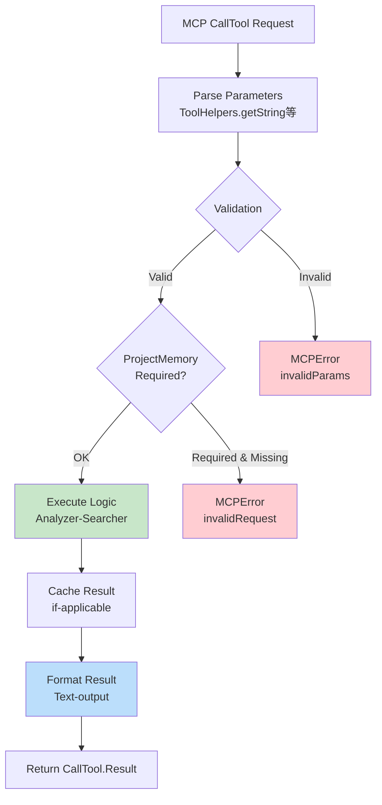

---

### 1.2 LSP強化パターン（v0.5.4+）

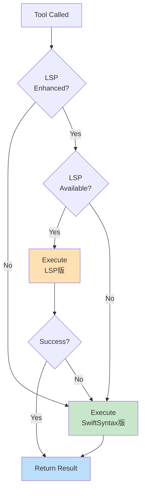

**保証:** LSP失敗でも必ずSwiftSyntax版で動作

---

## 2. ツールカテゴリ構成

### 2.1 18ツールの分類

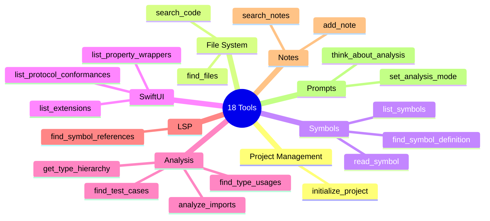

---

### 2.2 ツール間の関係

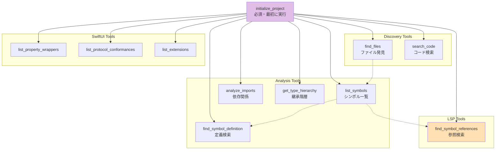

---

## 3. SwiftSyntax Visitor実装

### 3.1 Visitorパターン

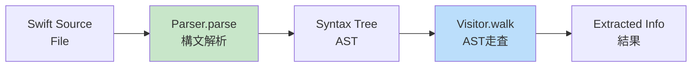

---

### 3.2 実装済みVisitor

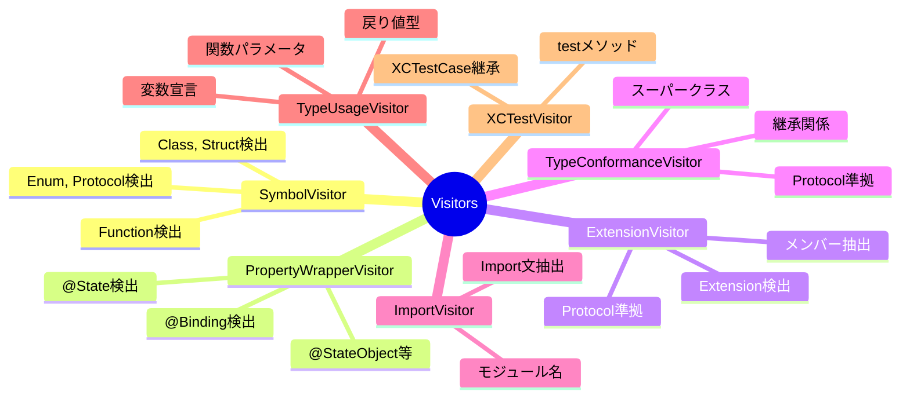

---

### 3.3 Visitor実装フロー

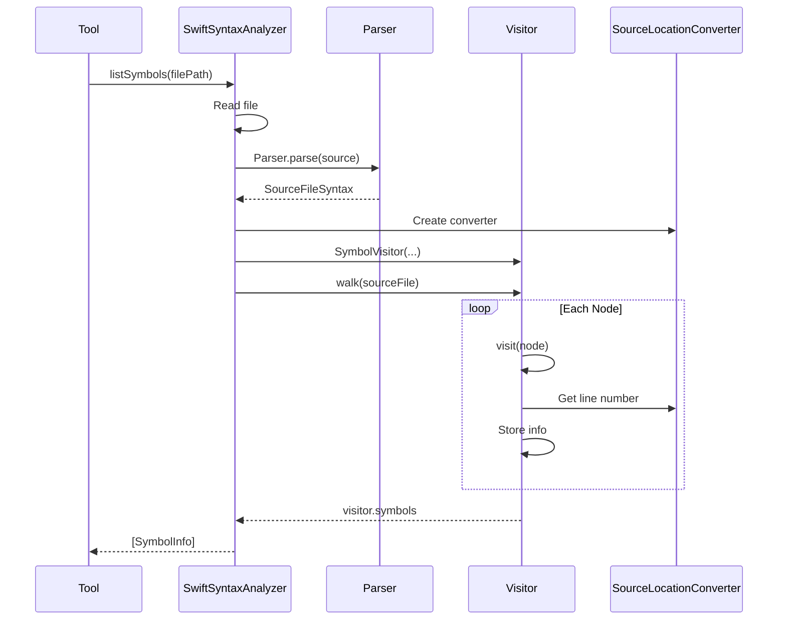

---

## 4. ツール実装詳細（主要ツールのみ）

### 4.1 initialize_project

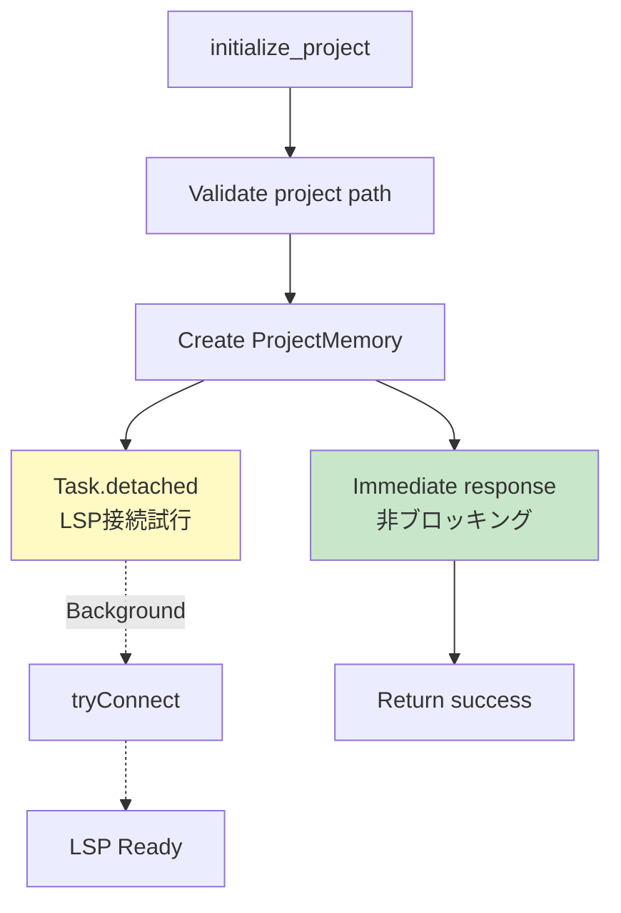

**特徴:** LSP接続を待たない（ユーザー体験優先）

---

### 4.2 list_symbols（SwiftSyntax版）

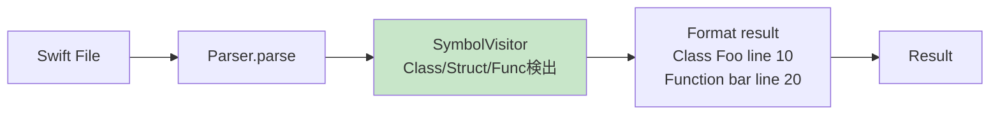

---

### 4.3 list_symbols（LSP版、v0.5.4+）

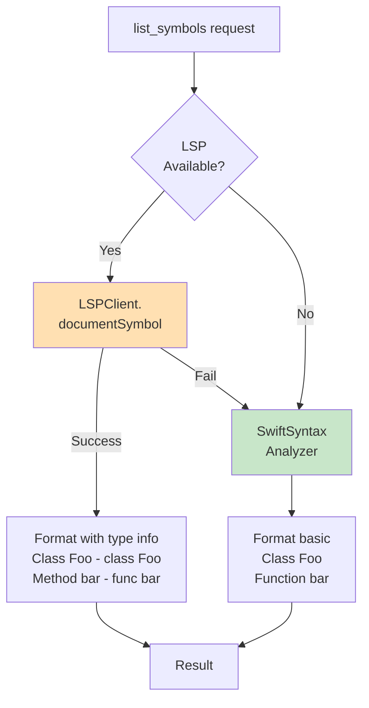

---

### 4.4 find_symbol_references（LSP専用）

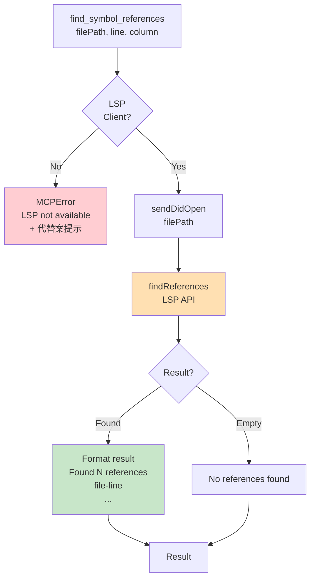

---

### 4.5 list_property_wrappers（SwiftUI）

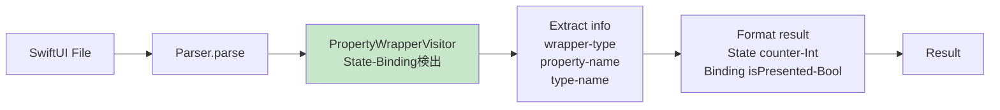

---

### 4.6 analyze_imports（キャッシュ活用）

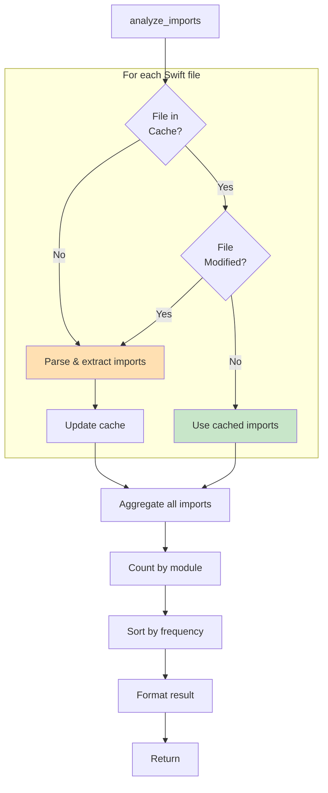

---

### 4.7 get_type_hierarchy（SwiftSyntax版）

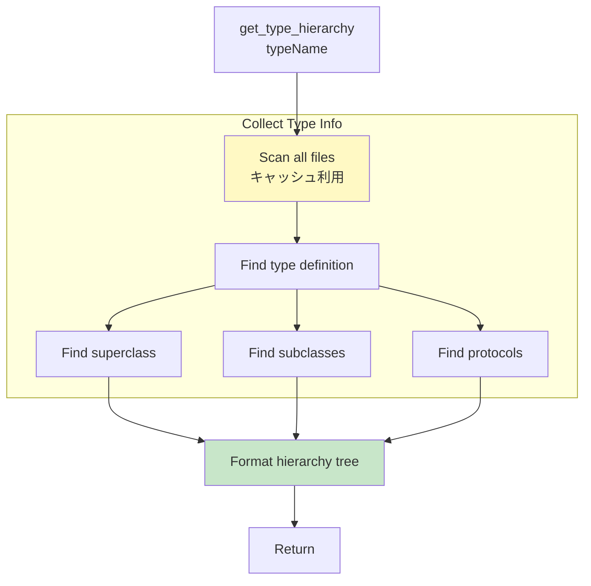

---

## 5. ツールヘルパー設計

### 5.1 ToolHelpers

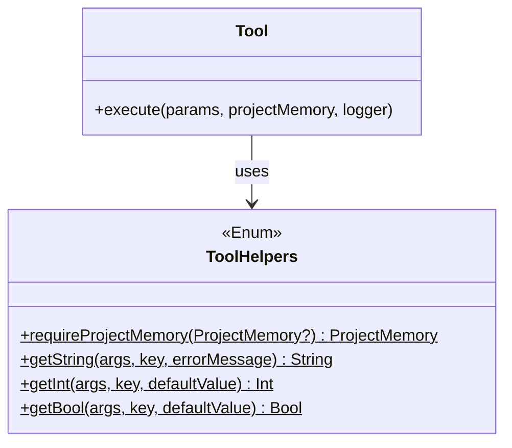

**目的:** パラメータ処理の共通化、コード重複削減

---

### 5.2 定数定義構造

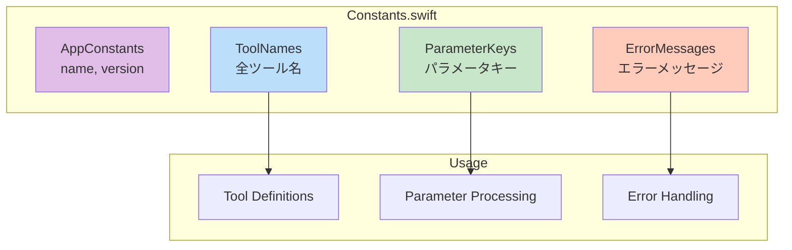

---

## 6. 新ツール追加フロー

### 6.1 実装手順

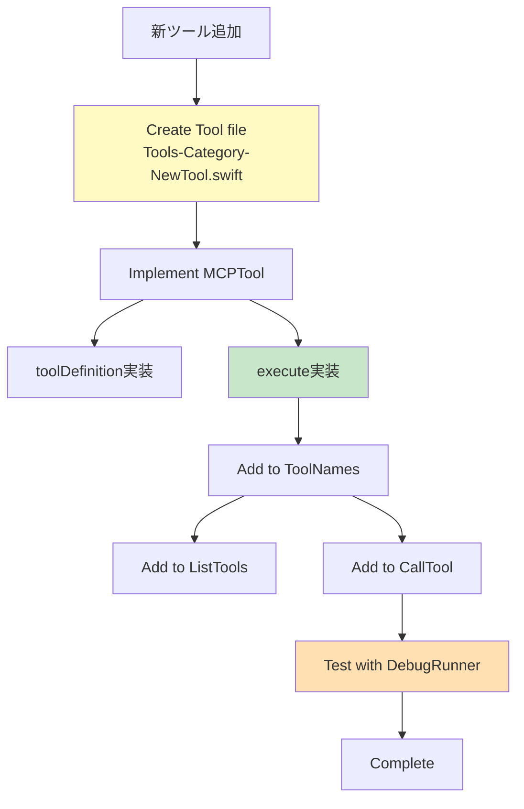

**所要時間:** 15-30分/ツール

---

### 6.2 Visitor追加フロー

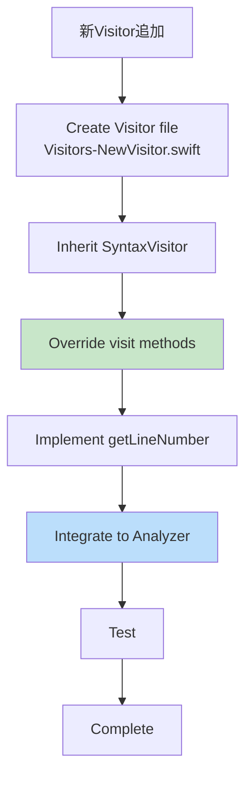

**所要時間:** 30-60分/Visitor

---

## 7. キャッシュ設計

### 7.1 キャッシュ構造

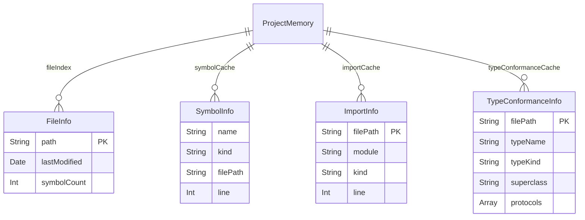

---

### 7.2 キャッシュ無効化フロー

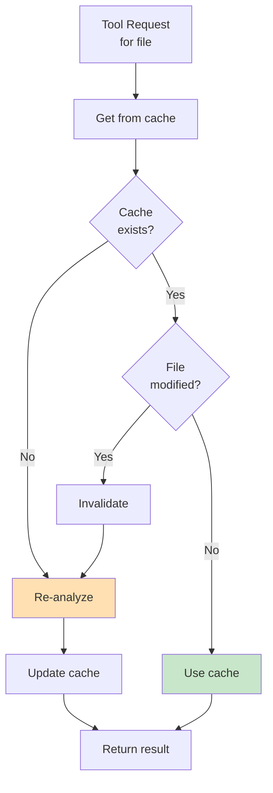

**判定:** `FileInfo.lastModified < FileManager.modificationDate`

---

## 8. エラーハンドリング

### 8.1 エラーレベル設計

```mermaid
graph TB
    Error[Error Occurred]

    Level{Error<br/>Level}

    Params[Invalid Parameters<br/>ユーザー入力ミス]
    Request[Invalid Request<br/>前提条件未達]
    Internal[Internal Error<br/>サーバー側問題]

    MsgParams[明確なパラメータ説明]
    MsgRequest[前提条件と解決方法]
    MsgInternal[詳細エラー + 代替案]

    Error --> Level

    Level --> Params
    Level --> Request
    Level --> Internal

    Params --> MsgParams
    Request --> MsgRequest
    Internal --> MsgInternal

    MsgParams --> User[User]
    MsgRequest --> User
    MsgInternal --> User

    style MsgParams fill:#fff9c4
    style MsgRequest fill:#ffccbc
    style MsgInternal fill:#ffcdd2
```

---

### 8.2 エラーメッセージ設計原則

```mermaid
mindmap
  root((エラーメッセージ))
    What
      何が起きたか
      明確に説明
    Why
      なぜ失敗したか
      原因を示す
    How
      どうすれば解決するか
      代替案提示
    Tone
      親切に
      建設的に
```

**例:**
```
❌ LSP not available.

This tool requires a buildable project with SourceKit-LSP.

💡 Alternatives:
- Use 'find_type_usages' for type-level reference search
- Use 'search_code' for text-based search
```

---

## 9. パフォーマンス最適化

### 9.1 最適化戦略

```mermaid
graph TB
    subgraph FileLevel["ファイルレベル"]
        Exclude[除外ディレクトリ<br/>.build, .git等]
        Cache1[ファイルキャッシュ<br/>lastModified比較]
    end

    subgraph AnalysisLevel["解析レベル"]
        Cache2[シンボルキャッシュ<br/>find_symbol_definition高速化]
        Cache3[Importキャッシュ<br/>analyze_imports高速化]
    end

    subgraph ExecutionLevel["実行レベル"]
        Async[非同期処理<br/>LSP接続バックグラウンド]
        Lazy[遅延評価<br/>必要な時だけ解析]
    end

    Performance[高速化]

    Exclude --> Performance
    Cache1 --> Performance
    Cache2 --> Performance
    Cache3 --> Performance
    Async --> Performance
    Lazy --> Performance

    style Performance fill:#c8e6c9
```

---

### 9.2 パフォーマンス目標

| 指標 | 目標 | v0.5.3実績 |
|------|------|-----------|
| 340ファイル（初回） | <5秒 | 3-5秒 ✅ |
| 340ファイル（キャッシュ） | <1秒 | 0.5秒 ✅ |
| 1000ファイル | <10秒 | 未測定 |
| メモリ使用量 | <100MB | 未測定 |

---

## 10. テスト設計

### 10.1 DebugRunnerテスト

```mermaid
graph LR
    DR[DebugRunner<br/>#if DEBUG]
    Seq[Test Sequence]
    T1[Test 1]
    T2[Test 2]
    T3[Test 3]
    T4[Test 4]
    T5[Test 5]
    Log[Log Results]
    Verify[Verify<br/>All passed?]

    DR --> Seq
    Seq --> T1
    Seq --> T2
    Seq --> T3
    Seq --> T4
    Seq --> T5

    T1 --> Log
    T2 --> Log
    T3 --> Log
    T4 --> Log
    T5 --> Log

    Log --> Verify

    style DR fill:#fff9c4
    style Verify fill:#c8e6c9
```

---

### 10.2 Xcodeデバッグフロー

```mermaid
flowchart TD
    Start[Xcodeで実行]
    Wait[5秒待機]
    Auto[DebugRunner<br/>自動実行]
    Break[Breakpoint<br/>停止]
    Inspect[変数監視<br/>スタックトレース]
    Step[ステップ実行]
    Fix[問題特定・修正]

    Start --> Wait
    Wait --> Auto
    Auto --> Break
    Break --> Inspect
    Inspect --> Step
    Step --> Fix

    style Break fill:#fff9c4
    style Inspect fill:#c8e6c9
```

---

## 11. 将来の拡張

### 11.1 v0.5.4での追加

```mermaid
graph LR
    V53[v0.5.3<br/>find_symbol_references]
    V54[v0.5.4<br/>+ documentSymbol<br/>+ typeHierarchy]
    Enhanced[2ツール強化<br/>list_symbols<br/>get_type_hierarchy]

    V53 --> V54
    V54 --> Enhanced

    style V53 fill:#c8e6c9
    style V54 fill:#ffe0b2
    style Enhanced fill:#bbdefb
```

---

### 11.2 v0.5.5での追加

```mermaid
graph LR
    V54[v0.5.4<br/>ツール強化]
    V55[v0.5.5<br/>+ callHierarchy<br/>+ その他API]
    More[さらなる機能]

    V54 --> V55
    V55 --> More

    style V55 fill:#fff9c4
    style More fill:#ffccbc
```

---

## 12. 参照

**要件定義:**
- REQ-003: コア機能要件

**設計書:**
- DES-101: システムアーキテクチャ
- DES-102: LSP統合設計

---

**Document Version**: 2.0
**Created**: 2025-10-24
**Last Updated**: 2025-10-24
**Status**: 承認待ち
**Changes**: mermaid図中心に再構成、詳細コード削減
**Supersedes**: （既存ツール実装の暗黙知を明文化）
