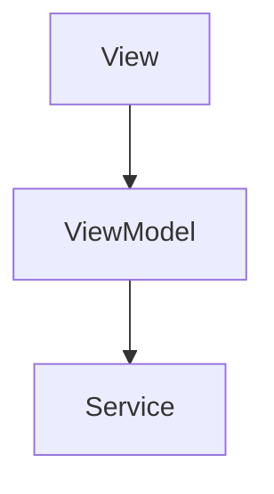

# 設計書フォーマットルール

## 目的

設計書の作成において統一的なフォーマットを定め、以下を実現します：

- **一貫性のある文書構造**: 全ての設計書が同じ構造で記載される
- **AIエージェントの理解促進**: 統一フォーマットによりAIが設計を正確に理解
- **要件とタスクの橋渡し**: 要件IDとタスクIDを接続するトレーサビリティ
- **保守性の向上**: 設計変更時の影響範囲を明確化

---

## 記載上の重要な原則 [MANDATORY]

**設計書は「How（どう作るか）」を記述します。「What（何を作るか）」は要件定義書に記載します。**

### 記載すべき内容

- ✅ **実装方法**（クラス名、メソッド名、デザインパターン）
- ✅ **技術的詳細**（フレームワーク、ライブラリの選定）
- ✅ **処理フロー・アルゴリズム**（内部の処理ステップ）
- ✅ **データフロー**（Service → DataStore → ViewModel）
- ✅ **状態管理の実装**（ViewState enum、@Observable等）
- ✅ **アーキテクチャ設計**（レイヤー配置、依存関係）
- ✅ **シーケンス図、クラス図**
- ✅ **テストケース設計**（正常系/異常系）
- ✅ **使用する既存コンポーネント**（具体的なファイルパス）

### 記載してはいけない内容

- ❌ **ソースコード**（実装の領域）
  - ※小規模なコード例（3-5行程度）は説明のために許容
  - ※特殊な事情がある場合は人間に確認

### 判断基準

**迷ったら「実装者がこれで実装できるか？」で判断**
- **Yes** → 設計書に記載
- **No** → より詳細化が必要、または要件定義書の領域

**要件定義書との境界**: 「要件定義書はWhat（何を作るか）、設計書はHow（どう作るか）」で判断

---

## 設計ID体系

各設計には以下の体系で一意のIDを付与します：

| プレフィックス | 説明 | 例 |
|--------------|------|-----|
| DES- | Design（設計） | DES-001 |

**ID付与ルール**:
- 001から連番
- 一度付与したIDは変更しない
- 削除された設計のIDは欠番とする
- 新規追加時は最後の番号の次を使用

## ファイル命名規則

### 基本ルール
- **設計IDをファイル名の先頭に付与**: `DES-001_user_list_design.md`
- **スネークケース**使用: `{設計ID}_{設計対象名}_design.md`
- 末尾に`_design.md`を必ず付与
- 英語で記載（日本語は使用しない）

## 設計書テンプレート

### 基本テンプレート構造

```markdown
# [設計名] 設計書

**設計ID**: DES-XXX
**関連要件**: [要件ID列挙]
**ファイル**: design/DES-XXX_{機能名}_design.md

## メタデータ

| 項目 | 値 |
|-----|-----|
| 設計ID | DES-XXX |
| 関連要件 | [カンマ区切りで関連要件IDを列挙、例: SCR-001, CMP-001, BL-001] |
| 実装層 | UI層 / Domain層 / Infrastructure層 / DI層（該当するものを列挙） |
| 主要モジュール | |
| - Entity | [Entity名列挙、例: Contact, Group] |
| - Service | [Service名列挙、例: ContactService, GroupService] |
| - DataStore | [DataStore名列挙、例: ContactDataStore] |
| - Repository | [Repository名列挙、例: ContactRepository] |
| - View | [View名列挙、例: ContactListView] |
| - ViewModel | [ViewModel名列挙、例: ContactListViewModel] |
| - Component | [Component名列挙、例: ContactListItem] |

**目的**: AI検索とトレーサビリティ追跡、実装層・モジュール特定のためのメタ情報。

**注意**: 設計書作成時に決定される情報を記載。実装の詳細はコード参照。

## 1. 概要

[設計の概要と目的を1-3段落で記載]
[この内容はproject/project_toc.mdの「要約」として抽出される]

## 2. アーキテクチャ概要

[システム全体のアーキテクチャ図（mermaid推奨）]

## 3. モジュール設計

### 3.1 モジュール一覧

[モジュール一覧表]

### 3.2 [主要モジュール1の詳細]
### 3.3 [主要モジュール2の詳細]

[H3見出しはproject/project_toc.mdの「主なトピック」として抽出される]

## 4. データフロー設計

**目的**: データがシステム内をどのように流れるかを設計する。

**記載内容**:
- **データの流れ**
  - Repository → Service → DataStore → ViewModel → View
  - 各層での処理内容
- **AsyncStreamの使用方法**
  - どのDataStoreでStreamを配信するか
  - ViewModelでの購読方法
- **データ更新のトリガー**
  - ユーザーアクション
  - 外部イベント（プッシュ通知等）

**例**:
```markdown
### 連絡先データのフロー

Repository（ContactRepository）
  ↓ fetchContacts()
Service（ContactService）
  ↓ processContacts()
  ↓ updateItems()
DataStore（ContactDataStore）
  ↓ StreamManager.broadcast()
  ↓ AsyncStream
ViewModel（ContactListViewModel）
  ↓ handleUpdate()
  ↓ items更新
View（ContactListView）
  ↓ 自動再描画
```

## 5. 処理フロー設計

**目的**: ビジネスロジックやアルゴリズムの詳細な実装方法を設計する。

**記載内容**:
- **アルゴリズム設計**
  - 処理の詳細ステップ
  - 条件分岐とループ
  - エラーハンドリング
- **シーケンス図**（mermaid推奨）
  - Actor/Service/Repository/DataStore間の相互作用
  - 処理の時系列
- **使用するクラス/モジュール**
  - Service名、Repository名、DataStore名
  - 依存関係

**例**:
```markdown
### 連絡先検索の処理フロー

1. ViewModel.searchText変更検知
2. debounce処理（300ms）
3. ContactService.search(keyword)呼び出し
4. Service内で名前・電話番号フィルタリング
5. DataStore.updateSearchResults()
6. AsyncStream経由でViewModel更新
7. View自動再描画

シーケンス図:
[mermaid図]
```

## 6. 状態管理設計

**目的**: UI状態やアプリケーション状態の管理方法を設計する。

**記載内容**:
- **ViewState設計**
  - 使用する状態の種類（.none, .loading, .loaded, .error）
  - 状態遷移図
- **ViewModel設計**
  - @MainActor @Observableの使用
  - 管理するプロパティ
  - AsyncStream購読管理（subscriptionTask）
- **DataStore設計**
  - 保持するデータ
  - StreamManagerの使用方法

**例**:
```markdown
### ContactListViewModelの状態管理

ViewState:
- .none: 初期状態
- .loading: 連絡先読み込み中
- .loaded: 連絡先表示中
- .error: エラー表示中

管理プロパティ:
- viewState: ViewState
- contacts: [Contact]
- errorMessage: String?

AsyncStream購読:
- subscriptionTask: Task<Void, Never>?
- start()でDataStore購読開始
- stop()でTask cancel
```

## 7. ユースケース設計

[主要なユースケースのシーケンス図等]

## 8. テストケース設計

**目的**: Unit Test、Integration Testで実施するテストケースを設計する。

**記載内容**:
- **正常系テストケース**
  - 期待される正常な動作
  - テスト条件と期待結果
- **異常系テストケース**
  - エラー時の動作
  - エラーハンドリングの検証
- **境界値テストケース**
  - 空配列、nil、最大値等
  - エッジケースの処理

**例**:
```markdown
### ContactServiceのテストケース

正常系:
- @Test("データ取得成功時、DataStoreが更新される")
  - mockRepository.dataToReturn = [testContact]
  - service.loadContacts()実行
  - dataStore.getCurrentContacts()で検証

異常系:
- @Test("ネットワークエラー時、ServiceErrorをスローする")
  - mockRepository.errorToThrow = .networkError
  - service.loadContacts()がエラーをスロー

境界値:
- @Test("データが空の場合、空配列を返す")
  - mockRepository.dataToReturn = []
  - service.loadContacts()実行
  - dataStore.getCurrentContacts()が空配列
```

## 9. その他

[追加の設計情報]
```

### 設計書テンプレート例

```markdown
# 連絡先管理アプリケーション 設計書

**設計ID**: DES-001
**関連要件**: SCR-001, CMP-001, BL-001, BL-002
**ファイル**: design/DES-001_contact_list_design.md

## メタデータ

| 項目 | 値 |
|-----|-----|
| 設計ID | DES-001 |
| 関連要件 | SCR-001, CMP-001, BL-001, BL-002 |
| 実装層 | UI層, Domain層, Infrastructure層 |
| 主要モジュール | |
| - Entity | Contact, Group |
| - Service | ContactService, GroupService, SearchService |
| - DataStore | ContactDataStore, GroupDataStore, SearchHistoryDataStore |
| - Repository | ContactRepository, GroupRepository |
| - View | ContactListView, GroupSidebar |
| - ViewModel | ContactListViewModel, ContactContainerViewModel, GroupSidebarViewModel |
| - Component | ContactListItem |

## 1. 概要

本設計書は、Contact[B]アプリケーションのClean Architectureに基づいた設計を定義する。macOSの連絡先フレームワークを活用し、高度な連絡先管理、電話発信、メール管理機能を提供する。

### 1.1 設計方針
- **Clean Architecture**: Domain層を中心とした独立性の高いアーキテクチャ
- **Actor並行性**: Swift Concurrencyを活用した安全な並行処理
- **リアクティブUI**: AsyncStreamによるリアルタイムデータ更新
- **依存性注入**: Factoryパターンによる疎結合な設計

## 2. アーキテクチャ概要

[mermaid図]

## 3. モジュール設計

### 3.1 モジュール一覧

[モジュール一覧表]

### 3.2 App層モジュール詳細
### 3.3 Domain層モジュール詳細
### 3.4 Infrastructure層モジュール詳細

[詳細設計]
```

## メタデータ記載のガイドライン

### 実装層の判定

**判定基準**:
- **UI層**: View、ViewModel、Componentが含まれる
- **Domain層**: Service、Entity、DataStore Protocol、Repository Protocolが含まれる
- **Infrastructure層**: DataStore実装、Repository実装が含まれる
- **DI層**: Factory Resolver実装が含まれる

**記載方法**: 該当する層を全て列挙（カンマ区切り）

### 主要モジュールの記載

**記載する項目**:
- **Entity**: ビジネスエンティティ（例: Contact, Group, Settings）
- **Service**: ビジネスロジック（例: ContactService, GroupService）
- **DataStore**: データ保持とStream配信（例: ContactDataStore）
- **Repository**: 外部システム連携（例: ContactRepository）
- **View**: SwiftUI View（例: ContactListView）
- **ViewModel**: 状態管理（例: ContactListViewModel）
- **Component**: 再利用可能UIコンポーネント（例: ContactListItem）

**記載しない項目**:
- 補助的なEnum、ValueObject
- 内部的なヘルパークラス
- Extension

### 関連要件の記載

**記載方法**:
- この設計が実現する要件IDを全て列挙
- カンマ区切り（例: SCR-001, CMP-001, BL-001）
- 要件トレーサビリティマトリクスと一致させる

## 記載上の注意事項

### 図表の使用

#### Mermaid図（推奨）

**よく使う図の種類**:
- **フローチャート**: アーキテクチャ図、処理フロー
- **クラス図**: モジュール構造、型関係
- **シーケンス図**: ユースケース、データフロー

**例（フローチャート）**:


**構文リファレンス**:
- [Flowchart](https://mermaid.js.org/syntax/flowchart.html) - アーキテクチャ図、処理フロー
- [Class Diagram](https://mermaid.js.org/syntax/classDiagram.html) - モジュール構造、型関係
- [Sequence Diagram](https://mermaid.js.org/syntax/sequenceDiagram.html) - ユースケース、データフロー

**注意**: flowchartで小文字の`end`は使用禁止（`End`または`END`を使用）

### コード例の記載

実装例を示す場合はコードブロックを使用：
```swift
// 実装例
public actor ContactService {
    private let repository: ContactRepositoryType
    private let dataStore: ContactDataStoreType
}
```

### 相互参照

- **要件参照**: 要件IDを明記（例: 「SCR-001の画面仕様に基づく」）
- **他設計参照**: 設計IDを明記（例: 「DES-002と連携」）

## バージョン管理

設計書の変更履歴は各ファイルの末尾に記載：

```markdown
## 改定履歴

| 日付 | バージョン | 作成者 | 変更内容 |
|------|-----------|--------|----------|
| 2025-01-01 | 1.0 | Claude | 初版作成 |
| 2025-01-15 | 1.1 | Claude | モジュール追加 |
```

## 関連文書

- [要件定義書フォーマットルール](spec_format.md) - 要件定義書の作成フォーマット
- [計画書フォーマットルール](plan_format.md) - 設計からタスクを作成するフォーマット
- [設計書作成ワークフロー](../workflow/plan/design_workflow.md) - 設計書作成の手順
- [コーディングルール](../rules/base/coding_rule.md) - 実装規約
