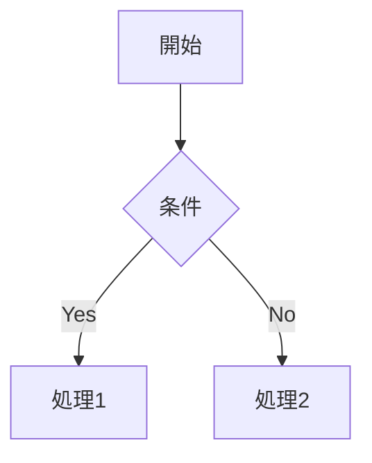

# 要件定義書フォーマットルール

## 目的

要件定義書の作成において統一的なフォーマットを定め、以下を実現します：

- **一貫性のある文書構造**: 全ての要件定義書が同じ構造で記載される
- **AIエージェントの理解促進**: 統一フォーマットによりAIが要件を正確に理解
- **要件の追跡可能性**: 要件IDによる実装までの追跡を可能にする
- **保守性の向上**: 要件変更時の影響範囲を明確化

---

## 記載上の重要な原則 [MANDATORY]

**要件定義書は「What（何を作るか）」を記述します。「How（どう作るか）」は設計書に記載します。**

### 記載すべき内容

- ✅ **ユーザーから見える機能**
- ✅ **業務ルール**（計算式、判断基準、制約条件）
- ✅ **データの内容**（何を持つか）
- ✅ **画面レイアウト**（UI要素の配置と見た目）
- ✅ **エラー時の表示**（ユーザーに見せるメッセージ）
- ✅ **画面遷移とナビゲーション**（どの画面からどの画面へ）

### 記載してはいけない内容

- ❌ **実装方法**（クラス名、メソッド名、デザインパターン等）
  - 例：「PhoneService.callPhone()を呼び出す」
- ❌ **技術的詳細**（フレームワーク、ライブラリの選定等）
  - 例：「AsyncStreamを使用する」
- ❌ **コード例**（Swiftコード）
- ❌ **レイヤー配置**（Domain層、Infrastructure層等）
- ❌ **処理フロー・アルゴリズム**（内部の処理ステップ）
  - 例：「1. データ取得 2. フィルタリング 3. ソート」
- ❌ **データフロー**（Service → DataStore → ViewModel等）
- ❌ **状態管理の実装**（ViewState enum、@Observable等）
- ❌ **パフォーマンス指標**（100ms以内等）※非機能要件で定義する場合を除く
- ❌ **テストの詳細**（テストケース、テスト方法等）
- ❌ **将来の拡張機能**（現在の機能のみを記載）

### 判断基準

**迷ったら「ユーザーマニュアルに書くか？」で判断**
- **Yes** → 要件として記載
- **No** → 記載不要（設計書で記載）

### 良い例 ✅

```markdown
## 機能仕様：電話発信

- 連絡先の電話番号アイコンをタップすると、電話番号選択ポップオーバーを表示する
- 電話番号が1つの場合は直接電話アプリを起動して発信する
- 電話番号が複数ある場合は選択画面を表示し、選択後に発信する
- 発信時に設定されたプレフィックス（0063等）を自動的に付与する
```

### 悪い例 ❌

```markdown
## 機能仕様：電話発信

- PhoneService.callPhone()メソッドを呼び出す
- ViewModelでプレフィックス処理を行う
- tel:スキームを使用してUIApplication.shared.open()を実行
- 処理時間は100ms以内
```

---

## project/{feature}/spec/ ディレクトリ構造

要件定義書はFeature単位でディレクトリを分け、機能カテゴリごとにサブディレクトリに配置します。

### 初期Feature名
- **新規アプリ開発時**: `main` 固定
- **追加Feature**: 任意の名前（例: `csv_import`, `sync_v2`）

```
project/
├── main/                 # 初期機能セット
│   └── spec/
│       ├── screens/              # 画面要件
│       ├── ui_components/        # UIコンポーネント要件
│       ├── functions/            # 機能要件
│       ├── business_logic/       # ビジネスロジック要件
│       ├── non_functional/       # 非機能要件
│       ├── data_models/          # データモデル定義
│       ├── external_interfaces/  # 外部インターフェース要件
│       ├── navigation/           # ナビゲーション要件
│       └── theme/                # デザイントークン・テーマ要件
├── csv_import/           # CSVインポート機能
│   └── spec/
│       └── ...
└── {feature-name}/       # 追加Feature
    └── spec/
        └── ...
```

## 各ディレクトリの詳細仕様

### 📁 screens/ - 画面要件

**目的**: アプリケーションの各画面の詳細仕様を定義

**必須記載項目**:
1. **画面概要** - 画面の目的と役割
2. **画面構成** - レイアウト構造（ASCII図推奨）
3. **画面要素** - UI要素の詳細説明
4. **機能仕様** - 画面で提供する機能
5. **データ要件** - 画面表示に必要なデータの種類と内容
6. **状態要件** - 管理が必要な状態の種類（ローディング中、エラー表示中等）
7. **エラーハンドリング** - エラー時の表示と処理

**任意記載項目**:
- パフォーマンス最適化
- アクセシビリティ要件
- 画面遷移詳細

**ファイル例**: 
- `SCR-001_contact_list_screen_spec.md`
- `SCR-002_dial_pad_spec.md`
- `SCR-003_settings_spec.md`

### 📁 ui_components/ - UIコンポーネント要件

**目的**: 再利用可能なUIコンポーネントの仕様定義

**必須記載項目**:
1. **コンポーネント概要** - 役割と使用場所
2. **ビジュアルデザイン** - 見た目の仕様
3. **プロパティ定義** - 入力/出力プロパティ
4. **インタラクション** - ユーザー操作への反応
5. **期待される動作** - ユーザー操作に対する反応の説明

**任意記載項目**:
- アニメーション仕様
- アクセシビリティ対応
- カスタマイズオプション

**ファイル例**:
- `CMP-001_ContactListItem_spec.md`
- `CMP-002_DialPadButton_spec.md`
- `CMP-003_GroupSidebar_spec.md`

### 📁 functions/ - 機能要件

**目的**: ユーザーが使用する機能の詳細仕様

**必須記載項目**:
1. **機能概要** - 機能の目的
2. **ユースケース** - 使用シナリオ
3. **機能の振る舞い** - ユーザーから見た機能の動き（入力→期待される出力）
4. **ビジネスルール** - 機能に関するルール
5. **制約事項** - 制限と前提条件

**任意記載項目**:
- 将来拡張機能
- パフォーマンス要件
- セキュリティ考慮事項

**ファイル例**:
- `FNC-001_group_management_spec.md`
- `FNC-002_contact_search_spec.md`
- `FNC-003_ui_agent_system_spec.md`

### 📁 business_logic/ - ビジネスロジック要件

**目的**: コアとなるビジネスロジックの詳細定義

**必須記載項目**:
1. **概要** - ロジックの目的と役割
2. **ビジネスルール詳細** - 判断基準、計算式、制約条件
3. **入出力仕様** - データの入力と出力
4. **エラーハンドリング** - エラー処理方針

**任意記載項目**:
- パフォーマンス要件（※非機能要件として別途定義する場合を除く）

**ファイル例**:
- `BL-001_data_sync_persistence_spec.md`
- `BL-002_phone_number_processing_spec.md`
- `BL-003_search_functionality_spec.md`
- `BL-004_settings_state_management_spec.md`

### 📁 non_functional/ - 非機能要件

**目的**: システムの品質特性に関する要件定義

**必須記載項目**:
1. **要件カテゴリ** - 性能/セキュリティ/信頼性等
2. **要件詳細** - 具体的な数値目標
3. **測定方法** - 要件の検証方法
4. **優先度** - 必須/推奨/任意

**任意記載項目**:
- 実装ガイドライン
- ベストプラクティス
- 参考情報

**ファイル例**:
- `NF-001_performance_requirements_spec.md`
- `NF-002_security_requirements_spec.md`
- `NF-003_debug_features_spec.md`

### 📁 data_models/ - データモデル定義

**目的**: エンティティとデータ構造の定義

**必須記載項目**:
1. **エンティティ概要** - データモデルの役割
2. **プロパティ定義** - 各プロパティの内容（概念レベルの型と説明）※実装型（String、Int等）も許容
3. **リレーション** - 他エンティティとの関係
4. **バリデーション** - 制約とルール
5. **永続化方式** - 保存方法と場所

**任意記載項目**:
- データ変換ルール
- インデックス定義
- マイグレーション方針

**ファイル例**:
- `DM-001_contact_entity_spec.md`
- `DM-002_group_entity_spec.md`
- `DM-003_settings_entity_spec.md`

### 📁 external_interfaces/ - 外部インターフェース要件

**目的**: 外部システムやAPIとの連携仕様

**必須記載項目**:
1. **インターフェース概要** - 連携の目的
2. **連携対象** - 外部システム/API/フレームワーク
3. **データフォーマット** - 入出力形式
4. **通信仕様** - プロトコルと方式
5. **エラーハンドリング** - エラー処理

**任意記載項目**:
- 認証・認可
- レート制限
- タイムアウト設定

**ファイル例**:
- `EXT-001_contacts_framework_spec.md`
- `EXT-002_icloud_sync_spec.md`
- `EXT-003_mail_integration_spec.md`

### 📁 navigation/ - ナビゲーション要件

**目的**: 画面遷移とナビゲーション構造の定義

**必須記載項目**:
1. **ナビゲーション構造** - 全体構造図
2. **画面遷移フロー** - 遷移パターン
3. **タブ/メニュー構成** - ナビゲーション要素
4. **状態管理** - 遷移時の状態保持

**任意記載項目**:
- ディープリンク対応
- ジェスチャー操作
- アニメーション仕様

**ファイル例**:
- `NAV-001_main_navigation_spec.md`
- `NAV-002_tab_structure_spec.md`
- `NAV-003_modal_presentation_spec.md`

### 📁 theme/ - デザイントークン・テーマ要件

**目的**: アプリ全体のデザイントークンとテーマ層の要件定義

**必須記載項目**:
1. **デザイントークン定義** - 原子的な値（色、フォント、スペーシング等）
2. **テーマ層定義** - セマンティックな意味づけ（Button、Text、Surface等）
3. **カラーパレット** - プライマリ、セカンダリ、背景、エラー等の色定義
4. **タイポグラフィ** - 見出し、本文、キャプション等のフォント定義
5. **スペーシング** - マージン、パディングのスケール定義
6. **入力ソース** - Figma Variables、既存コード、ブランドガイドライン等

**任意記載項目**:
- ボーダー半径（Corner Radius）
- シャドウ（Shadow）定義
- アニメーション定義
- ダークモード対応

**ファイル例**:
- `THEME-001_design_tokens_spec.md`
- `THEME-002_theme_layers_spec.md`

**注意**:
- 見栄えは人間にとって重要な必須要件であるため、要件定義として扱う
- 実装の詳細（2層構造の実装方法等）は設計書に記載

## 要件ID体系

各要件には以下の体系で一意のIDを付与します：

| カテゴリ | プレフィックス | 例 | 説明 |
|---------|--------------|-----|------|
| 画面要件 | SCR- | SCR-001 | Screens |
| コンポーネント | CMP- | CMP-001 | Components |
| 機能要件 | FNC- | FNC-001 | Functions |
| ビジネスロジック | BL- | BL-001 | Business Logic |
| 非機能要件 | NF- | NF-001 | Non-Functional |
| データモデル | DM- | DM-001 | Data Models |
| 外部インターフェース | EXT- | EXT-001 | External Interfaces |
| ナビゲーション | NAV- | NAV-001 | Navigation |
| テーマ | THEME- | THEME-001 | Design Tokens & Theme |

**ID付与ルール**:
- 各カテゴリごとに001から連番
- 一度付与したIDは変更しない
- 削除された要件のIDは欠番とする
- 新規追加時は最後の番号の次を使用

## ファイル命名規則

### 基本ルール
- **要件IDをファイル名の先頭に付与**: `SCR-001_contact_list_screen_spec.md`
- **スネークケース**使用: `{要件ID}_{機能名}_spec.md`
- 末尾に`_spec.md`を必ず付与
- 英語で記載（日本語は使用しない）

### カテゴリ別命名パターン

| カテゴリ | パターン | 例 |
|---------|---------|-----|
| screens | `{SCR-XXX}_{画面名}_screen_spec.md` | `SCR-001_contact_list_screen_spec.md` |
| ui_components | `{CMP-XXX}_{コンポーネント名}_spec.md` | `CMP-001_ContactListItem_spec.md` |
| functions | `{FNC-XXX}_{機能名}_spec.md` | `FNC-001_group_management_spec.md` |
| business_logic | `{BL-XXX}_{ロジック名}_spec.md` | `BL-001_search_functionality_spec.md` |
| non_functional | `{NF-XXX}_{要件名}_spec.md` | `NF-001_performance_requirements_spec.md` |
| data_models | `{DM-XXX}_{エンティティ名}_entity_spec.md` | `DM-001_contact_entity_spec.md` |
| external_interfaces | `{EXT-XXX}_{システム名}_spec.md` | `EXT-001_contacts_framework_spec.md` |
| navigation | `{NAV-XXX}_{ナビゲーション名}_spec.md` | `NAV-001_tab_structure_spec.md` |
| theme | `{THEME-XXX}_{テーマ名}_spec.md` | `THEME-001_design_tokens_spec.md` |

## 要件定義書テンプレート

### 基本テンプレート構造

```markdown
# [要件名] 要件定義書

**要件ID**: [XXX-000]
**カテゴリ**: [カテゴリ名]
**ファイル**: [ディレクトリ/ファイル名]

## メタデータ

| 項目 | 値 |
|-----|-----|
| 要件ID | [XXX-000] |
| カテゴリ | 画面要件 / 機能要件 / ビジネスロジック / UIコンポーネント / 非機能要件 / データモデル / 外部インターフェース / ナビゲーション / テーマ |
| 関連要件 | [カンマ区切りで関連要件IDを列挙、例: CMP-001, BL-001] |

**目的**: AI検索とトレーサビリティ追跡のためのメタ情報。

**注意**:
- 要件定義時点で記載可能な情報のみを記載
- 実装層、関連Entity/Service等は設計書作成時に決定されるため、ここでは記載しない
- 優先度は{feature}_plan.md作成時に決定されるため、ここでは記載しない

## 1. 概要

[要件の概要と目的を1-3段落で記載]
[この内容はproject/project_toc.mdの「要約」として抽出される]

## 2. [カテゴリ固有のセクション]

### 2.1 [主要トピック1]
### 2.2 [主要トピック2]
### 2.3 [主要トピック3]

[各カテゴリに応じた詳細内容]
[H3見出しはproject/project_toc.mdの「主なトピック」として抽出される]

## 3. [追加セクション]

[必要に応じて追加]

---

## 未確定事項

> 明確化できなかった項目を管理する。設計完了時に全て解決必須。

| ID | 項目 | 解決方法 | 期限 |
|----|------|---------|------|
| TBD-001 | [未確定項目] | ユーザー確認 / 設計で決定 | 設計開始前 / DES-XXX作成時 |

---
```

### 画面要件テンプレート例

```markdown
# 連絡先リスト画面 要件定義書

**要件ID**: SCR-001
**カテゴリ**: 画面要件
**ファイル**: screens/SCR-001_contact_list_screen_spec.md

## メタデータ

| 項目 | 値 |
|-----|-----|
| 要件ID | SCR-001 |
| カテゴリ | 画面要件 |
| 関連要件 | CMP-001, BL-001, BL-002 |

## 1. 画面概要

連絡先アプリのメイン画面として、macOSの連絡先データを表示・管理する画面。連絡先の一覧表示、検索、グループフィルタ、発信機能を提供。

## 2. 画面構成

### 2.1 レイアウト構造

[ASCII図でレイアウトを表現]

### 2.2 画面要素

[各UI要素の詳細]

## 3. 機能仕様

[画面で提供する機能の詳細]

## 4. データフロー要件

[データの取得と更新の仕様]

## 5. 画面状態管理要件

[管理すべき状態と更新要件]

## 6. エラーハンドリング

[エラー時の表示と処理]
```

## 記載上の注意事項

### 図表の使用

#### ASCII図
レイアウトや画面構成を表現する際に使用：
```
+------------------+
| Navigation Bar   |
+------------------+
| Content Area     |
|                  |
+------------------+
| Tab Bar          |
+------------------+
```

#### Mermaid図
画面遷移や状態遷移など、**ユーザーから見える挙動（What）**の説明に使用：


**構文リファレンス**:
- [Flowchart](https://mermaid.js.org/syntax/flowchart.html) - 画面遷移（内部アルゴリズムの手順説明には使わない）
- [Sequence Diagram](https://mermaid.js.org/syntax/sequenceDiagram.html) - ユースケース、インタラクション
- [State Diagram](https://mermaid.js.org/syntax/stateDiagram.html) - 状態遷移

**注意**: flowchartで小文字の`end`は使用禁止（`End`または`END`を使用）

### コード例の記載

要件定義書では **Swiftコードの記載は禁止**（実装方法の記述に該当するため）。
コード例が必要な場合は、設計書に記載すること。

### 相互参照

他の要件を参照する場合は要件IDを明記：
- 「SCR-001の画面から遷移」
- 「BL-002のロジックを使用」
- 「CMP-003のコンポーネントを配置」

### マークダウン記法

- **太字**: 重要な用語や項目名
- *斜体*: 補足説明や注釈
- `コード`: インラインコード、ファイル名、プロパティ名
- リスト: 箇条書きは`-`、番号付きリストは`1.`
- 表: パイプ`|`で区切って作成

## バージョン管理

要件定義書の変更履歴は各ファイルの末尾に記載：

```markdown
## 改定履歴

| 日付 | バージョン | 作成者 | 変更内容 |
|------|-----------|--------|----------|
| 2025-01-01 | 1.0 | Claude | 初版作成 |
| 2025-01-15 | 1.1 | Claude | 機能追加 |
```

## 関連文書

- [設計書作成ワークフロー](../workflow/plan/design_workflow.md) - 要件から設計書を作成するフロー
- [計画書フォーマットルール](plan_format.md) - 設計IDからタスクを作成するフォーマット
- [計画書作成ワークフロー](../workflow/plan/planning_workflow.md) - 3層文書構造の全体像
- [コーディングルール](../rules/base/coding_rule.md) - 実装規約
