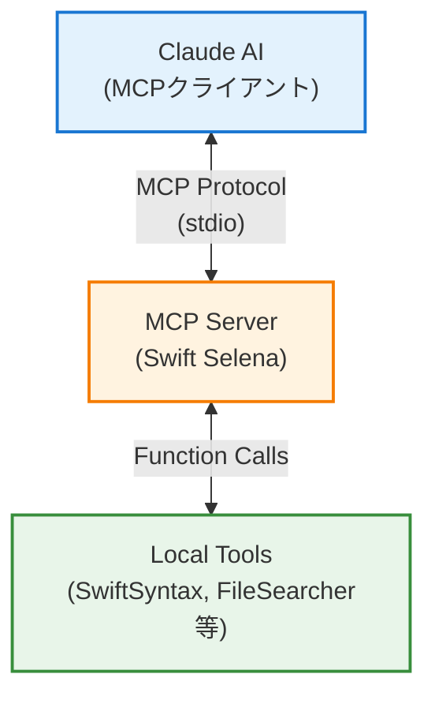
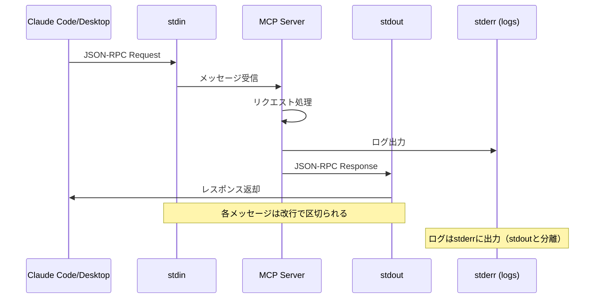

# MCP実装ガイド - Swift Selena

このドキュメントでは、Swift SelenaにおけるMCP (Model Context Protocol) の実装方法とSwift MCP SDKの使い方を詳しく説明します。

## 目次

1. [MCP概要](#mcp概要)
2. [依存関係とセットアップ](#依存関係とセットアップ)
3. [サーバーの初期化](#サーバーの初期化)
4. [ツールの登録（ListTools）](#ツールの登録listtools)
5. [ツールの実装（CallTool）](#ツールの実装calltool)
6. [トランスポート層](#トランスポート層)
7. [エラーハンドリング](#エラーハンドリング)
8. [ベストプラクティス](#ベストプラクティス)
9. [実装例](#実装例)

---

## MCP概要

### MCPとは？

**Model Context Protocol (MCP)** は、AIアシスタント（Claude等）がローカルツールやサービスと通信するための標準プロトコルです。

**公式ドキュメント**:
- 📖 [MCP公式サイト](https://modelcontextprotocol.io/)
- 📘 [Anthropic MCP ドキュメント](https://docs.anthropic.com/en/docs/build-with-claude/model-context-protocol)
- 💻 [Swift SDK](https://github.com/modelcontextprotocol/swift-sdk)

### 主要コンポーネント



### プロトコルの特徴

- **Stdioベース**: 標準入出力を使用した通信
- **JSON-RPC 2.0**: リクエスト/レスポンス形式
- **非同期処理**: async/awaitに対応
- **ツール指向**: 明確なツール定義とパラメータスキーマ

---

## 依存関係とセットアップ

### Package.swift

```swift
// swift-tools-version: 5.9
import PackageDescription

let package = Package(
    name: "Swift-Selena",
    platforms: [
        .macOS(.v13)
    ],
    dependencies: [
        // MCP Swift SDK（必須）
        .package(
            url: "https://github.com/modelcontextprotocol/swift-sdk.git",
            exact: "0.10.2"
        ),
        // SwiftSyntax（Swift解析用）
        .package(
            url: "https://github.com/apple/swift-syntax.git",
            exact: "602.0.0"
        ),
        // ロギング
        .package(
            url: "https://github.com/apple/swift-log.git",
            from: "1.5.3"
        )
    ],
    targets: [
        .executableTarget(
            name: "Swift-Selena",
            dependencies: [
                .product(name: "MCP", package: "swift-sdk"),
                .product(name: "SwiftSyntax", package: "swift-syntax"),
                .product(name: "SwiftParser", package: "swift-syntax"),
                .product(name: "Logging", package: "swift-log")
            ]
        )
    ]
)
```

### 必要なインポート

```swift
import MCP           // MCPプロトコル
import Foundation    // 基本的な型
import Logging       // ロギング
```

---

## サーバーの初期化

### 基本構造

```swift
@main
struct SwiftMCPServer {
    static func main() async throws {
        // 1. ロギング設定
        LoggingSystem.bootstrap { label in
            var handler = StreamLogHandler.standardError(label: label)
            handler.logLevel = .info
            return handler
        }

        let logger = Logger(label: "swift-selena")
        logger.info("Starting Swift MCP Server...")

        // 2. サーバー初期化
        let server = Server(
            name: "Swift-Selena",
            version: "0.4.2",
            capabilities: .init(
                tools: .init()  // ツール機能を有効化
            )
        )

        // 3. ツールハンドラの登録（後述）
        await server.withMethodHandler(ListTools.self) { _ in
            // ツールリスト定義
        }

        await server.withMethodHandler(CallTool.self) { params in
            // ツール実行ロジック
        }

        // 4. トランスポート起動
        let transport = StdioTransport(logger: logger)
        try await server.start(transport: transport)

        // 5. サーバーを永続実行
        while true {
            try await Task.sleep(nanoseconds: 1_000_000_000_000)
        }
    }
}
```

### Server初期化パラメータ

| パラメータ | 型 | 説明 |
|-----------|---|------|
| `name` | String | サーバー名（任意、識別用） |
| `version` | String | サーバーバージョン |
| `capabilities` | Server.Capabilities | サポートする機能 |

### Capabilities設定

```swift
Server.Capabilities(
    tools: .init(),      // ツール機能
    resources: nil,      // リソース機能（未使用）
    prompts: nil,        // プロンプト機能（未使用）
    logging: nil         // ロギング機能（未使用）
)
```

Swift Selenaでは**ツール機能のみ**を使用します。

**参考**: [MCP Server Capabilities](https://modelcontextprotocol.io/docs/concepts/architecture#capabilities)

---

## ツールの登録（ListTools）

### ListToolsハンドラ

MCPクライアントがサーバーに接続すると、最初に利用可能なツールのリストを要求します。

```swift
await server.withMethodHandler(ListTools.self) { _ in
    ListTools.Result(tools: [
        // ツール定義の配列
        Tool(
            name: "initialize_project",
            description: "Initialize a Swift project for analysis. Must be called first.",
            inputSchema: .object([
                "type": .string("object"),
                "properties": .object([
                    "project_path": .object([
                        "type": .string("string"),
                        "description": .string("Absolute path to Swift project root")
                    ])
                ]),
                "required": .array([.string("project_path")])
            ])
        ),
        // ... 他のツール定義
    ])
}
```

### Tool構造

```swift
Tool(
    name: String,           // ツール名（一意）
    description: String,    // ツールの説明
    inputSchema: JSONValue  // JSONスキーマ
)
```

**参考**: [MCP Tools](https://modelcontextprotocol.io/docs/concepts/tools)

### InputSchemaの構造

JSON Schema (Draft 7) 形式で定義：

```swift
.object([
    "type": .string("object"),
    "properties": .object([
        "パラメータ名": .object([
            "type": .string("型名"),        // string, integer, boolean, array, object
            "description": .string("説明")
        ])
    ]),
    "required": .array([.string("必須パラメータ名")])
])
```

### パラメータ型の例

#### 文字列パラメータ

```swift
"file_path": .object([
    "type": .string("string"),
    "description": .string("Path to Swift file")
])
```

#### 整数パラメータ

```swift
"start_line": .object([
    "type": .string("integer"),
    "description": .string("Start line (1-indexed)")
])
```

#### 配列パラメータ

```swift
"tags": .object([
    "type": .string("array"),
    "items": .object([
        "type": .string("string")
    ]),
    "description": .string("Optional tags for categorization")
])
```

#### オプショナルパラメータ

```swift
// 必須パラメータリストに含めない
.object([
    "type": .string("object"),
    "properties": .object([
        "required_param": .object([...]),
        "optional_param": .object([...])  // ← requiredに含めない
    ]),
    "required": .array([.string("required_param")])  // ← optional_paramは含まない
])
```

---

## ツールの実装（CallTool）

### CallToolハンドラ

クライアントがツールを呼び出すと、CallToolハンドラが実行されます。

```swift
await server.withMethodHandler(CallTool.self) { params in
    logger.info("Tool called: \(params.name)")

    switch params.name {
    case "initialize_project":
        // パラメータ取得
        guard let args = params.arguments,
              let projectPathValue = args["project_path"] else {
            throw MCPError.invalidParams("Missing project_path")
        }
        let projectPath = String(describing: projectPathValue)

        // ビジネスロジック
        let projectMemory = try ProjectMemory(projectPath: projectPath)

        // レスポンス返却
        return CallTool.Result(content: [
            .text("✅ Project initialized: \(projectPath)")
        ])

    case "find_files":
        // ... 他のツール実装

    default:
        throw MCPError.invalidParams("Unknown tool: \(params.name)")
    }
}
```

### パラメータの取得

#### 必須パラメータ

```swift
guard let args = params.arguments,
      let value = args["param_name"] else {
    throw MCPError.invalidParams("Missing param_name")
}
let paramValue = String(describing: value)
```

#### オプショナルパラメータ

```swift
let optionalValue = params.arguments?["optional_param"]
    .map { String(describing: $0) }
```

#### 配列パラメータ

```swift
var tags: [String] = []
if let tagsValue = args["tags"] {
    let tagsStr = String(describing: tagsValue)
    tags = tagsStr.components(separatedBy: ",")
        .map { $0.trimmingCharacters(in: .whitespaces) }
}
```

#### 整数パラメータ

```swift
let startLine = Int(String(describing: args["start_line"])) ?? 1
```

### レスポンスの返却

#### テキストレスポンス

```swift
return CallTool.Result(content: [
    .text("結果のテキスト")
])
```

#### 複数行のレスポンス

```swift
var result = "Found \(count) items:\n\n"
for item in items {
    result += "- \(item.name)\n"
}

return CallTool.Result(content: [.text(result)])
```

#### コードブロック付きレスポンス

```swift
let result = """
Function: \(functionName)
Location: \(filePath)

```swift
\(code)
```
"""

return CallTool.Result(content: [.text(result)])
```

---

## トランスポート層

### StdioTransport

標準入出力を使った通信：

```swift
let transport = StdioTransport(logger: logger)
try await server.start(transport: transport)
```

**参考**: [MCP Transports](https://modelcontextprotocol.io/docs/concepts/transports)

### 通信フロー



### メッセージ形式

#### リクエスト例

```json
{
  "jsonrpc": "2.0",
  "id": 1,
  "method": "tools/call",
  "params": {
    "name": "initialize_project",
    "arguments": {
      "project_path": "/path/to/project"
    }
  }
}
```

#### レスポンス例

```json
{
  "jsonrpc": "2.0",
  "id": 1,
  "result": {
    "content": [
      {
        "type": "text",
        "text": "✅ Project initialized: /path/to/project"
      }
    ]
  }
}
```

---

## エラーハンドリング

### MCPError

MCPプロトコル標準のエラー型：

```swift
public enum MCPError: Error {
    case invalidParams(String)      // パラメータエラー
    case invalidRequest(String)     // リクエストエラー
    case internalError(String)      // 内部エラー
    case methodNotFound(String)     // メソッドが見つからない
}
```

### エラー処理パターン

#### パラメータ検証エラー

```swift
guard let args = params.arguments,
      let value = args["required_param"] else {
    throw MCPError.invalidParams("Missing required_param")
}
```

#### 状態エラー

```swift
guard let memory = projectMemory else {
    throw MCPError.invalidRequest("Project not initialized")
}
```

#### 内部エラー

```swift
do {
    let result = try processData()
    return CallTool.Result(content: [.text(result)])
} catch {
    throw MCPError.internalError("Failed to process: \(error.localizedDescription)")
}
```

### エラーレスポンス

エラーがthrowされると、MCPサーバーが自動的にエラーレスポンスを生成：

```json
{
  "jsonrpc": "2.0",
  "id": 1,
  "error": {
    "code": -32602,
    "message": "Missing project_path"
  }
}
```

---

## ベストプラクティス

### 1. 定数の使用

パラメータ名やツール名は定数化：

```swift
enum ToolNames {
    static let initializeProject = "initialize_project"
    static let findFiles = "find_files"
    // ...
}

enum ParameterKeys {
    static let projectPath = "project_path"
    static let pattern = "pattern"
    // ...
}

enum ErrorMessages {
    static let projectNotInitialized = "Project not initialized"
    static let missingProjectPath = "Missing project_path"
    // ...
}
```

### 2. 状態管理

プロジェクト固有の状態はクラス/構造体で管理：

```swift
var projectMemory: ProjectMemory?

// 初期化
projectMemory = try ProjectMemory(projectPath: projectPath)

// 使用
guard let memory = projectMemory else {
    throw MCPError.invalidRequest(ErrorMessages.projectNotInitialized)
}
```

### 3. ロギング

重要な操作はログに記録：

```swift
logger.info("Tool called: \(params.name)")
logger.debug("Parameters: \(params.arguments ?? [:])")
logger.error("Failed to process: \(error)")
```

### 4. パラメータ検証

早期に検証し、明確なエラーメッセージを返す：

```swift
// ✅ Good
guard let path = args["project_path"] else {
    throw MCPError.invalidParams("Missing project_path parameter")
}

// ❌ Bad
let path = args["project_path"]  // nilチェックなし
```

### 5. 長時間実行の考慮

重い処理は進捗を報告：

```swift
logger.info("Analyzing \(files.count) files...")

for (index, file) in files.enumerated() {
    if index % 100 == 0 {
        logger.info("Progress: \(index)/\(files.count)")
    }
    // 処理
}
```

### 6. メモリ管理

大量のデータは分割処理：

```swift
// ✅ Good: ファイル単位で処理
for file in files {
    let symbols = try analyzeFile(file)
    cache.store(symbols, for: file)
}

// ❌ Bad: 全ファイルをメモリにロード
let allSymbols = files.map { try analyzeFile($0) }
```

---

## 実装例

### シンプルなツール

```swift
// ツール定義
Tool(
    name: "hello",
    description: "Say hello",
    inputSchema: .object([
        "type": .string("object"),
        "properties": .object([
            "name": .object([
                "type": .string("string"),
                "description": .string("Name to greet")
            ])
        ]),
        "required": .array([.string("name")])
    ])
)

// ツール実装
case "hello":
    guard let args = params.arguments,
          let nameValue = args["name"] else {
        throw MCPError.invalidParams("Missing name")
    }
    let name = String(describing: nameValue)

    return CallTool.Result(content: [
        .text("Hello, \(name)!")
    ])
```

### ファイル操作ツール

```swift
// ツール定義
Tool(
    name: "read_file",
    description: "Read contents of a file",
    inputSchema: .object([
        "type": .string("object"),
        "properties": .object([
            "path": .object([
                "type": .string("string"),
                "description": .string("File path")
            ])
        ]),
        "required": .array([.string("path")])
    ])
)

// ツール実装
case "read_file":
    guard let args = params.arguments,
          let pathValue = args["path"] else {
        throw MCPError.invalidParams("Missing path")
    }
    let path = String(describing: pathValue)

    // ファイル存在確認
    guard FileManager.default.fileExists(atPath: path) else {
        throw MCPError.invalidParams("File not found: \(path)")
    }

    // ファイル読み込み
    let content = try String(contentsOfFile: path)

    return CallTool.Result(content: [
        .text("File: \(path)\n\n\(content)")
    ])
```

### プロジェクト全体検索ツール

```swift
// ツール定義
Tool(
    name: "find_symbol",
    description: "Find symbol definition in project",
    inputSchema: .object([
        "type": .string("object"),
        "properties": .object([
            "symbol_name": .object([
                "type": .string("string"),
                "description": .string("Symbol name to find")
            ])
        ]),
        "required": .array([.string("symbol_name")])
    ])
)

// ツール実装
case "find_symbol":
    guard let memory = projectMemory else {
        throw MCPError.invalidRequest("Project not initialized")
    }

    guard let args = params.arguments,
          let symbolNameValue = args["symbol_name"] else {
        throw MCPError.invalidParams("Missing symbol_name")
    }
    let symbolName = String(describing: symbolNameValue)

    // プロジェクト内を検索
    let files = try FileSearcher.findFiles(in: memory.projectPath, pattern: "*.swift")
    var foundSymbols: [(file: String, line: Int)] = []

    for file in files {
        let symbols = try SwiftSyntaxAnalyzer.listSymbols(filePath: file)
        for symbol in symbols where symbol.name == symbolName {
            foundSymbols.append((file: file, line: symbol.line))
        }
    }

    if foundSymbols.isEmpty {
        return CallTool.Result(content: [
            .text("Symbol '\(symbolName)' not found")
        ])
    }

    var result = "Found \(foundSymbols.count) definition(s):\n\n"
    for (file, line) in foundSymbols {
        result += "- \(file):\(line)\n"
    }

    return CallTool.Result(content: [.text(result)])
```

---

## デバッグ方法

### ローカル実行

```bash
# サーバーを直接実行
swift run

# 入力を送信（JSON-RPC）
echo '{"jsonrpc":"2.0","id":1,"method":"initialize"}' | swift run
```

### ログ確認

```bash
# ログを標準エラー出力に表示
export LOG_LEVEL=debug
swift run
```

### MCP Inspector

MCP公式のインスペクタツール：

```bash
# MCPインスペクタで接続
npx @modelcontextprotocol/inspector swift run
```

**参考**:
- [MCP Inspector](https://github.com/modelcontextprotocol/inspector) - 公式インスペクタ
- [Debugging Guide](https://modelcontextprotocol.io/docs/tools/debugging) - デバッグガイド

---

## トラブルシューティング

### よくある問題

#### 1. サーバーが起動しない

```
原因: 依存関係の問題
解決: swift package resolve && swift build
```

#### 2. ツールが認識されない

```
原因: ListToolsハンドラの設定ミス
確認: ツール名が正しく定義されているか
```

#### 3. パラメータが取得できない

```
原因: inputSchemaと実装の不一致
確認: パラメータ名が一致しているか
```

#### 4. エラーが返らない

```
原因: エラーハンドリングの不備
確認: throwしているか、try?を使っていないか
```

---

## 参考資料

### MCP関連

- [MCP Protocol Specification](https://modelcontextprotocol.io/) - 公式プロトコル仕様
- [MCP Documentation](https://modelcontextprotocol.io/docs) - 公式ドキュメント
- [MCP Swift SDK](https://github.com/modelcontextprotocol/swift-sdk) - Swift SDK公式リポジトリ
- [Anthropic MCP Documentation](https://docs.anthropic.com/en/docs/build-with-claude/model-context-protocol) - AnthropicによるMCP解説

### 技術仕様

- [JSON-RPC 2.0 Specification](https://www.jsonrpc.org/specification) - 通信プロトコル仕様
- [JSON Schema Draft 7](https://json-schema.org/draft-07/schema) - スキーマ定義仕様

### Claude Code関連

- [Claude Code Documentation](https://docs.claude.com/claude-code) - Claude Code公式ドキュメント
- [Claude Code MCP Setup](https://docs.claude.com/claude-code/mcp) - MCPサーバーのセットアップ方法

---

**Document Version**: 1.0
**Last Updated**: 2025-10-11
**Author**: Swift-Selena Development Team
