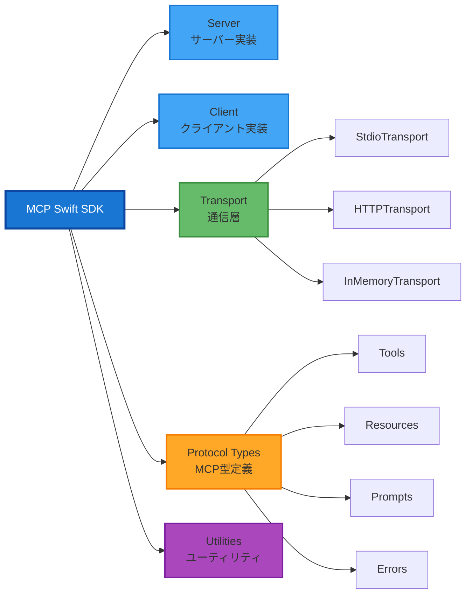
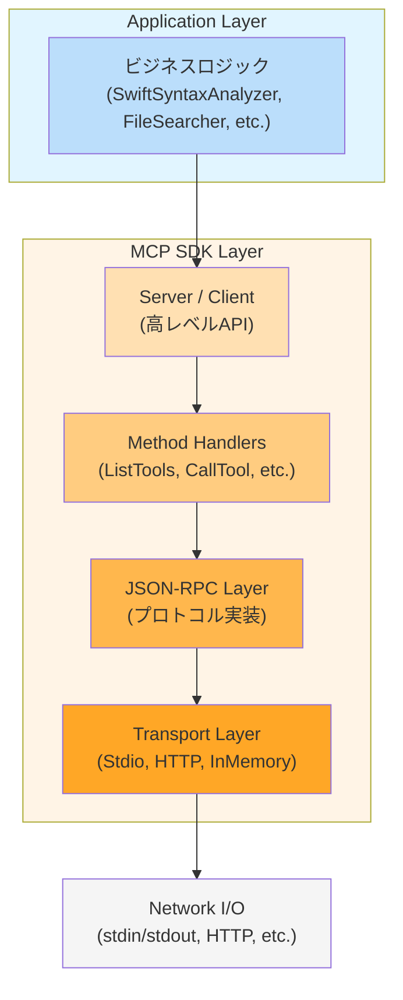
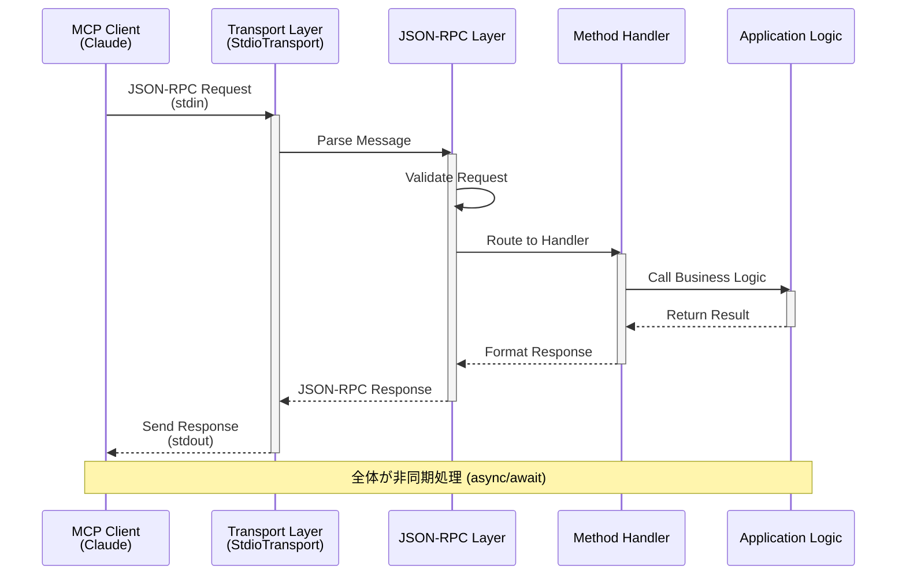
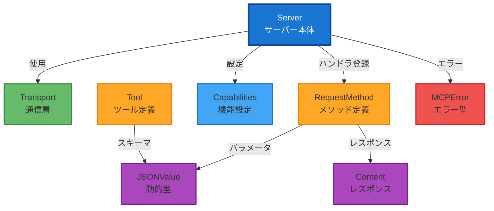
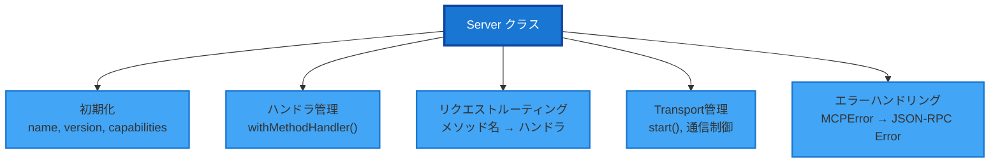
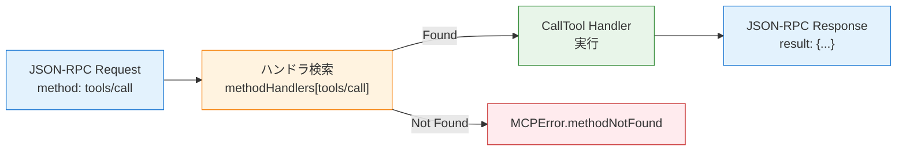
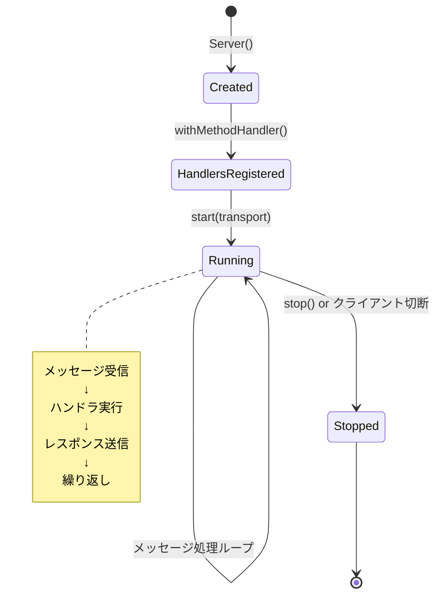
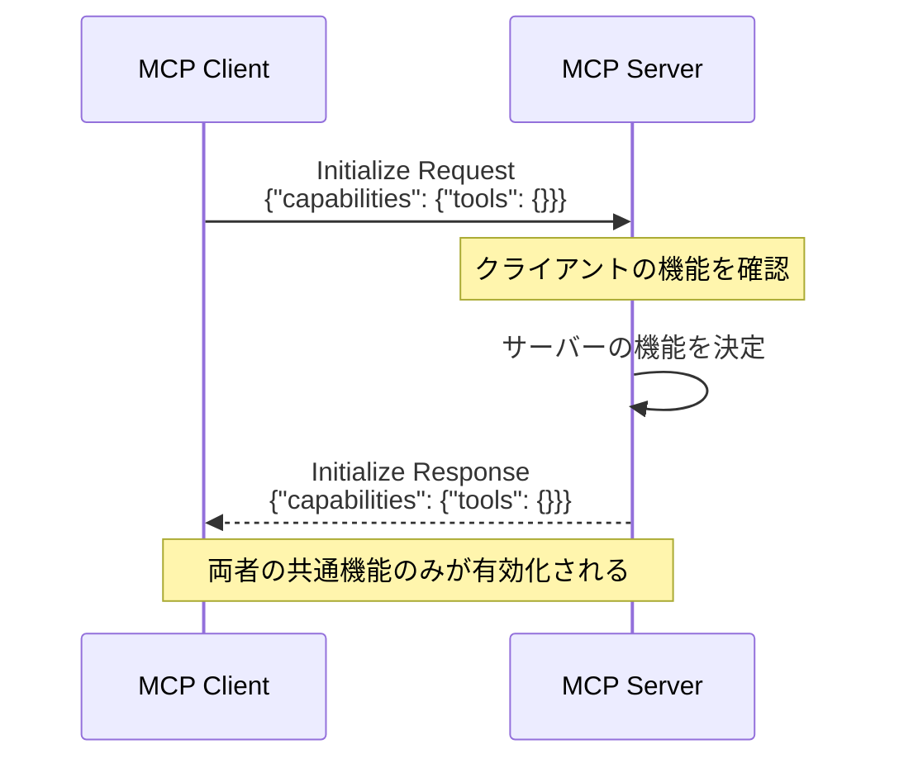

# MCP Swift SDK 完全ガイド

このドキュメントは、MCP Swift SDK（`swift-sdk`）の内部構造と使い方を深く理解するための詳細ガイドです。

## 目次

1. [SDK概要](#sdk概要)
2. [SDKのアーキテクチャ](#sdkのアーキテクチャ)
3. [コア型の詳細](#コア型の詳細)
4. [Server クラス](#server-クラス)
5. [Transport層](#transport層)
6. [Request/Response メカニズム](#requestresponse-メカニズム)
7. [Method Handlers](#method-handlers)
8. [JSONValue型システム](#jsonvalue型システム)
9. [エラーハンドリング](#エラーハンドリング)
10. [高度な使い方](#高度な使い方)

---

## SDK概要

### MCP Swift SDKとは？

**swift-sdk** は、Model Context Protocol (MCP) のSwift実装です。このSDKを使うことで、Swift言語でMCPサーバーやクライアントを構築できます。

### SDKの提供範囲



### インストール

```swift
dependencies: [
    .package(
        url: "https://github.com/modelcontextprotocol/swift-sdk.git",
        exact: "0.10.2"
    )
]

targets: [
    .target(
        name: "YourTarget",
        dependencies: [
            .product(name: "MCP", package: "swift-sdk")
        ]
    )
]
```

---

## SDKのアーキテクチャ

### レイヤー構造



### リクエスト処理フロー



### 主要コンポーネント

#### 1. Server

MCPサーバーのコア実装。クライアントからのリクエストを処理します。

```swift :SDK
public final class Server: Sendable {
    public init(
        name: String,
        version: String,
        capabilities: Capabilities
    )

    public func start(transport: Transport) async throws
    public func withMethodHandler<Method: RequestMethod>(
        _ type: Method.Type,
        handler: @escaping @Sendable (Method.Params) async throws -> Method.Result
    ) async
}
```

#### 2. Transport

通信層の抽象化。異なる通信方式を統一インターフェースで扱います。

```swift :SDK
public protocol Transport: Sendable {
    func start() async throws
    func send(_ message: JSONRPCMessage) async throws
    func receive() async throws -> JSONRPCMessage
    func close() async throws
}
```

#### 3. RequestMethod

MCPメソッドの型定義。各MCPメソッド（ListTools, CallTool等）を表します。

```swift :SDK
public protocol RequestMethod: Sendable {
    associatedtype Params: Codable & Sendable
    associatedtype Result: Codable & Sendable

    static var method: String { get }
}
```

---

## コア型の詳細

### 概要

MCP Swift SDKが提供する主要な型とその役割：

| 型 | カテゴリ | 役割 | 主要メソッド/プロパティ |
|----|---------|------|----------------------|
| **Server** | サーバー | MCPサーバーのコア実装 | `start()`, `withMethodHandler()` |
| **Transport** | 通信 | 通信層の抽象化 | `send()`, `receive()` |
| **RequestMethod** | プロトコル | MCPメソッドの型定義 | `Params`, `Result`, `method` |
| **Capabilities** | 設定 | サーバー機能の定義 | `tools`, `resources`, `prompts` |
| **JSONValue** | データ | 動的型の表現 | `.string()`, `.number()`, `.object()` |
| **Tool** | ツール | ツール定義 | `name`, `description`, `inputSchema` |
| **Content** | レスポンス | ツール結果の表現 | `.text()`, `.image()`, `.resource()` |
| **MCPError** | エラー | MCP標準エラー | `.invalidParams()`, `.internalError()` |

### 型の関係図



---

### Server.Capabilities

**サーバーが提供する機能を定義し、クライアントとネゴシエーションする**

```swift :SDK
public struct Capabilities: Codable, Sendable {
    public var tools: ToolCapabilities?
    public var resources: ResourceCapabilities?
    public var prompts: PromptCapabilities?
    public var logging: LoggingCapabilities?

    public init(
        tools: ToolCapabilities? = nil,
        resources: ResourceCapabilities? = nil,
        prompts: PromptCapabilities? = nil,
        logging: LoggingCapabilities? = nil
    )
}
```

#### Capabilitiesの目的

MCPでは、サーバーとクライアントが**互いにサポートする機能を宣言し、共通部分のみを有効化**します。これにより：

- ✅ **機能の明示**: サーバーが何を提供できるかを明確化
- ✅ **互換性の確保**: クライアントとサーバーの機能ミスマッチを防止
- ✅ **プロトコルの拡張性**: 新機能を追加しても既存実装との互換性を維持

#### Capabilitiesの種類と用途

| Capability | 目的 | 有効化されるメソッド | 使用例 |
|-----------|------|------------------|--------|
| **tools** | 外部ツールの実行 | `ListTools`, `CallTool` | コード解析、ファイル検索、計算処理 |
| **resources** | リソースへのアクセス | `ListResources`, `ReadResource`, `Subscribe` | ファイル読み取り、DB接続、APIアクセス |
| **prompts** | プロンプトテンプレート | `ListPrompts`, `GetPrompt` | 定型質問、対話テンプレート |
| **logging** | 構造化ロギング | `SetLogLevel` | サーバーログの動的制御 |

#### なぜOptionalなのか？

```swift :実装例
// ケース1: ツール機能のみを提供するサーバー
let toolServer = Server(
    name: "tool-server",
    version: "1.0.0",
    capabilities: .init(
        tools: .init()  // ツールのみ有効
        // resources, prompts, logging は nil（無効）
    )
)

// ケース2: 全機能を提供するサーバー
let fullServer = Server(
    name: "full-server",
    version: "1.0.0",
    capabilities: .init(
        tools: .init(),
        resources: .init(subscribe: true),
        prompts: .init(listChanged: true),
        logging: .init()
    )
)

// ケース3: リソース専用サーバー
let resourceServer = Server(
    name: "resource-server",
    version: "1.0.0",
    capabilities: .init(
        resources: .init()  // リソースのみ有効
    )
)
```

**利点:**
- サーバーの責務を明確にできる
- 不要な機能を実装しなくて良い
- クライアントは利用可能な機能のみを使用

---

#### 各Capabilityの詳細

##### 1. ToolCapabilities

**目的**: サーバーが実行可能なツールを提供

```swift :SDK
public struct ToolCapabilities: Codable, Sendable {
    public init()
}
```

| 項目 | 説明 |
|------|------|
| **有効化されるメソッド** | `ListTools`, `CallTool` |
| **主な用途** | コマンド実行、コード解析、データ処理、計算 |
| **Swift-Selenaでの使用** | ✅ 使用中（17個のツールを提供） |
| **設定オプション** | なし（有効/無効のみ） |

**実装例:**
```swift :実装例
capabilities: .init(
    tools: .init()  // ツール機能を有効化
)
```

---

##### 2. ResourceCapabilities

**目的**: ファイルやデータソースなどのリソースへのアクセスを提供

```swift :SDK
public struct ResourceCapabilities: Codable, Sendable {
    public var subscribe: Bool?      // リソース変更の購読機能
    public var listChanged: Bool?    // リソースリスト変更通知

    public init(subscribe: Bool? = nil, listChanged: Bool? = nil)
}
```

| 項目 | 説明 |
|------|------|
| **有効化されるメソッド** | `ListResources`, `ReadResource`, `Subscribe`, `Unsubscribe` |
| **主な用途** | ファイル読み取り、データベース接続、API統合 |
| **Swift-Selenaでの使用** | ❌ 未使用（ツール機能で代替） |
| **subscribe** | `true`: リソース変更の通知を受け取る |
| **listChanged** | `true`: リソースリスト変更時に通知 |

**実装例:**
```swift :実装例
capabilities: .init(
    resources: .init(
        subscribe: true,      // リソース変更を購読
        listChanged: true     // リスト変更を通知
    )
)
```

---

##### 3. PromptCapabilities

**目的**: 事前定義されたプロンプトテンプレートを提供

```swift :SDK
public struct PromptCapabilities: Codable, Sendable {
    public var listChanged: Bool?    // プロンプトリスト変更通知

    public init(listChanged: Bool? = nil)
}
```

| 項目 | 説明 |
|------|------|
| **有効化されるメソッド** | `ListPrompts`, `GetPrompt` |
| **主な用途** | 定型質問、対話フロー、テンプレート管理 |
| **Swift-Selenaでの使用** | ❌ 未使用 |
| **listChanged** | `true`: プロンプトリスト変更時に通知 |

**実装例:**
```swift :実装例
capabilities: .init(
    prompts: .init(
        listChanged: true  // プロンプト更新を通知
    )
)
```

**使用シーン:**
- ユーザーに質問パターンを提示
- 複数ステップの対話フロー
- コンテキストに応じたプロンプト切り替え

---

##### 4. LoggingCapabilities

**目的**: クライアントからサーバーのログレベルを動的に制御

```swift :SDK
public struct LoggingCapabilities: Codable, Sendable {
    public init()
}
```

| 項目 | 説明 |
|------|------|
| **有効化されるメソッド** | `SetLogLevel` |
| **主な用途** | デバッグ時のログレベル変更、本番環境での動的ログ制御 |
| **Swift-Selenaでの使用** | ❌ 未使用（静的なログレベル設定） |
| **設定オプション** | なし（有効/無効のみ） |

**実装例:**
```swift :実装例
capabilities: .init(
    logging: .init()  // ロギング制御を有効化
)

// クライアントからログレベルを変更可能になる
// SetLogLevel { level: "debug" } → サーバーのログレベルが変更される
```

---

#### Capabilitiesの選択ガイド

**最小構成（ツールのみ）:**
```swift :実装例
// Swift-Selenaの構成
capabilities: .init(tools: .init())
```
→ シンプルなツール提供サーバー

**リソース重視:**
```swift :実装例
capabilities: .init(
    resources: .init(subscribe: true)
)
```
→ ファイルサーバー、データソース

**対話重視:**
```swift :実装例
capabilities: .init(
    tools: .init(),
    prompts: .init()
)
```
→ 対話型アシスタント

**フルスタック:**
```swift :実装例
capabilities: .init(
    tools: .init(),
    resources: .init(subscribe: true, listChanged: true),
    prompts: .init(listChanged: true),
    logging: .init()
)
```
→ 全機能を提供する包括的サーバー

---

## Server クラス

### Serverクラスの役割

`Server`は、MCP Swift SDKの中核となるクラスです。以下の責務を持ちます：



### コア機能

#### 1. メソッドハンドラの管理

```swift :SDK
// withMethodHandler(): ジェネリクスを使った型安全なハンドラ登録
public func withMethodHandler<Method: RequestMethod>(
    _ type: Method.Type,
    handler: @escaping @Sendable (Method.Params) async throws -> Method.Result
) async
```

**仕組み:**
- Associated Typeを使って、パラメータ型と戻り値型を静的に決定
- コンパイル時に型チェックが行われる
- ランタイムエラーを大幅に削減

**型安全性の例:**

```swift :実装例
// ✅ 正しい型 - コンパイル成功
await server.withMethodHandler(ListTools.self) { params in
    // params は自動的に ListTools.Params 型
    // 戻り値は ListTools.Result 型でなければならない
    return ListTools.Result(tools: [...])
}

// ❌ 誤った型 - コンパイルエラー
await server.withMethodHandler(ListTools.self) { params in
    return CallTool.Result(...)  // 型が合わない！
}
```

#### 2. リクエストルーティング

```swift :SDK内部
// Server内部のルーティングメカニズム（疑似コード）
class Server {
    // メソッド名をキーにしたハンドラ辞書
    private var methodHandlers: [String: Any] = [:]

    func withMethodHandler<Method: RequestMethod>(
        _ type: Method.Type,
        handler: @escaping @Sendable (Method.Params) async throws -> Method.Result
    ) async {
        // メソッド名（例: "tools/list"）をキーにハンドラを保存
        methodHandlers[Method.method] = handler
    }

    func handleRequest(_ message: JSONRPCMessage) async throws -> JSONRPCMessage {
        guard case .request(let id, let method, let params) = message else {
            throw MCPError.invalidRequest("Not a request")
        }

        // メソッド名でハンドラを検索
        guard let handler = methodHandlers[method] else {
            throw MCPError.methodNotFound("Unknown method: \(method)")
        }

        // ハンドラを実行（型キャストして呼び出し）
        let result = try await handler(params)

        // レスポンスを作成
        return .response(id: id, result: result)
    }
}
```

**ルーティングフロー:**



#### 3. ライフサイクル管理

```swift :SDK内部
// Server のライフサイクル（疑似コード）
class Server {
    private var transport: Transport?
    private var isRunning = false

    public func start(transport: Transport) async throws {
        guard !isRunning else {
            throw MCPError.invalidRequest("Server already running")
        }

        self.transport = transport

        // 1. Transportを起動
        try await transport.start()

        // 2. メッセージ受信ループを開始
        isRunning = true
        await messageLoop()
    }

    private func messageLoop() async {
        while isRunning {
            do {
                // メッセージを受信
                let message = try await transport?.receive()

                // リクエストを処理
                let response = try await handleRequest(message)

                // レスポンスを送信
                try await transport?.send(response)

            } catch {
                // エラーレスポンスを送信
                let errorResponse = createErrorResponse(error)
                try? await transport?.send(errorResponse)
            }
        }
    }

    public func stop() async throws {
        isRunning = false
        try await transport?.close()
    }
}
```

**ライフサイクル図:**



#### 4. エラーハンドリングとレスポンス生成

```swift :SDK内部
// Server内部のエラーハンドリング（疑似コード）
func handleRequest(_ message: JSONRPCMessage) async throws -> JSONRPCMessage {
    do {
        // 通常のリクエスト処理
        let result = try await processRequest(message)
        return result

    } catch let error as MCPError {
        // MCPError → JSON-RPC エラーレスポンス
        return createMCPErrorResponse(id: message.id, error: error)

    } catch {
        // その他のエラー → InternalError
        return createMCPErrorResponse(
            id: message.id,
            error: .internalError(error.localizedDescription)
        )
    }
}

func createMCPErrorResponse(id: JSONValue, error: MCPError) -> JSONRPCMessage {
    let (code, message) = mapMCPErrorToJSONRPC(error)

    return .error(
        id: id,
        error: JSONRPCError(code: code, message: message)
    )
}

func mapMCPErrorToJSONRPC(_ error: MCPError) -> (code: Int, message: String) {
    switch error {
    case .invalidParams(let msg):
        return (-32602, msg)  // Invalid params
    case .invalidRequest(let msg):
        return (-32600, msg)  // Invalid request
    case .methodNotFound(let msg):
        return (-32601, msg)  // Method not found
    case .internalError(let msg):
        return (-32603, msg)  // Internal error
    case .parseError(let msg):
        return (-32700, msg)  // Parse error
    }
}
```

#### 5. 並行処理の安全性

```swift :SDK
// Server は Sendable プロトコルに準拠
public final class Server: Sendable {
    // ...
}

// ハンドラも @Sendable クロージャ
public func withMethodHandler<Method: RequestMethod>(
    _ type: Method.Type,
    handler: @escaping @Sendable (Method.Params) async throws -> Method.Result
) async
```

**Sendableの重要性:**

```swift :実装例
// ✅ 安全: Sendable な状態管理
actor ServerState {
    private var projectPath: String?

    func setProjectPath(_ path: String) {
        projectPath = path
    }

    func getProjectPath() -> String? {
        projectPath
    }
}

let state = ServerState()

await server.withMethodHandler(CallTool.self) { params in
    // Actor を使った安全な状態アクセス
    await state.setProjectPath("/path/to/project")

    return CallTool.Result(content: [.text("OK")])
}

// ❌ 危険: 非Sendableな状態（データ競合の可能性）
var unsafeState: String? = nil  // ⚠️ コンパイルエラーまたは警告

await server.withMethodHandler(CallTool.self) { params in
    // 複数のリクエストが同時に来た場合、データ競合が発生
    unsafeState = "/path/to/project"  // ⚠️ 危険！

    return CallTool.Result(content: [.text("OK")])
}
```

#### 6. Capabilitiesネゴシエーション

```swift :SDK内部
// Initialize リクエストの処理（疑似コード）
func handleInitialize(_ params: Initialize.Params) -> Initialize.Result {
    // クライアントの capabilities を確認
    logger.info("Client capabilities", metadata: [
        "supports_tools": .stringConvertible(params.capabilities.tools != nil),
        "supports_resources": .stringConvertible(params.capabilities.resources != nil)
    ])

    // サーバーの capabilities を返す
    return Initialize.Result(
        protocolVersion: "2024-11-05",  // MCPプロトコルバージョン
        capabilities: serverCapabilities,  // Server初期化時に設定したもの
        serverInfo: ServerInfo(
            name: serverName,
            version: serverVersion
        )
    )
}
```

**Capabilitiesの交換:**



---

### 初期化

```swift :実装例
// ======================================================================
// Serverの作成
// ======================================================================
// Server: MCP Swift SDKのコアクラス
// MCPプロトコルに従ってクライアントとの通信を管理
let server = Server(
    // name: サーバー識別名
    // - Claude側のUI等で表示される
    // - 任意の文字列（推奨: kebab-case）
    name: "my-server",

    // version: サーバーのバージョン
    // - セマンティックバージョニング推奨（1.0.0, 0.4.2 等）
    // - クライアント側でバージョン互換性チェックに使用される可能性あり
    version: "1.0.0",

    // capabilities: サーバーが提供する機能
    // - tools: ツール機能（ListTools, CallTool）
    // - resources: リソース機能（ListResources, ReadResource）
    // - prompts: プロンプト機能（ListPrompts, GetPrompt）
    // - logging: ロギング機能
    capabilities: .init(
        tools: .init()  // ツール機能のみを有効化
    )
)
```

### ライフサイクル

```swift :実装例
// ======================================================================
// 1. サーバー作成
// ======================================================================
let server = Server(
    name: "my-server",
    version: "1.0.0",
    capabilities: .init(tools: .init())
)

// ======================================================================
// 2. ハンドラ登録
// ======================================================================
// withMethodHandler(): メソッドハンドラを登録
// - 型パラメータ: RequestMethodプロトコルに準拠した型
// - クロージャ: 非同期（async）、エラーをthrow可能、Sendable
// - 戻り値: Method.Result型
await server.withMethodHandler(ListTools.self) { params in
    // params: ListTools.Params（この場合は空）
    // 戻り値: ListTools.Result

    // ツールのリストを返す
    return ListTools.Result(tools: [
        Tool(name: "my_tool", description: "...", inputSchema: ...)
    ])
}

// 複数のハンドラを登録可能
await server.withMethodHandler(CallTool.self) { params in
    // params: CallTool.Params
    // - params.name: ツール名
    // - params.arguments: パラメータ（JSONValue Dictionary）

    // ツールを実行して結果を返す
    return CallTool.Result(content: [.text("Result")])
}

// ======================================================================
// 3. トランスポート起動
// ======================================================================
// Transport: 通信層の実装（Stdio, HTTP, InMemory等）
let transport = StdioTransport(logger: logger)

// server.start(): サーバーを起動
// - ハンドラ登録はstart()の前に完了しておく必要がある
// - start()後はメッセージ受信ループが開始される
// - この呼び出しはブロックしない（非同期）
try await server.start(transport: transport)

// ======================================================================
// 4. 実行継続（重要）
// ======================================================================
// MCPサーバーは永続的に実行され続ける必要がある
// クライアントからのリクエストを待ち受けるため、プロセスを終了させない
while true {
    // 長時間スリープ（1秒 = 1_000_000_000 ナノ秒）
    try await Task.sleep(nanoseconds: 1_000_000_000)

    // または無限スリープ（実質的にプロセスを永続化）
    // try await Task.sleep(nanoseconds: UInt64.max)
}

// 注意: この無限ループは終了しない
// プロセスはクライアント側からkillされることで終了する
```

### Method Handler登録

```swift :実装例
// ======================================================================
// withMethodHandler(): メソッドハンドラの登録
// ======================================================================
// 型パラメータで RequestMethod を指定することで、
// パラメータ型と戻り値型が自動的に決定される（型安全）
await server.withMethodHandler(ListTools.self) { params in
    // params: ListTools.Params（型推論により自動決定）
    // 戻り値: ListTools.Result（型推論により自動決定）

    // この例では params は空（ListTools.Params は中身がない）
    // ツールのリストを返すだけ
    return ListTools.Result(tools: [
        Tool(
            name: "example_tool",
            description: "Example tool",
            inputSchema: .object([...])
        )
    ])
}

// ======================================================================
// 複数のハンドラを登録する場合
// ======================================================================
// 各 RequestMethod に対して1つのハンドラを登録
// 同じ型に対して複数回 withMethodHandler を呼ぶと、後のものが上書きする
await server.withMethodHandler(CallTool.self) { params in
    // params: CallTool.Params
    // - params.name: String（ツール名）
    // - params.arguments: [String: JSONValue]?（パラメータ）

    // switch文でツールを振り分け
    switch params.name {
    case "tool1":
        return CallTool.Result(content: [.text("Result 1")])
    case "tool2":
        return CallTool.Result(content: [.text("Result 2")])
    default:
        throw MCPError.invalidParams("Unknown tool: \(params.name)")
    }
}
```

**ポイント**:
- `withMethodHandler`は非同期（`await`）
- ハンドラクロージャは`@Sendable`（並行処理の安全性）
- パラメータ型と戻り値型は`RequestMethod`で定義（型安全）
- 同じRequestMethodに複数回登録すると上書きされる
- ハンドラ内でエラーをthrowすると、自動的にエラーレスポンスが返る

---

## Transport層

### Transport プロトコル

```swift
public protocol Transport: Sendable {
    func start() async throws
    func send(_ message: JSONRPCMessage) async throws
    func receive() async throws -> JSONRPCMessage
    func close() async throws
}
```

### StdioTransport

**標準入出力を使ったプロセス間通信**

```swift :SDK
public final class StdioTransport: Transport {
    public init(logger: Logger)

    public func start() async throws
    public func send(_ message: JSONRPCMessage) async throws
    public func receive() async throws -> JSONRPCMessage
    public func close() async throws
}
```

**特徴:**
- プロセスのstdin/stdoutを使用
- プロセス間通信に適している
- シンプルで実装が容易

**使用例:**

```swift :実装例
import Logging

// ======================================================================
// Loggerの設定（重要: stderrに出力）
// ======================================================================
// stdoutはMCP通信専用のため、ログは必ずstderrに出力する必要がある
// StreamLogHandler.standardError は stderr に出力するハンドラ
LoggingSystem.bootstrap { label in
    var handler = StreamLogHandler.standardError(label: label)
    // ログレベルの設定
    // .trace (最も詳細) → .debug → .info → .notice → .warning → .error → .critical (最も重要)
    handler.logLevel = .info
    return handler
}

let logger = Logger(label: "mcp-server")

// ======================================================================
// StdioTransportの作成と起動
// ======================================================================
// StdioTransport: 標準入出力を使ったTransport実装
// - stdin から JSON-RPC リクエストを受信
// - stdout に JSON-RPC レスポンスを送信
// - logger を渡すことで、Transport内部のログも出力される
let transport = StdioTransport(logger: logger)

// server.start() でサーバーを起動
// この時点で stdin からのメッセージ受信を開始
try await server.start(transport: transport)
```

**内部動作:**

1. **受信**: `FileHandle.standardInput`から1行ずつ読み取り
   ```
   stdin → JSONデータ → JSONDecoder → JSONRPCMessage
   ```

```swift :SDK内部
   // StdioTransport内部の疑似コード
   func receive() async throws -> JSONRPCMessage {
       // stdin から1行読み取り（改行まで）
       guard let line = readLine() else {
           throw TransportError.connectionClosed
       }

       // JSON文字列をDataに変換
       guard let data = line.data(using: .utf8) else {
           throw TransportError.invalidEncoding
       }

       // JSONデコード
       let decoder = JSONDecoder()
       let message = try decoder.decode(JSONRPCMessage.self, from: data)

       logger.debug("Received message", metadata: [
           "method": .string(message.method ?? "unknown")
       ])

       return message
   }
   ```

2. **パース**: JSON-RPCメッセージをデコード
```swift :SDK
   // JSONRPCMessage の構造
   enum JSONRPCMessage {
       case request(id: JSONValue, method: String, params: JSONValue?)
       case response(id: JSONValue, result: JSONValue)
       case error(id: JSONValue?, error: JSONRPCError)
       case notification(method: String, params: JSONValue?)
   }
   ```

3. **ルーティング**: メソッド名に応じてハンドラを呼び出し
```swift :SDK内部
   // Server内部の疑似コード
   switch message {
   case .request(let id, let method, let params):
       // メソッド名でハンドラを検索
       guard let handler = methodHandlers[method] else {
           throw MCPError.methodNotFound("Unknown method: \(method)")
       }

       // ハンドラを実行
       let result = try await handler(params)

       // レスポンスを作成
       return .response(id: id, result: result)
   }
   ```

4. **送信**: `FileHandle.standardOutput`に結果を書き込み
   ```
   JSONRPCMessage → JSONEncoder → JSONデータ → stdout
   ```

```swift :SDK内部
   // StdioTransport内部の疑似コード
   func send(_ message: JSONRPCMessage) async throws {
       // JSONエンコード
       let encoder = JSONEncoder()
       let data = try encoder.encode(message)

       // Data → String
       guard let jsonString = String(data: data, encoding: .utf8) else {
           throw TransportError.invalidEncoding
       }

       logger.debug("Sending message", metadata: [
           "size": .stringConvertible(data.count)
       ])

       // stdout に書き込み（改行付き）
       print(jsonString)  // print() は自動的に改行を追加
       fflush(stdout)     // バッファをフラッシュして即座に送信
   }
   ```

**重要な注意点:**
- **ログはstderrに出力**: stdoutはMCP通信専用のため、ログは必ずstderrに出力
- **改行区切り**: 各JSON-RPCメッセージは改行で区切られる
- **ブロッキングI/O**: 同期的に読み書きを行う

**適用例:**

```bash
# ケース1: MCPクライアントから起動される場合
# （例: Claude Desktop, Claude Code, 他のMCPクライアント）
/path/to/your-mcp-server

# ケース2: 手動テスト（stdinに直接送信）
echo '{"jsonrpc":"2.0","id":1,"method":"initialize","params":{...}}' | ./your-mcp-server

# ケース3: パイプで連携
cat request.json | ./your-mcp-server | tee response.json
```

---

### HTTPTransport

**HTTP/HTTPSを使ったネットワーク通信**

```swift :SDK
public final class HTTPTransport: Transport {
    public init(url: URL, headers: [String: String] = [:])

    public func start() async throws
    public func send(_ message: JSONRPCMessage) async throws
    public func receive() async throws -> JSONRPCMessage
    public func close() async throws
}
```

**特徴:**
- HTTP/HTTPSプロトコルを使用
- ネットワーク越しの通信に適している
- カスタムHTTPヘッダーをサポート
- **注意**: SDK v0.10.2では実験的実装（API変更の可能性あり）

**使用例:**

```swift :実装例
// ======================================================================
// HTTPTransportの作成
// ======================================================================
// HTTPTransport: HTTP/HTTPS を使ったTransport実装（実験的）
// - url: MCPエンドポイントのURL
// - headers: カスタムHTTPヘッダー（認証、Content-Type等）
let transport = HTTPTransport(
    url: URL(string: "https://api.example.com/mcp")!,
    headers: [
        // Authorization ヘッダーで認証トークンを送信
        "Authorization": "Bearer token",
        // Content-Type は通常 application/json
        "Content-Type": "application/json",
        // カスタムヘッダーも追加可能
        "X-API-Version": "1.0"
    ]
)

// サーバー起動（HTTPエンドポイントに接続）
try await server.start(transport: transport)
```

**内部動作:**

1. **送信**: HTTPポストリクエストでJSON-RPCメッセージを送信
   ```
   POST https://api.example.com/mcp
   Content-Type: application/json
   Authorization: Bearer token

   {"jsonrpc":"2.0","id":1,"method":"tools/list",...}
   ```

```swift :SDK内部
   // HTTPTransport内部の疑似コード
   func send(_ message: JSONRPCMessage) async throws {
       // JSON-RPCメッセージをエンコード
       let encoder = JSONEncoder()
       let data = try encoder.encode(message)

       // HTTPリクエストの作成
       var request = URLRequest(url: url)
       request.httpMethod = "POST"  // 常にPOST
       request.httpBody = data

       // カスタムヘッダーの追加
       for (key, value) in headers {
           request.setValue(value, forHTTPHeaderField: key)
       }

       // HTTPリクエストを送信
       let (responseData, response) = try await URLSession.shared.data(for: request)

       // HTTPステータスコードのチェック
       guard let httpResponse = response as? HTTPURLResponse,
             (200...299).contains(httpResponse.statusCode) else {
           throw TransportError.httpError(statusCode: httpResponse.statusCode)
       }

       logger.debug("HTTP request sent", metadata: [
           "status": .stringConvertible(httpResponse.statusCode),
           "size": .stringConvertible(responseData.count)
       ])
   }
   ```

2. **受信**: HTTPレスポンスボディからJSON-RPCレスポンスを取得
   ```
   HTTP/1.1 200 OK
   Content-Type: application/json

   {"jsonrpc":"2.0","id":1,"result":{...}}
   ```

```swift :SDK内部
   func receive() async throws -> JSONRPCMessage {
       // レスポンスボディをデコード
       let decoder = JSONDecoder()
       let message = try decoder.decode(JSONRPCMessage.self, from: responseData)

       return message
   }
   ```

**適用例:**
- マイクロサービス間の通信
- 分散システムでのMCP連携
- クラウドサービスとの統合
- プロキシやゲートウェイ経由の通信

**SDK実装状態（v0.10.2）:**
- ⚠️ 実験的実装のため、将来のバージョンでAPIが変更される可能性
- 基本的な送受信は動作するが、エラーハンドリングは限定的
- 認証方式はHTTPヘッダーベースのみ（OAuth等は未対応）

---

### InMemoryTransport

**メモリ上での通信（I/Oなし）**

```swift :SDK
public final class InMemoryTransport: Transport {
    public init()

    public func start() async throws
    public func send(_ message: JSONRPCMessage) async throws
    public func receive() async throws -> JSONRPCMessage
    public func close() async throws

    // テスト用の追加メソッド
    public func simulateRequest(_ message: JSONRPCMessage) async throws -> JSONRPCMessage
}
```

**特徴:**
- 実際のI/Oなし、全てメモリ上で処理
- 最速のパフォーマンス
- 送受信履歴の追跡が可能
- デバッグとテストに最適

**使用例（ユニットテスト）:**

```swift :実装例
import XCTest
@testable import MCP

final class ServerTests: XCTestCase {
    func testToolCall() async throws {
        // ======================================================================
        // 1. テスト用サーバーの作成
        // ======================================================================
        let server = Server(
            name: "test-server",
            version: "1.0.0",
            capabilities: .init(tools: .init())
        )

        // ======================================================================
        // 2. ハンドラ登録
        // ======================================================================
        // ListToolsハンドラ: 利用可能なツールを返す
        await server.withMethodHandler(ListTools.self) { _ in
            ListTools.Result(tools: [
                Tool(
                    name: "test_tool",
                    description: "Test tool",
                    inputSchema: .object([:])  // パラメータなし
                )
            ])
        }

        // CallToolハンドラ: ツール実行のロジック
        await server.withMethodHandler(CallTool.self) { params in
            // パラメータの検証（XCTestのアサーション）
            XCTAssertEqual(params.name, "test_tool")

            // 結果を返す
            return CallTool.Result(content: [.text("Success")])
        }

        // ======================================================================
        // 3. InMemoryTransportでテスト
        // ======================================================================
        // InMemoryTransport: 実際のI/Oなしでメモリ上で通信をシミュレート
        // - テストの高速化（I/Oオーバーヘッドなし）
        // - デバッグが容易（送受信履歴を確認可能）
        let transport = InMemoryTransport()
        try await server.start(transport: transport)

        // ======================================================================
        // 4. リクエストをシミュレート
        // ======================================================================
        // JSONRPCMessage.request() でリクエストメッセージを作成
        // - id: リクエストID（レスポンスとの紐付けに使用）
        // - method: MCPメソッド名（"tools/call", "tools/list" 等）
        // - params: パラメータ（JSONValue形式）
        let request = JSONRPCMessage.request(
            id: .number(1),
            method: "tools/call",
            params: ["name": "test_tool"]
        )

        // simulateRequest(): リクエストを送信してレスポンスを取得
        // 実際のI/Oを伴わず、メモリ上で処理
        let response = try await transport.simulateRequest(request)

        // ======================================================================
        // 5. レスポンスを検証
        // ======================================================================
        // レスポンスの型をチェック
        guard case .response(let result) = response else {
            XCTFail("Expected response, got: \(response)")
            return
        }

        // 結果の内容を検証
        // result には CallTool.Result がエンコードされている
        // ... さらに詳細な検証を追加
    }
}
```

**内部動作:**

1. **メッセージキュー**: 送受信メッセージを内部キューで管理
```swift :SDK内部
   // InMemoryTransport内部の疑似コード
   class InMemoryTransport: Transport {
       // リクエストとレスポンスを格納するキュー
       private var requestQueue: [JSONRPCMessage] = []
       private var responseQueue: [JSONRPCMessage] = []

       // 送受信履歴（デバッグ用）
       private var history: [(direction: String, message: JSONRPCMessage)] = []
   }
   ```

2. **同期的処理**: I/O待機なしで即座にレスポンスを返す
```swift :SDK内部
   func send(_ message: JSONRPCMessage) async throws {
       // メッセージをキューに追加するだけ（I/Oなし）
       responseQueue.append(message)

       // デバッグ履歴に記録
       history.append((direction: "send", message: message))

       // 実際のI/Oはないため、即座に完了
   }

   func receive() async throws -> JSONRPCMessage {
       // キューからメッセージを取り出すだけ（I/Oなし）
       guard !requestQueue.isEmpty else {
           throw TransportError.noMessages
       }

       let message = requestQueue.removeFirst()

       // デバッグ履歴に記録
       history.append((direction: "receive", message: message))

       return message
   }
   ```

3. **デバッグ機能**: 送受信履歴の記録
```swift :SDK
   // テスト用のヘルパーメソッド（InMemoryTransport専用）
   func getHistory() -> [(direction: String, message: JSONRPCMessage)] {
       return history
   }

   func clearHistory() {
       history.removeAll()
   }

   // 送受信したメッセージ数を取得
   func getMessageCount() -> (sent: Int, received: Int) {
       let sent = history.filter { $0.direction == "send" }.count
       let received = history.filter { $0.direction == "receive" }.count
       return (sent, received)
   }
   ```

**適用例:**
- ユニットテスト（XCTest等）
- 統合テスト
- MCPサーバーのロジック検証
- パフォーマンステスト（I/Oオーバーヘッドなし）
- 開発中のプロトタイピング

**テストパターン:**

```swift
// パターン1: 正常系テスト
func testNormalFlow() async throws {
    let transport = InMemoryTransport()
    // ... テストロジック
}

// パターン2: エラーハンドリングテスト
func testErrorHandling() async throws {
    let transport = InMemoryTransport()
    // 不正なリクエストを送信
    let badRequest = JSONRPCMessage.request(
        id: .number(1),
        method: "invalid_method",
        params: nil
    )
    // エラーレスポンスを期待
}

// パターン3: 複数リクエストのテスト
func testMultipleRequests() async throws {
    let transport = InMemoryTransport()
    // 連続してリクエストを送信
    for i in 1...10 {
        let request = createRequest(id: i)
        let response = try await transport.simulateRequest(request)
        // 検証
    }
}
```

---

### Transportの比較

| 特徴 | StdioTransport | HTTPTransport | InMemoryTransport |
|------|----------------|---------------|-------------------|
| **通信方式** | stdin/stdout | HTTP/HTTPS | メモリ |
| **通信特性** | プロセス間通信 | ネットワーク通信 | プロセス内通信 |
| **I/O** | あり（ブロッキング） | あり（非同期） | なし |
| **パフォーマンス** | 高速 | ネットワーク依存 | 最速 |
| **セットアップ** | シンプル | 複雑（エンドポイント設定） | 最もシンプル |
| **デバッグ** | 中（ログで確認） | 難（ネットワークツール必要） | 簡単（メモリ内で完結） |
| **適用例** | CLIツール、デスクトップアプリ統合 | マイクロサービス、API連携 | ユニットテスト、統合テスト |
| **認証方式** | プロセス権限 | HTTPヘッダー | 不要 |
| **SDK実装状態** | 安定版 | 実験的（API変更の可能性） | 安定版 |

### Transportの選択例

#### ケース1: ローカルCLIツールとの統合

```swift
// Claude Desktop/Code から起動される場合
// プロセスのstdin/stdoutを使った通信
let transport = StdioTransport(logger: logger)
```

**特徴:**
- プロセスが起動されると自動的に通信開始
- 追加の設定不要
- セキュリティ: プロセス権限で制御

#### ケース2: リモートサービスとの連携

```swift
// 別のサーバー上のMCPサービスに接続する場合
// HTTP/HTTPSを使った通信
let transport = HTTPTransport(
    url: URL(string: "https://your-mcp-service.com/api")!,
    headers: ["Authorization": "Bearer your-token"]
)
```

**特徴:**
- ネットワーク越しの通信
- 複数クライアントからの接続が可能
- セキュリティ: HTTPヘッダーで認証

#### ケース3: ユニットテストでの検証

```swift
// テスト環境で実際のI/Oなしで動作確認
// メモリ上の通信
let transport = InMemoryTransport()
```

**特徴:**
- I/Oオーバーヘッドなし
- 高速なテスト実行
- 送受信履歴の確認が容易

---

## Request/Response メカニズム

### RequestMethod プロトコル

```swift :SDK
public protocol RequestMethod: Sendable {
    associatedtype Params: Codable & Sendable
    associatedtype Result: Codable & Sendable

    static var method: String { get }
}
```

### 標準メソッド

#### ListTools

```swift :SDK
public struct ListTools: RequestMethod {
    public static let method = "tools/list"

    public struct Params: Codable, Sendable {
        public init()
    }

    public struct Result: Codable, Sendable {
        public let tools: [Tool]

        public init(tools: [Tool])
    }
}
```

**使用例:**

```swift :実装例
await server.withMethodHandler(ListTools.self) { _ in
    return ListTools.Result(tools: [
        Tool(
            name: "my_tool",
            description: "My tool description",
            inputSchema: .object([:])
        )
    ])
}
```

#### CallTool

```swift :SDK
public struct CallTool: RequestMethod {
    public static let method = "tools/call"

    public struct Params: Codable, Sendable {
        public let name: String
        public let arguments: [String: JSONValue]?

        public init(name: String, arguments: [String: JSONValue]? = nil)
    }

    public struct Result: Codable, Sendable {
        public let content: [Content]
        public let isError: Bool?

        public init(content: [Content], isError: Bool? = nil)
    }
}
```

**使用例:**

```swift :実装例
await server.withMethodHandler(CallTool.self) { params in
    switch params.name {
    case "my_tool":
        // ツール実装
        return CallTool.Result(content: [
            .text("Result")
        ])
    default:
        throw MCPError.invalidParams("Unknown tool")
    }
}
```

#### Initialize

```swift :SDK
public struct Initialize: RequestMethod {
    public static let method = "initialize"

    public struct Params: Codable, Sendable {
        public let protocolVersion: String
        public let capabilities: ClientCapabilities
        public let clientInfo: ClientInfo

        public init(
            protocolVersion: String,
            capabilities: ClientCapabilities,
            clientInfo: ClientInfo
        )
    }

    public struct Result: Codable, Sendable {
        public let protocolVersion: String
        public let capabilities: ServerCapabilities
        public let serverInfo: ServerInfo

        public init(
            protocolVersion: String,
            capabilities: ServerCapabilities,
            serverInfo: ServerInfo
        )
    }
}
```

**自動処理:**
- `Initialize`は自動的に処理される（ハンドラ登録不要）
- サーバー初期化時の情報が自動的に返される

---

## JSONValue型システム

### JSONValue enum

MCPでは、動的な型を扱うために`JSONValue`を使用します。

```swift :SDK
public enum JSONValue: Codable, Sendable, Hashable {
    case null
    case bool(Bool)
    case number(Double)
    case string(String)
    case array([JSONValue])
    case object([String: JSONValue])
}
```

### 便利なイニシャライザ

```swift :SDK
extension JSONValue {
    public static func string(_ value: String) -> JSONValue
    public static func number(_ value: Double) -> JSONValue
    public static func bool(_ value: Bool) -> JSONValue
    public static func array(_ value: [JSONValue]) -> JSONValue
    public static func object(_ value: [String: JSONValue]) -> JSONValue
}
```

### 使用例

#### シンプルな値

```swift :実装例
// ======================================================================
// JSONValue: 動的な型を表現するenum
// ======================================================================
// JSONの全ての型に対応
let stringValue: JSONValue = .string("hello")    // 文字列
let numberValue: JSONValue = .number(42)         // 数値（Double）
let boolValue: JSONValue = .bool(true)           // 真偽値
let nullValue: JSONValue = .null                 // null

// 型の確認とパターンマッチング
if case .string(let value) = stringValue {
    print("String value: \(value)")  // "String value: hello"
}

if case .number(let value) = numberValue {
    print("Number value: \(value)")  // "Number value: 42.0"
}
```

#### 配列

```swift :実装例
// ======================================================================
// 配列型のJSONValue
// ======================================================================
// .array([JSONValue]): JSONValueの配列
let array: JSONValue = .array([
    .string("item1"),   // 文字列要素
    .string("item2"),   // 文字列要素
    .number(3)          // 数値要素
])

// 配列の要素にアクセス
if case .array(let items) = array {
    for item in items {
        if case .string(let str) = item {
            print("String item: \(str)")
        }
    }
}

// ネストされた配列
let nestedArray: JSONValue = .array([
    .array([.number(1), .number(2)]),
    .array([.number(3), .number(4)])
])
```

#### オブジェクト

```swift :実装例
// ======================================================================
// オブジェクト型のJSONValue
// ======================================================================
// .object([String: JSONValue]): キーと値のペア
let object: JSONValue = .object([
    "name": .string("John"),      // 文字列プロパティ
    "age": .number(30),            // 数値プロパティ
    "active": .bool(true)          // 真偽値プロパティ
])

// オブジェクトのプロパティにアクセス
if case .object(let dict) = object {
    // キーでアクセス
    if let nameValue = dict["name"],
       case .string(let name) = nameValue {
        print("Name: \(name)")  // "Name: John"
    }

    // 全プロパティを列挙
    for (key, value) in dict {
        print("\(key): \(value)")
    }
}

// ネストされたオブジェクト
let nested: JSONValue = .object([
    "user": .object([
        "name": .string("John"),
        "profile": .object([
            "age": .number(30),
            "country": .string("USA")
        ])
    ])
])
```

#### ネストされた構造（InputSchema の例）

```swift :実装例
// ======================================================================
// JSON Schema (Draft 7) 形式のInputSchema
// ======================================================================
// Tool の inputSchema に使用する複雑なネスト構造
// これは「create_user」ツールのパラメータ定義の例
let complex: JSONValue = .object([
    // トップレベルは必ず "object" 型
    "type": .string("object"),

    // properties: パラメータの定義
    "properties": .object([
        // パラメータ1: name（文字列、必須）
        "name": .object([
            "type": .string("string"),
            "description": .string("User name"),
            // オプション: 文字列長の制限
            "minLength": .number(1),
            "maxLength": .number(100)
        ]),

        // パラメータ2: age（整数、必須）
        "age": .object([
            "type": .string("integer"),
            "description": .string("User age"),
            // オプション: 数値の範囲制限
            "minimum": .number(0),
            "maximum": .number(150)
        ]),

        // パラメータ3: email（文字列、オプション）
        "email": .object([
            "type": .string("string"),
            "description": .string("Email address"),
            // オプション: 正規表現パターン
            "pattern": .string("^[a-zA-Z0-9._%+-]+@[a-zA-Z0-9.-]+\\.[a-zA-Z]{2,}$")
        ])
    ]),

    // required: 必須パラメータのリスト
    // email は含まれていないため、オプショナル
    "required": .array([
        .string("name"),
        .string("age")
    ])
])

// このInputSchemaを使ったTool定義
let tool = Tool(
    name: "create_user",
    description: "Create a new user",
    inputSchema: complex
)
```

### JSONValueからの値取得

```swift :実装例
// ======================================================================
// パターンマッチングによる値の取得
// ======================================================================

// ケース1: String取得
// CallTool.Params.arguments から文字列パラメータを取得する典型的なパターン
func getStringParam(from args: [String: JSONValue], key: String) -> String? {
    guard let value = args[key] else {
        return nil  // キーが存在しない
    }

    // パターンマッチングで文字列を抽出
    if case .string(let stringValue) = value {
        return stringValue
    }

    return nil  // 型が異なる
}

// 使用例
let args: [String: JSONValue] = [
    "name": .string("John"),
    "age": .number(30)
]
if let name = getStringParam(from: args, key: "name") {
    print("Name: \(name)")  // "Name: John"
}

// ======================================================================
// ケース2: Object取得（ネストされたパラメータ）
// ======================================================================
let params: JSONValue = .object([
    "user": .object([
        "name": .string("John"),
        "age": .number(30)
    ])
])

// ネストされたオブジェクトから値を取得
if case .object(let dict) = params,
   let userValue = dict["user"],
   case .object(let userDict) = userValue,
   let nameValue = userDict["name"],
   case .string(let name) = nameValue {
    print("User name: \(name)")  // "User name: John"
}

// ======================================================================
// ケース3: Array取得（複数の値を処理）
// ======================================================================
let tagsParam: JSONValue = .array([
    .string("swift"),
    .string("mcp"),
    .string("server")
])

// 配列の各要素を処理
if case .array(let items) = tagsParam {
    var tags: [String] = []
    for item in items {
        if case .string(let tag) = item {
            tags.append(tag)
        }
    }
    print("Tags: \(tags)")  // "Tags: ["swift", "mcp", "server"]"
}

// ======================================================================
// ケース4: 実践的なパラメータ取得パターン
// ======================================================================
// CallTool ハンドラ内での典型的な使用例
func extractParams(from arguments: [String: JSONValue]?) throws -> (name: String, age: Int) {
    // arguments が nil チェック
    guard let args = arguments else {
        throw MCPError.invalidParams("Missing arguments")
    }

    // name パラメータの取得
    guard let nameValue = args["name"],
          case .string(let name) = nameValue else {
        throw MCPError.invalidParams("Missing or invalid 'name' parameter")
    }

    // age パラメータの取得
    guard let ageValue = args["age"],
          case .number(let ageDouble) = ageValue else {
        throw MCPError.invalidParams("Missing or invalid 'age' parameter")
    }
    let age = Int(ageDouble)

    return (name, age)
}
```

### JSONValueの変換

#### CodableからJSONValue

```swift :実装例
// ======================================================================
// Swift の Codable 型を JSONValue に変換
// ======================================================================
// 用途: 構造化されたデータをJSONValueとして扱いたい場合

// 1. Codable構造体の定義
struct MyData: Codable {
    let name: String
    let age: Int
}

// 2. インスタンスを作成
let data = MyData(name: "John", age: 30)

// 3. JSONエンコード → JSONValueにデコード
let encoder = JSONEncoder()
let jsonData = try encoder.encode(data)  // MyData → Data
let jsonValue = try JSONDecoder().decode(JSONValue.self, from: jsonData)  // Data → JSONValue

// 結果: jsonValue = .object(["name": .string("John"), "age": .number(30)])

// ======================================================================
// 実用例: 複雑なInputSchemaを構造体で定義
// ======================================================================
struct CreateUserSchema: Codable {
    let type = "object"
    let properties: Properties
    let required: [String]

    struct Properties: Codable {
        let name: Property
        let age: Property

        struct Property: Codable {
            let type: String
            let description: String
        }
    }
}

let schema = CreateUserSchema(
    properties: .init(
        name: .init(type: "string", description: "User name"),
        age: .init(type: "integer", description: "User age")
    ),
    required: ["name", "age"]
)

// 構造体 → JSONValue に変換
let schemaData = try JSONEncoder().encode(schema)
let inputSchema = try JSONDecoder().decode(JSONValue.self, from: schemaData)

// Tool定義で使用
let tool = Tool(
    name: "create_user",
    description: "Create a user",
    inputSchema: inputSchema
)
```

#### JSONValueからCodable

```swift :実装例
// ======================================================================
// JSONValue を Swift の Codable 型に変換
// ======================================================================
// 用途: JSONValueで受け取ったデータを型安全に扱いたい場合

// 1. JSONValue（受信データ）
let jsonValue: JSONValue = .object([
    "name": .string("John"),
    "age": .number(30)
])

// 2. JSONエンコード → Codableにデコード
let jsonData = try JSONEncoder().encode(jsonValue)  // JSONValue → Data
let data = try JSONDecoder().decode(MyData.self, from: jsonData)  // Data → MyData

// 結果: data.name = "John", data.age = 30

// ======================================================================
// 実用例: CallToolハンドラ内での使用
// ======================================================================
await server.withMethodHandler(CallTool.self) { params in
    switch params.name {
    case "create_user":
        // JSONValueのパラメータをCodable構造体に変換
        guard let args = params.arguments else {
            throw MCPError.invalidParams("Missing arguments")
        }

        // [String: JSONValue] → JSONValue
        let argsValue = JSONValue.object(args)

        // JSONValue → Codable
        let argsData = try JSONEncoder().encode(argsValue)
        let userParams = try JSONDecoder().decode(CreateUserParams.self, from: argsData)

        // 型安全にパラメータを使用
        let user = createUser(name: userParams.name, age: userParams.age)

        return CallTool.Result(content: [.text("User created: \(user.id)")])

    default:
        throw MCPError.invalidParams("Unknown tool")
    }
}

// パラメータ用のCodable構造体
struct CreateUserParams: Codable {
    let name: String
    let age: Int
}
```

---

## エラーハンドリング

### MCPError

```swift
public enum MCPError: Error {
    case invalidParams(String)
    case invalidRequest(String)
    case internalError(String)
    case methodNotFound(String)
    case parseError(String)
}
```

### エラーコード

JSON-RPC 2.0標準エラーコード:

```swift
public enum JSONRPCError: Int {
    case parseError = -32700      // JSONパースエラー
    case invalidRequest = -32600  // 無効なリクエスト
    case methodNotFound = -32601  // メソッドが見つからない
    case invalidParams = -32602   // パラメータエラー
    case internalError = -32603   // 内部エラー
}
```

### エラーレスポンス

```swift
// エラーをthrow
throw MCPError.invalidParams("Missing required parameter: name")

// JSON-RPCエラーレスポンス（自動生成）
{
  "jsonrpc": "2.0",
  "id": 1,
  "error": {
    "code": -32602,
    "message": "Missing required parameter: name"
  }
}
```

### カスタムエラー処理

```swift
await server.withMethodHandler(CallTool.self) { params in
    do {
        // ツール処理
        let result = try processToolCall(params)
        return CallTool.Result(content: [.text(result)])
    } catch let error as ValidationError {
        // バリデーションエラー
        throw MCPError.invalidParams(error.message)
    } catch {
        // その他のエラー
        throw MCPError.internalError("Unexpected error: \(error)")
    }
}
```

---

## 高度な使い方

### 複数ハンドラの登録

```swift
// ツールハンドラ
await server.withMethodHandler(ListTools.self) { _ in
    ListTools.Result(tools: [...])
}

await server.withMethodHandler(CallTool.self) { params in
    // 実装
}

// リソースハンドラ
await server.withMethodHandler(ListResources.self) { _ in
    ListResources.Result(resources: [...])
}

await server.withMethodHandler(ReadResource.self) { params in
    // 実装
}

// プロンプトハンドラ
await server.withMethodHandler(ListPrompts.self) { _ in
    ListPrompts.Result(prompts: [...])
}
```

### 状態を持つサーバー

```swift
actor ServerState {
    private var data: [String: Any] = [:]

    func set(_ key: String, value: Any) {
        data[key] = value
    }

    func get(_ key: String) -> Any? {
        data[key]
    }
}

let state = ServerState()

await server.withMethodHandler(CallTool.self) { params in
    // 状態を使用
    await state.set("last_tool", params.name)

    // ツール処理
    return CallTool.Result(content: [.text("Done")])
}
```

### 非同期処理

```swift
await server.withMethodHandler(CallTool.self) { params in
    switch params.name {
    case "async_task":
        // 非同期タスクを開始
        Task {
            try await performLongRunningTask()
        }

        return CallTool.Result(content: [
            .text("Task started")
        ])

    case "wait_task":
        // 非同期タスクの完了を待つ
        let result = try await performLongRunningTask()

        return CallTool.Result(content: [
            .text("Task completed: \(result)")
        ])

    default:
        throw MCPError.invalidParams("Unknown tool")
    }
}
```

### 進捗報告

```swift
await server.withMethodHandler(CallTool.self) { params in
    switch params.name {
    case "batch_process":
        var results: [String] = []
        let total = 100

        for i in 0..<total {
            // 処理
            let item = try await processItem(i)
            results.append(item)

            // 進捗をログ出力（クライアントに通知される）
            if i % 10 == 0 {
                logger.info("Progress: \(i)/\(total)")
            }
        }

        return CallTool.Result(content: [
            .text("Processed \(total) items")
        ])

    default:
        throw MCPError.invalidParams("Unknown tool")
    }
}
```

### Tool定義の動的生成

```swift
// ツール定義を動的に生成する関数
func generateTool(name: String, description: String, params: [String: String]) -> Tool {
    var properties: [String: JSONValue] = [:]
    var required: [JSONValue] = []

    for (paramName, paramType) in params {
        properties[paramName] = .object([
            "type": .string(paramType),
            "description": .string("Parameter: \(paramName)")
        ])
        required.append(.string(paramName))
    }

    return Tool(
        name: name,
        description: description,
        inputSchema: .object([
            "type": .string("object"),
            "properties": .object(properties),
            "required": .array(required)
        ])
    )
}

// 使用例
await server.withMethodHandler(ListTools.self) { _ in
    let tools = [
        generateTool(
            name: "calculator",
            description: "Perform calculation",
            params: ["a": "number", "b": "number", "operation": "string"]
        ),
        generateTool(
            name: "search",
            description: "Search for items",
            params: ["query": "string", "limit": "integer"]
        )
    ]

    return ListTools.Result(tools: tools)
}
```

### InputSchemaのバリデーション

```swift
// バリデーションヘルパー
func validateParams(_ args: [String: JSONValue]?, required: [String]) throws {
    guard let args = args else {
        throw MCPError.invalidParams("Missing arguments")
    }

    for key in required {
        guard args[key] != nil else {
            throw MCPError.invalidParams("Missing required parameter: \(key)")
        }
    }
}

// 使用例
await server.withMethodHandler(CallTool.self) { params in
    switch params.name {
    case "create_user":
        // パラメータ検証
        try validateParams(params.arguments, required: ["name", "email"])

        // 型チェック
        guard case .string(let name) = params.arguments!["name"],
              case .string(let email) = params.arguments!["email"] else {
            throw MCPError.invalidParams("Invalid parameter types")
        }

        // ビジネスロジック
        let user = try createUser(name: name, email: email)

        return CallTool.Result(content: [
            .text("User created: \(user.id)")
        ])

    default:
        throw MCPError.invalidParams("Unknown tool")
    }
}
```

---

## Content型

### Content enum

ツールの結果を表現する型。

```swift
public enum Content: Codable, Sendable {
    case text(String)
    case image(ImageContent)
    case resource(ResourceContent)
}
```

### 使用例

#### テキストコンテンツ

```swift
CallTool.Result(content: [
    .text("Simple text result")
])
```

#### 複数コンテンツ

```swift
CallTool.Result(content: [
    .text("First part"),
    .text("Second part"),
    .text("Third part")
])
```

#### 画像コンテンツ

```swift
CallTool.Result(content: [
    .image(ImageContent(
        url: "https://example.com/image.png",
        mimeType: "image/png"
    ))
])
```

---

## Tool型

### Tool構造

```swift
public struct Tool: Codable, Sendable {
    public let name: String
    public let description: String
    public let inputSchema: JSONValue

    public init(
        name: String,
        description: String,
        inputSchema: JSONValue
    )
}
```

### InputSchemaのベストプラクティス

#### 基本構造

```swift
Tool(
    name: "tool_name",
    description: "Tool description",
    inputSchema: .object([
        "type": .string("object"),
        "properties": .object([...]),
        "required": .array([...])
    ])
)
```

#### 詳細なスキーマ

```swift
Tool(
    name: "create_resource",
    description: "Create a new resource",
    inputSchema: .object([
        "type": .string("object"),
        "properties": .object([
            "name": .object([
                "type": .string("string"),
                "description": .string("Resource name"),
                "minLength": .number(1),
                "maxLength": .number(100)
            ]),
            "type": .object([
                "type": .string("string"),
                "description": .string("Resource type"),
                "enum": .array([
                    .string("file"),
                    .string("url"),
                    .string("database")
                ])
            ]),
            "tags": .object([
                "type": .string("array"),
                "description": .string("Optional tags"),
                "items": .object([
                    "type": .string("string")
                ])
            ]),
            "config": .object([
                "type": .string("object"),
                "description": .string("Configuration options"),
                "properties": .object([
                    "timeout": .object([
                        "type": .string("integer"),
                        "minimum": .number(0)
                    ])
                ])
            ])
        ]),
        "required": .array([
            .string("name"),
            .string("type")
        ])
    ])
)
```

---

## デバッグとロギング

### swift-logの統合

```swift
import Logging

// ロギング設定
LoggingSystem.bootstrap { label in
    var handler = StreamLogHandler.standardError(label: label)
    handler.logLevel = .debug  // デバッグレベル
    return handler
}

let logger = Logger(label: "mcp-server")

// 使用例
logger.trace("Trace message")   // 最も詳細
logger.debug("Debug message")
logger.info("Info message")
logger.notice("Notice message")
logger.warning("Warning message")
logger.error("Error message")
logger.critical("Critical message")  // 最も重要
```

### ハンドラ内でのロギング

```swift
await server.withMethodHandler(CallTool.self) { params in
    logger.info("Tool called", metadata: [
        "tool": .string(params.name),
        "args_count": .stringConvertible(params.arguments?.count ?? 0)
    ])

    do {
        let result = try processToolCall(params)
        logger.debug("Tool execution successful")
        return CallTool.Result(content: [.text(result)])
    } catch {
        logger.error("Tool execution failed", metadata: [
            "error": .string(error.localizedDescription)
        ])
        throw error
    }
}
```

---

## テスト

### InMemoryTransportを使ったテスト

```swift
import XCTest
@testable import MCP

final class ServerTests: XCTestCase {
    func testToolCall() async throws {
        // サーバー作成
        let server = Server(
            name: "test-server",
            version: "1.0.0",
            capabilities: .init(tools: .init())
        )

        // ハンドラ登録
        await server.withMethodHandler(ListTools.self) { _ in
            ListTools.Result(tools: [
                Tool(
                    name: "test_tool",
                    description: "Test tool",
                    inputSchema: .object([:])
                )
            ])
        }

        await server.withMethodHandler(CallTool.self) { params in
            XCTAssertEqual(params.name, "test_tool")
            return CallTool.Result(content: [.text("Success")])
        }

        // InMemoryTransportでテスト
        let transport = InMemoryTransport()
        try await server.start(transport: transport)

        // ツール呼び出しをシミュレート
        // ... テストロジック
    }
}
```

---

## 参考資料

### 公式ドキュメント

- [MCP Protocol Specification](https://modelcontextprotocol.io/)
- [MCP Swift SDK GitHub](https://github.com/modelcontextprotocol/swift-sdk)
- [Anthropic MCP Documentation](https://docs.anthropic.com/en/docs/build-with-claude/model-context-protocol)

### APIドキュメント

- [Server API](https://github.com/modelcontextprotocol/swift-sdk/blob/main/Sources/MCP/Server/Server.swift)
- [Transport API](https://github.com/modelcontextprotocol/swift-sdk/blob/main/Sources/MCP/Transport/Transport.swift)
- [Types API](https://github.com/modelcontextprotocol/swift-sdk/tree/main/Sources/MCP/Types)

### サンプルコード

- [Swift-Selena実装例](../../Sources/SwiftMCPServer.swift)
- [公式サンプル](https://github.com/modelcontextprotocol/swift-sdk/tree/main/Examples)

---

**Document Version**: 1.0
**Last Updated**: 2025-10-11
**Author**: Swift-Selena Development Team
