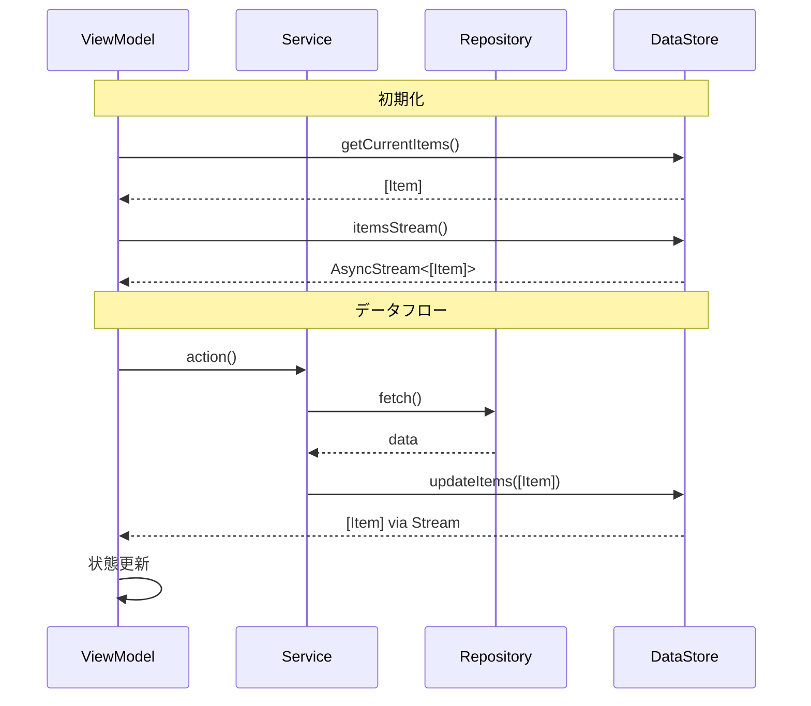

# コーディングルール

## 基本原則

### 言語
- **コメントは日本語で記述**

### 段階的コーディング・リファクタリング [MANDATORY]

#### 新規実装時
- **一度に1つのタスクのみ実装**
- **一度に多くのコードを書きすぎないこと**
- **依存関係の少ないものから開始すること**
- **ビルドができる状態をできる限りキープすること（破壊的な変更を一気に実施しない）**
- **タスク単位で、ビルドしてエラーを確認すること**

#### リファクタリング時 [MANDATORY]
一度にコード変更すると、差分がわからずレビューできない。必ず以下を守ること：

1. **変更リスト提示が必須**
   - 実装前に変更内容を列挙
   - レビューを経てから実装開始

2. **小さく分割**
   - 1PRで1つの変更のみ
   - 最大300行程度に留める
   - 単一責任の原則を適用

3. **段階的実装**
   - 依存関係の少ないものから開始
   - 基盤となる共通機能を優先
   - UI変更は最後に実施

4. **各段階で確認**
   - ビルド確認必須
   - テスト実行
   - 承認後に次段階へ進行

5. **影響範囲調査**
   - Swift-Selena MCP接続時: 型・関数・プロパティの使用箇所を機械的に全検索
   - 未接続時: Grep/Globで代替（変更漏れリスク高）

### 非同期初期化の禁止 [MANDATORY]
- **init内でのTask使用禁止**: テストが正しく動作しないため
- **正しい方法**: `init() async`、遅延初期化、または明示的な初期化メソッドを使用
- **間違った例**:
    ```swift
    init() {
        Task { await loadData() }  // ❌ 禁止
    }
    ```

## 命名規則

### 頭字語（Acronyms）の扱い
Swift API Design Guidelinesに基づき、英語圏で一般的に大文字で表記される頭字語（ID, URL, ASCII, UTF8, SMTP など）は、Swiftではすべて**UPPERCASE**で表記します。
このルールは、日本の開発者にとって間違いやすいため、特に注意してください。

- **正しい例:**
  - `userID`, `travelID`, `scheduleID`
  - `URLSession`, `URLRequest`
  - `UTF8.CodeUnit`
  - `SMTPServer`

### Bool値のプロパティ命名
- **表明形式で命名**: `is`, `has`, `shows`等の接頭辞を使用
- **例**: `isEmpty`, `isHidden`, `hasCompletedTutorial`

### ファクトリメソッドの命名
- **`make`で開始**: `makeIterator()`, `makeButton()`

### 値を変換するメソッドの命名
- **副作用なし（Non-mutating）**: 元の値を変更せず、新しい値を返すメソッドは、動詞の**過去分詞形（-ed, -en）**や**-ing形**で命名します。
  - `sorted()`: 元の配列は変更せず、ソートされた新しい配列を返す。
  - `adding(_:)`: 元のセットは変更せず、要素が追加された新しいセットを返す。

- **副作用あり（Mutating）**: 元の値を直接変更するメソッドは、命令形の**動詞**で命名します。
  - `sort()`: 配列をその場でソートする。
  - `add(_:)`: セットに要素を直接追加する。

**実践的な例:**
```swift
// 副作用なし（Non-mutating）
let sortedSchedules = schedules.sorted()  // 新しい配列を返す
let uppercasedString = name.uppercased()  // 新しい文字列を返す

// 副作用あり（Mutating）
schedules.sort()  // 配列自体を変更
name.append("様")  // 文字列自体を変更
```

### 引数ラベルの省略ルール
最初の引数がメソッド名の**文法的な句**を形成する場合、引数ラベルを省略します。

- **正しい例:**
  - `view.addSubview(button)`  // "add subview button" と読める
  - `words.remove(at: index)`  // "remove at index" と読める
  - `view.fadeTransition(with: 0.3)`  // "fade transition with 0.3" と読める

- **間違いやすい例:**
  - `view.addSubview(subview: button)`  // 冗長
  - `words.remove(position: index)`  // 引数ラベルが不要

### プロトコル命名規約
- **能力**: `-able`, `-ible` → `Comparable`, `Codable`
- **動作**: `-ing` → `Loading`, `Tracking`
- **型変換**: `-Convertible` → `CustomStringConvertible`
- **その他**: 名詞 → `Collection`, `Sequence`

### 前置詞の使い方
引数が**メソッドの主要な焦点**でない場合、前置詞を使って役割を明確にします。

- **正しい例:**
  - `move(toX: 100, y: 50)`  // to, from, with などで役割を明確化
  - `copy(with: zone)`
  - `removeBoxes(havingLength: 12)`

- **間違いやすい例:**
  - `move(x: 100, y: 50)`  // 意味が不明確
  - `copy(zone: zone)`  // withがないと不自然

### タプルの使用制限
- **最大3個まで**: それ以上は専用の型を定義
- **再利用時は`typealias`使用**: `typealias Coordinate = (x: Double, y: Double)`

## Swift言語仕様 [MANDATORY]

### switch文のreturn
- **単一行**: 暗黙的return可
- **複数行**: 明示的`return`必須

## 開発言語・フレームワーク

Package.swiftに定義された
- macOS: 13.0+
- Swift: 5.9
で利用可能な技術を使ってください。

ただし、明確な利点がなければ、敢えてリスキーな選択をしないこと

## 全体注意事項

- **Toolsに存在するclassやstruct、enumなどは、独自実装しないでToolsのものを使うこと**
  - 実装する時は、Toolsを確認してください
  - Toolsの実装を変える時は、必ず確認すること
- 各レイヤーは、Embedded Frameworkで実装されているので、レイヤー間参照には、importが必要です
- **依存性注入（DI）はシンプルなFactoryパターンを使用**
- **実装していない部分は、必ず `TODO: ⚠️ XXXが実装できていません` の形式でTODOコメントを記述すること** [MANDATORY]

## レイヤー間ルール

### 基本原則

**ViewModel**

- ViewModelとインタラクションするのは、Service、DataStoreのみ
- ViewModel - Service 間は、async/awaitまたはAsyncStreamで接続すること

**Factory**

- Domain層にFactoryクラスとDependencyプロトコル、DI層にResolver実装
  - Protocol-based DIにより、DomainでService Mock / DataStore Mockを提供可能
  - 引数なしコンストラクタでMock、Resolver指定で本番実装を切り替え

**App層**

- `import DI` 禁止
- `@Observable`でSwiftUI統合

## データフロー [MANDATORY]

### 基本データフロー（１）



### 基本データフロー（２）
- **直接返却パターン**: リアクティブ更新不要の場合
- **フロー**: ViewModel → Service → Repository → returnで直接返却
- **使用例**: 検索結果、計算結果等の一時的データ

## DIルール

- Protocol-based DIにより、DependencyプロトコルとResolverパターンで依存性を注入
- 引数なしコンストラクタでMock、Resolver指定で本番実装を切り替え

## Mock実装の基本方針

- **ServiceのMockは作成しない**
- Serviceは実物を使用し、MockのDataStore/Repositoryを注入してテスト
- すべてのMockのinitで`MockAssertion.assertIfProductionOrStaging()`を呼ぶ

## ログ使用ルール [IMPORTANT]

### swift-logの使用
- **統一logger使用**: swift-logの`Logger`を使用
- **FileLogHandler**: `Sources/Logging/FileLogHandler.swift`でファイル出力対応
- **ログレベル**: debug, info, notice, warning, error, critical を適切に使い分け
