# DES-102: LSPçµ±åˆè¨­è¨ˆæ›¸

**設計ID**: DES-102
**作æˆæ—¥**: 2025-10-24
**対象**: v0.5.1〜v0.5.5（LSPçµ±åˆãƒ•ã‚§ãƒ¼ã‚ºï¼‰
**ステータス**: 承èªå¾…ã¡
**関連文書**: REQ-002, DES-101

## メタデータ

| 項目 | 値 |
|-----|-----|
| 設計ID | DES-102 |
| 対象ãƒãƒ¼ã‚¸ãƒ§ãƒ³ | v0.5.1〜v0.5.5 |
| 関連è¦ä»¶ | REQ-002（LSPçµ±åˆè¦ä»¶ï¼‰ |
| 主è¦ã‚³ãƒ³ãƒãƒ¼ãƒãƒ³ãƒˆ | LSPState, LSPClient, FileLogHandler, DebugRunner |
| LSP API | initialize, initialized, didOpen, findReferences, documentSymbol, typeHierarchy |

---

## 1. LSPçµ±åˆã®è¨­è¨ˆæ–¹é‡

### 1.1 ãƒã‚¤ãƒ–リッドアーキテクãƒãƒ£

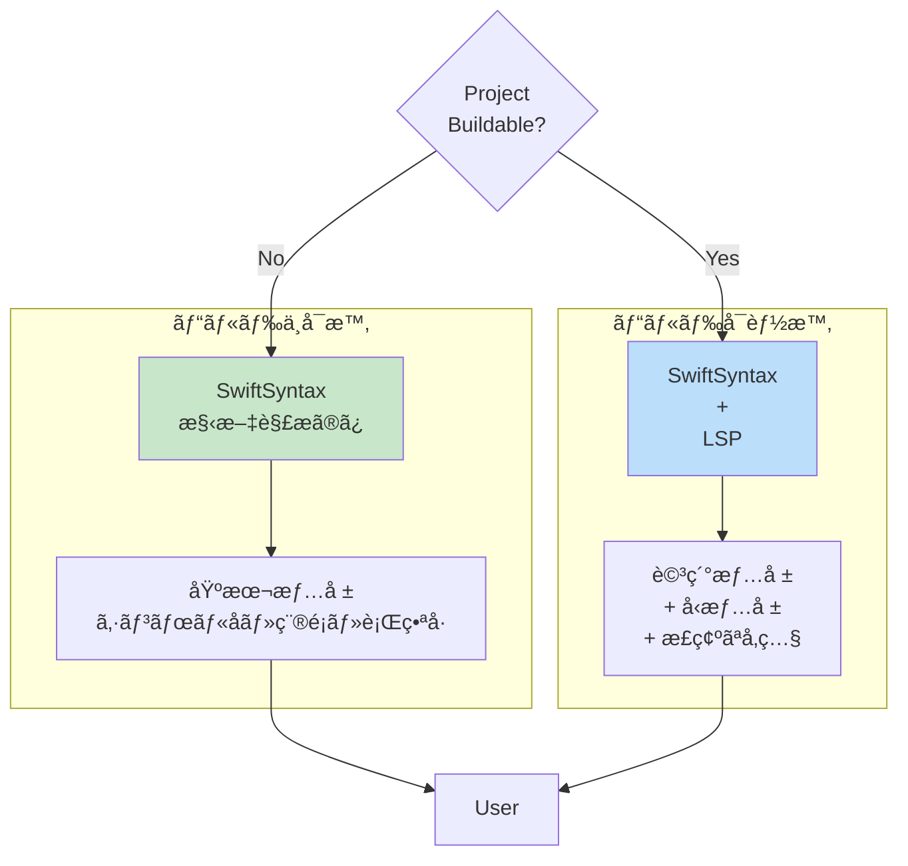
```mermaid
graph TB
    subgraph NoBuild["ビルドä¸å¯æ™‚"]
        SS[SwiftSyntax<br/>構文解æã®ã¿]
        Result1[基本情報<br/>シンボルå・種é¡ãƒ»è¡Œç•ªå·]
    end

    subgraph Buildable["ビルドå¯èƒ½æ™‚"]
        Hybrid[SwiftSyntax<br/>+<br/>LSP]
        Result2[詳細情報<br/>+ å‹æƒ…å ±<br/>+ 正確ãªå‚ç…§]
    end

    Project{Project<br/>Buildable?}

    Project -->|No| SS
    Project -->|Yes| Hybrid

    SS --> Result1
    Hybrid --> Result2

    Result1 --> User[User]
    Result2 --> User

    style SS fill:#c8e6c9
    style Hybrid fill:#bbdefb
```

**設計判断:**
- SwiftSyntax = ベースライン（削除ã—ãªã„）
- LSP = オプション強化
- ビルドéä¾å­˜æ€§ã®åŸå‰‡ã‚’維æŒ

---

### 1.2 グレースフルデグレード

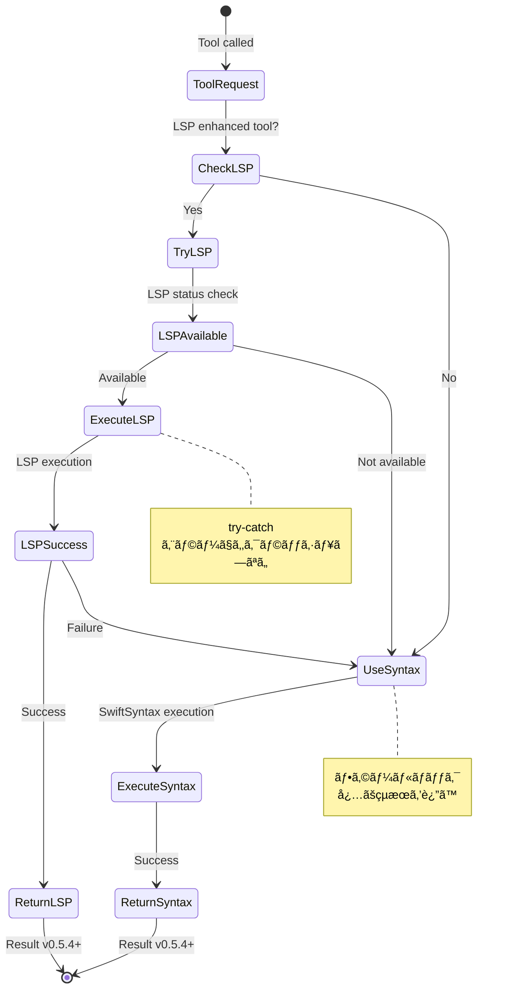
```mermaid
stateDiagram-v2
    [*] --> ToolRequest: Tool called

    ToolRequest --> CheckLSP: LSP enhanced tool?

    CheckLSP --> TryLSP: Yes
    CheckLSP --> UseSyntax: No

    TryLSP --> LSPAvailable: LSP status check

    LSPAvailable --> ExecuteLSP: Available
    LSPAvailable --> UseSyntax: Not available

    ExecuteLSP --> LSPSuccess: LSP execution
    LSPSuccess --> ReturnLSP: Success
    LSPSuccess --> UseSyntax: Failure

    UseSyntax --> ExecuteSyntax: SwiftSyntax execution
    ExecuteSyntax --> ReturnSyntax: Success

    ReturnLSP --> [*]: Result v0.5.4+
    ReturnSyntax --> [*]: Result v0.5.4+

    note right of UseSyntax
        フォールãƒãƒƒã‚¯
        å¿…ãšçµæœã‚’è¿”ã™
    end note

    note right of ExecuteLSP
        try-catch
        エラーã§ã‚‚クラッシュã—ãªã„
    end note
```

**ä¿è¨¼:**
- ã©ã®ã‚±ãƒ¼ã‚¹ã§ã‚‚çµæœã‚’è¿”ã™
- エラーã§çµ‚ã‚らãªã„
- 代替案をæ示

---

## 2. v0.5.xç³» 実装ロードãƒãƒƒãƒ—

### 2.1 ãƒãƒ¼ã‚¸ãƒ§ãƒ³åˆ¥å®Ÿè£…内容

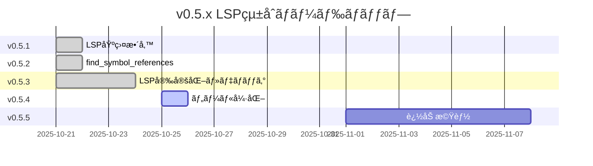
```mermaid
gantt
    title v0.5.x LSPçµ±åˆãƒ­ãƒ¼ãƒ‰ãƒãƒƒãƒ—
    dateFormat YYYY-MM-DD
    section v0.5.1
    LSP基盤整備           :done, v51, 2025-10-21, 1d
    section v0.5.2
    find_symbol_references :done, v52, 2025-10-21, 1d
    section v0.5.3
    LSP安定化・デãƒãƒƒã‚°    :done, v53, 2025-10-21, 3d
    section v0.5.4
    ツール強化             :active, v54, 2025-10-25, 1d
    section v0.5.5
    追加機能              :v55, 2025-11-01, 7d
```

---

### 2.2 実装済㿠vs 計画中

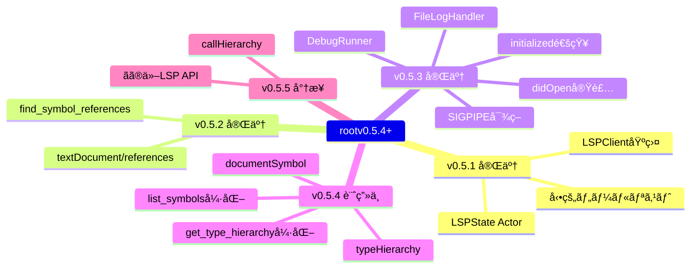
```mermaid
mindmap
  rootv0.5.4+
    v0.5.1 完了
      LSPState Actor
      LSPClient基盤
      動的ツールリスト
    v0.5.2 完了
      find_symbol_references
      textDocument/references
    v0.5.3 完了
      initialized通知
      didOpen実装
      SIGPIPE対策
      FileLogHandler
      DebugRunner
    v0.5.4 計画中
      documentSymbol
      typeHierarchy
      list_symbols強化
      get_type_hierarchy強化
    v0.5.5 å°†æ¥
      callHierarchy
      ãã®ä»–LSP API
```

---

## 3. LSPプロトコル実装

### 3.1 完全ãªãƒ—ロトコルフロー

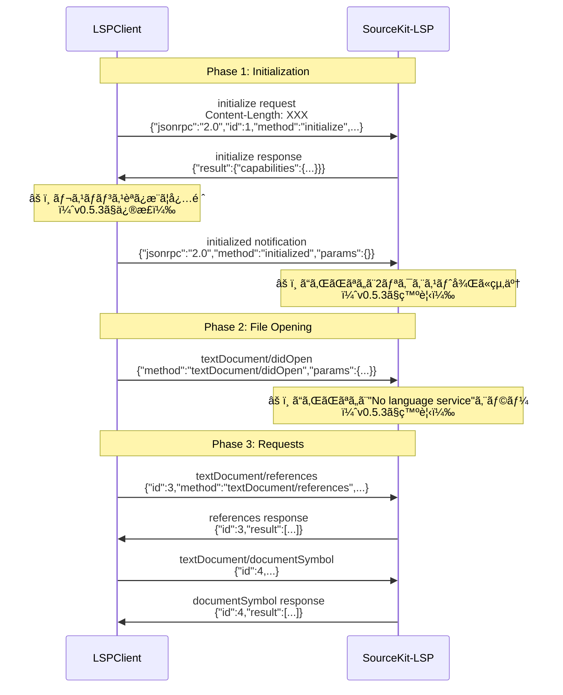
```mermaid
sequenceDiagram
    participant Client as LSPClient
    participant LSP as SourceKit-LSP

    Note over Client,LSP: Phase 1: Initialization

    Client->>LSP: initialize request<br/>Content-Length: XXX<br/>{"jsonrpc":"2.0","id":1,"method":"initialize",...}

    LSP->>Client: initialize response<br/>{"result":{"capabilities":{...}}}

    Note over Client: âš ï¸ ãƒ¬ã‚¹ãƒãƒ³ã‚¹èª­ã¿æ¨ã¦å¿…é ˆ<br/>（v0.5.3ã§ä¿®æ­£ï¼‰

    Client->>LSP: initialized notification<br/>{"jsonrpc":"2.0","method":"initialized","params":{}}

    Note over LSP: âš ï¸ ã“ã‚ŒãŒãªã„ã¨2リクエスト後ã«çµ‚了<br/>（v0.5.3ã§ç™ºè¦‹ï¼‰

    Note over Client,LSP: Phase 2: File Opening

    Client->>LSP: textDocument/didOpen<br/>{"method":"textDocument/didOpen","params":{...}}

    Note over LSP: âš ï¸ ã“ã‚ŒãŒãªã„ã¨"No language service"エラー<br/>（v0.5.3ã§ç™ºè¦‹ï¼‰

    Note over Client,LSP: Phase 3: Requests

    Client->>LSP: textDocument/references<br/>{"id":3,"method":"textDocument/references",...}

    LSP->>Client: references response<br/>{"id":3,"result":[...]}

    Client->>LSP: textDocument/documentSymbol<br/>{"id":4,...}

    LSP->>Client: documentSymbol response<br/>{"id":4,"result":[...]}
```

---

### 3.2 é‡è¦ãªç™ºè¦‹ï¼ˆv0.5.3）

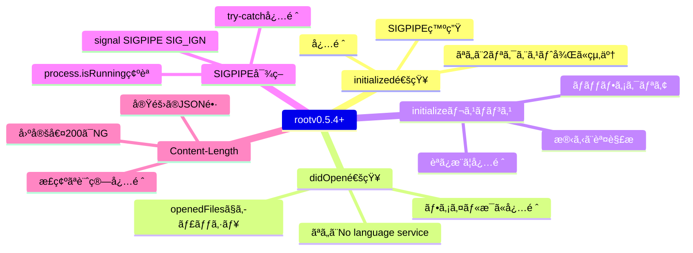
```mermaid
mindmap
  rootv0.5.4+
    initialized通知
      å¿…é ˆ
      ãªã„ã¨2リクエスト後ã«çµ‚了
      SIGPIPE発生
    didOpen通知
      ファイルæ¯ã«å¿…é ˆ
      ãªã„ã¨No language service
      openedFilesã§ã‚­ãƒ£ãƒƒã‚·ãƒ¥
    initializeレスãƒãƒ³ã‚¹
      読ã¿æ¨ã¦å¿…é ˆ
      残るã¨èª¤è§£æ
      ãƒãƒƒãƒ•ã‚¡ã‚¯ãƒªã‚¢
    SIGPIPE対策
      signal SIGPIPE SIG_IGN
      process.isRunning確èª
      try-catchå¿…é ˆ
    Content-Length
      正確ãªè¨ˆç®—å¿…é ˆ
      固定値200ã¯NG
      実際ã®JSONé•·
```

---

## 4. LSPClient設計

### 4.1 クラス構造

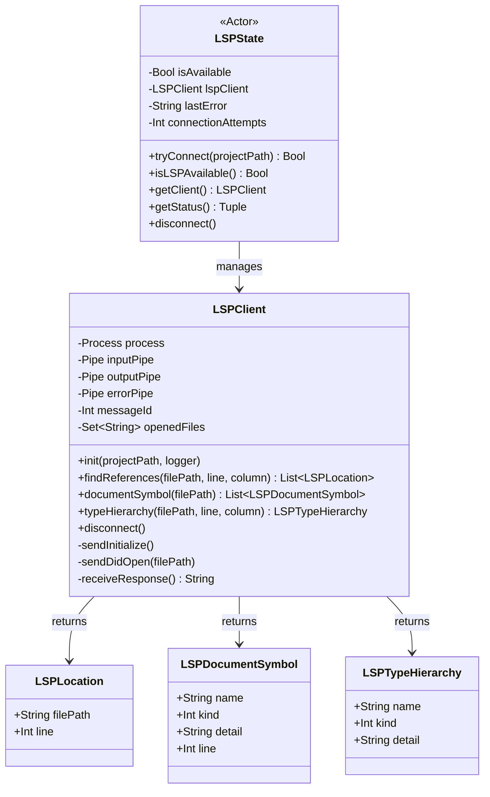
```mermaid
classDiagram
    class LSPClient {
        -Process process
        -Pipe inputPipe
        -Pipe outputPipe
        -Pipe errorPipe
        -Int messageId
        -Set~String~ openedFiles
        +init(projectPath, logger)
        +findReferences(filePath, line, column) List~LSPLocation~
        +documentSymbol(filePath) List~LSPDocumentSymbol~
        +typeHierarchy(filePath, line, column) LSPTypeHierarchy
        +disconnect()
        -sendInitialize()
        -sendDidOpen(filePath)
        -receiveResponse() String
    }

    class LSPState {
        <<Actor>>
        -Bool isAvailable
        -LSPClient lspClient
        -String lastError
        -Int connectionAttempts
        +tryConnect(projectPath) Bool
        +isLSPAvailable() Bool
        +getClient() LSPClient
        +getStatus() Tuple
        +disconnect()
    }

    class LSPLocation {
        +String filePath
        +Int line
    }

    class LSPDocumentSymbol {
        +String name
        +Int kind
        +String detail
        +Int line
    }

    class LSPTypeHierarchy {
        +String name
        +Int kind
        +String detail
    }

    LSPState --> LSPClient : manages
    LSPClient --> LSPLocation : returns
    LSPClient --> LSPDocumentSymbol : returns
    LSPClient --> LSPTypeHierarchy : returns
```

---

### 4.2 LSP APIメソッド一覧

| メソッド | LSP Method | 入力 | 出力 | ãƒãƒ¼ã‚¸ãƒ§ãƒ³ |
|---------|-----------|------|------|-----------|
| findReferences | textDocument/references | filePath, line, column | [LSPLocation] | v0.5.2 |
| documentSymbol | textDocument/documentSymbol | filePath | [LSPDocumentSymbol] | v0.5.4（計画） |
| typeHierarchy | textDocument/prepareTypeHierarchy | filePath, line, column | LSPTypeHierarchy? | v0.5.4（計画） |
| callHierarchy | textDocument/prepareCallHierarchy | filePath, line, column | CallHierarchyItem? | v0.5.5（将æ¥ï¼‰ |

---

## 5. LSPプロトコル詳細

### 5.1 initialize/initialized

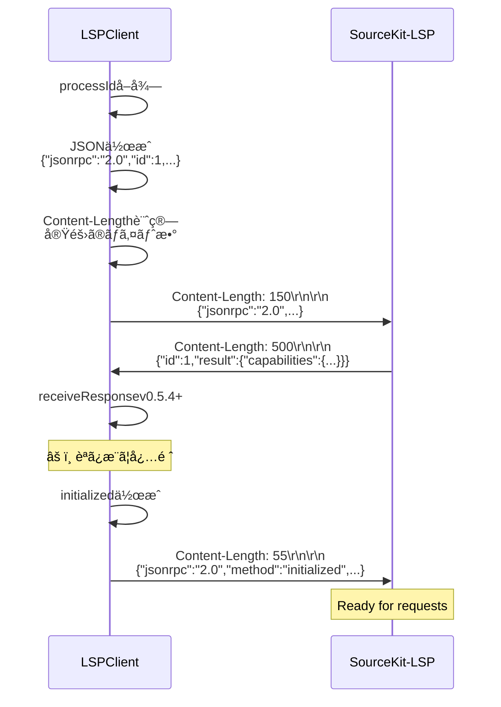
```mermaid
sequenceDiagram
    participant C as LSPClient
    participant L as SourceKit-LSP

    C->>C: processIdå–å¾—
    C->>C: JSON作æˆ<br/>{"jsonrpc":"2.0","id":1,...}
    C->>C: Content-Length計算<br/>実際ã®ãƒã‚¤ãƒˆæ•°
    C->>L: Content-Length: 150\r\n\r\n<br/>{"jsonrpc":"2.0",...}

    L->>C: Content-Length: 500\r\n\r\n<br/>{"id":1,"result":{"capabilities":{...}}}

    C->>C: receiveResponsev0.5.4+
    Note over C: âš ï¸ èª­ã¿æ¨ã¦å¿…é ˆ

    C->>C: initialized作æˆ
    C->>L: Content-Length: 55\r\n\r\n<br/>{"jsonrpc":"2.0","method":"initialized",...}

    Note over L: Ready for requests
```

---

### 5.2 textDocument/didOpen

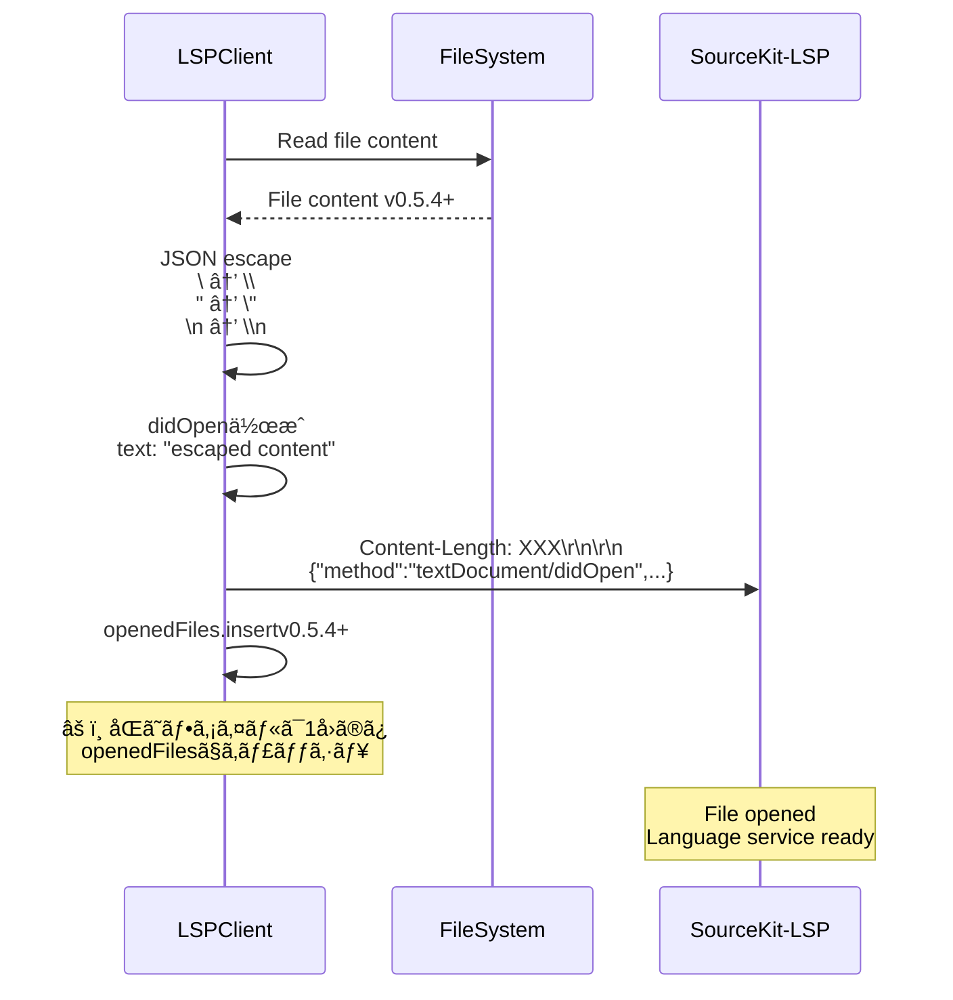
```mermaid
sequenceDiagram
    participant C as LSPClient
    participant FS as FileSystem
    participant L as SourceKit-LSP

    C->>FS: Read file content
    FS-->>C: File content v0.5.4+

    C->>C: JSON escape<br/>\ → \\<br/>" → \"<br/>\n → \\n

    C->>C: didOpen作æˆ<br/>text: "escaped content"

    C->>L: Content-Length: XXX\r\n\r\n<br/>{"method":"textDocument/didOpen",...}

    C->>C: openedFiles.insertv0.5.4+

    Note over C: âš ï¸ åŒã˜ãƒ•ã‚¡ã‚¤ãƒ«ã¯1å›ã®ã¿<br/>openedFilesã§ã‚­ãƒ£ãƒƒã‚·ãƒ¥

    Note over L: File opened<br/>Language service ready
```

---

### 5.3 textDocument/references

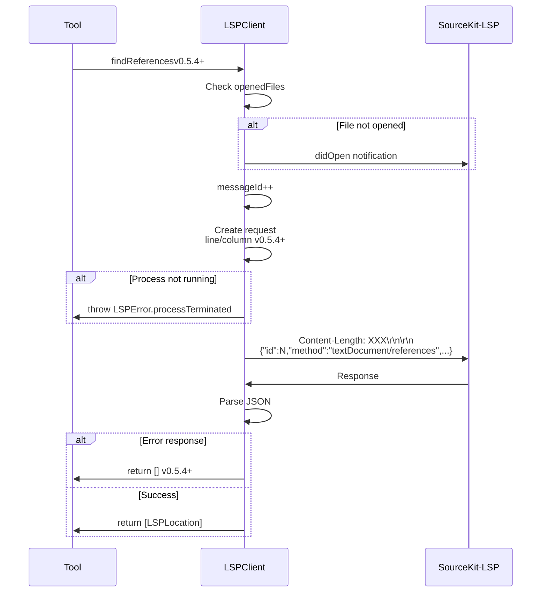
```mermaid
sequenceDiagram
    participant T as Tool
    participant C as LSPClient
    participant L as SourceKit-LSP

    T->>C: findReferencesv0.5.4+

    C->>C: Check openedFiles
    alt File not opened
        C->>L: didOpen notification
    end

    C->>C: messageId++
    C->>C: Create request<br/>line/column v0.5.4+

    alt Process not running
        C->>T: throw LSPError.processTerminated
    end

    C->>L: Content-Length: XXX\r\n\r\n<br/>{"id":N,"method":"textDocument/references",...}

    L->>C: Response

    C->>C: Parse JSON

    alt Error response
        C->>T: return [] v0.5.4+
    else Success
        C->>T: return [LSPLocation]
    end
```

---

## 6. エラーãƒãƒ³ãƒ‰ãƒªãƒ³ã‚°è¨­è¨ˆ

### 6.1 エラー発生ãƒã‚¤ãƒ³ãƒˆã¨å¯¾ç­–

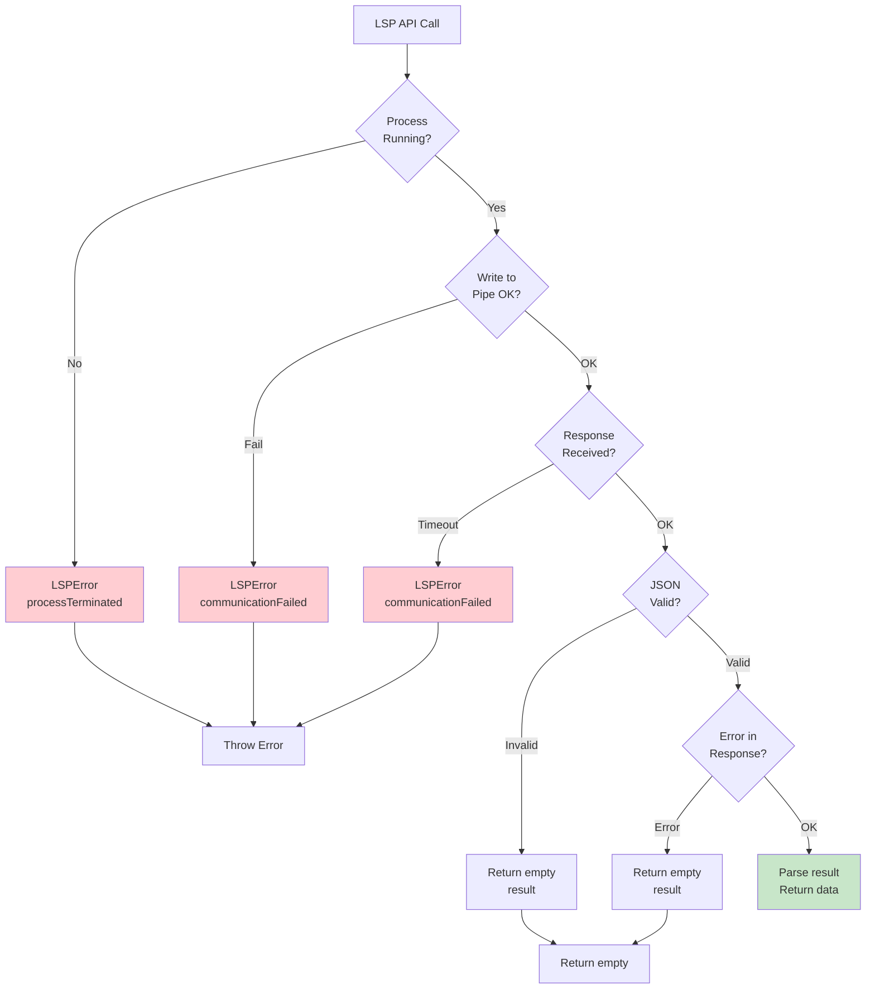
```mermaid
graph TD
    Start[LSP API Call]

    Check1{Process<br/>Running?}
    Check2{Write to<br/>Pipe OK?}
    Check3{Response<br/>Received?}
    Check4{JSON<br/>Valid?}
    Check5{Error in<br/>Response?}

    Err1[LSPError<br/>processTerminated]
    Err2[LSPError<br/>communicationFailed]
    Err3[LSPError<br/>communicationFailed]
    Err4[Return empty<br/>result]
    Err5[Return empty<br/>result]

    Success[Parse result<br/>Return data]

    Start --> Check1
    Check1 -->|No| Err1
    Check1 -->|Yes| Check2

    Check2 -->|Fail| Err2
    Check2 -->|OK| Check3

    Check3 -->|Timeout| Err3
    Check3 -->|OK| Check4

    Check4 -->|Invalid| Err4
    Check4 -->|Valid| Check5

    Check5 -->|Error| Err5
    Check5 -->|OK| Success

    Err1 --> Throw[Throw Error]
    Err2 --> Throw
    Err3 --> Throw
    Err4 --> Empty[Return empty]
    Err5 --> Empty

    style Err1 fill:#ffcdd2
    style Err2 fill:#ffcdd2
    style Err3 fill:#ffcdd2
    style Success fill:#c8e6c9
```

---

### 6.2 SIGPIPE対策（v0.5.3）

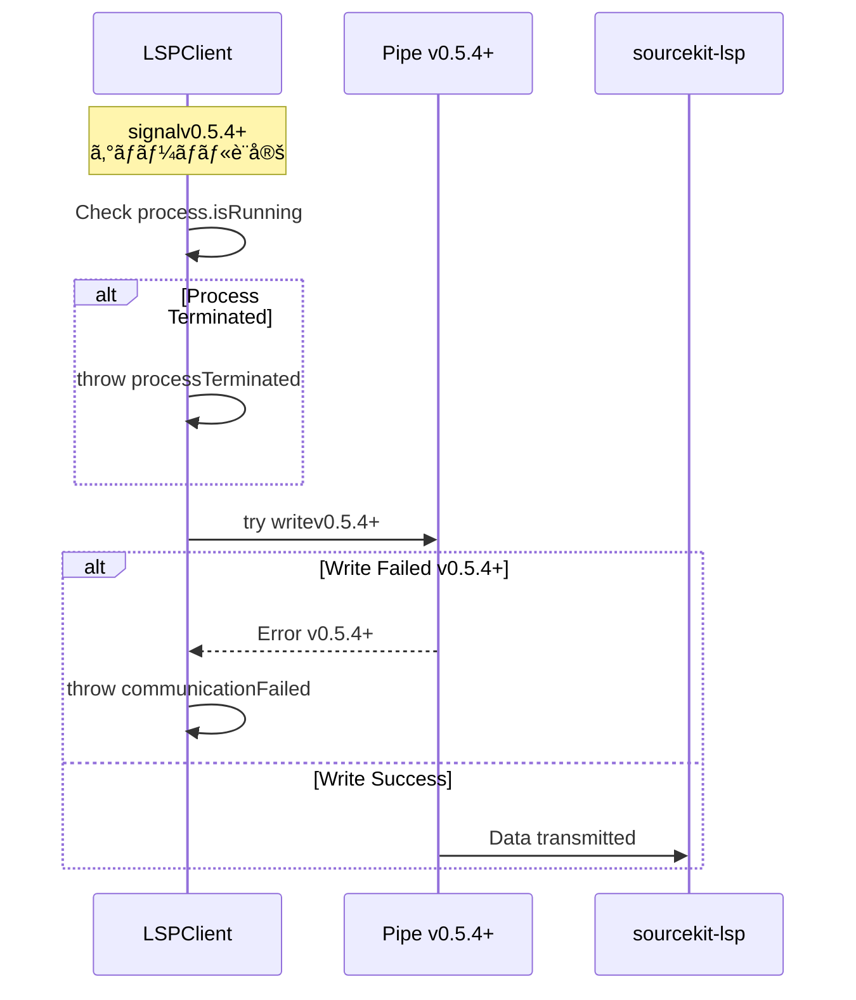
```mermaid
sequenceDiagram
    participant LSPClient
    participant Pipe as Pipe v0.5.4+
    participant LSP as sourcekit-lsp

    Note over LSPClient: signalv0.5.4+<br/>グローãƒãƒ«è¨­å®š

    LSPClient->>LSPClient: Check process.isRunning

    alt Process Terminated
        LSPClient->>LSPClient: throw processTerminated
    end

    LSPClient->>Pipe: try writev0.5.4+

    alt Write Failed v0.5.4+
        Pipe-->>LSPClient: Error v0.5.4+
        LSPClient->>LSPClient: throw communicationFailed
    else Write Success
        Pipe->>LSP: Data transmitted
    end
```

---

## 7. デãƒãƒƒã‚°ç’°å¢ƒè¨­è¨ˆï¼ˆv0.5.3）

### 7.1 FileLogHandler

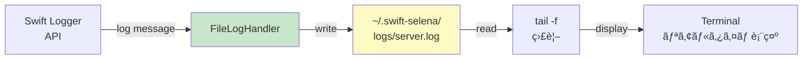
```mermaid
graph LR
    Logger[Swift Logger<br/>API]
    Handler[FileLogHandler]
    File[~/.swift-selena/<br/>logs/server.log]
    Tail[tail -f<br/>監視]

    Logger -->|log message| Handler
    Handler -->|write| File
    File -->|read| Tail
    Tail -->|display| Terminal[Terminal<br/>リアルタイム表示]

    style Handler fill:#c8e6c9
    style File fill:#fff9c4
```

**ログ形å¼:**
```
[2025-10-24T09:30:49Z] â„¹ï¸ [info] Starting Swift MCP Server...
[2025-10-24T09:30:51Z] â„¹ï¸ [info] Attempting LSP connection...
[2025-10-24T09:30:51Z] ✅ [info] LSP connected successfully
```

---

### 7.2 DebugRunner設計

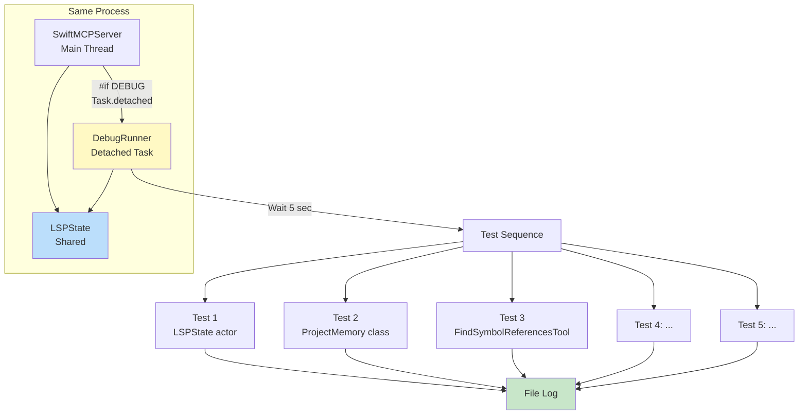
```mermaid
graph TB
    subgraph SameProcess["Same Process"]
        Main[SwiftMCPServer<br/>Main Thread]
        DBG[DebugRunner<br/>Detached Task]
        LSPState[LSPState<br/>Shared]
    end

    Main -->|#if DEBUG<br/>Task.detached| DBG
    Main --> LSPState
    DBG --> LSPState

    DBG -->|Wait 5 sec| TestSeq[Test Sequence]

    TestSeq --> T1[Test 1<br/>LSPState actor]
    TestSeq --> T2[Test 2<br/>ProjectMemory class]
    TestSeq --> T3[Test 3<br/>FindSymbolReferencesTool]
    TestSeq --> T4[Test 4: ...]
    TestSeq --> T5[Test 5: ...]

    T1 --> Log[File Log]
    T2 --> Log
    T3 --> Log
    T4 --> Log
    T5 --> Log

    style DBG fill:#fff9c4
    style LSPState fill:#bbdefb
    style Log fill:#c8e6c9
```

**利点:**
- 本番ã¨åŒã˜LSPState共有
- Xcodeデãƒãƒƒã‚¬ã§ãƒ–レークãƒã‚¤ãƒ³ãƒˆè¨­å®šå¯èƒ½
- 自動テストシーケンス

---

## 8. 動的ツールリスト設計

### 8.1 å•é¡Œã¨è§£æ±ºç­–

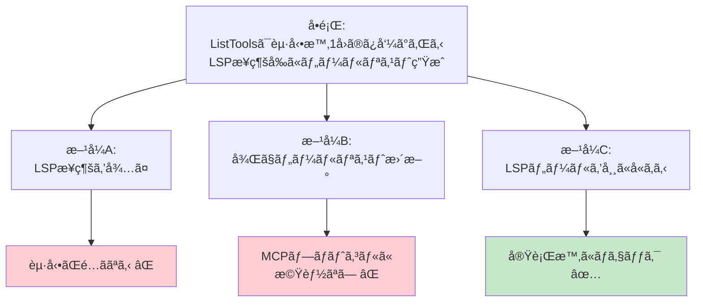
```mermaid
graph TD
    Problem[å•é¡Œ:<br/>ListToolsã¯èµ·å‹•æ™‚1å›ã®ã¿å‘¼ã°ã‚Œã‚‹<br/>LSPæ¥ç¶šå‰ã«ãƒ„ールリスト生æˆ]

    Solution1[æ–¹å¼A:<br/>LSPæ¥ç¶šã‚’å¾…ã¤]
    Solution2[æ–¹å¼B:<br/>後ã§ãƒ„ールリスト更新]
    Solution3[æ–¹å¼C:<br/>LSPツールを常ã«å«ã‚ã‚‹]

    Issue1[èµ·å‹•ãŒé…ããªã‚‹ âŒ]
    Issue2[MCPプロトコルã«<br/>機能ãªã— âŒ]
    Success[実行時ã«ãƒã‚§ãƒƒã‚¯ ✅]

    Problem --> Solution1
    Problem --> Solution2
    Problem --> Solution3

    Solution1 --> Issue1
    Solution2 --> Issue2
    Solution3 --> Success

    style Success fill:#c8e6c9
    style Issue1 fill:#ffcdd2
    style Issue2 fill:#ffcdd2
```

**æ¡ç”¨æ–¹å¼ï¼ˆv0.5.3）:**
- find_symbol_referencesを常ã«ãƒ„ールリストã«å«ã‚ã‚‹
- 実行時ã«LSP利用å¯èƒ½æ€§ã‚’ãƒã‚§ãƒƒã‚¯
- 利用ä¸å¯ãªã‚‰ã‚¨ãƒ©ãƒ¼ãƒ¡ãƒƒã‚»ãƒ¼ã‚¸ã§ä»£æ›¿æ¡ˆæ示

---

## 9. v0.5.4実装ガイド

### 9.1 実装ã™ã‚‹ã‚‚ã®

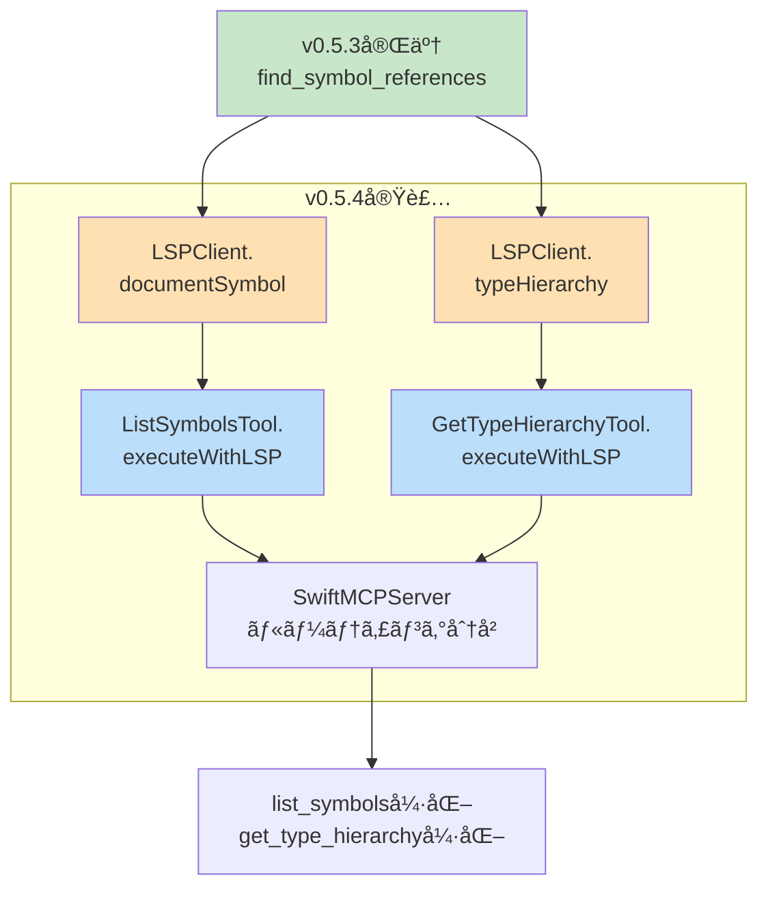
```mermaid
graph TB
    V53[v0.5.3完了<br/>find_symbol_references]

    subgraph V054Impl["v0.5.4実装"]
        LC1[LSPClient.<br/>documentSymbol]
        LC2[LSPClient.<br/>typeHierarchy]
        T1[ListSymbolsTool.<br/>executeWithLSP]
        T2[GetTypeHierarchyTool.<br/>executeWithLSP]
        R1[SwiftMCPServer<br/>ルーティング分å²]
    end

    Result[list_symbols強化<br/>get_type_hierarchy強化]

    V53 --> LC1
    V53 --> LC2

    LC1 --> T1
    LC2 --> T2

    T1 --> R1
    T2 --> R1

    R1 --> Result

    style V53 fill:#c8e6c9
    style LC1 fill:#ffe0b2
    style LC2 fill:#ffe0b2
    style T1 fill:#bbdefb
    style T2 fill:#bbdefb
```

---

### 9.2 実装パターン（findReferencesã¨åŒã˜ï¼‰

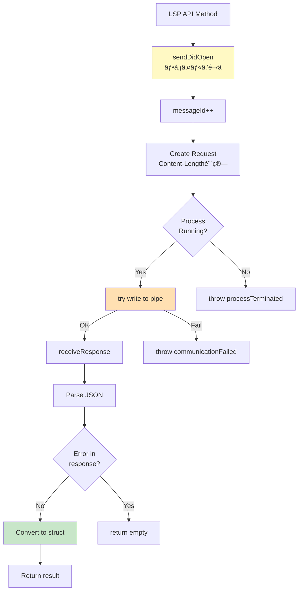
```mermaid
flowchart TD
    Start[LSP API Method]
    DidOpen[sendDidOpen<br/>ファイルを開ã]
    MsgId[messageId++]
    Req[Create Request<br/>Content-Length計算]
    Check{Process<br/>Running?}
    Write[try write to pipe]
    Recv[receiveResponse]
    Parse[Parse JSON]
    ErrCheck{Error in<br/>response?}
    Convert[Convert to struct]
    Return[Return result]

    Start --> DidOpen
    DidOpen --> MsgId
    MsgId --> Req
    Req --> Check
    Check -->|Yes| Write
    Check -->|No| Err1[throw processTerminated]
    Write -->|OK| Recv
    Write -->|Fail| Err2[throw communicationFailed]
    Recv --> Parse
    Parse --> ErrCheck
    ErrCheck -->|Yes| Empty[return empty]
    ErrCheck -->|No| Convert
    Convert --> Return

    style DidOpen fill:#fff9c4
    style Write fill:#ffe0b2
    style Convert fill:#c8e6c9
```

**å…¨LSP APIãŒã“ã®ãƒ‘ターンをè¸è¥²**

---

## 10. 学んã æ•™è¨“

### 10.1 v0.5.2/v0.5.3ã§å­¦ã‚“ã ã“ã¨

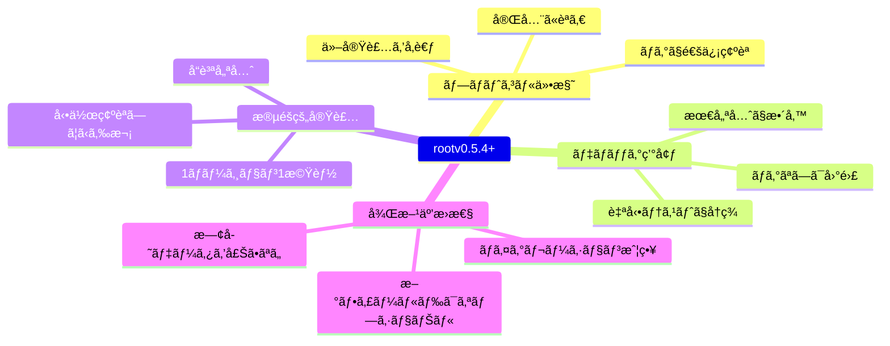
```mermaid
mindmap
  rootv0.5.4+
    プロトコル仕様
      完全ã«èª­ã‚€
      他実装をå‚考
      ログã§é€šä¿¡ç¢ºèª
    デãƒãƒƒã‚°ç’°å¢ƒ
      最優先ã§æ•´å‚™
      ログãªã—ã¯å›°é›£
      自動テストã§å†ç¾
    段éšçš„実装
      1ãƒãƒ¼ã‚¸ãƒ§ãƒ³1機能
      å“質優先
      動作確èªã—ã¦ã‹ã‚‰æ¬¡
    後方互æ›æ€§
      新フィールドã¯ã‚ªãƒ—ショナル
      ãƒã‚¤ã‚°ãƒ¬ãƒ¼ã‚·ãƒ§ãƒ³æˆ¦ç•¥
      既存データを壊ã•ãªã„
```

---

## 11. v0.5.4ã§ç™ºè¦‹ã—ãŸå•é¡Œï¼ˆv0.5.5ã§ä¿®æ­£ï¼‰

### 11.1 LSPéåŒæœŸé€šçŸ¥æ··å…¥å•é¡Œ

**発見日:** 2025-10-26（v0.5.4テスト時）

**å•é¡Œã®è©³ç´°:**

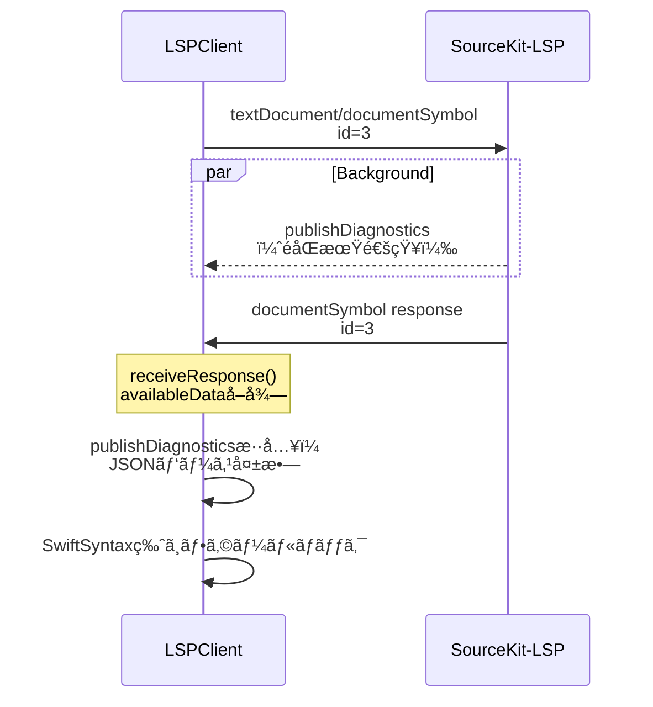
```mermaid
sequenceDiagram
    participant Client as LSPClient
    participant LSP as SourceKit-LSP

    Client->>LSP: textDocument/documentSymbol<br/>id=3

    par Background
        LSP-->>Client: publishDiagnostics<br/>（éåŒæœŸé€šçŸ¥ï¼‰
    end

    LSP->>Client: documentSymbol response<br/>id=3

    Note over Client: receiveResponse()<br/>availableDataå–å¾—

    Client->>Client: publishDiagnosticsæ··å…¥ï¼<br/>JSONパース失敗

    Client->>Client: SwiftSyntax版ã¸ãƒ•ã‚©ãƒ¼ãƒ«ãƒãƒƒã‚¯
```

**実際ã®ãƒ­ã‚°:**
```
LSP typeHierarchy response (length=196)
---START---
{"method":"textDocument/publishDiagnostics",...}  ↠éåŒæœŸé€šçŸ¥
---END---
âš ï¸ Failed to parse LSP typeHierarchy response as JSON
Using SwiftSyntax for list_symbols
```

**影響範囲:**
- find_symbol_references: ✅ 動作（éåŒæœŸé€šçŸ¥ãŒå°‘ãªã„）
- documentSymbol: ⌠ä¸å®‰å®šï¼ˆãƒ•ã‚©ãƒ¼ãƒ«ãƒãƒƒã‚¯ï¼‰
- typeHierarchy: ⌠ä¸å®‰å®šï¼ˆãƒ•ã‚©ãƒ¼ãƒ«ãƒãƒƒã‚¯ï¼‰

---

### 11.2 根本åŸå› 

**ç¾çŠ¶ã®å®Ÿè£…（receiveResponse）:**
```swift
let data = try? handle.availableData  // å…¨ãƒãƒƒãƒ•ã‚¡å–å¾—
```

**å•é¡Œç‚¹:**
1. 複数メッセージãŒæ··åœ¨ã™ã‚‹
2. éåŒæœŸé€šçŸ¥ãŒå…ˆã«èª­ã¾ã‚Œã‚‹
3. 実際ã®ãƒ¬ã‚¹ãƒãƒ³ã‚¹ã‚’読ã‚ãªã„

**æ­£ã—ã„実装（v0.5.5）:**
```swift
1. Content-Lengthヘッダー読ã¿å–ã‚Š
2. 指定ãƒã‚¤ãƒˆæ•°ã ã‘読ã¿å–ã‚Š
3. 1メッセージãšã¤å‡¦ç†
4. éåŒæœŸé€šçŸ¥ï¼ˆmethod）ã¨å¿œç­”（id）を分離
```

---

### 11.3 v0.5.5ã§ã®ä¿®æ­£è¨ˆç”»

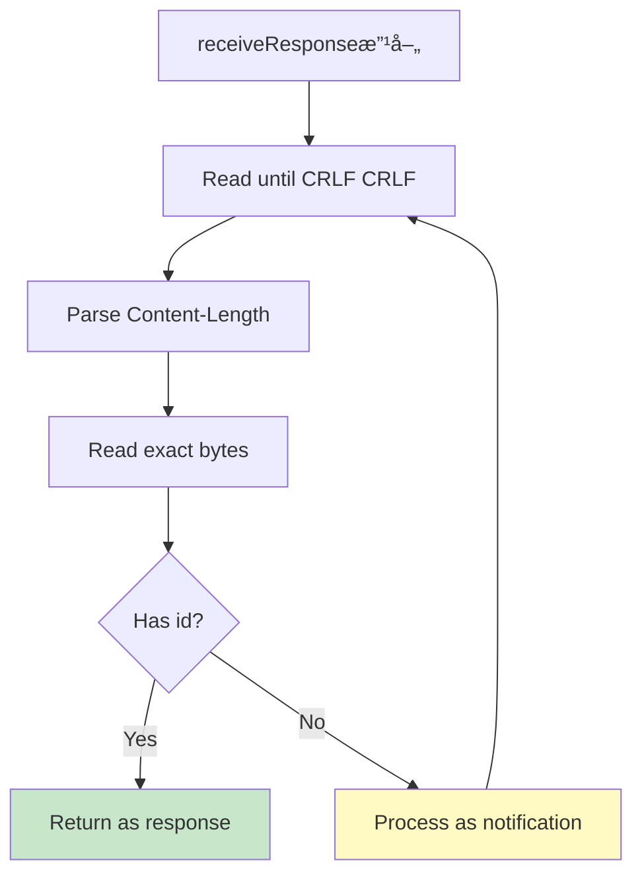
```mermaid
graph TD
    Start[receiveResponse改善]

    Read[Read until CRLF CRLF]
    Parse[Parse Content-Length]
    ReadBody[Read exact bytes]
    Check{Has id?}
    Response[Return as response]
    Notify[Process as notification]

    Start --> Read
    Read --> Parse
    Parse --> ReadBody
    ReadBody --> Check
    Check -->|Yes| Response
    Check -->|No| Notify

    Notify --> Read

    style Response fill:#c8e6c9
    style Notify fill:#fff9c4
```

**実装方é‡:**
1. ResponseBufferクラス作æˆ
2. Content-Length正確解æ
3. メッセージ種別判定（id有無）
4. éåŒæœŸé€šçŸ¥ã¯åˆ¥å‡¦ç†ã¾ãŸã¯ã‚¹ã‚­ãƒƒãƒ—

**工数:** 2-3時間

**優先度:** 🔴 最高（v0.5.5ã®æœ€å„ªå…ˆèª²é¡Œï¼‰

---

## 12. v0.5.4詳細設計

### 12.1 documentSymbol実装

```mermaid
sequenceDiagram
    participant Tool as ListSymbolsTool
    participant Client as LSPClient
    participant LSP as SourceKit-LSP

    Tool->>Client: documentSymbolv0.5.4+

    Client->>Client: sendDidOpenv0.5.4+
    Client->>LSP: textDocument/didOpen

    Client->>Client: messageId++
    Client->>LSP: textDocument/documentSymbol

    LSP->>Client: {"result":[<br/>  {"name":"Foo","kind":5,"detail":"class Foo"},<br/>  {"name":"bar","kind":6,"detail":"func barv0.5.4+"}...]}

    Client->>Client: Parse & Convert

    Client->>Tool: [LSPDocumentSymbol]

    Tool->>Tool: Format with type info

    Tool->>Tool: Return "Symbols v0.5.4+"
```

---

### 12.2 typeHierarchy実装

```mermaid
sequenceDiagram
    participant Tool as GetTypeHierarchyTool
    participant Syntax as SwiftSyntaxAnalyzer
    participant Client as LSPClient
    participant LSP as SourceKit-LSP

    Tool->>Syntax: getTypeHierarchyv0.5.4+
    Syntax-->>Tool: TypeInfo v0.5.4+

    Tool->>Client: typeHierarchyv0.5.4+

    Client->>Client: sendDidOpenv0.5.4+
    Client->>LSP: textDocument/didOpen

    Client->>LSP: textDocument/prepareTypeHierarchy

    LSP->>Client: {"result":[{"name":"Foo","detail":"class Foo: Bar"}]}

    Client-->>Tool: LSPTypeHierarchy

    Tool->>Tool: Combine SwiftSyntax + LSP info

    Tool->>Tool: Return "Type Hierarchy v0.5.4+:<br/>Type Detail: class Foo: Bar"
```

---

## 13. テスト戦略

### 13.1 DebugRunnerテストフロー

```mermaid
sequenceDiagram
    participant Xcode
    participant SMCP as SwiftMCPServer
    participant DR as DebugRunner
    participant Tool as FindSymbolReferencesTool
    participant LSP as LSPClient

    Xcode->>SMCP: Run v0.5.4+

    SMCP->>DR: Task.detached<br/>v0.5.4+

    Note over SMCP,DR: MCPサーãƒãƒ¼èµ·å‹•<br/>LSPæ¥ç¶š

    DR->>DR: Wait 5 seconds

    loop Test Sequence
        DR->>Tool: Call with test data
        Tool->>LSP: LSP API
        LSP-->>Tool: Result
        Tool-->>DR: Success/Failure
        DR->>DR: Log result
    end

    Note over DR: ✅ All tests passed<br/>or<br/>⌠Test N failed

    Note over Xcode: ブレークãƒã‚¤ãƒ³ãƒˆã§åœæ­¢å¯èƒ½<br/>変数監視<br/>スタックトレース
```

---

### 13.2 検証çµæœï¼ˆv0.5.3）

| テスト | çµæœ |
|--------|------|
| LSPState actor | ✅ 3件検出 |
| ProjectMemory class | ✅ 34件検出 |
| FindSymbolReferencesTool | ✅ 3件検出 |
| 5å›é€£ç¶šå®Ÿè¡Œ | ✅ クラッシュãªã— |

---

### 13.3 検証çµæœï¼ˆv0.5.4）

**Swift-Selena自身（Swift Package）:**

| API | æ¥ç¶š | レスãƒãƒ³ã‚¹å–å¾— | パース | 動作 |
|-----|------|---------------|--------|------|
| find_symbol_references | ✅ | ✅ | ✅ | ✅ 完全動作 |
| documentSymbol | ✅ | ✅ (16KB) | ⌠éåŒæœŸé€šçŸ¥æ··å…¥ | â–³ フォールãƒãƒƒã‚¯ |
| typeHierarchy | ✅ | ✅ (196byte) | ⌠éåŒæœŸé€šçŸ¥æ··å…¥ | â–³ フォールãƒãƒƒã‚¯ |

**ContactBプロジェクト（Xcodeプロジェクト）:**

| ツール | LSPæ¥ç¶š | LSP動作 | SwiftSyntax版 | çµæœ |
|--------|---------|---------|---------------|------|
| list_symbols | ✅ | ⌠| ✅ | ✅ 263ファイル完全一致 |
| analyze_imports | - | - | ✅ | ✅ 263ファイル完全一致 |
| find_files | - | - | ✅ | ✅ 263ファイル完全一致 |

**çµè«–:**
- グレースフルデグレード完璧 ✅
- SwiftSyntax版ã§å…¨æ©Ÿèƒ½å‹•ä½œ ✅
- LSP版㯠v0.5.5 ã§å®‰å®šåŒ–予定

---

## 14. v0.5.4実装ã®æœ€çµ‚評価

### 14.1 é”æˆäº‹é …

**完全実装:**
- ✅ LSPClient API追加（documentSymbol, typeHierarchy）
- ✅ éšå±¤æ§‹é€ å¯¾å¿œï¼ˆchildrenå†å¸°ã€90å€æ”¹å–„）
- ✅ 除外ディレクトリ（é‡å¤§ãƒã‚°ä¿®æ­£ï¼‰
- ✅ Import空ファイル対応
- ✅ ログJST表示

**部分実装:**
- â–³ LSP版動作（éåŒæœŸé€šçŸ¥å•é¡Œã€v0.5.5ã§å®Œæˆï¼‰

### 14.2 v0.5.5ã¸ã®å¼•ç¶™ã

**必須課題:**
1. ResponseBuffer実装（最優先）
2. documentSymbol/typeHierarchy安定化
3. éåŒæœŸé€šçŸ¥å‡¦ç†

**期待効æœ:**
- LSP版ãŒå®Œå…¨å‹•ä½œ
- å‹æƒ…報表示（detailフィールドãŒã‚ã‚Œã°ï¼‰

---

## 15. å‚ç…§

**è¦ä»¶å®šç¾©:**
- REQ-002: LSPçµ±åˆè¦ä»¶

**設計書:**
- DES-101: システムアーキテクãƒãƒ£
- DES-103: ツール実装設計

**履歴:**
- CONVERSATION_HISTORY.md: v0.5.2/v0.5.3開発経緯

---

**Document Version**: 2.1
**Created**: 2025-10-24
**Last Updated**: 2025-10-26
**Status**: 承èªå¾…ã¡
**Changes**:
- v0.5.4実装完了ã€æ¤œè¨¼çµæœè¿½åŠ 
- LSPéåŒæœŸé€šçŸ¥å•é¡Œã‚’記載
- v0.5.5ã¸ã®å¼•ç¶™ã事項æ˜ç¢ºåŒ–
**Supersedes**: DES-007, DES-008 DebugRunner, DES-009, Hybrid-Architecture-Plan.md（LSP部分）
