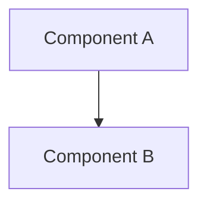
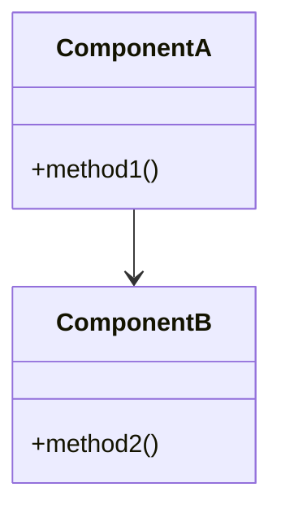
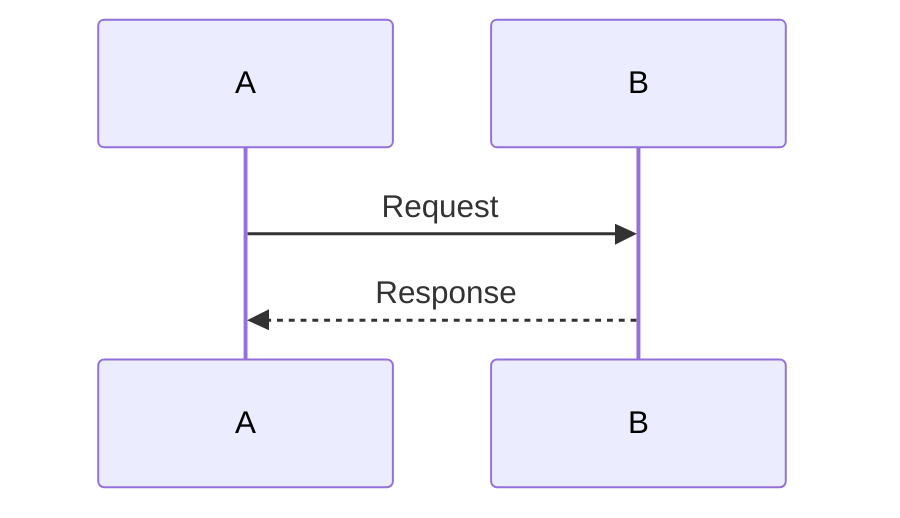
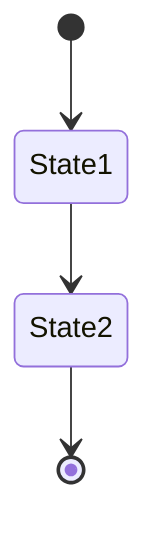
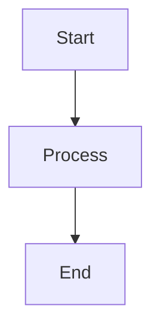
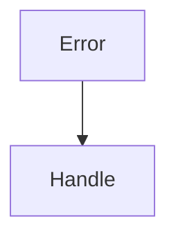
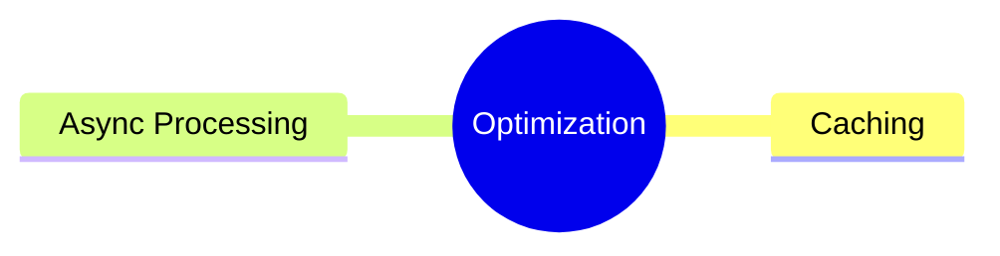
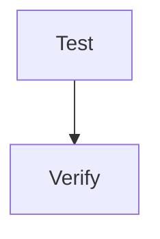

# 設計書フォーマットルール（Swift-Selena用）

## 目的

Swift-Selena（MCPサーバー）の設計書作成において統一的なフォーマットを定め、以下を実現します：

- **一貫性のある文書構造**: 全ての設計書が同じ構造で記載される
- **AIエージェントの理解促進**: 統一フォーマットによりAIが設計を正確に理解
- **要件とのトレーサビリティ**: 要件IDと設計IDを接続
- **保守性の向上**: 設計変更時の影響範囲を明確化
- **視覚的理解**: mermaid図による設計の可視化

---

## 設計ID体系

各設計には以下の体系で一意のIDを付与します：

| プレフィックス | 説明 | 例 |
|--------------|------|-----|
| DES- | Design（設計） | DES-101 |

**ID付与ルール**:
- 101から開始（Swift-Selena用は100番台）
- 一度付与したIDは変更しない
- 削除された設計のIDは欠番とする
- 新規追加時は最後の番号の次を使用

**現在の使用状況:**
- DES-101: システムアーキテクチャ
- DES-102: LSP統合
- DES-103: ツール実装

---

## ファイル命名規則

### 基本ルール
- **設計IDをファイル名の先頭に付与**: `DES-101_System_Architecture.md`
- **アンダースコア区切り**: `{設計ID}_{機能名}.md`
- **PascalCase推奨**: `System_Architecture`（読みやすさ優先）
- 英語で記載

### 命名パターン

| パターン | 例 | 用途 |
|---------|-----|------|
| `{DES-XXX}_System_Architecture.md` | `DES-101_System_Architecture.md` | システム全体 |
| `{DES-XXX}_{Feature}_Design.md` | `DES-102_LSP_Integration_Design.md` | 機能設計 |
| `{DES-XXX}_{Component}_Design.md` | `DES-103_Tool_Implementation_Design.md` | コンポーネント |

---

## 設計書テンプレート（Swift-Selena用）

### 基本テンプレート構造

```markdown
# DES-XXX: [設計名] 設計書

**設計ID**: DES-XXX
**作成日**: YYYY-MM-DD
**対象**: [対象バージョンまたはコンポーネント]
**ステータス**: 承認待ち / 承認済み / 実装完了
**関連文書**: REQ-XXX, DES-YYY

## メタデータ

| 項目 | 値 |
|-----|-----|
| 設計ID | DES-XXX |
| 対象バージョン | v0.X.X |
| 関連要件 | REQ-XXX（カンマ区切り） |
| 主要コンポーネント | [コンポーネント名列挙] |
| ツール | [関連ツール名、該当する場合] |
| LSP API | [LSP API名、該当する場合] |

**注意**: Swift-SelenaはMCPサーバーのため、UI層/Domain層等のアプリ層分類は使用しない

---

## 1. 概要

### 1.1 [設計の目的]

[なぜこの設計が必要か、何を解決するか]

### 1.2 [スコープ]

[実装する範囲、実装しない範囲]

---

## 2. アーキテクチャ設計

### 2.1 [全体構成]



### 2.2 [コンポーネント設計]



---

## 3. データフロー設計

### 3.1 [主要フロー]



### 3.2 [状態遷移]



---

## 4. 実装ガイド

### 4.1 [実装手順]



### 4.2 [設計パターン]

[使用する設計パターンの説明、mermaidで図示]

---

## 5. エラーハンドリング

### 5.1 [エラー分類]



---

## 6. パフォーマンス設計

### 6.1 [最適化戦略]



---

## 7. テスト戦略

### 7.1 [テスト方針]



---

## 8. 将来の拡張

[拡張ポイントの説明、mermaidで図示]

---

## 9. 参照

**要件定義:**
- REQ-XXX: [要件定義書名]

**設計書:**
- DES-YYY: [関連設計書名]

**計画:**
- PLAN.md: 開発計画

---

**Document Version**: X.X
**Created**: YYYY-MM-DD
**Last Updated**: YYYY-MM-DD
**Status**: [ステータス]
**Changes**: [変更内容、バージョンアップ時]
**Supersedes**: [置き換える古い文書、該当する場合]
```

---

## メタデータ記載ガイドライン（Swift-Selena用）

### 主要コンポーネントの分類

**Swift-Selenaのコンポーネント分類:**
- **Server**: SwiftMCPServer
- **State**: LSPState, ProjectMemory
- **Communication**: LSPClient, StdioTransport
- **Analysis**: SwiftSyntaxAnalyzer, FileSearcher
- **Tools**: 各ツール実装
- **Visitors**: SwiftSyntax Visitor実装
- **Logging**: FileLogHandler, DebugRunner

**記載例:**
```
| 主要コンポーネント | LSPState, LSPClient, FileLogHandler |
```

---

### ツールの記載

**ツール関連設計の場合:**
```
| ツール | find_symbol_references, list_symbols, get_type_hierarchy |
```

---

### LSP APIの記載

**LSP統合設計の場合:**
```
| LSP API | initialize, initialized, didOpen, findReferences |
```

---

## 記載上の重要ポイント

### 1. mermaid図を中心に

**必須mermaid図:**
- システム構成: `graph TB`
- データフロー: `sequenceDiagram` または `flowchart`
- 状態遷移: `stateDiagram-v2`
- コンポーネント関係: `graph` または `classDiagram`

**推奨mermaid図:**
- 概念整理: `mindmap`
- スケジュール: `gantt`
- データ構造: `erDiagram`

---

### 2. コード例は最小限に

**記載すべきコード:**
- エラーメッセージの例
- 設定ファイルの例

**記載すべきでないコード:**
- 実装の詳細（Sources/で確認）
- 関数の中身
- 長いコードブロック

**代わりに:**
- mermaid図で処理フローを説明
- 疑似コードではなく図で表現

---

### 3. 相互参照の明確化

**要件参照:**
```
関連要件: REQ-001（全体要件）, REQ-002（LSP統合）
```

**設計参照:**
```
DES-101のシステム構成を参照
DES-102のLSPプロトコル実装を参照
```

---

## バージョン管理

設計書の変更履歴は末尾に記載：

```markdown
---

**Document Version**: 2.0
**Created**: 2025-10-24
**Last Updated**: 2025-10-24
**Status**: 承認待ち
**Changes**: mermaid図中心に再構成、コード例削減
**Supersedes**: Swift-Selena Design.md, Hybrid-Architecture-Plan.md
```

---

## 設計書作成チェックリスト

### 必須項目
- ✅ 設計ID、作成日、対象、ステータス記載
- ✅ メタデータテーブル（関連要件、主要コンポーネント）
- ✅ 概要セクション（目的、スコープ）
- ✅ 最低3つのmermaid図（システム構成、データフロー、状態/フロー）
- ✅ 参照セクション（要件定義、他設計書）
- ✅ Document Version記載

### 推奨項目
- エラーハンドリング設計
- パフォーマンス設計
- テスト戦略
- 将来の拡張

---

## 参考例

**良い設計書の例:**
- DES-101: システムアーキテクチャ（20個のmermaid図）
- DES-102: LSP統合設計（16個のmermaid図）
- DES-103: ツール実装設計（15個のmermaid図）

**特徴:**
- 視覚的に理解しやすい
- コードは最小限
- フローが明確

---

## 関連文書

- [要件定義書フォーマット](spec_format.md) - Swift-Selena用要件定義フォーマット
- [計画書フォーマット](plan_format.md) - 開発計画フォーマット
- [Code Headerフォーマット](code_header_format.md) - コードヘッダー（変更不可）

---

**Document Version**: 2.0（Swift-Selena用に改訂）
**Created**: 2025-10-19
**Last Updated**: 2025-10-24
**Purpose**: Swift-Selena設計書の統一フォーマット定義
