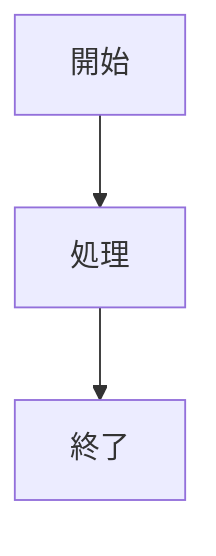

# 要件定義書フォーマットルール（Swift-Selena用）

## 目的

Swift-Selena（MCPサーバー）の要件定義書作成において統一的なフォーマットを定め、以下を実現します：

- **一貫性のある文書構造**: 全ての要件定義書が同じ構造で記載される
- **AIエージェントの理解促進**: 統一フォーマットによりAIが要件を正確に理解
- **要件の追跡可能性**: 要件IDによる実装までの追跡を可能にする
- **保守性の向上**: 要件変更時の影響範囲を明確化

---

## 要件ID体系

各要件には以下の体系で一意のIDを付与します：

| カテゴリ | プレフィックス | 例 | 説明 |
|---------|--------------|-----|------|
| 全体要件 | REQ- | REQ-001 | プロジェクト全体の要件 |
| LSP機能 | REQ- | REQ-002 | LSP統合関連の要件 |
| コア機能 | REQ- | REQ-003 | ツール・機能要件 |

**ID付与ルール**:
- 001から連番
- 一度付与したIDは変更しない
- 削除された要件のIDは欠番とする
- 新規追加時は最後の番号の次を使用

**現在の使用状況:**
- REQ-001: Swift-Selena全体要件
- REQ-002: v0.5.x LSP統合要件
- REQ-003: コア機能要件（18ツール）

---

## ファイル命名規則

### 基本ルール
- **要件IDをファイル名の先頭に付与**: `REQ-001_Swift_Selena_Overall_Requirements.md`
- **アンダースコア区切り**: `{要件ID}_{機能名}_Requirements.md`
- **PascalCase推奨**: 読みやすさ優先
- 末尾に`_Requirements.md`を付与
- 英語で記載

### 命名パターン

| パターン | 例 |
|---------|-----|
| `{REQ-XXX}_Overall_Requirements.md` | `REQ-001_Swift_Selena_Overall_Requirements.md` |
| `{REQ-XXX}_{Feature}_Requirements.md` | `REQ-002_LSP_Integration_v0.5.x.md` |
| `{REQ-XXX}_{Component}_Requirements.md` | `REQ-003_Core_Features_Requirements.md` |

---

## 要件定義書テンプレート（Swift-Selena用）

### 基本テンプレート構造

```markdown
# REQ-XXX: [要件名] 要件定義書

**要件ID**: REQ-XXX
**作成日**: YYYY-MM-DD
**対象**: [対象範囲]
**ステータス**: 承認待ち / 承認済み
**関連文書**: [関連REQ, DES]

---

## 1. 要求背景

### 1.1 解決すべき課題

[なぜこの機能が必要か]

**具体例:**
[実際の使用シーン、Before/After]

---

## 2. 現状の問題

### 2.1 既存ツールの限界

[競合ツールとの比較、現状の課題]

### 2.2 開発者のペインポイント

[実際に困っていること]

---

## 3. 要件定義

### 3.1 機能要件

**FR-XXX-001: [機能名]**

**要件:**
[機能の詳細説明]

**受入基準:**
- ✅ [定量的基準]
- ✅ [定性的基準]

---

### 3.2 非機能要件

**NFR-XXX-001: [非機能名]**

**要件:**
[パフォーマンス、信頼性等]

**受入基準:**
- ✅ [測定可能な基準]

---

## 4. ユースケース

### UC-XXX-001: [ユースケース名]

**アクター:** [ユーザー種類]

**シナリオ:**
[具体的な使用シーン]

**フロー:**
1. [ステップ1]
2. [ステップ2]

**期待される結果:**
- [結果]

---

## 5. 成功基準

### 5.1 定量的指標

| 指標 | 目標値 | 実績 |
|------|--------|------|
| [指標名] | [数値] | [実績] |

### 5.2 定性的評価

[品質評価基準]

---

## 6. 制約条件

### 6.1 技術的制約

[技術的な前提条件、制限]

### 6.2 設計制約

[守るべき設計原則]

---

## 7. スコープ外

[実装しないもの、理由]

---

## 8. 承認事項

### 8.1 要件の妥当性

[確認ポイント]

---

**Document Version**: X.X
**Created**: YYYY-MM-DD
**Last Updated**: YYYY-MM-DD
**Status**: [ステータス]
```

---

## 記載上の注意事項

### 図表の使用

#### mermaid図（必須）
ユースケースフロー、システム構成等：


#### 表（推奨）
競合比較、成功基準等：
```markdown
| 項目 | Swift-Selena | 競合A | 競合B |
|------|-------------|-------|-------|
| 機能 | ✅ | ❌ | △ |
```

---

### コード例の記載

**最小限に:**
- 設定ファイルの例
- エラーメッセージの例
- 使用例（短い）

**避けるべき:**
- 実装の詳細
- 長いコードブロック

---

### 相互参照

**設計書参照:**
```
DES-101のアーキテクチャを参照
詳細はDES-102を参照
```

**他要件参照:**
```
REQ-001の全体要件に基づく
```

---

## バージョン管理

要件定義書の変更履歴は末尾に記載：

```markdown
---

**Document Version**: 1.0
**Created**: 2025-10-24
**Last Updated**: 2025-10-24
**Status**: 承認待ち
```

---

## 参考例

**良い要件定義書の例:**
- REQ-001: Swift-Selena全体要件（6つのユースケース、競合比較）
- REQ-002: LSP統合要件（3つのユースケース、バージョン別要件）
- REQ-003: コア機能要件（18ツール、ワークフロー3パターン）

---

## 関連文書

- [設計書フォーマット](design_format.md) - 設計書作成フォーマット
- [計画書フォーマット](plan_format.md) - 開発計画フォーマット
- [Code Headerフォーマット](code_header_format.md) - コードヘッダー（変更不可）

---

**Document Version**: 2.0（Swift-Selena用に改訂）
**Created**: 2025-10-19
**Last Updated**: 2025-10-24
**Purpose**: Swift-Selena要件定義書の統一フォーマット定義
