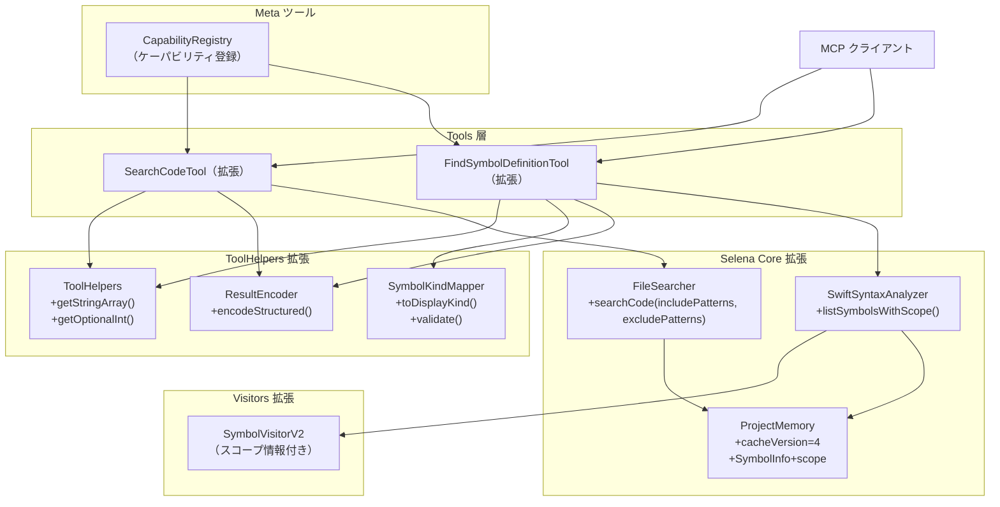
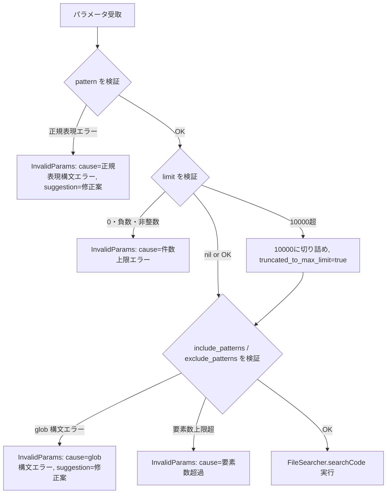
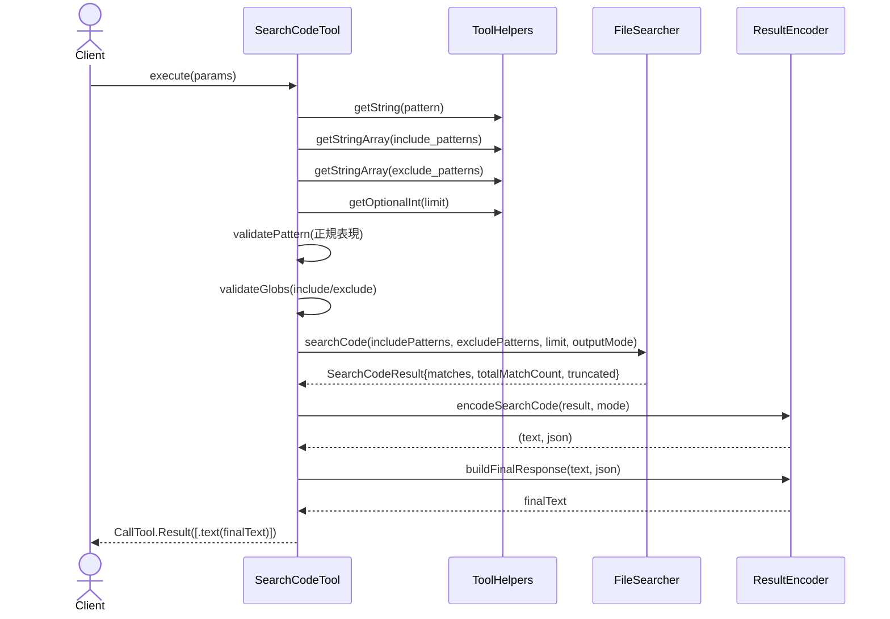
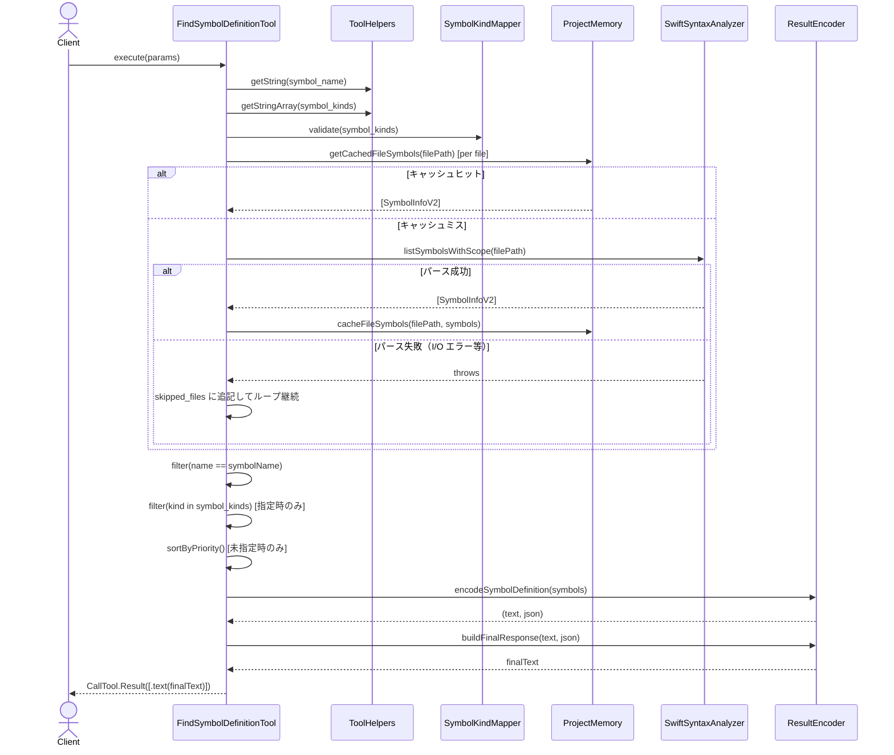
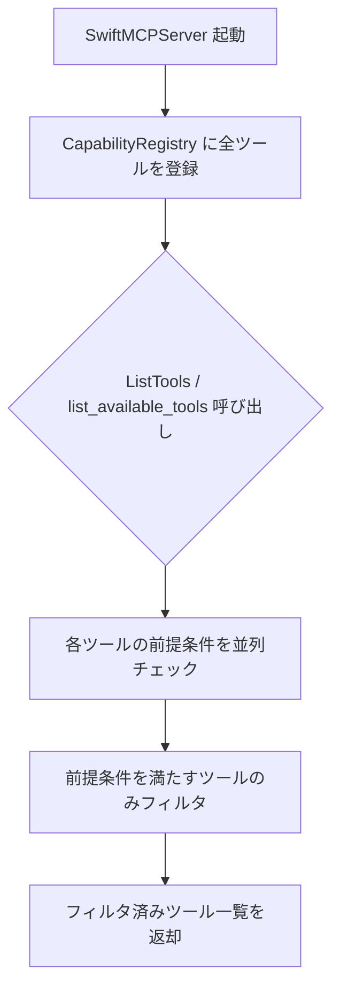

# DES-104 検索・シンボルツール強化 設計書

**設計ID**: DES-104
**関連要件**: REQ-005
**ファイル**: design/DES-104_search_symbol_tools_enhancement_design.md

## メタデータ

| 項目 | 値 |
|------|-----|
| 設計ID | DES-104 |
| 関連要件 | REQ-005 |
| 実装層 | Tools層, Selena Core層 |
| 主要モジュール | |
| - Tool | SearchCodeTool, FindSymbolDefinitionTool |
| - Helper | ToolHelpers, SymbolKindMapper, ResultEncoder |
| - Core | FileSearcher, SwiftSyntaxAnalyzer, ProjectMemory |
| - Visitor | SymbolVisitorV2 |
| - Registry | CapabilityRegistry |
| 作成日 | 2026-05-04 |

---

## 1. 概要

`search_code` および `find_symbol_definition` の2ツールを強化する。
具体的には、出力モード・件数上限・ファイルパターン複数指定・構造化結果・シンボル種別フィルタ・所属スコープ情報付与・ケーパビリティ通知に対応する。
既存の呼び出し互換性（後方互換）を維持しながら機能を拡張する方針を取る。

---

## 2. TBD 解決

本設計書で以下の未確定事項（REQ-005 §7）をすべて解決する。

### TBD-002: モジュール名取得の精度

**採用方針**: ベストエフォート（SwiftPM ターゲット名推定）

- `Package.swift` が存在するディレクトリを起点に SwiftPM ターゲット名を読み取る
- 実装: `Package.swift` のテキスト内から `name: "..."` を正規表現抽出し、ファイルパスとターゲット `sources` ディレクトリを照合
- 取得できない場合は `moduleName: nil` を返す（エラーとしない）
- SwiftPM 構造でない場合（Xcode Only プロジェクト等）も同様に `nil`

### TBD-004: 構造化結果の表現形式

**採用方針**: テキスト出力の末尾に JSON 構造化ブロックを付加

MCP プロトコルの `CallTool.Result` の `content` 配列に、`.text(String)` として以下の形式で付加する：

```
--- structured ---
{"matches":[...],"total":N,"truncated":false}
```

- 既存テキスト出力（行頭フォーマット維持）の後に `\n--- structured ---\n{JSON}` を追記
- クライアントが不要であれば `--- structured ---` セクションを無視できる
- JSON パース失敗時はテキスト出力のみ返し `structured_output_error: true` をテキストに付記

### TBD-005: 小文字スネーク値と表示用 kind 値の対応

**対応表**（`SymbolKindMapper` として実装）:

| 利用者指定値（小文字スネーク） | 表示用 kind 値（SymbolVisitor 出力） |
|-------------------------------|--------------------------------------|
| `struct`                      | `Struct`                             |
| `class`                       | `Class`                              |
| `enum`                        | `Enum`                               |
| `protocol`                    | `Protocol`                           |
| `actor`                       | `Actor`                              |
| `function`                    | `Function`                           |
| `variable`                    | `Variable`                           |
| `typealias`                   | `TypeAlias`                          |
| `extension`                   | `Extension`                          |

`Macro` 種別（`SymbolVisitor` が返す）は利用者指定可能な 9 区分に含まれないため、種別フィルタ未指定時は返却する（フィルタ指定時は除外）。

### TBD-006: 件数上限の既定値

**採用方針**: 未指定時は全件返す（無制限）を維持

課題解決の主役は「出力モード選択」と「件数上限の明示指定」であり、デフォルト変更は後方互換を損なうため行わない。

### TBD-007: 含めるパターン配列と既存単一指定の優先順位

**採用方針**: `include_patterns` 配列が 1 件以上指定された場合は配列を優先し、`file_pattern` を無視する

- `include_patterns` が空配列・省略・null → `file_pattern` を従来どおり使用
- `include_patterns` が 1 件以上 → `file_pattern` を完全に無視
- 利用者はこの優先順位を考慮してパラメータを設計する

### TBD-009: 配列要素数上限方針

| 項目 | 上限 | 超過時の挙動 |
|------|------|-------------|
| `include_patterns` 要素数 | 20 件 | 入力エラー（`InvalidParams`） |
| `exclude_patterns` 要素数 | 20 件 | 入力エラー（`InvalidParams`） |
| `symbol_kinds` 要素数 | 9 件（全種別数） | 入力エラー（`InvalidParams`） |

### TBD-010: 件数上限の最大値超過時の挙動

**採用方針**: 内部上限への切り詰め通知方式

- 件数上限の最大値: **10,000**
- 10,000 を超える値が指定された場合: 10,000 に切り詰め、テキスト出力と構造化結果の `truncated_to_max_limit: true` で通知
- 0・負数・整数以外: 入力エラー（`InvalidParams`）として明示

---

## 3. アーキテクチャ概要



---

## 4. モジュール設計

### 4.1 モジュール一覧

| モジュール | ファイルパス | 変更種別 | 責務 |
|-----------|------------|---------|------|
| `SearchCodeTool` | `Sources/Tools/FileSystem/SearchCodeTool.swift` | 変更 | 出力モード・件数上限・複数パターン対応 |
| `FindSymbolDefinitionTool` | `Sources/Tools/Symbols/FindSymbolDefinitionTool.swift` | 変更 | 種別フィルタ・所属スコープ情報付与 |
| `ToolHelpers` | `Sources/Tools/ToolProtocol.swift` | 変更 | 配列・Optional整数パラメータ取得ヘルパー追加 |
| `SymbolKindMapper` | `Sources/Tools/Symbols/SymbolKindMapper.swift` | **新規** | 利用者指定値↔表示用kind値の変換・検証 |
| `ResultEncoder` | `Sources/Tools/ResultEncoder.swift` | **新規** | 構造化結果の JSON エンコード・テキスト整形 |
| `FileSearcher` | `Sources/Selena/Core/FileSearcher.swift` | 変更 | include/exclude パターン配列対応 |
| `SwiftSyntaxAnalyzer` | `Sources/Selena/Core/SwiftSyntaxAnalyzer.swift` | 変更 | `SymbolInfoV2`（スコープ情報付き）追加 |
| `SymbolVisitorV2` | `Sources/Selena/Visitors/SymbolVisitorV2.swift` | **新規** | スコープ情報（親スコープ・extension 対象型）取得 |
| `ProjectMemory` | `Sources/Selena/Core/ProjectMemory.swift` | 変更 | `cacheVersion=4`・`SymbolInfo` にスコープフィールド追加 |
| `ParameterKeys` | `Sources/Constants.swift` | 変更 | 新規パラメータキー定数追加 |
| `ErrorMessages` | `Sources/Constants.swift` | 変更 | 新規エラーメッセージ定数追加 |
| `ModuleNameResolver` | `Sources/Selena/Core/ModuleNameResolver.swift` | **新規** | SwiftPM ターゲット名推定によるモジュール名解決 |
| `CapabilityRegistry` | `Sources/Tools/Meta/CapabilityRegistry.swift` | **新規** | ツールのケーパビリティ動的登録管理 |

### 4.2 SymbolKindMapper の設計

**場所**: `Sources/Tools/Symbols/SymbolKindMapper.swift`

```
SymbolKindMapper
├── userInputToDisplayKind(_ input: String) -> String?
│   // 小文字スネーク → 表示用 kind 値。マッピング外は nil
├── displayKindToUserInput(_ kind: String) -> String?
│   // 表示用 kind 値 → 小文字スネーク。マッピング外は nil
├── validate(_ inputs: [String]) throws
│   // 未定義の種別文字列が 1 件でも含まれれば InvalidParams をスロー
│   // エラーメッセージには無効な値を列挙
├── priorityGroup(_ displayKind: String) -> Int
│   // 0: 優先返却対象 (Class/Struct/Enum/Protocol/Actor)
│   // 1: 非優先返却対象 (Function/Variable/TypeAlias/Extension)
│   // 2: 対象外 (Macro など)
└── validUserInputs: [String]  // 定義済み 9 区分の一覧
```

### 4.3 ToolHelpers の拡張設計

`Sources/Tools/ToolProtocol.swift` に追加：

```
ToolHelpers
├── getStringArray(from:key:maxCount:) throws -> [String]
│   // Value.array([.string(...)]) を抽出。maxCount 超過時は InvalidParams
│   // 空配列・省略・null は [] を返す（エラーにしない）
└── getOptionalInt(from:key:) throws -> Int?
    // フィールドが存在しない・null → nil（未指定扱い）
    // .int(v) または .string(s) で Int に変換可能な場合 → Int?
    // フィールドが存在するが変換不可能（例: "abc"） → throws InvalidParams
    // ※省略（nil）と不正型入力（InvalidParams）を明確に区別する
```

### 4.4 FileSearcher の拡張設計

既存の `searchCode(in:pattern:filePattern:)` に加え、以下のオーバーロードを追加：

```swift
static func searchCode(
    in directory: String,
    pattern: String,
    includePatterns: [String],    // 新規: 含めるglob配列（空= Swift全体）
    excludePatterns: [String],    // 新規: 除くglob配列
    limit: Int?,                  // 新規: 件数上限（nil=無制限）
    outputMode: SearchOutputMode  // 新規: 出力モード
) throws -> SearchCodeResult
```

後方互換のため既存シグネチャは残す。内部的には新シグネチャに委譲する実装に変更する。

`SearchOutputMode`:
```
enum SearchOutputMode {
    case matchDetail    // 既定: ファイル・行番号・マッチ内容
    case fileList       // ファイル一覧（重複排除）
    case countOnly      // 件数のみ
}
```

`SearchCodeResult`:
```
struct SearchCodeResult {
    let matches: [Match]          // matchDetail モード
    let files: [String]           // fileList モード（重複排除済み）
    let totalMatchCount: Int      // 上限適用前の総数
    let totalFileCount: Int       // 上限適用前のファイル数
    let truncated: Bool           // 件数上限超過フラグ
    let truncatedToMaxLimit: Bool // 最大値切り詰めフラグ

    struct Match {
        let file: String
        let line: Int
        let content: String
    }
}
```

**ファイルパターン評価アルゴリズム**:

1. `includePatterns` が空 → `file_pattern`（従来パラメータ）を使用。`file_pattern` も空なら `.swift` 拡張子一致
2. `includePatterns` が 1 件以上 → `file_pattern` を無視。`includePatterns` の OR 結合で対象ファイルを決定
3. `excludePatterns` が 1 件以上 → `excludePatterns` の OR 結合で合致するファイルを除外（include 優先度より除外優先）
4. glob パース失敗（`NSRegularExpression` 生成失敗）→ `InvalidParams` エラー

**glob パーサー**: 既存の `private static wildcardToRegex()` を `internal static` に変更し、`**/` パターン（サブディレクトリ再帰）をサポートする拡張を加える。`**` → `.*` に変換。（代替案: 新規 `internal static wildcardToRegexV2()` として追加し、既存関数はそのまま維持する。）

### 4.5 SymbolVisitorV2 と SwiftSyntaxAnalyzer の拡張設計

**SymbolInfoV2**（`SwiftSyntaxAnalyzer` に追加）:

```swift
struct SymbolInfoV2 {
    let name: String
    let kind: String           // 表示用 kind 値（Class/Struct 等）
    let line: Int
    let parentScope: String?   // ネスト親の型名（例: Foo.Button の Foo）
    let extensionTarget: String? // extension 内定義時の対象型名
    let moduleName: String?    // SwiftPM ターゲット名（ベストエフォート）
}
```

**SymbolVisitorV2**（新規 `Sources/Selena/Visitors/SymbolVisitorV2.swift`）:

- `SymbolVisitor` を継承せず独立実装（スコープスタックが必要なため）
- スコープスタック（`[String]`）を保持し、型宣言に入るたびに push、抜けるたびに pop
- `ExtensionDeclSyntax` への visit 時に `extensionTarget` をスタックと別途記録
- シンボル登録時に現在のスコープスタックから `parentScope` を決定

```
SymbolVisitorV2
├── スコープスタック: [(name: String, isExtension: Bool)]
├── visit(ClassDeclSyntax) → push("ClassName", false), append SymbolInfoV2, visitChildren
├── visit(ExtensionDeclSyntax) → push(extendedType, true), visitChildren (シンボルとして追加しない)
│   ※ ExtensionDeclSyntax の下にある型定義は extensionTarget = extendedType として記録
├── visitPost(ClassDeclSyntax) → pop
├── visitPost(ExtensionDeclSyntax) → pop
└── 各シンボル追加時:
    - parentScope = スタックの直近の非 extension エントリ名（なければ nil）
    - extensionTarget = スタック内の直近の extension エントリ対象型（なければ nil）
```

**モジュール名取得** (`ModuleNameResolver`、新規ヘルパー):

- `Sources/Selena/Core/ModuleNameResolver.swift` として実装
- ファイルパスからプロジェクトルートを遡り `Package.swift` を発見
- `Package.swift` テキストから `name: "..."` パターンを正規表現抽出
- ファイルパスが `Sources/{target}/` 配下であれば target 名をモジュール名として返す
- 発見できない場合は `nil`

### 4.6 ProjectMemory のキャッシュスキーマ更新

`SymbolInfoV2` フィールド追加に伴い、キャッシュスキーマを更新する：

```swift
// ProjectMemory.Memory.SymbolInfo に追加
struct SymbolInfo: Codable {
    let name: String
    let kind: String
    let line: Int
    let parentScope: String?       // 追加
    let extensionTarget: String?   // 追加
    let moduleName: String?        // 追加
}
```

- `cacheVersion` を **3 → 4** にインクリメント
- 旧バージョン（3 以前）キャッシュは起動時に自動破棄・再構築（既存の再初期化ロジックを利用）

### 4.7 ResultEncoder の設計

**場所**: `Sources/Tools/ResultEncoder.swift`

`Sources/Tools/` 直下（`ToolProtocol.swift` と同階層）はツール共通ユーティリティの置き場とする。
特定ツールカテゴリに依存しない共有ヘルパー（ResultEncoder 等）は `Tools/` 直下に配置し、サブディレクトリには属さない。
将来の共有ヘルパー追加時もこの方針に従う。

構造化結果の JSON 生成とテキスト整形を担当。

```
ResultEncoder
├── encodeSearchCode(result: SearchCodeResult, mode: SearchOutputMode) -> (text: String, json: String)
│   // text: 従来互換テキスト出力
│   // json: 構造化結果 JSON 文字列
│   // モード別 JSON 出力スキーマ:
│   //   match_detail: {"matches":[{"file":"...","line":1,"content":"..."},...],
│   //     "total_match_count":N,"total_file_count":N,"truncated":false,"truncated_to_max_limit":false,
│   //     "cache_warning":false}
│   //   file_list: {"matches":[],"files":["..."],"total_match_count":N,"total_file_count":N,
│   //     "truncated":false,"truncated_to_max_limit":false,"cache_warning":false}
│   //   count_only: {"matches":[],"files":[],"total_match_count":N,"total_file_count":N,
│   //     "truncated":false,"truncated_to_max_limit":false,"cache_warning":false}
│   // ※ cache_warning は全モードで常に含める（通常時 false、キャッシュ破損時 true）
├── encodeSymbolDefinition(symbols: [SymbolDefinitionResult]) -> (text: String, json: String)
│   // SymbolDefinitionResult の定義:
│   //   symbol_name: String       — シンボル名
│   //   kind: String              — 表示用 kind 値（Class/Struct 等）
│   //   file: String              — 絶対パス
│   //   line: Int
│   //   parent_scope: String?     — ネスト親の型名（なければ nil）
│   //   extension_target: String? — extension 内定義時の対象型名（なければ nil）
│   //   module_name: String?      — SwiftPM ターゲット名（ベストエフォート、なければ nil）
│   // JSON 出力例:
│   //   {"symbols":[{"symbol_name":"Button","kind":"Struct","file":"/path/to/Views.swift",
│   //     "line":42,"parent_scope":null,"extension_target":null,"module_name":"MyModule"},...],
│   //    "total_count":N,"truncated":false}
├── buildFinalResponse(_ text: String, _ json: String) -> String
│   // text + "\n--- structured ---\n" + json
└── buildErrorResponse(cause: String, suggestion: String) -> String
    // エラーテキスト（cause / suggestion の 2 要素を機械的に区別可能な形式で含む）
```

**エラーレスポンス形式**:
```
[Error]
cause: {原因}
suggestion: {修正案}
```

### 4.8 CapabilityRegistry の設計

**場所**: `Sources/Tools/Meta/CapabilityRegistry.swift`

**MetaToolRegistry との関係**:
- `MetaToolRegistry`: 全ツールの静的定義（Tool 構造体）を管理し、list_tools / execute_tool / get_tool_schema に提供する
- `CapabilityRegistry`: ツールの前提条件（実行時動的判定）を管理し、利用可能ツールのフィルタリングに特化する
- 両者は協調動作する: `CapabilityRegistry` が利用可能と判定したツールのみを `MetaToolRegistry` の一覧から公開する
- 責務は分離されており、`CapabilityRegistry` は `MetaToolRegistry` を内包しない

```
CapabilityRegistry
├── register(tool: MCPTool.Type, requires: () async -> Bool)
│   // ツールと前提条件チェック関数を登録
├── availableTools() async -> [MCPTool.Type]
│   // 前提条件を満たすツールのみを返す
│   // タイムアウト戦略: 各前提条件チェック関数は 5 秒のタイムアウトでラップする
│   //   （Swift Concurrency の withTaskGroup + Task.sleep 相当で実装）
│   //   タイムアウトした場合は当該ツールを除外する（§7.2 と整合）
└── 初期登録（SwiftMCPServer.swift から呼び出し）:
    - search_code: 前提条件なし（常に利用可能）
    - find_symbol_definition: 前提条件なし（常に利用可能）
    - list_symbols: 前提条件なし（常に利用可能）
    - LSP系ツール（将来実装時）: sourcekit-lsp 検出関数を登録
```

`ListTools` / `list_available_tools` ハンドラは `CapabilityRegistry.availableTools()` の返値のみを公開する。

---

## 5. SearchCodeTool 拡張設計

### 5.1 パラメータ設計

| パラメータ名 | 型 | 既存/新規 | 説明 |
|-------------|-----|---------|------|
| `pattern` | `string` | 既存 | 正規表現パターン（必須） |
| `file_pattern` | `string` | 既存 | 後方互換用単一 glob |
| `output_mode` | `string` | **新規** | `"match_detail"` / `"file_list"` / `"count_only"` |
| `limit` | `integer` | **新規** | 件数上限（1〜10,000）。`output_mode="match_detail"` 時はマッチ行数に適用、`output_mode="file_list"` 時はファイル数（重複排除後）に適用、`output_mode="count_only"` 時は非適用（指定されても集計値に影響しない） |
| `include_patterns` | `array<string>` | **新規** | 含めるファイル glob 配列 |
| `exclude_patterns` | `array<string>` | **新規** | 除くファイル glob 配列 |

追加する `ParameterKeys` 定数:
- `outputMode = "output_mode"`
- `limit = "limit"`
- `includePatterns = "include_patterns"`
- `excludePatterns = "exclude_patterns"`

### 5.2 出力モード別テキスト出力フォーマット

**match_detail（既定、後方互換）**:
```
Found N matches:

path/to/File.swift:12: func example() {
path/to/File.swift:34: func example2() {
...
[Truncated: showing 100 of 250 matches]
```

**file_list**:
```
Found N files:

path/to/File.swift
path/to/Other.swift
...
```

**count_only**:
```
Matches: 250
Files: 12
```

### 5.3 入力検証フロー



**glob 検証の実施主体**:
`include_patterns` / `exclude_patterns` の glob 構文検証（D ノード）は `FileSearcher` 呼び出し前に `SearchCodeTool` 内で実施する。
具体的には `wildcardToRegex()` + `NSRegularExpression` 生成テストを各パターンに対して実行し、
生成失敗時は `buildErrorResponse(cause:suggestion:)` を通して統一フォーマット（E3）で返す。
`FileSearcher` からの例外をキャッチする経路には依存しない。

### 5.4 シーケンス図（match_detail モード、件数上限あり）



---

## 6. FindSymbolDefinitionTool 拡張設計

### 6.1 パラメータ設計

| パラメータ名 | 型 | 既存/新規 | 説明 |
|-------------|-----|---------|------|
| `symbol_name` | `string` | 既存 | シンボル名（必須） |
| `symbol_kinds` | `array<string>` | **新規** | 種別フィルタ配列（小文字スネーク 9 区分） |

追加する `ParameterKeys` 定数:
- `symbolKinds = "symbol_kinds"`

### 6.2 種別フィルタと優先返却設計

**種別フィルタ未指定時**:
1. 全 9 区分を返す
2. 優先返却順序: `Class`, `Struct`, `Enum`, `Protocol`, `Actor` → `Function`, `Variable`, `TypeAlias`, `Extension`
3. `SymbolKindMapper.priorityGroup()` でグループ分けし、グループ 0 を先頭に配置

**種別フィルタ指定時**:
1. `SymbolKindMapper.validate()` で未定義値を検証（1 件でも不正 → `InvalidParams`）
2. 指定された種別のみ（OR 結合）を返す
3. 優先返却順序は適用しない

### 6.3 所属スコープ情報の取得設計

`SymbolVisitorV2` を使用して `SymbolInfoV2` を取得。

3 ケースの区別方法:
- (i) ルート定義（`Foo.Button` の `Button`）: `parentScope = nil`, `extensionTarget = nil`
- (ii) ネスト型（`enum Foo { struct Button }`）: `parentScope = "Foo"`, `extensionTarget = nil`
- (iii) extension 内定義（`extension Foo { struct Button }`）: `parentScope = nil`, `extensionTarget = "Foo"`

### 6.4 キャッシュ互換性

既存の `findSymbolDefinition` は `ProjectMemory.Memory.SymbolInfo`（3 フィールド）を使用している。
`cacheVersion=4` 以降は `SymbolInfoV2`（6 フィールド）を使用する。
キャッシュバージョン不一致時は自動再初期化されるため、移行コストは起動時の 1 回限りの再解析。

変換:
```
ProjectMemory.Memory.SymbolInfo(v4) ↔ SwiftSyntaxAnalyzer.SymbolInfoV2
```

### 6.5 SymbolInfo / SymbolInfoV2 の並存方針

本 Feature 完了後、`SymbolInfo`（3フィールド）と `SymbolInfoV2`（6フィールド）が並存する。使い分け方針は以下の通り：

| 用途 | 使用する型 | 理由 |
|------|-----------|------|
| `find_symbol_definition`（本 Feature 拡張後） | `SymbolInfoV2` | 所属スコープ情報が必須 |
| `list_symbols`・その他既存ツール | `SymbolInfo` | 拡張不要のため変更コストを避ける |
| `ProjectMemory` キャッシュ（v4〜） | `SymbolInfoV2` 相当の `Memory.SymbolInfo`（6フィールド） | スコープフィールドを保持 |

**将来的な一本化**: `SymbolInfo` を `SymbolInfoV2` に統合する可能性があるが、本 Feature のスコープ外とする。統合する場合は全利用箇所の確認が必要となる。

### 6.5 テキスト出力フォーマット（所属スコープ情報付き）

```
Found N definition(s) for 'Button':

[Struct] Button
  File: /path/to/Views.swift
  Line: 42
  Scope: (root)

[Struct] Button
  File: /path/to/Foo.swift
  Line: 15
  Scope: parent=Foo

[Struct] Button
  File: /path/to/FooExtension.swift
  Line: 8
  Scope: extension=Foo
```

`moduleName` が取得できた場合:
```
  Scope: parent=Foo (module=MyModule)
```

### 6.6 シーケンス図



---

## 7. ケーパビリティ通知設計（REQ-005 §4.7.1）

### 7.1 CapabilityRegistry の動作フロー



### 7.2 失敗時の挙動

- ケーパビリティ判定処理が例外・タイムアウトした場合: 当該ツールを **除外** して応答する
- `initialize_project` / `list_available_tools` の応答に判定失敗フィールドを含める:

```
[CapabilityWarning] Capability check failed for: {tool_name}
Reason: {判定失敗の理由}
```

**出力先**: この警告メッセージは `initialize_project` の応答テキスト末尾および `list_available_tools` の応答テキスト内に含める。
プレフィックス `[CapabilityWarning]` を機械識別用として使用し、クライアントがパターンマッチで判定失敗の状況を識別できる形式とする。

---

## 8. エラーハンドリング設計（REQ-005 §4.7.2・§4.8）

### 8.1 入力検証エラーの統一形式

`ResultEncoder.buildErrorResponse(cause:suggestion:)` を使用:

```
[Error]
cause: {原因（機械的に区別可能）}
suggestion: {修正案（機械的に区別可能）}
```

### 8.2 キャッシュ破損時の挙動

1. `ProjectMemory.init()` でキャッシュロードが失敗（デコードエラー等）した場合:
   - 自動的に空のメモリで再初期化（既存の挙動を継続）
   - `SwiftMCPServer` のログに警告を記録
   - **ロード失敗時の構造化結果通知**: キャッシュロード失敗フラグを保持し、次のツール呼び出し応答の構造化結果 JSON に `"cache_warning": true` フィールドを付加する
   - `cache_warning` の型: Bool（値は常に `true`）、§4.2 共通フィールド表への追加行として扱う
2. ツール実行中にキャッシュ保存が失敗した場合:
   - 解析結果は正常に返す（既存の挙動を継続）
   - 構造化結果に `"cache_warning": true`（Bool）フィールドを付加する

### 8.3 構造化結果の生成失敗時

`ResultEncoder.encodeSearchCode/encodeSymbolDefinition` が例外をスローした場合:
- テキスト出力のみを返す
- テキスト末尾に `[structured output unavailable]` を付記

### 8.4 所属スコープ情報の取得失敗時

`SymbolVisitorV2` がスコープ情報を取得できなかった場合:
- `parentScope: nil`, `extensionTarget: nil`, `moduleName: nil` として結果を返す
- テキスト出力の `Scope:` 行に `(scope resolution failed)` を付記

**ファイルパース失敗時の挙動**:
`SwiftSyntaxAnalyzer.listSymbolsWithScope()` がファイルパース自体に失敗した場合（不正 Swift ソース、I/O エラー等）:
- 当該ファイルをスキップし、残りのファイルの処理を継続する（ループ全体を停止しない）
- 構造化結果の `skipped_files` フィールドに当該ファイルパスを列挙する
- §6.6 シーケンス図の `listSymbolsWithScope` 呼び出しにも catch → skip 分岐が存在する

---

## 9. 後方互換設計（REQ-005 §4.6）

### 9.1 SearchCodeTool の後方互換

- `output_mode` 未指定 → `match_detail`（従来と同等の出力）
- `limit` 未指定 → 全件返す
- `include_patterns` / `exclude_patterns` 未指定 → 従来の `file_pattern` ロジックを適用
- テキスト出力の行頭フォーマット `<file>:<line>: <content>` は変更なし
- 構造化ブロック（`--- structured ---` 以降）は**追記**であり既存行に変更を加えない

### 9.2 FindSymbolDefinitionTool の後方互換

- `symbol_kinds` 未指定 → 全 9 区分を返す（既存挙動と等価）
- 出力テキストの先頭部分 `[Kind] Name` / `File:` / `Line:` は変更なし
- `Scope:` 行は**追加行**として付記（既存行への変更なし）

---

## 10. 使用する既存コンポーネント

| コンポーネント | ファイルパス | 用途 |
|-------------|------------|------|
| `FileSearcher.searchCode()` | `Sources/Selena/Core/FileSearcher.swift:49` | 拡張の起点 |
| `FileSearcher.wildcardToRegex()` | `Sources/Selena/Core/FileSearcher.swift:154` | glob 変換ロジック再利用 |
| `SymbolVisitor` | `Sources/Selena/Visitors/SymbolVisitor.swift` | `SymbolVisitorV2` の実装参考 |
| `ExtensionVisitor.visit(ExtensionDeclSyntax)` | `Sources/Selena/Visitors/ExtensionVisitor.swift:20` | extension 対象型取得ロジック参考 |
| `ProjectMemory.cacheFileSymbols()` | `Sources/Selena/Core/ProjectMemory.swift:124` | キャッシュ保存インターフェイス |
| `ProjectMemory.getCachedFileSymbols()` | `Sources/Selena/Core/ProjectMemory.swift:137` | キャッシュ取得インターフェイス |
| `ToolHelpers.getString()` | `Sources/Tools/ToolProtocol.swift:45` | 拡張の起点 |
| `ToolHelpers.getInt()` | `Sources/Tools/ToolProtocol.swift:55` | `getOptionalInt()` 実装参考 |
| `ExcludedDirectories.shouldExclude()` | `Sources/Constants.swift:78` | ファイル検索時の除外ロジック継続使用 |

---

## 11. テストケース設計

### 11.1 SearchCodeTool テスト

**正常系**:
- `output_mode="match_detail"` 未指定時、従来と同等の出力が返る（後方互換）
- `output_mode="file_list"` 指定時、マッチを含むファイル一覧が重複排除で返る
- `output_mode="count_only"` 指定時、マッチ数とファイル数のみ返る
- `limit=5` 指定でマッチが 10 件のとき、5 件返し `truncated=true` が付く
- `include_patterns=["*.swift"]` と `exclude_patterns=["*Tests*"]` で Tests ファイルが除外される
- `include_patterns=["*.swift"]` と `file_pattern="*.md"` の同時指定で `include_patterns` が優先される

**異常系**:
- `pattern` に不正な正規表現を指定 → エラー（`cause:` / `suggestion:` を含む）
- `limit=0` → エラー
- `limit=-1` → エラー
- `limit=20000` → 10,000 に切り詰め、`truncated_to_max_limit=true`
- `include_patterns` に 21 件指定 → エラー
- `include_patterns` に不正 glob 構文 → エラー
- `include_patterns` と `exclude_patterns` が同一ファイルにマッチ → 除くパターン優先

### 11.2 FindSymbolDefinitionTool テスト

**正常系**:
- `symbol_kinds` 未指定時、全 9 区分が返り `Class/Struct/Enum/Protocol/Actor` が先頭に来る
- `symbol_kinds=["struct"]` 指定時、Struct のシンボルのみ返る
- `symbol_kinds=["struct","class"]` 指定時、Struct と Class が OR 結合で返る
- ルートに `Button` があり、ネスト型に `Foo.Button` があるとき、所属スコープ情報で区別できる
- `extension Foo { struct Button }` 内の `Button` が `extensionTarget="Foo"` で返る

**異常系**:
- `symbol_kinds=["unknown_type"]` → エラー（無効な値を明示）
- `symbol_kinds=["struct","invalid"]` → エラー（部分的無視なし）

### 11.3 ModuleNameResolver テスト

**正常系**:
- `Package.swift` が存在するディレクトリ配下のファイルパスを渡すと、SwiftPM ターゲット名が返る
- `Sources/{target}/` 配下のファイルパスで、正しいターゲット名が返る

**異常系**:
- `Package.swift` が存在しないディレクトリ配下のファイルパスを渡すと `nil` が返る
- SwiftPM 構造でないプロジェクト（Xcode Only 等）のファイルパスを渡すと `nil` が返る

### 11.4 既存テストの後方互換検証

- `search_code` の既存呼び出し（`pattern` のみ指定）で行頭フォーマット `path:line: content` が変更されないこと
- `find_symbol_definition` の既存呼び出しで `[Kind] Name / File: / Line:` が維持されること

---

## 改定履歴

| 日付 | バージョン | 作成者 | 内容 |
|------|----------|--------|------|
| 2026-05-04 | 1.0 | k2moons | 初版作成（REQ-005 §4.1〜§4.8 全 TBD 解決） |
