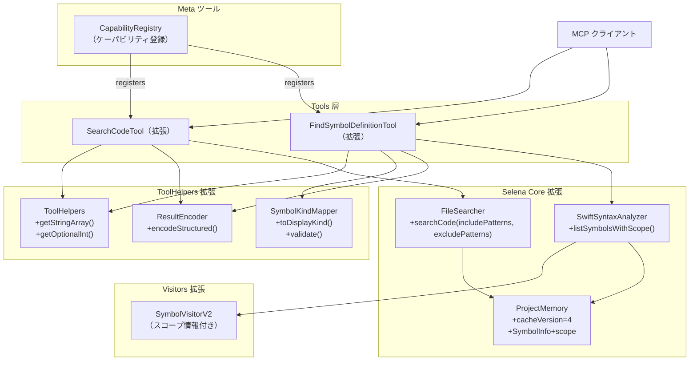
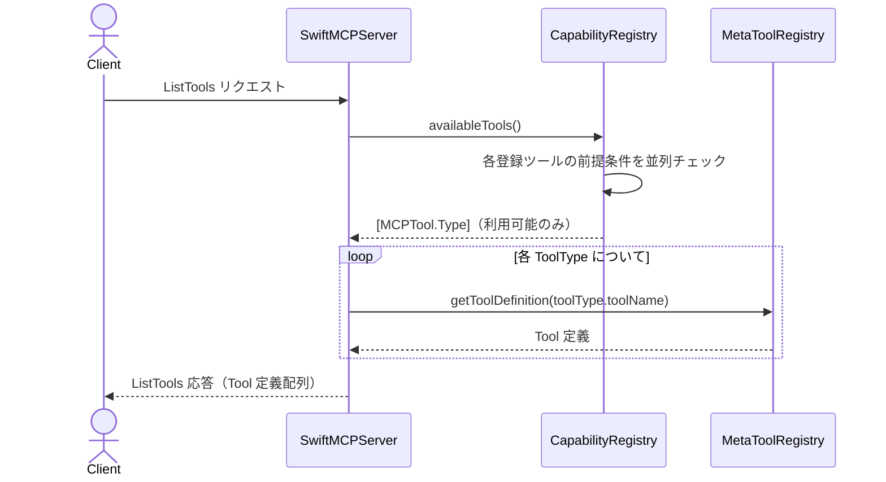
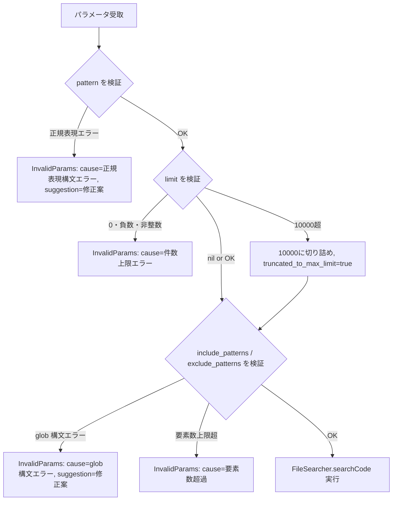
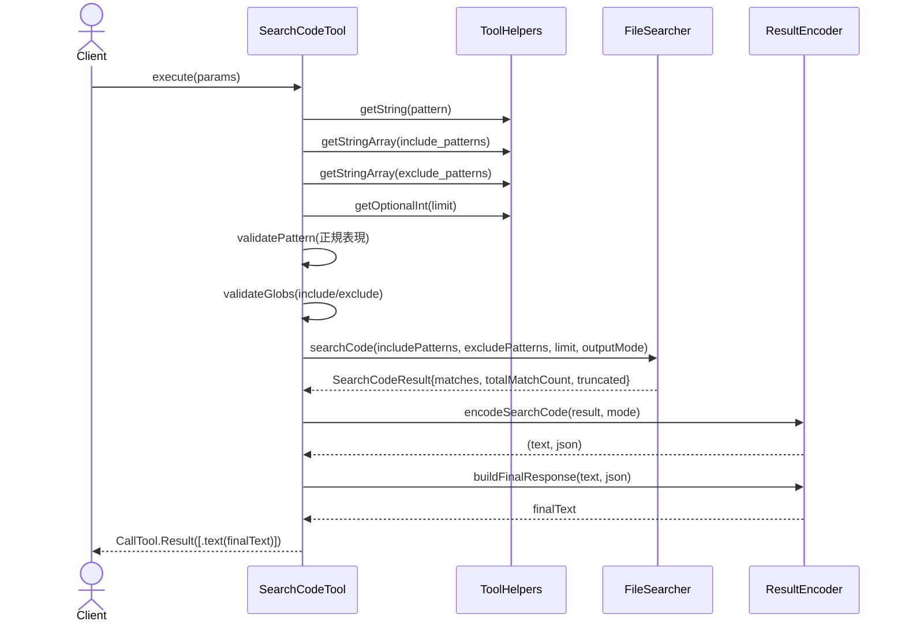
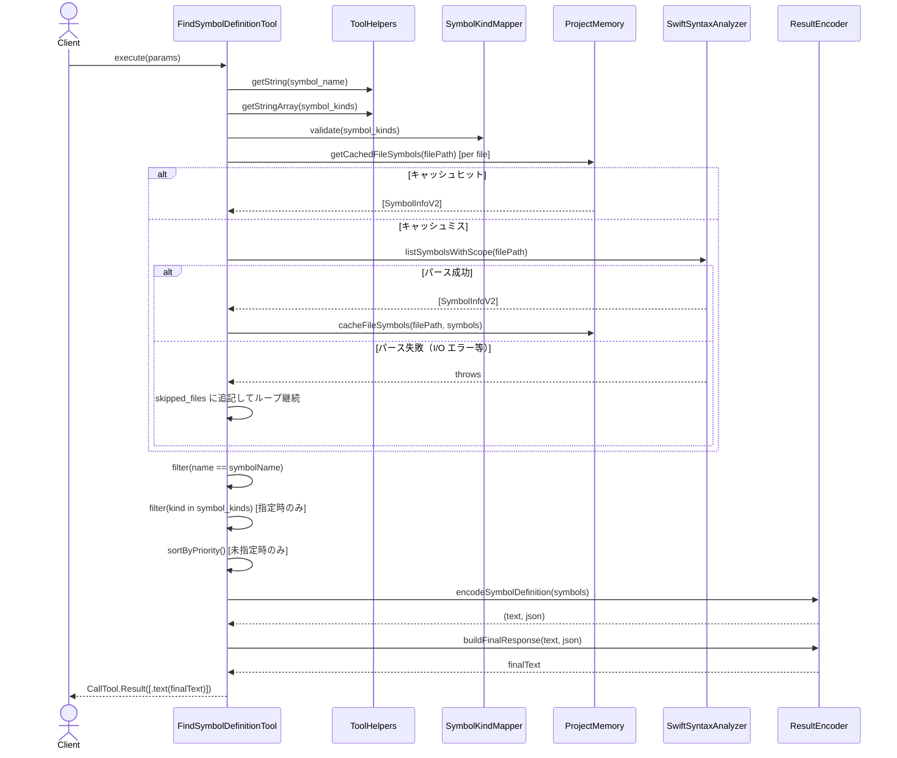
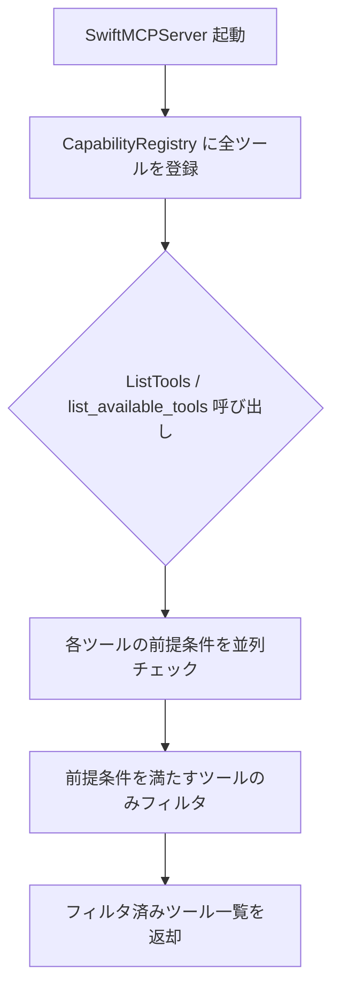

# DES-104 検索・シンボルツール強化 設計書

**設計ID**: DES-104
**関連要件**: REQ-005
**ファイル**: design/DES-104_search_symbol_tools_enhancement_design.md

## メタデータ

| 項目 | 値 |
|------|-----|
| 設計ID | DES-104 |
| 関連要件 | REQ-005 |
| 実装層 | Tools層, Selena Core層 |
| 主要モジュール | |
| - Tool | SearchCodeTool, FindSymbolDefinitionTool |
| - Helper | ToolHelpers, SymbolKindMapper, ResultEncoder |
| - Core | FileSearcher, SwiftSyntaxAnalyzer, ProjectMemory |
| - Visitor | SymbolVisitorV2 |
| - Registry | CapabilityRegistry |
| 作成日 | 2026-05-04 |

※ MCP Server 設計のため、`design_format.md` テンプレートのカテゴリ（Service/Repository/Entity/DataStore 等）の代わりにプロジェクト固有カテゴリを使用する。対応関係は以下の通り: `Tool` = Service 相当（MCP ツール提供層）、`Core` = DataStore/Repository 相当（解析・キャッシュ管理）、`Helper` / `Visitor` / `Registry` = 補助コンポーネント相当。

---

## 1. 概要

`search_code` および `find_symbol_definition` の2ツールを強化する。
具体的には、出力モード・件数上限・ファイルパターン複数指定・構造化結果・シンボル種別フィルタ・所属スコープ情報付与・ケーパビリティ通知に対応する。
既存の呼び出し互換性（後方互換）を維持しながら機能を拡張する方針を取る。

---

## 2. TBD 解決

本設計書で以下の未確定事項（REQ-005 §7）をすべて解決する。

### TBD-002: モジュール名取得の精度

**採用方針**: ベストエフォート（SwiftPM ターゲット名推定）

- `Package.swift` が存在するディレクトリを起点に SwiftPM ターゲット名を読み取る
- 実装: `Package.swift` のテキスト内から `name: "..."` を正規表現抽出し、ファイルパスとターゲット `sources` ディレクトリを照合
- 取得できない場合は `moduleName: nil` を返す（エラーとしない）
- SwiftPM 構造でない場合（Xcode Only プロジェクト等）も同様に `nil`

### TBD-004: 構造化結果の表現形式

**採用方針**: テキスト出力の末尾に JSON 構造化ブロックを付加

MCP プロトコルの `CallTool.Result` の `content` 配列に、`.text(String)` として以下の形式で付加する：

```
--- structured ---
{"matches":[...],"total":N,"truncated":false}
```

- 既存テキスト出力（行頭フォーマット維持）の後に `\n--- structured ---\n{JSON}` を追記
- クライアントが不要であれば `--- structured ---` セクションを無視できる
- JSON パース失敗時はテキスト出力のみ返し `structured_output_error: true` をテキストに付記

### TBD-005: 小文字スネーク値と表示用 kind 値の対応

**対応表**（`SymbolKindMapper` として実装）:

| 利用者指定値（小文字スネーク） | 表示用 kind 値（SymbolVisitor 出力） |
|-------------------------------|--------------------------------------|
| `struct`                      | `Struct`                             |
| `class`                       | `Class`                              |
| `enum`                        | `Enum`                               |
| `protocol`                    | `Protocol`                           |
| `actor`                       | `Actor`                              |
| `function`                    | `Function`                           |
| `variable`                    | `Variable`                           |
| `typealias`                   | `TypeAlias`                          |
| `extension`                   | `Extension`                          |

`Macro` 種別（`SymbolVisitor` が返す）は利用者指定可能な 9 区分に含まれないため、種別フィルタ未指定時は返却する（フィルタ指定時は除外）。

### TBD-006: 件数上限の既定値

**採用方針**: 未指定時は全件返す（無制限）を維持

課題解決の主役は「出力モード選択」と「件数上限の明示指定」であり、デフォルト変更は後方互換を損なうため行わない。

### TBD-007: 解消済み（`file_pattern` 廃止により無効化）

REQ-005 §4.3 で `file_pattern` を本 Feature 廃止対象（破壊的変更）と確定したため、本 TBD（含めるパターン配列と既存単一指定の優先順位）は併存しなくなり優先順位の議論自体が消滅した。詳細は REQ-005 §4.3「破壊的変更（既存単一指定パラメータの廃止）」段落および §4.6 後方互換性を参照。

### TBD-009: 配列要素数上限方針

| 項目 | 上限 | 超過時の挙動 |
|------|------|-------------|
| `include_patterns` 要素数 | 20 件 | 入力エラー（`InvalidParams`） |
| `exclude_patterns` 要素数 | 20 件 | 入力エラー（`InvalidParams`） |
| `symbol_kinds` 要素数 | 9 件（全種別数） | 入力エラー（`InvalidParams`） |

### TBD-010: 件数上限の最大値超過時の挙動

**採用方針**: 内部上限への切り詰め通知方式

- 件数上限の最大値: **10,000**
- 10,000 を超える値が指定された場合: 10,000 に切り詰め、テキスト出力と構造化結果の `truncated_to_max_limit: true` で通知
- 0・負数・整数以外: 入力エラー（`InvalidParams`）として明示

---

## 3. アーキテクチャ概要


```mermaid
flowchart TB
    Client["MCP クライアント"]
    subgraph Tools["Tools 層"]
        SCT["SearchCodeTool（拡張）"]
        FSDT["FindSymbolDefinitionTool（拡張）"]
    end
    subgraph Helpers["ToolHelpers 拡張"]
        TH["ToolHelpers\n+getStringArray()\n+getOptionalInt()"]
        SKM["SymbolKindMapper\n+toDisplayKind()\n+validate()"]
        RE["ResultEncoder\n+encodeStructured()"]
    end
    subgraph Core["Selena Core 拡張"]
        FS["FileSearcher\n+searchCode(includePatterns, excludePatterns)"]
        SSA["SwiftSyntaxAnalyzer\n+listSymbolsWithScope()"]
        PM["ProjectMemory\n+cacheVersion=4\n+SymbolInfo+scope"]
    end
    subgraph Visitors["Visitors 拡張"]
        SV["SymbolVisitorV2\n（スコープ情報付き）"]
    end
    subgraph Meta["Meta ツール"]
        CAP["CapabilityRegistry\n（ケーパビリティ登録）"]
    end

    Client --> SCT
    Client --> FSDT
    SCT --> TH
    SCT --> RE
    SCT --> FS
    FSDT --> TH
    FSDT --> SKM
    FSDT --> RE
    FSDT --> SSA
    SSA --> SV
    SSA --> PM
    FS --> PM
    CAP -->|registers| SCT
    CAP -->|registers| FSDT
```

> §3 図の `CAP -->|registers|` 矢印は「`SwiftMCPServer` 起動時に `CapabilityRegistry` がツール型を登録対象として参照する」関係を示す。ツール実装側は `CapabilityRegistry` に依存しない（依存方向の詳細は §4.8 参照）。

### 3.1 データフロー設計

> `design_format.md` テンプレート §4 「データフロー設計」に対応するセクション（本設計書はテンプレートの §3 アーキテクチャ概要内サブセクションとして配置）。
> MCP Server 設計コンテキストでは `Repository → Service → DataStore → ViewModel → View` の代わりに `MCP Client → Tool → Helper → Core → Cache` のレイヤーフローを記述する。

**データの流れ（共通パターン）**:

```
MCP Client
  ↓ JSON-RPC リクエスト（CallTool）
SwiftMCPServer
  ↓ ツールルーティング
Tool 層（SearchCodeTool / FindSymbolDefinitionTool）
  ↓ 入力検証（ToolHelpers / SymbolKindMapper）
  ↓ 検証済みパラメータ
Core 層（FileSearcher / SwiftSyntaxAnalyzer）
  ↓ ファイル走査・AST 解析
ProjectMemory（Cache）
  ↓ キャッシュヒット/ミス判定
  ↓ 解析結果
Tool 層（ResultEncoder）
  ↓ テキスト整形 + 構造化結果 JSON 生成
SwiftMCPServer
  ↓ JSON-RPC レスポンス（CallTool.Result）
MCP Client
```

**ツール別データフロー**:

| ツール | データソース | 中間層 | 永続化 | 出力整形 |
|--------|------------|--------|--------|----------|
| `search_code` | ファイルシステム（Swift ソース） | `FileSearcher`（include/exclude glob 適用） | （なし。検索結果はその場で返却） | `ResultEncoder.encodeSearchCode()` |
| `find_symbol_definition` | `ProjectMemory.fileSymbolCache` または `SwiftSyntaxAnalyzer` 解析結果 | `SymbolVisitorV2`（スコープ情報付与）、`ModuleNameResolver`（モジュール名解決） | `ProjectMemory.cacheFileSymbols()` でキャッシュ書き込み | `ResultEncoder.encodeSymbolDefinition()` |

**データ更新のトリガー**:

- **ユーザーアクション**: MCP Client からのツール呼び出し（`CallTool` リクエスト）
- **キャッシュ無効化**: ファイル更新検知（`ProjectMemory.fileIndex` の mtime 比較）、`cacheVersion` 不一致による再初期化
- **外部イベント**: なし（MCP Server は要求駆動型のため、プッシュ通知等のトリガーは存在しない）

**構造化結果の伝播経路**:

```
FileSearcher / SwiftSyntaxAnalyzer
  ↓ SearchCodeResult / [SymbolInfoV2]
ResultEncoder.encodeSearchCode() / encodeSymbolDefinition()
  ↓ (text, json)
ResultEncoder.buildFinalResponse(text, json)
  ↓ "text\n--- structured ---\n{json}"
Tool.execute() 戻り値
  ↓ CallTool.Result([.text(finalText)])
MCP Client
```

`cache_warning` 等のフラグは `ProjectMemory` から `Tool` 層への状態問い合わせ（actor メソッド呼び出し）で取得し、`ResultEncoder` 呼び出し時に JSON 構造に組み込む。

---

## 4. モジュール設計

### 4.0 設計原則

**入力検証の責務原則**: 全ツールにおいて、利用者入力（パラメータ）の検証は **Tool 層内で完結** させる。Core 層（`FileSearcher` / `SwiftSyntaxAnalyzer` / `ProjectMemory` 等）からの例外スロー経路にエラー検出を依存しない設計とする。

- 検証はパラメータ受領直後に実施し、不正値は `ResultEncoder.buildErrorResponse(cause:suggestion:)` で統一フォーマット（`InvalidParams`）として返す
- `SymbolKindMapper.validate()` のような検証ヘルパーも Tool 層ヘルパーとして配置し、Tool 層内で検証完結という原則の適用例として位置付ける
- `FileSearcher` 等の Core 層は、Tool 層が検証済みパラメータを渡す前提で動作する。Core 層からの例外（NSRegularExpression 生成失敗等）は二重防御として捕捉するが、本来の検証責務は Tool 層にある

### 4.1 モジュール一覧

| モジュール | ファイルパス | 変更種別 | 責務 |
|-----------|------------|---------|------|
| `SearchCodeTool` | `Sources/Tools/FileSystem/SearchCodeTool.swift` | 変更 | 出力モード・件数上限・複数パターン対応 |
| `FindSymbolDefinitionTool` | `Sources/Tools/Symbols/FindSymbolDefinitionTool.swift` | 変更 | 種別フィルタ・所属スコープ情報付与 |
| `ToolHelpers` | `Sources/Tools/ToolProtocol.swift` | 変更 | 配列・Optional整数パラメータ取得ヘルパー追加 |
| `SymbolKindMapper` | `Sources/Tools/Symbols/SymbolKindMapper.swift` | **新規** | 利用者指定値↔表示用kind値の変換・検証 |
| `ResultEncoder` | `Sources/Tools/ResultEncoder.swift` | **新規** | 構造化結果の JSON エンコード・テキスト整形 |
| `FileSearcher` | `Sources/Selena/Core/FileSearcher.swift` | 変更 | include/exclude パターン配列対応 |
| `SwiftSyntaxAnalyzer` | `Sources/Selena/Core/SwiftSyntaxAnalyzer.swift` | 変更 | `SymbolInfoV2`（スコープ情報付き）追加 |
| `SymbolVisitorV2` | `Sources/Selena/Visitors/SymbolVisitorV2.swift` | **新規** | スコープ情報（親スコープ・extension 対象型）取得 |
| `ProjectMemory` | `Sources/Selena/Core/ProjectMemory.swift` | 変更 | `cacheVersion=4`・`SymbolInfo` にスコープフィールド追加 |
| `ParameterKeys` | `Sources/Constants.swift` | 変更 | 新規パラメータキー定数追加 |
| `ErrorMessages` | `Sources/Constants.swift` | 変更 | 新規エラーメッセージ定数追加 |
| `ModuleNameResolver` | `Sources/Selena/Core/ModuleNameResolver.swift` | **新規** | SwiftPM ターゲット名推定によるモジュール名解決 |
| `CapabilityRegistry` | `Sources/Tools/Meta/CapabilityRegistry.swift` | **新規** | ツールのケーパビリティ動的登録管理 |

### 4.2 SymbolKindMapper の設計

**場所**: `Sources/Tools/Symbols/SymbolKindMapper.swift`

```
SymbolKindMapper
├── userInputToDisplayKind(_ input: String) -> String?
│   // 小文字スネーク → 表示用 kind 値。マッピング外は nil
├── displayKindToUserInput(_ kind: String) -> String?
│   // 表示用 kind 値 → 小文字スネーク。マッピング外は nil
├── validate(_ inputs: [String]) throws
│   // 未定義の種別文字列が 1 件でも含まれれば InvalidParams をスロー
│   // エラーメッセージには無効な値を列挙
├── priorityGroup(_ displayKind: String) -> Int
│   // 0: 優先返却対象 (Class/Struct/Enum/Protocol/Actor)
│   // 1: 非優先返却対象 (Function/Variable/TypeAlias/Extension)
│   // 2: 対象外 (Macro など)
└── validUserInputs: [String]  // 定義済み 9 区分の一覧
```

### 4.3 ToolHelpers の拡張設計

`Sources/Tools/ToolProtocol.swift` に追加：

```
ToolHelpers
├── getStringArray(from:key:maxCount:) throws -> [String]
│   // Value.array([.string(...)]) を抽出。maxCount 超過時は InvalidParams
│   // 空配列・省略・null は [] を返す（エラーにしない）
└── getOptionalInt(from:key:) throws -> Int?
    // フィールドが存在しない・null → nil（未指定扱い）
    // .int(v) または .string(s) で Int に変換可能な場合 → Int?
    // フィールドが存在するが変換不可能（例: "abc"） → throws InvalidParams
    // ※省略（nil）と不正型入力（InvalidParams）を明確に区別する
```

### 4.4 FileSearcher の拡張設計

既存の `searchCode(in:pattern:filePattern:)` に加え、以下のオーバーロードを追加：

```swift
static func searchCode(
    in directory: String,
    pattern: String,
    includePatterns: [String],    // 新規: 含めるglob配列（空= Swift全体）
    excludePatterns: [String],    // 新規: 除くglob配列
    limit: Int?,                  // 新規: 件数上限（nil=無制限）
    outputMode: SearchOutputMode  // 新規: 出力モード
) throws -> SearchCodeResult
```

後方互換のため既存シグネチャは残す。内部的には新シグネチャに委譲する実装に変更する。

`SearchOutputMode`（`enum`）のケース:

| ケース | 説明 |
|--------|------|
| `matchDetail` | 既定。ファイル・行番号・マッチ内容を返す |
| `fileList` | ファイル一覧（重複排除）を返す |
| `countOnly` | 件数のみを返す |

`SearchCodeResult`（`struct`）のフィールド:

| フィールド | 型 | 説明 |
|-----------|-----|------|
| `matches` | `[Match]` | `matchDetail` モードのマッチ結果 |
| `files` | `[String]` | `fileList` モード（重複排除済み） |
| `totalMatchCount` | `Int` | 上限適用前の総マッチ数 |
| `totalFileCount` | `Int` | 上限適用前のファイル数 |
| `truncated` | `Bool` | 件数上限超過フラグ |
| `truncatedToMaxLimit` | `Bool` | 最大値切り詰めフラグ |

内部 `struct Match` のフィールド:

| フィールド | 型 | 説明 |
|-----------|-----|------|
| `file` | `String` | マッチしたファイルの絶対パス |
| `line` | `Int` | マッチした行番号 |
| `content` | `String` | マッチ行のテキスト内容 |

**ファイルパターン評価アルゴリズム**:

1. `includePatterns` が空（未指定・空配列・null） → `.swift` 拡張子一致（既定挙動）
2. `includePatterns` が 1 件以上 → `includePatterns` の OR 結合で対象ファイルを決定
3. `excludePatterns` が 1 件以上 → `excludePatterns` の OR 結合で合致するファイルを除外（include 優先度より除外優先）
4. glob パース失敗（`NSRegularExpression` 生成失敗）→ `InvalidParams` エラー

> **注**: 既存パラメータ `file_pattern` は本 Feature で廃止する破壊的変更（REQ-005 §4.3）。`file_pattern` が指定された場合の挙動（未知パラメータエラー / 無視）は §5.1 パラメータ設計で確定する。

**glob パーサー**: 既存の `private static wildcardToRegex()` を `internal static` に変更し、`**/` パターン（サブディレクトリ再帰）をサポートする拡張を加える。`**` → `.*` に変換する。

- **採用根拠**: 既存の `searchFilesWithoutPattern()` 等が同関数を継続利用しているため、`internal` 化により呼び出し元の変更なしで `SearchCodeTool` から直接呼び出せる。新規 `wildcardToRegexV2()` 案は既存関数が `private` のままとなり、後方互換コストが増えるため棄却した。
- **アクセスレベル変更によるテスト影響**: 既存テストは `private` のため `wildcardToRegex` が不可視であり、`internal` 化による既存テストへの破壊的影響はない（不可視→可視に変わるのみ）。
- **`**` 変換の実装上の注意**: 現行 `wildcardToRegex()` は文字単位ループで実装されているため、`**` を文字単位で処理すると「先頭 `*` → `.*` に変換され、後続 `*` がさらに `.*` に変換されて `.*.*` になる」競合が発生する。`Sources/**/*.swift` のような指定が意図どおり評価されない異常系が顕在化するため、拡張時は `**` を事前にプレースホルダー（例: `\u{0001}DOUBLESTAR\u{0001}`）に置換してから文字単位ループを実行し、最後にプレースホルダーを `.*` に展開する実装、または 2 文字先読みによる実装を採用すること。

### 4.5 SymbolVisitorV2 と SwiftSyntaxAnalyzer の拡張設計

**SymbolInfoV2**（`SwiftSyntaxAnalyzer` に追加する `struct`）のフィールド:

| フィールド | 型 | 説明 |
|-----------|-----|------|
| `name` | `String` | シンボル名 |
| `kind` | `String` | 表示用 kind 値（`Class` / `Struct` 等） |
| `line` | `Int` | 宣言開始行 |
| `parentScope` | `String?` | ネスト親の型名（例: `Foo.Button` の `Foo`）。なければ `nil` |
| `extensionTarget` | `String?` | extension 内定義時の対象型名。なければ `nil` |
| `moduleName` | `String?` | SwiftPM ターゲット名（ベストエフォート）。なければ `nil` |

**SymbolVisitorV2**（新規 `Sources/Selena/Visitors/SymbolVisitorV2.swift`）:

- `SymbolVisitor` を継承せず独立実装する
- 独立実装の理由:
  - **継承との競合**: 既存 `SymbolVisitor` は 9 種の `visit(...)` メソッドが `.visitChildren` を返す前提で実装されており、継承して `visitPost(...)` を追加してスコープスタック pop を行うと、親クラスの戻り値制御と子クラスの pop タイミング保証の組み合わせが複雑化する（親クラスが将来 `.skipChildren` 返却を導入した場合に pop が呼ばれずスタック崩壊する保守リスクが生じる）
  - **保守リスクの許容**: 独立実装にすると 9 種の visit メソッドが両クラスで重複し、シンボル種別追加時の更新漏れが生じるリスクは存在する。これは「スコープスタック管理の単純さ・正しさ」を優先するためのトレードオフとして許容する。両クラスの整合性確認は §11 テストケース設計のシンボル種別網羅テストで担保する
- スコープスタック（`[(name: String, isExtension: Bool)]`）を保持し、型宣言に入るたびに push、抜けるたびに pop
- `ExtensionDeclSyntax` への visit 時に `extensionTarget` をスタックと別途記録
- シンボル登録時に現在のスコープスタックから `parentScope` を決定

**SymbolVisitorV2 の状態と訪問ハンドラ**:

スコープスタック: `[(name: String, isExtension: Bool)]`

| メソッド | 引数 | 動作 |
|---------|------|------|
| `visit` | `ClassDeclSyntax` | `push("ClassName", false)` → `SymbolInfoV2` を追加 → `.visitChildren` |
| `visit` | `ExtensionDeclSyntax` | `push(extendedType, true)` → `SymbolInfoV2(kind="Extension")` を追加 → `.visitChildren` |
| `visitPost` | `ClassDeclSyntax` | スコープスタックを `pop` |
| `visitPost` | `ExtensionDeclSyntax` | スコープスタックを `pop` |

シンボル追加時の `parentScope` / `extensionTarget` 決定規則:

| フィールド | 決定規則 |
|-----------|---------|
| `parentScope` | スタックの直近の非 extension エントリ名（なければ `nil`） |
| `extensionTarget` | スタック内の直近の extension エントリ対象型（なければ `nil`） |

補足:
- `ClassDeclSyntax` 以外の型宣言（`Struct` / `Enum` / `Protocol` / `Actor`）も同様に `visit` で push、`visitPost` で pop する
- extension 自体を `kind="Extension"` のシンボルとして登録する（REQ-005 §4.4.1 受入基準対応）
- スタック push（スコープ管理）とシンボル登録（返却対象）は独立した処理として両立する
- `ExtensionDeclSyntax` の下にある型定義は `extensionTarget = extendedType` として記録

**実装上の制約**:
- `visit` メソッドは必ず `.visitChildren` を返すこと
- `.skipChildren` を返すと `visitPost` が呼ばれずスコープスタックが崩壊する
- スタック崩壊防止のため、`defer { scopeStack.removeLast() }` パターンの併用を推奨する

**モジュール名取得** (`ModuleNameResolver`、新規ヘルパー):

- `Sources/Selena/Core/ModuleNameResolver.swift` として実装
- ファイルパスからプロジェクトルートを遡り `Package.swift` を発見
- `Package.swift` テキストから `name: "..."` パターンを正規表現抽出
- ファイルパスが `Sources/{target}/` 配下であれば target 名をモジュール名として返す
- 発見できない場合は `nil`
- `Package.swift` からの正規表現抽出失敗時（パターン不一致・コンパイルエラー含む）も同様に `nil` を返す（エラーとしない）
- **精度の制限**: 複数ターゲット構成（`Package.swift` 内の `targets:` に複数定義）での精度はベストエフォート（§2 TBD-002 採用方針参照）。単純な `name: "..."` 正規表現抽出のため、最初に一致したターゲット名が返る可能性がある。読者は §2 TBD-002 の方針を併せて参照すること

### 4.6 ProjectMemory のキャッシュスキーマ更新

`SymbolInfoV2` フィールド追加に伴い、`ProjectMemory.Memory.SymbolInfo`（`Codable` 準拠 `struct`）のキャッシュスキーマを更新する。フィールド構成は以下のとおり:

| フィールド | 型 | 区分 | 説明 |
|-----------|-----|------|------|
| `name` | `String` | 既存 | シンボル名 |
| `kind` | `String` | 既存 | 表示用 kind 値 |
| `line` | `Int` | 既存 | 宣言開始行 |
| `parentScope` | `String?` | 追加 | ネスト親の型名 |
| `extensionTarget` | `String?` | 追加 | extension 対象型名 |
| `moduleName` | `String?` | 追加 | SwiftPM ターゲット名 |

- `cacheVersion` を **3 → 4** にインクリメント
- 旧バージョン（3 以前）キャッシュは起動時に自動破棄・再構築（既存の再初期化ロジックを利用）

**バージョン移行時の `notes`（ユーザーメモ）扱い方針**:

`ProjectMemory.init()` の現行ロジックでは、`cacheVersion` 不一致時に `createEmptyMemory()` を呼び出してキャッシュ全体（`fileIndex` / `fileSymbolCache` / `notes` 等）を消去している。`notes` はユーザーが明示的に蓄積したメモであり、バージョン移行時に消失するとユーザーにとって意図しないデータ損失となる。

本設計では **【案A】notes を保持する** を採用する:

- バージョン不一致を検出した場合、旧データのデコードを `notes` フィールドのみ部分的に試み（`notes` のスキーマは v3 / v4 で同一構造を維持する）、抽出に成功した `notes` を保持する
- 解析関連のキャッシュ（`fileIndex` / `fileSymbolCache` / `importCache` / `typeConformanceCache` / `classDefinitions`）は破棄して空のメモリで再初期化する
- 実装方針: `Memory` 構造体のデコードを 2 段階に分け、第 1 段階で `notes` のみを抽出するための補助 `Codable` 構造体（例: `LegacyNotesContainer`）を用いる
- 抽出失敗時は `notes` も破棄する（現行挙動と同等）

`notes` のスキーマが将来変更される場合は、本方針を再検討する。

### 4.7 ResultEncoder の設計

**場所**: `Sources/Tools/ResultEncoder.swift`

`Sources/Tools/` 直下（`ToolProtocol.swift` と同階層）はツール共通ユーティリティの置き場とする。
特定ツールカテゴリに依存しない共有ヘルパー（ResultEncoder 等）は `Tools/` 直下に配置し、サブディレクトリには属さない。
将来の共有ヘルパー追加時もこの方針に従う。

構造化結果の JSON 生成とテキスト整形を担当。

**メソッド一覧**:

| メソッド | 引数 | 戻り値 | 責務 |
|---------|------|--------|------|
| `encodeSearchCode` | `result: SearchCodeResult, mode: SearchOutputMode` | `(text: String, json: String)` | 検索結果を従来互換テキストと構造化 JSON に整形（モード別スキーマは下記） |
| `encodeSymbolDefinition` | `symbols: [SymbolDefinitionResult]` | `(text: String, json: String)` | シンボル定義結果をテキストと JSON に整形（出力スキーマは下記） |
| `buildFinalResponse` | `_ text: String, _ json: String` | `String` | `text + "\n--- structured ---\n" + json` を結合した最終応答を生成 |
| `buildErrorResponse` | `cause: String, suggestion: String` | `String` | `cause` / `suggestion` の 2 要素を機械的に区別可能な形式でエラーテキスト化 |

シグネチャ骨子（Swift 表記）:

```swift
static func encodeSearchCode(result: SearchCodeResult, mode: SearchOutputMode) -> (text: String, json: String)
static func encodeSymbolDefinition(symbols: [SymbolDefinitionResult]) -> (text: String, json: String)
static func buildFinalResponse(_ text: String, _ json: String) -> String
```

**`encodeSearchCode` のモード別 JSON スキーマ**（共通フィールド: `total_match_count` / `total_file_count` / `truncated` / `truncated_to_max_limit` / `cache_warning`、`cache_warning` は全モードで常に含め通常時 `false`、キャッシュ破損時 `true`）:

| モード | `matches` | `files` | 補足 |
|--------|----------|--------|------|
| `match_detail` | `[{"file":"...","line":1,"content":"..."}, ...]` | フィールドなし | 既定モード |
| `file_list` | `[]` | `["...", ...]`（重複排除済み） | ファイル一覧モード |
| `count_only` | `[]` | `[]` | 件数のみモード |

**`encodeSymbolDefinition` の `SymbolDefinitionResult` フィールド**:

| フィールド | 型 | 説明 |
|-----------|-----|------|
| `symbol_name` | `String` | シンボル名 |
| `kind` | `String` | 表示用 kind 値（`Class` / `Struct` 等） |
| `file` | `String` | 絶対パス |
| `line` | `Int` | 宣言開始行 |
| `parent_scope` | `String?` | ネスト親の型名。なければ `nil` |
| `extension_target` | `String?` | extension 内定義時の対象型名。なければ `nil` |
| `module_name` | `String?` | SwiftPM ターゲット名（ベストエフォート）。なければ `nil` |

**`encodeSymbolDefinition` の JSON 出力例**:

```
{"symbols":[{"symbol_name":"Button","kind":"Struct","file":"/path/to/Views.swift","line":42,"parent_scope":null,"extension_target":null,"module_name":"MyModule"}, ...],"total_count":N,"truncated":false}
```

**エラーレスポンス形式**:
```
[Error]
cause: {原因}
suggestion: {修正案}
```

**file_list / count_only モードでの共通フィールド適用範囲**:

REQ-005 §4.2「共通フィールド」のうち「ファイルパス・検索結果総数（`total_match_count` / `total_file_count`）・省略フラグ（`truncated` / `truncated_to_max_limit` / `cache_warning`）」は全モード（match_detail / file_list / count_only）で提供する。一方、「行番号・マッチ行内容」は **モード特性上 file_list / count_only では提供対象外**とし、`matches: []`（空配列）を返す。これは REQ-005 §4.1 のモード別件数上限単位定義（file_list はファイル単位、count_only は集計のみ）と整合する設計判断である。

**SymbolDefinitionResult の定義場所**:

`encodeSymbolDefinition()` の引数型 `SymbolDefinitionResult` は `Sources/Tools/Symbols/FindSymbolDefinitionTool.swift` 内で定義する（同ツールの結果オブジェクトとして所有）。`ResultEncoder` は同型を入力として受け取り、テキスト整形と JSON 化のみを担当する。

**Tools → Core 依存方向の確認**:

`encodeSearchCode()` の引数型 `SearchCodeResult` は Core 層（`Sources/Selena/Core/FileSearcher.swift` 内）の型である。`Tools/` 直下の `ResultEncoder` が同型を参照することは、`DES-101 §依存方向` の「Tools → Core 一方向依存」原則に合致する正規の依存である。

### 4.8 CapabilityRegistry の設計

**場所**: `Sources/Tools/Meta/CapabilityRegistry.swift`

**MetaToolRegistry との関係**:
- `MetaToolRegistry`: 全ツールの静的定義（Tool 構造体）を管理し、list_tools / execute_tool / get_tool_schema に提供する
- `CapabilityRegistry`: ツールの前提条件（実行時動的判定）を管理し、利用可能ツールのフィルタリングに特化する
- 両者は協調動作する: `CapabilityRegistry` が利用可能と判定したツールのみを `MetaToolRegistry` の一覧から公開する
- 責務は分離されており、`CapabilityRegistry` は `MetaToolRegistry` を内包しない
- **意図的な依存例外**: `CapabilityRegistry` は Meta 層に属しながらカテゴリ別 Tool 実装型（`SearchCodeTool` 等）を直接参照する。これは既存 `MetaToolRegistry.getToolDefinition()` と同一パターンであり、`DES-101 §依存方向` の「Tools → Core 一方向依存」原則の意図的な例外として許容する。理由は、ツール実装型の前提条件をプロセス起動時に静的に登録する必要があるため。
- **依存方向の明示**: `CapabilityRegistry` は `MCPTool.Type` を参照するが、ツール実装側は `CapabilityRegistry` に依存しない。§3 アーキテクチャ図の `CAP -->|registers| SCT` 矢印は「`SwiftMCPServer` 起動時に `CapabilityRegistry` がツール型を登録対象として参照する」関係を示し、ツール実装→Registry の依存ではない。

**CapabilityRegistry 導入後の MetaToolRegistry の扱い**:

- (a) **`MetaToolRegistry.toolSummaries` の継続利用**: 既存の静的配列はツール定義のソースとして継続利用する。廃止せず、`CapabilityRegistry` への登録経路と並存する。
- (b) **`ListTools` ハンドラの切り替え**: `SwiftMCPServer.swift` の `ListTools` ハンドラは、従来 `MetaToolRegistry.toolSummaries` を直接返していた経路を、`CapabilityRegistry.availableTools()` を経由する経路に切り替える。具体的な呼び出しパスは以下の通り:
  ```
  CapabilityRegistry.availableTools() → [MCPTool.Type]
    → 各型から toolName を取得
    → MetaToolRegistry.getToolDefinition(name) で Tool 定義を取得
    → 取得済み Tool 定義配列を ListTools 応答として返却
  ```
- (c) **`CapabilityRegistry` のライフサイクル**: Swift `actor` として実装する（並列前提条件チェック・状態保護のため）。`SwiftMCPServer` 初期化時にシングルトンとして 1 度だけ生成し、初期登録（search_code・find_symbol_definition 等）も同タイミングで実施する。

**ListTools ハンドラ切り替えシーケンス**:


```mermaid
sequenceDiagram
    actor Client
    participant SMS as SwiftMCPServer
    participant CAP as CapabilityRegistry
    participant MTR as MetaToolRegistry

    Client->>SMS: ListTools リクエスト
    SMS->>CAP: availableTools()
    CAP->>CAP: 各登録ツールの前提条件を並列チェック
    CAP-->>SMS: [MCPTool.Type]（利用可能のみ）
    loop 各 ToolType について
        SMS->>MTR: getToolDefinition(toolType.toolName)
        MTR-->>SMS: Tool 定義
    end
    SMS-->>Client: ListTools 応答（Tool 定義配列）
```

```
CapabilityRegistry
├── register(tool: MCPTool.Type, requires: () async -> Bool)
│   // ツールと前提条件チェック関数を登録
├── availableTools() async -> [MCPTool.Type]
│   // 前提条件を満たすツールのみを返す
│   // タイムアウト戦略: 各前提条件チェック関数にタイムアウトを設ける
│   //   タイムアウト値は Constants.swift の定数（capabilityCheckTimeout）に委ねる
│   //   タイムアウトした場合は当該ツールを除外する（§7.2 と整合）
│   //   実装手段（withTaskGroup + Task.sleep 等の Swift Concurrency API 選択）は実装者の裁量に委ねる
└── 初期登録（SwiftMCPServer.swift から呼び出し）:
    - search_code: 前提条件なし（常に利用可能）
    - find_symbol_definition: 前提条件なし（常に利用可能）
    - list_symbols: 前提条件なし（常に利用可能）
    - LSP系ツール（将来実装時）: sourcekit-lsp 検出関数を登録
```

`ListTools` / `list_available_tools` ハンドラは `CapabilityRegistry.availableTools()` の返値のみを公開する。

**タイムアウトとリソース解放の設計**:

- **タイムアウト発生時の子タスク扱い**: 各前提条件チェック関数は `availableTools()` 内で並列実行される。タイムアウト経過後、当該チェック関数を実行中の子タスクにはキャンセル要求を発行し、structured concurrency 上のキャンセル伝播経路を通じて停止を試みる。具体的なキャンセル発行 API の選択は実装者に委ねる（§4.8 のタイムアウト戦略コメント方針と整合）
- **キャンセル協調要件**: 前提条件チェック関数の実装者は、Swift Concurrency の協調的キャンセル原則に従いキャンセル要求を観測すること。具体的には `try await` 境界・キャンセル確認 API・タスク状態確認等のいずれかを用いてキャンセル要求の観測点を関数内に設けること。キャンセル非協調な処理（同期 I/O・キャンセル不可な旧 API 等）はチェック関数内で使用しないこと
- **リソース解放**: チェック関数が外部プロセス起動・ファイルディスクリプタ取得・ネットワーク接続等のリソースを保持する場合、Swift 言語標準の `defer` 文等を用いて関数終了時の確実な解放を行うこと。タイムアウト発生時のキャンセルから後処理ブロックの実行までの順序は Swift ランタイムが保証する
- **タイムアウト後のツール扱い**: タイムアウトしたチェック関数に対応するツールは「前提条件未達」として `availableTools()` の返値から除外する。除外時にログ出力（`SwiftMCPServer` のログ経由）を行い、運用者がタイムアウト発生を検知できるようにする
- **リトライ方針**: タイムアウト除外されたツールは、次回 `ListTools` 呼び出し時に再度チェックが実行される（`availableTools()` 呼び出しごとに前提条件を再評価する設計）。永続的な除外フラグは保持しない

### 4.9 状態管理設計

> `design_format.md` テンプレート §6 「状態管理設計」に対応するセクション（本設計書はテンプレートの §4 モジュール設計内サブセクションとして配置）。
> MCP Server 設計コンテキストでは `ViewState` enum / `@Observable` ViewModel の代わりに、`ProjectMemory` のキャッシュ状態と `CapabilityRegistry` の登録状態を記述する。

#### 4.9.1 ProjectMemory のキャッシュ状態管理

`ProjectMemory` は Swift `actor` として実装され、プロセス起動から終了まで単一インスタンスでキャッシュ全体のライフサイクルを管理する。状態種別と遷移は以下の通り。

**キャッシュ状態の種類**:

| 状態 | 内容 | 遷移条件 |
|------|------|----------|
| `uninitialized` | 起動直後、キャッシュ未ロード | 起動時の初期状態 |
| `loaded` | 永続化キャッシュをデコード成功し、メモリ展開済み | `init()` で `cacheVersion` 一致のキャッシュをロード |
| `reinitialized` | バージョン不一致を検出し、空キャッシュで再構築 | `init()` で `cacheVersion` 不一致を検出 → `createEmptyMemory()`（ただし §4.6 方針に従い `notes` は保持を試行） |
| `corrupted` | デコード失敗（ファイル破損等） | `init()` でデコード例外発生 → 空キャッシュ + `cache_warning: true` フラグ設定 |
| `dirty` | 解析結果の追加・更新によりメモリと永続化キャッシュが不一致 | `cacheFileSymbols()` 等の書き込み呼び出し |
| `flushed` | `dirty` 状態から永続化ファイルへの書き出し完了 | `save()` 相当の書き込み完了 |

**管理プロパティ**（`ProjectMemory.Memory` 構造体内）:

| プロパティ | 型 | 用途 |
|------------|-----|------|
| `cacheVersion` | `Int`（v4） | キャッシュスキーマのバージョン番号。v3 → v4 で `SymbolInfo` のフィールド数が 3 → 6 に拡張 |
| `fileIndex` | `[String: FileCacheEntry]` | ファイルパス → mtime/解析メタ情報のマップ |
| `fileSymbolCache` | `[String: [Memory.SymbolInfo]]` | ファイルパス → スコープ情報付きシンボルリスト |
| `notes` | `[String: String]`（仮構造） | ユーザーが明示的に蓄積したメモ。バージョン移行時も保持を試行（§4.6） |
| `cacheWarning`（仮想プロパティ） | `Bool` | デコード失敗時に立つフラグ。Tool 層から actor メソッド経由で取得し、構造化結果 JSON に伝播（§8.2） |

**再初期化ロジック**:

1. `ProjectMemory.init()` 時に永続化ファイルを読み込み
2. デコード成功 → `cacheVersion` を比較
   - 一致 → `loaded` 状態へ遷移
   - 不一致 → `notes` のみを別ステップでデコード試行 → `reinitialized` 状態へ遷移（解析関連キャッシュは空）
3. デコード失敗 → 空キャッシュで `corrupted` 状態へ遷移、`cacheWarning` を `true` に設定
4. ツール呼び出し時、`cacheWarning` フラグを actor メソッド経由で取得し、`ResultEncoder` に渡して構造化結果 JSON の `cache_warning` フィールドに反映

**並行アクセス制御**: `ProjectMemory` は Swift `actor` であるため、複数ツールからの同時呼び出しはランタイムが直列化を保証する。Tool 層は `await` で actor 境界をまたぐ。

#### 4.9.2 CapabilityRegistry の登録状態管理

`CapabilityRegistry` も Swift `actor` として単一インスタンスで動作する。状態は以下の通り。

| 状態 | 内容 | 遷移条件 |
|------|------|----------|
| `empty` | 登録ツールなし | 初期状態 |
| `registered` | `register()` により 1 件以上登録済み | `SwiftMCPServer` 起動時の初期登録完了後 |
| `evaluating` | `availableTools()` 呼び出し中（前提条件並列チェック中） | `ListTools` ハンドラからの呼び出し |

**管理プロパティ**:

| プロパティ | 型 | 用途 |
|------------|-----|------|
| 登録テーブル | `[ObjectIdentifier: () async -> Bool]` | ツール型 → 前提条件チェック関数のマップ |
| タイムアウト値 | `Constants.swift` 経由で定数参照 | 各前提条件チェックのタイムアウト（5 秒） |

ライフサイクルは §4.8 (c) で規定済み。

---

## 5. SearchCodeTool 拡張設計

### 5.1 パラメータ設計

| パラメータ名 | 型 | 既存/新規 | 説明 |
|-------------|-----|---------|------|
| `pattern` | `string` | 既存 | 正規表現パターン（必須） |
| `output_mode` | `string` | **新規** | `"match_detail"` / `"file_list"` / `"count_only"` |
| `limit` | `integer` | **新規** | 件数上限（1〜10,000）。`output_mode="match_detail"` 時はマッチ行数に適用、`output_mode="file_list"` 時はファイル数（重複排除後）に適用、`output_mode="count_only"` 時は非適用（指定されても集計値に影響しない） |
| `include_patterns` | `array<string>` | **新規** | 含めるファイル glob 配列 |
| `exclude_patterns` | `array<string>` | **新規** | 除くファイル glob 配列 |

> **廃止パラメータ**: 既存 `file_pattern`（`string`）は本 Feature で廃止する破壊的変更（REQ-005 §4.3）。`file_pattern` キーが指定された場合の挙動は **未知パラメータとして無視する**（`InvalidParams` エラーは返さない）。理由: MCP クライアント側で旧スキーマがキャッシュされている可能性に対する寛容性を優先し、エラー連鎖を避けるため。代替手段は `include_patterns=["{glob}"]` を利用すること。

追加する `ParameterKeys` 定数:
- `outputMode = "output_mode"`
- `limit = "limit"`
- `includePatterns = "include_patterns"`
- `excludePatterns = "exclude_patterns"`

削除する `ParameterKeys` 定数:
- `filePattern = "file_pattern"`（`Sources/Constants.swift:58` を削除。`SearchFilesWithoutPatternTool` 等での同名パラメータ利用は別途 issue #34 で扱うため、本 Feature では `SearchCodeTool` 側の参照のみ削除し、`Constants.filePattern` 自体の削除可否は他ツールの修正完了を待って判断する）

### 5.2 出力モード別テキスト出力フォーマット

**match_detail（既定、後方互換）**:
```
Found N matches:

path/to/File.swift:12: func example() {
path/to/File.swift:34: func example2() {
...
[Truncated: showing 100 of 250 matches]
```

**file_list**:
```
Found N files:

path/to/File.swift
path/to/Other.swift
...
```

**count_only**:
```
Matches: 250
Files: 12
```

### 5.3 入力検証フロー


```mermaid
flowchart TD
    A[パラメータ受取] --> B{pattern を検証}
    B -->|正規表現エラー| E1[InvalidParams: cause=正規表現構文エラー, suggestion=修正案]
    B -->|OK| C{limit を検証}
    C -->|0・負数・非整数| E2[InvalidParams: cause=件数上限エラー]
    C -->|10000超| CLIP[10000に切り詰め, truncated_to_max_limit=true]
    C -->|nil or OK| D{include_patterns / exclude_patterns を検証}
    D -->|glob 構文エラー| E3[InvalidParams: cause=glob構文エラー, suggestion=修正案]
    D -->|要素数上限超| E4[InvalidParams: cause=要素数超過]
    D -->|OK| EXEC[FileSearcher.searchCode 実行]
    CLIP --> D
```

**glob 検証の実施主体**:
`include_patterns` / `exclude_patterns` の glob 構文検証（D ノード）は `FileSearcher` 呼び出し前に `SearchCodeTool` 内で実施する。
具体的には `wildcardToRegex()` + `NSRegularExpression` 生成テストを各パターンに対して実行し、
生成失敗時は `buildErrorResponse(cause:suggestion:)` を通して統一フォーマット（E3）で返す。
`FileSearcher` からの例外をキャッチする経路には依存しない。

`pattern`（正規表現）の検証も同様に `SearchCodeTool` 内で事前実施する（§4.0 入力検証責務原則に従う）。
具体的には `NSRegularExpression(pattern: pattern)` 生成テストを `SearchCodeTool` 内で実行し、
生成失敗時は E1（InvalidParams）を返す。`FileSearcher` には検証済みパターンを渡し、`FileSearcher.searchCode()` 内の `NSRegularExpression(pattern:)` スローは二重防御として残すが、本来の検証責務は `SearchCodeTool` にある。

### 5.4 シーケンス図（match_detail モード、件数上限あり）


```mermaid
sequenceDiagram
    actor Client
    participant SCT as SearchCodeTool
    participant TH as ToolHelpers
    participant FS as FileSearcher
    participant RE as ResultEncoder

    Client->>SCT: execute(params)
    SCT->>TH: getString(pattern)
    SCT->>TH: getStringArray(include_patterns)
    SCT->>TH: getStringArray(exclude_patterns)
    SCT->>TH: getOptionalInt(limit)
    SCT->>SCT: validatePattern(正規表現)
    SCT->>SCT: validateGlobs(include/exclude)
    SCT->>FS: searchCode(includePatterns, excludePatterns, limit, outputMode)
    FS-->>SCT: SearchCodeResult{matches, totalMatchCount, truncated}
    SCT->>RE: encodeSearchCode(result, mode)
    RE-->>SCT: (text, json)
    SCT->>RE: buildFinalResponse(text, json)
    RE-->>SCT: finalText
    SCT-->>Client: CallTool.Result([.text(finalText)])
```

---

## 6. FindSymbolDefinitionTool 拡張設計

### 6.1 パラメータ設計

| パラメータ名 | 型 | 既存/新規 | 説明 |
|-------------|-----|---------|------|
| `symbol_name` | `string` | 既存 | シンボル名（必須） |
| `symbol_kinds` | `array<string>` | **新規** | 種別フィルタ配列（小文字スネーク 9 区分） |

追加する `ParameterKeys` 定数:
- `symbolKinds = "symbol_kinds"`

### 6.2 種別フィルタと優先返却設計

**種別フィルタ未指定時**:
1. 全 9 区分を返す
2. 優先返却順序: `Class`, `Struct`, `Enum`, `Protocol`, `Actor` → `Function`, `Variable`, `TypeAlias`, `Extension`
3. `SymbolKindMapper.priorityGroup()` でグループ分けし、グループ 0 を先頭に配置

**種別フィルタ指定時**:
1. `SymbolKindMapper.validate()` で未定義値を検証（1 件でも不正 → `InvalidParams`）
2. 指定された種別のみ（OR 結合）を返す
3. 優先返却順序は適用しない

### 6.3 所属スコープ情報の取得設計

`SymbolVisitorV2` を使用して `SymbolInfoV2` を取得。

3 ケースの区別方法:
- (i) ルート定義（`Foo.Button` の `Button`）: `parentScope = nil`, `extensionTarget = nil`
- (ii) ネスト型（`enum Foo { struct Button }`）: `parentScope = "Foo"`, `extensionTarget = nil`
- (iii) extension 内定義（`extension Foo { struct Button }`）: `parentScope = nil`, `extensionTarget = "Foo"`

### 6.4 キャッシュ互換性

既存の `findSymbolDefinition` は `ProjectMemory.Memory.SymbolInfo`（3 フィールド）を使用している。
`cacheVersion=4` 以降は `SymbolInfoV2`（6 フィールド）を使用する。
キャッシュバージョン不一致時は自動再初期化されるため、移行コストは起動時の 1 回限りの再解析。

変換:
```
ProjectMemory.Memory.SymbolInfo(v4) ↔ SwiftSyntaxAnalyzer.SymbolInfoV2
```

**変換責務の所在**:

両型は同フィールド構成（6 フィールド）の別型のため、変換は単純なフィールドコピーで成立する。変換責務は **`FindSymbolDefinitionTool` 内インライン変換** に置く。

| 項目 | 内容 |
|------|------|
| 変換責務の担当 | `FindSymbolDefinitionTool`（呼び出し側） |
| 変換方式 | キャッシュ取得直後の `map { SymbolInfoV2(...) }` インライン変換 |
| 配置の根拠 | 既存実装 `FindSymbolDefinitionTool.swift:81` の `map { SymbolInfo(name:kind:line:) }` パターンと同一方針。変換ロジックが単純（フィールド名・型同一のコピー）のため独立ヘルパー化は過剰抽象化となる |
| 双方向変換 | 解析結果（`SymbolInfoV2`）→ キャッシュ書き込み（`Memory.SymbolInfo`）も同様に `FindSymbolDefinitionTool` 内でインライン変換する。`ProjectMemory.cacheFileSymbols(_:)` には変換済みの `Memory.SymbolInfo` を渡す |

**将来的な再配置トリガー**: 変換ロジックが他ツール（例: 将来の `list_symbols_with_scope` 等）でも必要となった場合、`SwiftSyntaxAnalyzer` 配下の独立ヘルパーへ移動する。本 Feature のスコープではトリガー条件未到達のため、インライン配置を維持する。

### 6.5 SymbolInfo / SymbolInfoV2 の並存方針

本 Feature 完了後、関連する 3 種の型が並存する。各型は別型であり、混同しないよう注意する。

**並存する 3 型の関係**:

| 型 | フィールド | 配置 | 用途 |
|----|-----------|------|------|
| `SwiftSyntaxAnalyzer.SymbolInfo` | `name` / `kind` / `line`（3 フィールド） | `Sources/Selena/Core/SwiftSyntaxAnalyzer.swift` | 既存ツール（`list_symbols` 等）の解析結果型 |
| `SwiftSyntaxAnalyzer.SymbolInfoV2` | 上記 3 + `parentScope` / `extensionTarget` / `moduleName`（6 フィールド） | `Sources/Selena/Core/SwiftSyntaxAnalyzer.swift` | 本 Feature の解析結果型（所属スコープ情報付き） |
| `ProjectMemory.Memory.SymbolInfo` | `SymbolInfoV2` と同フィールド構成（6 フィールド） | `Sources/Selena/Core/ProjectMemory.swift` 内ネスト型 | キャッシュ永続化型（v4 以降） |

> `ProjectMemory.Memory.SymbolInfo`（v4）と `SwiftSyntaxAnalyzer.SymbolInfoV2` は**同フィールド構成だが別型**である（前者は `Codable` 永続化型、後者は解析結果型）。両者の変換は §6.4 の変換式（コピー）で行う。

**ツール別の使用型**:

| 用途 | 使用する型 | キャッシュ型からの変換 |
|------|-----------|----------------------|
| `find_symbol_definition`（本 Feature 拡張後） | `SwiftSyntaxAnalyzer.SymbolInfoV2`（6 フィールド） | `Memory.SymbolInfo`（v4: 6 フィールド）→ `SymbolInfoV2` の全フィールドコピー |
| `list_symbols`・その他既存ツール | `SwiftSyntaxAnalyzer.SymbolInfo`（3 フィールド） | `Memory.SymbolInfo`（v4: 6 フィールド）から 3 フィールドのみ抽出（追加フィールドは無視）。既存実装の `FindSymbolDefinitionTool.swift:81` の `map { SymbolInfo(name:kind:line:) }` 変換と同パターンを `list_symbols` 等にも適用する |
| `ProjectMemory` キャッシュ（v4 〜） | `Memory.SymbolInfo`（6 フィールド） | — |

**将来的な一本化**: `SwiftSyntaxAnalyzer.SymbolInfo` を `SymbolInfoV2` に統合する可能性があるが、本 Feature のスコープ外とする。統合トリガー条件は「`list_symbols` 等の既存ツールがスコープ情報を必要とするタイミング」。統合する場合は全利用箇所の確認が必要となる。

### 6.6 テキスト出力フォーマット（所属スコープ情報付き）

```
Found N definition(s) for 'Button':

[Struct] Button
  File: /path/to/Views.swift
  Line: 42
  Scope: (root)

[Struct] Button
  File: /path/to/Foo.swift
  Line: 15
  Scope: parent=Foo

[Struct] Button
  File: /path/to/FooExtension.swift
  Line: 8
  Scope: extension=Foo
```

`moduleName` が取得できた場合:
```
  Scope: parent=Foo (module=MyModule)
```

### 6.7 シーケンス図


```mermaid
sequenceDiagram
    actor Client
    participant FSDT as FindSymbolDefinitionTool
    participant TH as ToolHelpers
    participant SKM as SymbolKindMapper
    participant PM as ProjectMemory
    participant SSA as SwiftSyntaxAnalyzer
    participant RE as ResultEncoder

    Client->>FSDT: execute(params)
    FSDT->>TH: getString(symbol_name)
    FSDT->>TH: getStringArray(symbol_kinds)
    FSDT->>SKM: validate(symbol_kinds)
    FSDT->>PM: getCachedFileSymbols(filePath) [per file]
    alt キャッシュヒット
        PM-->>FSDT: [SymbolInfoV2]
    else キャッシュミス
        FSDT->>SSA: listSymbolsWithScope(filePath)
        alt パース成功
            SSA-->>FSDT: [SymbolInfoV2]
            FSDT->>PM: cacheFileSymbols(filePath, symbols)
        else パース失敗（I/O エラー等）
            SSA-->>FSDT: throws
            FSDT->>FSDT: skipped_files に追記してループ継続
        End
    end
    FSDT->>FSDT: filter(name == symbolName)
    FSDT->>FSDT: filter(kind in symbol_kinds) [指定時のみ]
    FSDT->>FSDT: sortByPriority() [未指定時のみ]
    FSDT->>RE: encodeSymbolDefinition(symbols)
    RE-->>FSDT: (text, json)
    FSDT->>RE: buildFinalResponse(text, json)
    RE-->>FSDT: finalText
    FSDT-->>Client: CallTool.Result([.text(finalText)])
```

### 6.8 ユースケース設計

> `design_format.md` テンプレート §7 「ユースケース設計」に対応するセクション（本設計書はテンプレートの §6 FindSymbolDefinitionTool 拡張設計内サブセクションとして配置し、`search_code` 側のユースケースもここに集約する）。
> MCP Server 設計コンテキストでは「ツール呼び出しシナリオ」として既存シーケンス図への参照とユースケース総覧を記述する。

**主要ユースケース一覧**:

| UC ID | ユースケース名 | 主担当ツール | シーケンス図参照 | 関連 REQ |
|-------|---------------|------------|----------------|---------|
| UC-1 | ファイル数を絞ってマッチ詳細を取得（出力モード `match_detail` + `limit`） | `search_code` | §5.4 シーケンス図 | REQ-005 §4.1 / §4.2 |
| UC-2 | ファイル一覧のみを取得（出力モード `file_list`） | `search_code` | §5.4 シーケンス図（モード差分は §5.2 / §4.7 を参照） | REQ-005 §4.1 |
| UC-3 | マッチ件数のみを取得（出力モード `count_only`） | `search_code` | §5.4 シーケンス図（モード差分は §5.2 / §4.7 を参照） | REQ-005 §4.1 |
| UC-4 | 複数 glob パターンで検索対象を絞り込み | `search_code` | §5.3 入力検証フロー、§5.4 シーケンス図 | REQ-005 §4.3 |
| UC-5 | シンボル種別フィルタ付きで定義検索 | `find_symbol_definition` | §6.7 シーケンス図 | REQ-005 §4.4 |
| UC-6 | 所属スコープ情報付きで定義検索（同名型の区別） | `find_symbol_definition` | §6.7 シーケンス図、§6.3 所属スコープ情報の取得設計 | REQ-005 §4.5 |
| UC-7 | ケーパビリティに基づく利用可能ツール一覧の取得 | `list_available_tools` / `ListTools` | §4.8 ListTools ハンドラ切り替えシーケンス、§7.1 動作フロー | REQ-005 §4.7.1 |
| UC-8 | キャッシュ破損検知時の警告通知付き呼び出し | 全ツール共通 | §8.2 キャッシュ破損時の挙動、§3.1 構造化結果の伝播経路 | REQ-005 §4.8 |

**典型シナリオ（UC-6: 同名型の区別）**:

1. 利用者が「`Button` という型がプロジェクト内に複数定義されているが、それぞれの所属スコープを区別したい」と要求
2. `find_symbol_definition(symbol_name="Button")` を呼び出し
3. `FindSymbolDefinitionTool` が `SymbolVisitorV2` 経由で `SymbolInfoV2`（スコープ情報付き）を取得
4. 結果テキストに `Scope: (root)` / `Scope: parent=Foo` / `Scope: extension=Foo` の 3 ケースを区別して出力
5. 構造化結果 JSON にも `parent_scope` / `extension_target` フィールドで同情報を含める

**典型シナリオ（UC-8: キャッシュ破損検知）**:

1. プロジェクト初回起動時、永続化キャッシュファイルが破損している（外部要因による I/O 不整合等）
2. `ProjectMemory.init()` でデコード失敗を検知 → `corrupted` 状態（§4.9.1）に遷移、`cacheWarning = true`
3. 利用者が `search_code` を呼び出し
4. `SearchCodeTool` が `ProjectMemory.cacheWarning` を取得し、`ResultEncoder.encodeSearchCode()` に渡す
5. 構造化結果 JSON に `"cache_warning": true` フィールドが付加される
6. 利用者がキャッシュ破損を即座に検知し、必要に応じてキャッシュファイルの手動削除等を実施

その他のユースケースは §5.4 / §6.7 / §7.1 / §8.2 等の既存節で詳細記述済み。本節は集約・索引としての役割を担う。

---

## 7. ケーパビリティ通知設計（REQ-005 §4.7.1）

### 7.1 CapabilityRegistry の動作フロー


```mermaid
flowchart TD
    Start["SwiftMCPServer 起動"] --> REG["CapabilityRegistry に全ツールを登録"]
    REG --> LT{"ListTools / list_available_tools 呼び出し"}
    LT --> CHECK["各ツールの前提条件を並列チェック"]
    CHECK --> FILTER["前提条件を満たすツールのみフィルタ"]
    FILTER --> RESP["フィルタ済みツール一覧を返却"]
```

### 7.2 失敗時の挙動

- ケーパビリティ判定処理が例外・タイムアウトした場合: 当該ツールを **除外** して応答する
- `initialize_project` / `list_available_tools` の応答に判定失敗フィールドを含める:

```
[CapabilityWarning] Capability check failed for: {tool_name}
Reason: {判定失敗の理由}
```

**出力先**: この警告メッセージは `initialize_project` の応答テキスト末尾および `list_available_tools` の応答テキスト内に含める。
プレフィックス `[CapabilityWarning]` を機械識別用として使用し、クライアントがパターンマッチで判定失敗の状況を識別できる形式とする。

---

## 8. エラーハンドリング設計（REQ-005 §4.7.2・§4.8）

### 8.1 入力検証エラーの統一形式

`ResultEncoder.buildErrorResponse(cause:suggestion:)` を使用:

```
[Error]
cause: {原因（機械的に区別可能）}
suggestion: {修正案（機械的に区別可能）}
```

**E3（glob 構文エラー）の `suggestion:` 固定文言**:

`NSRegularExpression` の内部エラーからユーザー向けの修正案を導出するのは困難なため、E3 応答の `suggestion:` フィールドには有効な glob パターン例を固定文言として含める。

```
有効な glob パターン例: *.swift, Sources/**/*.swift, *Tests*
```

これにより、利用者は具体的な記述例を即座に参照できる。

### 8.2 キャッシュ破損時の挙動

1. `ProjectMemory.init()` でキャッシュロードが失敗（デコードエラー等）した場合:
   - 自動的に空のメモリで再初期化（既存の挙動を継続）
   - `SwiftMCPServer` のログに警告を記録
   - **ロード失敗時の構造化結果通知**: キャッシュロード失敗フラグを保持し、次のツール呼び出し応答の構造化結果 JSON に `"cache_warning": true` フィールドを付加する
   - `cache_warning` の型: Bool（値は常に `true`）、§4.2 共通フィールド表への追加行として扱う
2. ツール実行中にキャッシュ保存が失敗した場合:
   - 解析結果は正常に返す（既存の挙動を継続）
   - 構造化結果に `"cache_warning": true`（Bool）フィールドを付加する

#### 8.2.1 cache_warning フラグの伝達経路

`ProjectMemory`（Swift `actor`）が保持する破損フラグを Tool 層から `ResultEncoder` まで伝達する経路を以下に明示する。

**ProjectMemory 側のインターフェイス**:

| 要素 | 種別 | 内容 |
|------|------|------|
| `cacheWarning` | actor 内部プロパティ（`Bool`） | デコード失敗時に `init()` で `true` に設定。書き込み失敗時にも `true` に設定可能 |
| `isCacheWarning() async -> Bool` | actor メソッド | 外部からフラグを取得するための公開アクセサ。actor 境界を越えるため `await` 必須 |

**Tool → ResultEncoder への伝達フロー**:

```
1. Tool.execute() 実行開始
2. Tool が ProjectMemory.shared.isCacheWarning() を await で取得
3. Tool が解析結果（SearchCodeResult / [SymbolInfoV2] 等）と cacheWarning フラグを保持
4. Tool が ResultEncoder.encodeXxx(...) を呼び出し、cacheWarning を引数として渡す
5. ResultEncoder が JSON 整形時に "cache_warning": <Bool> フィールドを付加
6. Tool が buildFinalResponse(text, json) で最終応答を生成
```

**ResultEncoder 側のシグネチャ拡張**:

`encodeSearchCode` / `encodeSymbolDefinition` の引数に `cacheWarning: Bool` を追加する（§4.7 メソッド一覧の責務範囲内拡張）。`cacheWarning` は両モードの全 JSON スキーマで `cache_warning` フィールドとして出力される（§4.7 のモード別 JSON スキーマ表を参照）。

**伝達の一貫性保証**:

- `ProjectMemory` が actor のため、複数ツールが同時呼び出しても `cacheWarning` の取得は直列化される
- `cacheWarning` は一度 `true` になると、次回 `ProjectMemory` 再初期化（プロセス再起動またはキャッシュファイル正常化検知）まで保持する
- ツール実行のたびに `await` でフラグを取得し直すことで、実行中に発生した書き込み失敗も次回応答に反映できる

### 8.3 構造化結果の生成失敗時

`ResultEncoder.encodeSearchCode/encodeSymbolDefinition` が例外をスローした場合:
- テキスト出力のみを返す
- **付記位置**: テキスト出力の末尾行の後に改行を 1 つ挿入し、続けて `[structured output unavailable]` を付記する。末尾が `[Truncated: ...]` の場合も通常マッチ行の場合も同一ルールを適用し、末尾行の内容に依らず一貫した位置に付記する

### 8.4 所属スコープ情報の取得失敗時

`SymbolVisitorV2` がスコープ情報を取得できなかった場合:
- `parentScope: nil`, `extensionTarget: nil`, `moduleName: nil` として結果を返す
- テキスト出力の `Scope:` 行に `(scope resolution failed)` を付記

**ファイルパース失敗時の挙動**:
`SwiftSyntaxAnalyzer.listSymbolsWithScope()` がファイルパース自体に失敗した場合（不正 Swift ソース、I/O エラー等）:
- 当該ファイルをスキップし、残りのファイルの処理を継続する（ループ全体を停止しない）
- 構造化結果の `skipped_files` フィールドに当該ファイルパスを列挙する
- §6.7 シーケンス図の `listSymbolsWithScope` 呼び出しにも catch → skip 分岐が存在する

**`skipped_files` フィールドの件数上限**:

応答サイズの肥大化を防ぐため、`skipped_files` 配列に列挙するファイルパスは最大 **100 件** までとする。上限値は `Constants.swift` の定数（例: `maxSkippedFilesInResponse`）に委ねる。

| フィールド | 型 | 説明 |
|-----------|-----|------|
| `skipped_files` | `[String]` | スキップされたファイルパス（最大 100 件） |
| `skipped_files_truncated` | `Bool` | 上限超過時に `true`、それ以外は `false` |
| `total_skipped_count` | `Int` | 上限適用前の総スキップ件数 |

100 件を超えた場合、超過分は配列に含めず `skipped_files_truncated: true` と `total_skipped_count` の正確な値で通知する。利用者は `total_skipped_count` で全体規模を把握し、必要に応じて検索範囲を絞ってリトライできる。

### 8.5 ディレクトリ列挙失敗時の挙動

`FileSearcher.searchCode()` がプロジェクトディレクトリの列挙に失敗した場合（アクセス権限エラー、パスが存在しない等で `FileManager.enumerator(atPath:)` が `nil` を返した場合）:

- `ResultEncoder.buildErrorResponse(cause:suggestion:)` を使用し、`§8.1` の統一エラーフォーマットで返す
- `cause:` 例: `"Failed to enumerate project directory: {path}"`
- `suggestion:` 例: `"プロジェクトパスのアクセス権限を確認してください。パスが存在し、読み取り権限が付与されているかを確認してください。"`
- 空結果（`SearchCodeResult` の各件数 0）として返さず、明示的なエラー応答とすることで利用者がアクセス権限の問題を即座に検知できるようにする

---

## 9. 後方互換設計（REQ-005 §4.6）

### 9.1 SearchCodeTool の後方互換

- `output_mode` 未指定 → `match_detail`（従来と同等の出力）
- `limit` 未指定 → 全件返す
- `include_patterns` / `exclude_patterns` 未指定 → `.swift` 拡張子一致（従来 `file_pattern` 未指定時と同等の既定挙動）
- テキスト出力の行頭フォーマット `<file>:<line>: <content>` は変更なし
- 構造化ブロック（`--- structured ---` 以降）は**追記**であり既存行に変更を加えない

**破壊的変更（REQ-005 §4.3 / §4.6）**:
- 既存パラメータ `file_pattern` は廃止。指定された場合は §5.1 の方針に従い未知パラメータとして無視される（旧クライアントは結果が「全 `.swift` ファイル対象」になるため、絞り込み再現には `include_patterns` への移行が必要）。
- 後方互換例外として REQ-005 §4.6「破壊的変更（許容する範囲）」で許容済み。

### 9.2 FindSymbolDefinitionTool の後方互換

- `symbol_kinds` 未指定 → 全 9 区分を返す（既存挙動と等価）
- 出力テキストの先頭部分 `[Kind] Name` / `File:` / `Line:` は変更なし
- `Scope:` 行は**追加行**として付記（既存行への変更なし）

---

## 10. 使用する既存コンポーネント

| コンポーネント | ファイルパス | 用途 |
|-------------|------------|------|
| `FileSearcher.searchCode()` | `Sources/Selena/Core/FileSearcher.swift:49` | 拡張の起点 |
| `FileSearcher.wildcardToRegex()` | `Sources/Selena/Core/FileSearcher.swift:154` | glob 変換ロジック再利用 |
| `SymbolVisitor` | `Sources/Selena/Visitors/SymbolVisitor.swift` | `SymbolVisitorV2` の実装参考 |
| `ExtensionVisitor.visit(ExtensionDeclSyntax)` | `Sources/Selena/Visitors/ExtensionVisitor.swift:20` | extension 対象型取得ロジック参考 |
| `ProjectMemory.cacheFileSymbols()` | `Sources/Selena/Core/ProjectMemory.swift:124` | キャッシュ保存インターフェイス |
| `ProjectMemory.getCachedFileSymbols()` | `Sources/Selena/Core/ProjectMemory.swift:137` | キャッシュ取得インターフェイス |
| `ToolHelpers.getString()` | `Sources/Tools/ToolProtocol.swift:45` | 拡張の起点 |
| `ToolHelpers.getInt()` | `Sources/Tools/ToolProtocol.swift:55` | `getOptionalInt()` 実装参考 |
| `ExcludedDirectories.shouldExclude()` | `Sources/Constants.swift:78` | ファイル検索時の除外ロジック継続使用 |

---

## 11. テストケース設計

### 11.1 SearchCodeTool テスト

**正常系**:
- `output_mode="match_detail"` 未指定時、従来と同等の出力が返る（後方互換）
- `output_mode="file_list"` 指定時、マッチを含むファイル一覧が重複排除で返る
- `output_mode="count_only"` 指定時、マッチ数とファイル数のみ返る
- `limit=5` 指定でマッチが 10 件のとき、5 件返し `truncated=true` が付く
- `include_patterns=["*.swift"]` と `exclude_patterns=["*Tests*"]` で Tests ファイルが除外される
- `include_patterns` / `exclude_patterns` を未指定で従来と同様 `.swift` ファイル全体が対象となる（既定挙動、旧 `file_pattern` 未指定時と同等）
- 廃止済み `file_pattern="*.md"` を指定しても無視され、`include_patterns` 等が空ならば既定挙動（`.swift` 全体）が適用される（REQ-005 §4.3 破壊的変更の検証）

**異常系**:
- `pattern` に不正な正規表現を指定 → エラー（`cause:` / `suggestion:` を含む）
- `limit=0` → エラー
- `limit=-1` → エラー
- `limit=20000` → 10,000 に切り詰め、`truncated_to_max_limit=true`
- `include_patterns` に 21 件指定 → エラー
- `include_patterns` に不正 glob 構文 → エラー
- `include_patterns` と `exclude_patterns` が同一ファイルにマッチ → 除くパターン優先

### 11.2 FindSymbolDefinitionTool テスト

**正常系**:
- `symbol_kinds` 未指定時、全 9 区分が返り `Class/Struct/Enum/Protocol/Actor` が先頭に来る
- `symbol_kinds=["struct"]` 指定時、Struct のシンボルのみ返る
- `symbol_kinds=["struct","class"]` 指定時、Struct と Class が OR 結合で返る
- ルートに `Button` があり、ネスト型に `Foo.Button` があるとき、所属スコープ情報で区別できる
- `extension Foo { struct Button }` 内の `Button` が `extensionTarget="Foo"` で返る

**異常系**:
- `symbol_kinds=["unknown_type"]` → エラー（無効な値を明示）
- `symbol_kinds=["struct","invalid"]` → エラー（部分的無視なし）

### 11.3 ModuleNameResolver テスト

**正常系**:
- `Package.swift` が存在するディレクトリ配下のファイルパスを渡すと、SwiftPM ターゲット名が返る
- `Sources/{target}/` 配下のファイルパスで、正しいターゲット名が返る

**異常系**:
- `Package.swift` が存在しないディレクトリ配下のファイルパスを渡すと `nil` が返る
- SwiftPM 構造でないプロジェクト（Xcode Only 等）のファイルパスを渡すと `nil` が返る

### 11.4 既存テストの後方互換検証

- `search_code` の既存呼び出し（`pattern` のみ指定）で行頭フォーマット `path:line: content` が変更されないこと
- `find_symbol_definition` の既存呼び出しで `[Kind] Name / File: / Line:` が維持されること

---

## 12. その他

`design_format.md` テンプレートの「§9 その他」に対応するセクション。本節には要件トレーサビリティを含める。将来的に節番号体系をテンプレート完全準拠に再構成する際、本節を §9 へ移動する。

### 12.1 要件トレーサビリティ

#### テンプレート（design_format.md）セクション対応マッピング

`design_format.md` テンプレートの必須セクション（§4 データフロー設計・§5 処理フロー設計・§6 状態管理設計・§7 ユースケース設計・§9 その他）と本設計書のセクション配置の対応関係を以下に示す。本設計書は MCP Server 設計コンテキストに合わせ、既存セクション番号（§1〜§12）を維持したまま、テンプレート必須内容をサブセクションとして追加配置する方針を取る。

| テンプレート（design_format.md） | 本設計書（DES-104）対応セクション | 備考 |
|---------------------------------|-----------------------------------|------|
| §1 概要 | §1 概要 | 同一番号 |
| §2 アーキテクチャ概要 | §3 アーキテクチャ概要 | DES-104 は §2 に「TBD 解決」を独立配置している影響でテンプレートから 1 番ずれる |
| §3 主要モジュール詳細 | §4 モジュール設計 | 同上 |
| **§4 データフロー設計** | **§3.1 データフロー設計** | サブセクションとして配置。§3 アーキテクチャ概要の直後に追加 |
| §5 処理フロー設計 | §5.3 入力検証フロー、§5.4 シーケンス図、§6.7 シーケンス図、§7.1 動作フロー | 各ツール固有の処理フローに分散配置（共通フロー総覧は §3.1 データフロー設計を参照） |
| **§6 状態管理設計** | **§4.9 状態管理設計** | サブセクションとして配置。§4.9.1 ProjectMemory・§4.9.2 CapabilityRegistry の状態管理を記述 |
| **§7 ユースケース設計** | **§6.8 ユースケース設計** | サブセクションとして配置。`search_code` / `find_symbol_definition` 双方のユースケースを集約 |
| §8 テストケース設計 | §11 テストケース設計 | 同等内容 |
| §9 その他 | §12 その他 | 同等内容（要件トレーサビリティを内包） |

> 本マッピングはテンプレート準拠と既存番号維持のトレードオフ判断による配置の対応表である。将来的に節番号体系をテンプレート完全準拠に再構成する際、本表を移行手順の参照とする。

#### REQ-005 要件トレーサビリティ

本設計書の各節と REQ-005 §4.x の対応関係を以下に示す。レビュー・実装・変更影響調査時の双方向トレースに用いる。

| REQ-005 節 | 対応する DES-104 節 |
| ---------- | ------------------- |
| §4.1 検索結果の量制御 | §5.1 パラメータ設計、§5.2 出力モード別テキスト出力フォーマット |
| §4.2 構造化された検索結果 | §4.7 ResultEncoder 設計、§8.2 cache_warning 共通フィールド |
| §4.3 ファイルパターンの複数指定 | §4.4 FileSearcher 拡張設計 |
| §4.4 シンボル定義検索の絞り込み強化 | §4.2 SymbolKindMapper、§4.5 SymbolVisitorV2、§6 FindSymbolDefinitionTool 拡張設計 |
| §4.5 所属スコープ情報 | §4.5 SymbolVisitorV2 と SwiftSyntaxAnalyzer の拡張設計、§6.3 所属スコープ情報の取得設計 |
| §4.6 後方互換性 | §9 後方互換設計 |
| §4.7.1 ケーパビリティ通知 | §4.8 CapabilityRegistry、§7 ケーパビリティ通知設計 |
| §4.7.2 運用性 | §8.1 入力検証エラーの統一形式、§5.3 入力検証フロー |
| §4.8 異常系要件 | §8.2 キャッシュ破損時、§8.3 構造化結果生成失敗時、§8.4 所属スコープ情報の取得失敗時、§8.5 ディレクトリ列挙失敗時の挙動 |

---

## 改定履歴

| 日付 | バージョン | 作成者 | 変更内容 |
|------|----------|--------|---------|
| 2026-05-04 | 1.0 | k2moons | 初版作成（REQ-005 §4.1〜§4.8 全 TBD 解決） |
| 2026-05-04 | 1.1 | k2moons | レビュー指摘修正（要件トレーサビリティ表追加・SymbolVisitorV2 extension 種別シンボル追加・CapabilityRegistry 統合フロー補記・wildcardToRegex 採用案一本化・節番号重複解消・テンプレート整合注記追加・各種堅牢性注記追加） |
| 2026-05-04 | 1.2 | k2moons | テンプレート必須セクション補完（§3.1 データフロー設計・§4.9 状態管理設計・§6.8 ユースケース設計を追加、§12.1 にテンプレートセクション対応マッピング追加） |
| 2026-05-05 | 1.3 | k2moons | REQ-005 `file_pattern` 廃止（破壊的変更）反映: ① §2 TBD-007 を解消済みに変更（理由を REQ-005 §4.3 / §4.6 への参照に集約）／② §4.4 ファイルパターン評価アルゴリズムを書き換え（`includePatterns` 未指定時の既定挙動を `.swift` 拡張子一致に簡素化、`file_pattern` 廃止注を追加）／③ §5.1 パラメータ設計から `file_pattern` 行を削除し、廃止パラメータの扱い（未知パラメータとして無視）を明記、`Constants.filePattern` 削除可否は issue #34 と連動する旨を補記／④ §9.1 後方互換から `file_pattern` ロジック適用記述を削除し、破壊的変更の再現方法（`include_patterns` 移行）を追記／⑤ §11.1 テストケースを更新（同時指定優先テストを廃止挙動検証テストに置換） |
