# DES-101: Swift-Selena システムアーキテクチャ設計書

**設計ID**: DES-101
**作成日**: 2025-10-24
**対象**: Swift-Selena v0.5.3（現在）
**ステータス**: 承認待ち
**関連文書**: REQ-001, REQ-002, REQ-003

## メタデータ

| 項目 | 値 |
|-----|-----|
| 設計ID | DES-101 |
| 対象バージョン | v0.5.3 |
| 関連要件 | REQ-001（全体要件）, REQ-002（LSP統合） |
| 主要コンポーネント | SwiftMCPServer, ProjectMemory, LSPState, LSPClient, SwiftSyntaxAnalyzer, FileSearcher |
| ツール数 | 18個（SwiftSyntax: 17, LSP: 1） |

---

## 1. システム概要

### 1.1 核心的価値

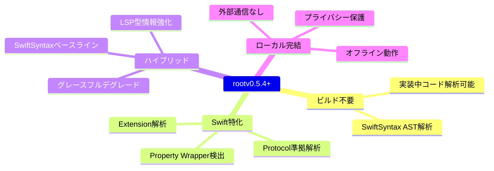
```mermaid
mindmap
  rootv0.5.4+
    ビルド不要
      実装中コード解析可能
      SwiftSyntax AST解析
    Swift特化
      Property Wrapper検出
      Protocol準拠解析
      Extension解析
    ハイブリッド
      SwiftSyntaxベースライン
      LSP型情報強化
      グレースフルデグレード
    ローカル完結
      外部通信なし
      プライバシー保護
      オフライン動作
```

---

### 1.2 システム全体構成

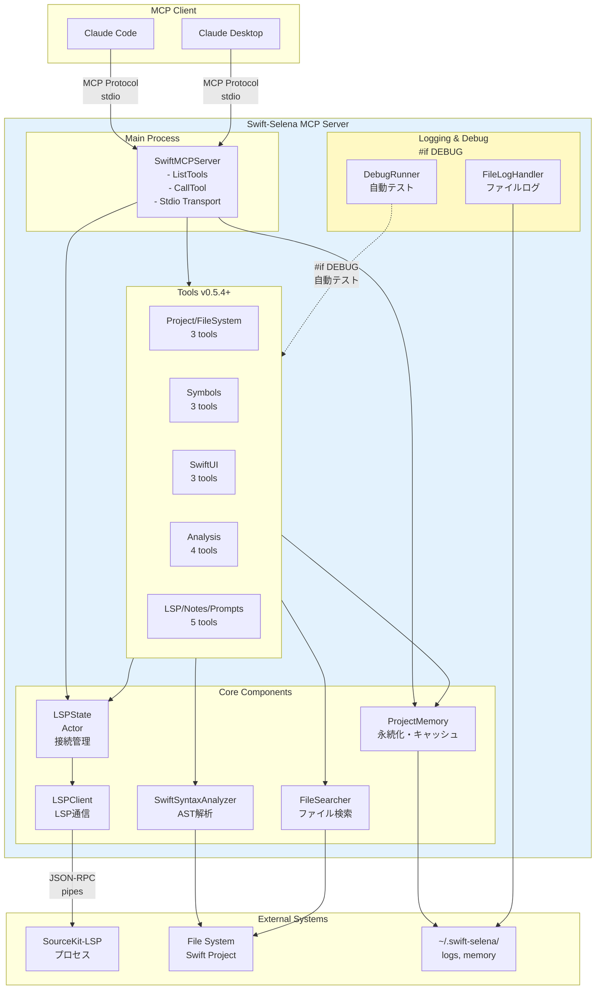
```mermaid
graph TB
    subgraph Client["MCP Client"]
        CC[Claude Code]
        CD[Claude Desktop]
    end

    subgraph Server["Swift-Selena MCP Server"]
        subgraph Main["Main Process"]
            SMCP[SwiftMCPServer<br/>- ListTools<br/>- CallTool<br/>- Stdio Transport]
        end

        subgraph Components["Core Components"]
            LS[LSPState<br/>Actor<br/>接続管理]
            LC[LSPClient<br/>LSP通信]
            PM[ProjectMemory<br/>永続化・キャッシュ]
            SA[SwiftSyntaxAnalyzer<br/>AST解析]
            FS[FileSearcher<br/>ファイル検索]
        end

        subgraph Tools["Tools v0.5.4+"]
            T1[Project/FileSystem<br/>3 tools]
            T2[Symbols<br/>3 tools]
            T3[SwiftUI<br/>3 tools]
            T4[Analysis<br/>4 tools]
            T5[LSP/Notes/Prompts<br/>5 tools]
        end

        subgraph Debug["Logging & Debug<br/>#if DEBUG"]
            FL[FileLogHandler<br/>ファイルログ]
            DR[DebugRunner<br/>自動テスト]
        end
    end

    subgraph External["External Systems"]
        SKLSP[SourceKit-LSP<br/>プロセス]
        FS2[File System<br/>Swift Project]
        LOGS[~/.swift-selena/<br/>logs, memory]
    end

    CC -->|MCP Protocol<br/>stdio| SMCP
    CD -->|MCP Protocol<br/>stdio| SMCP

    SMCP --> LS
    SMCP --> PM
    SMCP --> Tools

    LS --> LC
    LC -->|JSON-RPC<br/>pipes| SKLSP

    Tools --> SA
    Tools --> FS
    Tools --> PM
    Tools --> LS

    SA --> FS2
    FS --> FS2
    PM --> LOGS
    FL --> LOGS

    DR -.->|#if DEBUG<br/>自動テスト| Tools

    style Server fill:#e3f2fd
    style Debug fill:#fff9c4
```

---

### 1.3 技術スタック

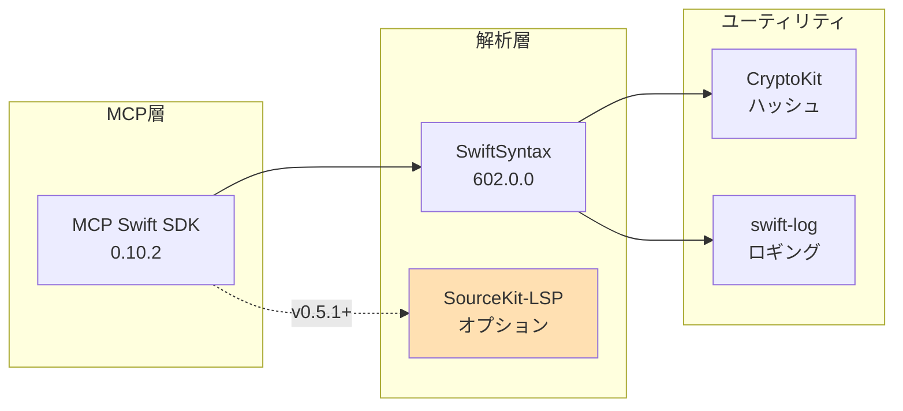
```mermaid
graph LR
    subgraph MCPLayer["MCP層"]
        MCP[MCP Swift SDK<br/>0.10.2]
    end

    subgraph AnalysisLayer["解析層"]
        SS[SwiftSyntax<br/>602.0.0]
        LSP[SourceKit-LSP<br/>オプション]
    end

    subgraph Utility["ユーティリティ"]
        CK[CryptoKit<br/>ハッシュ]
        LOG[swift-log<br/>ロギング]
    end

    MCP --> SS
    MCP -.->|v0.5.1+| LSP
    SS --> CK
    SS --> LOG

    style LSP fill:#ffe0b2
```

---

## 2. コアコンポーネント設計

### 2.1 SwiftMCPServer

**責務:** MCPサーバーのエントリポイント、ライフサイクル管理

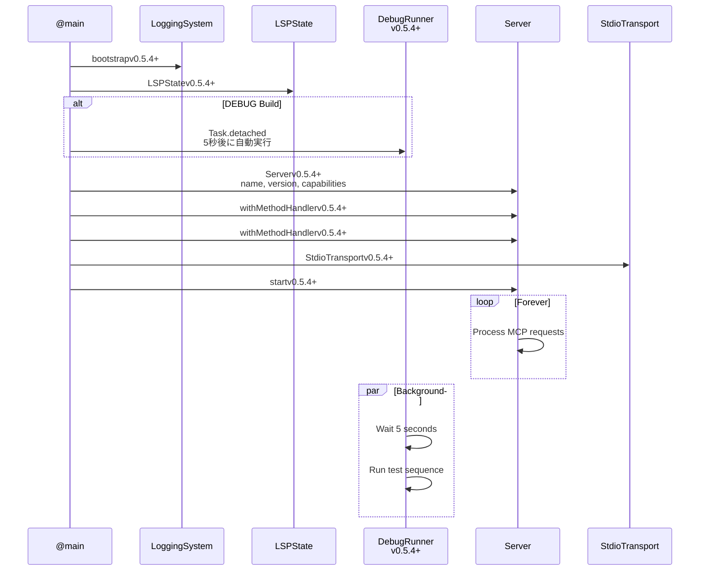
```mermaid
sequenceDiagram
    participant Main as @main
    participant Log as LoggingSystem
    participant LSP as LSPState
    participant DBG as DebugRunner<br/>v0.5.4+
    participant SVR as Server
    participant STD as StdioTransport

    Main->>Log: bootstrapv0.5.4+
    Main->>LSP: LSPStatev0.5.4+

    alt DEBUG Build
        Main->>DBG: Task.detached<br/>5秒後に自動実行
    end

    Main->>SVR: Serverv0.5.4+<br/>name, version, capabilities
    Main->>SVR: withMethodHandlerv0.5.4+
    Main->>SVR: withMethodHandlerv0.5.4+
    Main->>STD: StdioTransportv0.5.4+
    Main->>SVR: startv0.5.4+

    loop Forever
        SVR->>SVR: Process MCP requests
    end

    par Background
        DBG->>DBG: Wait 5 seconds
        DBG->>DBG: Run test sequence
    end
```

---

### 2.2 動的ツールリスト

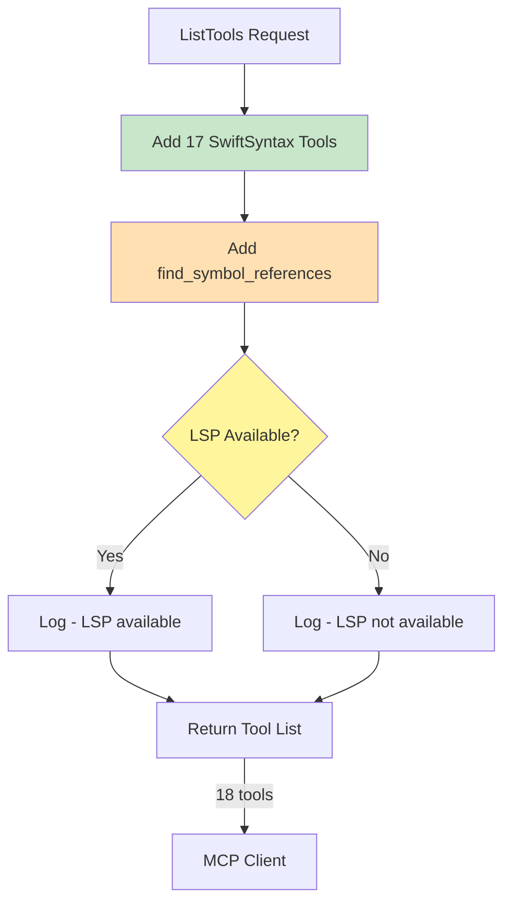
```mermaid
graph TB
    Start[ListTools Request]
    Check{LSP Available?}
    Add17[Add 17 SwiftSyntax Tools]
    Add1[Add find_symbol_references]
    Return[Return Tool List]

    Start --> Add17
    Add17 --> Add1
    Add1 --> Check
    Check -->|Yes| Log1[Log - LSP available]
    Check -->|No| Log2[Log - LSP not available]
    Log1 --> Return
    Log2 --> Return

    Return --> |18 tools| Client[MCP Client]

    style Add17 fill:#c8e6c9
    style Add1 fill:#ffe0b2
    style Check fill:#fff59d
```

**重要:** v0.5.3からfind_symbol_referencesを**常に含める**（実行時にLSPチェック）

---

### 2.3 ツール実行フロー

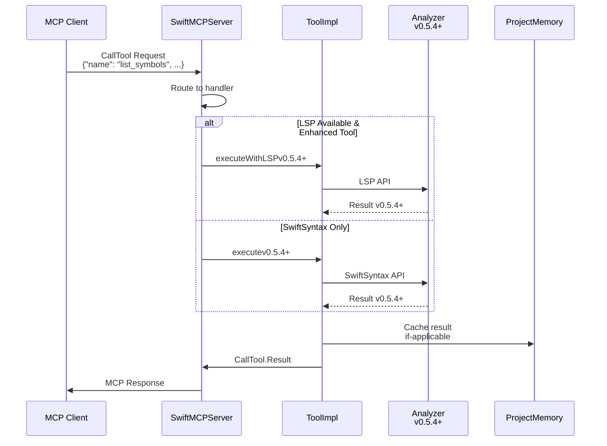
```mermaid
sequenceDiagram
    participant Client as MCP Client
    participant Server as SwiftMCPServer
    participant Tool as ToolImpl
    participant Analyzer as Analyzer<br/>v0.5.4+
    participant PM as ProjectMemory

    Client->>Server: CallTool Request<br/>{"name": "list_symbols", ...}
    Server->>Server: Route to handler

    alt LSP Available & Enhanced Tool
        Server->>Tool: executeWithLSPv0.5.4+
        Tool->>Analyzer: LSP API
        Analyzer-->>Tool: Result v0.5.4+
    else SwiftSyntax Only
        Server->>Tool: executev0.5.4+
        Tool->>Analyzer: SwiftSyntax API
        Analyzer-->>Tool: Result v0.5.4+
    end

    Tool->>PM: Cache result<br/>if-applicable
    Tool->>Server: CallTool.Result
    Server->>Client: MCP Response
```

---

### 2.4 ProjectMemory データ構造

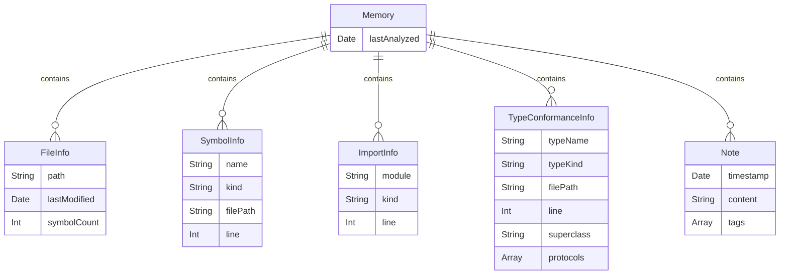
```mermaid
erDiagram
    Memory ||--o{ FileInfo : contains
    Memory ||--o{ SymbolInfo : contains
    Memory ||--o{ ImportInfo : contains
    Memory ||--o{ TypeConformanceInfo : contains
    Memory ||--o{ Note : contains

    Memory {
        Date lastAnalyzed
    }

    FileInfo {
        String path
        Date lastModified
        Int symbolCount
    }

    SymbolInfo {
        String name
        String kind
        String filePath
        Int line
    }

    ImportInfo {
        String module
        String kind
        Int line
    }

    TypeConformanceInfo {
        String typeName
        String typeKind
        String filePath
        Int line
        String superclass
        Array protocols
    }

    Note {
        Date timestamp
        String content
        Array tags
    }
```

**保存場所:**
```
~/.swift-selena/
  └── clients/{clientId}/
      └── projects/{projectName}-{hash}/
          └── memory.json
```

---

### 2.5 LSP統合アーキテクチャ（v0.5.1+）

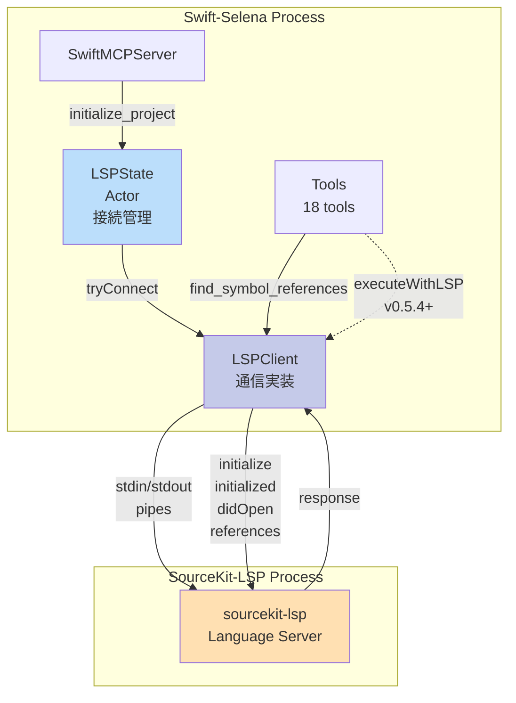
```mermaid
graph TB
    subgraph SwiftSelenaProcess["Swift-Selena Process"]
        SMCP[SwiftMCPServer]
        LSPState[LSPState<br/>Actor<br/>接続管理]
        LSPClient[LSPClient<br/>通信実装]
        Tools[Tools<br/>18 tools]
    end

    subgraph SourceKitLSPProcess["SourceKit-LSP Process"]
        SKLSP[sourcekit-lsp<br/>Language Server]
    end

    SMCP -->|initialize_project| LSPState
    LSPState -->|tryConnect| LSPClient
    LSPClient -->|stdin/stdout<br/>pipes| SKLSP

    Tools -->|find_symbol_references| LSPClient
    Tools -.->|executeWithLSP<br/>v0.5.4+| LSPClient

    LSPClient -->|initialize<br/>initialized<br/>didOpen<br/>references| SKLSP
    SKLSP -->|response| LSPClient

    style LSPState fill:#bbdefb
    style LSPClient fill:#c5cae9
    style SKLSP fill:#ffe0b2
```

---

## 3. データフロー設計

### 3.1 ツール実行の基本フロー

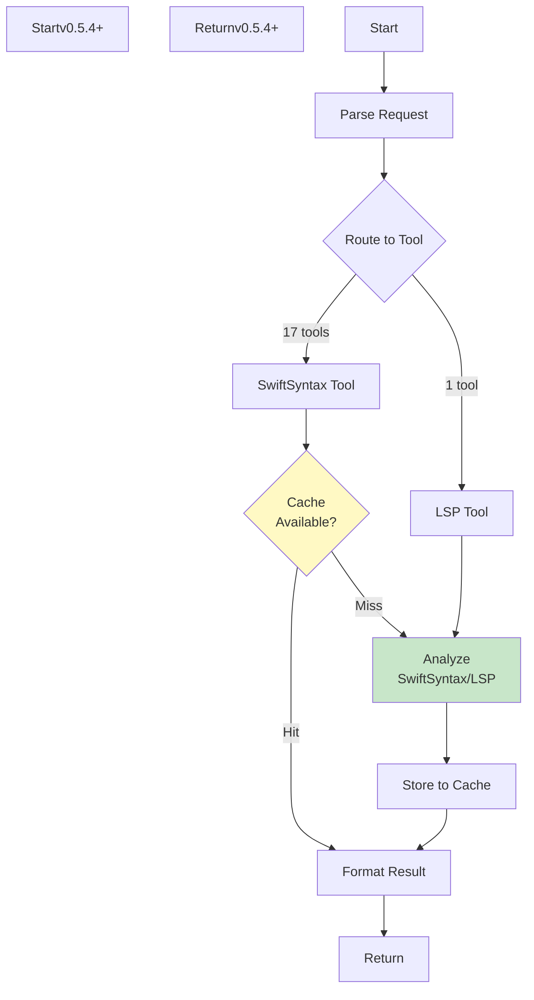
```mermaid
flowchart TD
    Startv0.5.4+
    Parse[Parse Request]
    Route{Route to Tool}

    Tool1[SwiftSyntax Tool]
    Tool2[LSP Tool]

    Cache{Cache<br/>Available?}
    Analyze[Analyze<br/>SwiftSyntax/LSP]
    Store[Store to Cache]
    Format[Format Result]
    Returnv0.5.4+

    Start --> Parse
    Parse --> Route

    Route -->|17 tools| Tool1
    Route -->|1 tool| Tool2

    Tool1 --> Cache
    Tool2 --> Analyze

    Cache -->|Hit| Format
    Cache -->|Miss| Analyze

    Analyze --> Store
    Store --> Format
    Format --> Return

    style Cache fill:#fff9c4
    style Analyze fill:#c8e6c9
```

---

### 3.2 LSP接続フロー

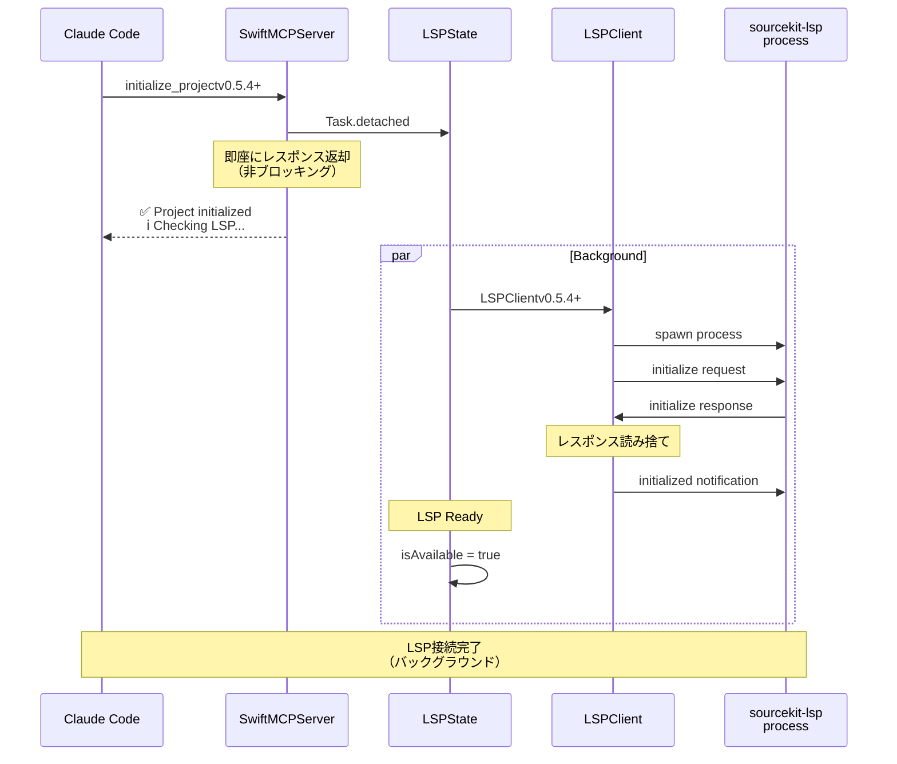
```mermaid
sequenceDiagram
    participant User as Claude Code
    participant SMCP as SwiftMCPServer
    participant LSP as LSPState
    participant Client as LSPClient
    participant Proc as sourcekit-lsp<br/>process

    User->>SMCP: initialize_projectv0.5.4+

    SMCP->>LSP: Task.detached

    Note over SMCP: 即座にレスポンス返却<br/>（非ブロッキング）

    SMCP-->>User: ✅ Project initialized<br/>ℹ️ Checking LSP...

    par Background
        LSP->>Client: LSPClientv0.5.4+
        Client->>Proc: spawn process
        Client->>Proc: initialize request
        Proc->>Client: initialize response
        Note over Client: レスポンス読み捨て
        Client->>Proc: initialized notification
        Note over LSP: LSP Ready
        LSP->>LSP: isAvailable = true
    end

    Note over User,Proc: LSP接続完了<br/>（バックグラウンド）
```

---

### 3.3 キャッシュフロー

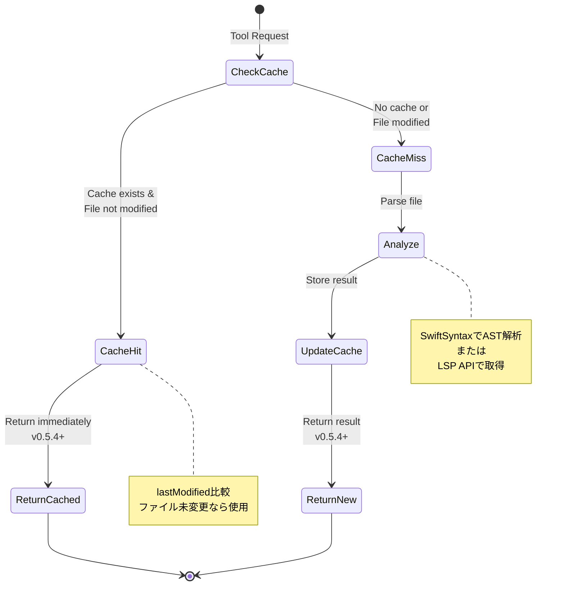
```mermaid
stateDiagram-v2
    [*] --> CheckCache: Tool Request

    CheckCache --> CacheHit: Cache exists &<br/>File not modified
    CheckCache --> CacheMiss: No cache or<br/>File modified

    CacheHit --> ReturnCached: Return immediately<br/>v0.5.4+
    CacheMiss --> Analyze: Parse file

    Analyze --> UpdateCache: Store result
    UpdateCache --> ReturnNew: Return result<br/>v0.5.4+

    ReturnCached --> [*]
    ReturnNew --> [*]

    note right of CacheHit
        lastModified比較
        ファイル未変更なら使用
    end note

    note right of Analyze
        SwiftSyntaxでAST解析
        または
        LSP APIで取得
    end note
```

---

## 4. コンポーネント責務

### 4.1 コンポーネント関係図

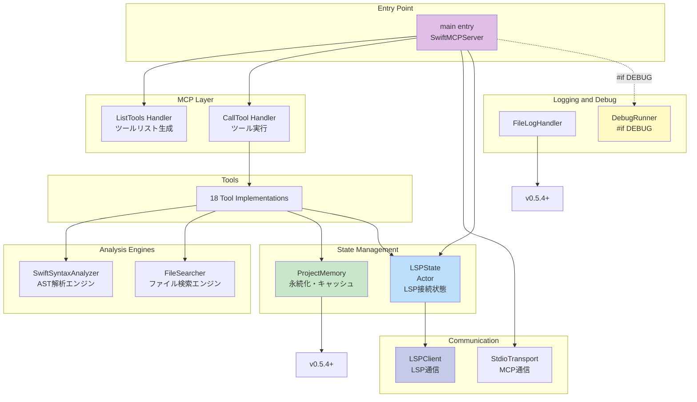
```mermaid
graph TB
    subgraph EntryPoint["Entry Point"]
        Main["main entry<br/>SwiftMCPServer"]
    end

    subgraph MCPLayer["MCP Layer"]
        LT[ListTools Handler<br/>ツールリスト生成]
        CT[CallTool Handler<br/>ツール実行]
    end

    subgraph StateManagement["State Management"]
        LS[LSPState<br/>Actor<br/>LSP接続状態]
        PM[ProjectMemory<br/>永続化・キャッシュ]
    end

    subgraph Communication["Communication"]
        LC[LSPClient<br/>LSP通信]
        ST[StdioTransport<br/>MCP通信]
    end

    subgraph AnalysisEngines["Analysis Engines"]
        SA[SwiftSyntaxAnalyzer<br/>AST解析エンジン]
        FS[FileSearcher<br/>ファイル検索エンジン]
    end

    subgraph Tools["Tools"]
        T[18 Tool Implementations]
    end

    subgraph LoggingDebug["Logging and Debug"]
        FL[FileLogHandler]
        DR[DebugRunner<br/>#if DEBUG]
    end

    Main --> LT
    Main --> CT
    Main --> ST
    Main --> LS
    Main -.->|#if DEBUG| DR

    CT --> T
    T --> SA
    T --> FS
    T --> PM
    T --> LS

    LS --> LC

    FL --> Log[v0.5.4+]
    PM --> Mem[v0.5.4+]

    style Main fill:#e1bee7
    style LS fill:#bbdefb
    style LC fill:#c5cae9
    style PM fill:#c8e6c9
    style DR fill:#fff9c4
```

---

### 4.2 責務マトリクス

| コンポーネント | 責務 | 依存先 | 並行性 |
|--------------|------|--------|--------|
| **SwiftMCPServer** | MCPサーバー制御 | 全コンポーネント | Main Actor |
| **LSPState** | LSP接続状態管理 | LSPClient | Actor（スレッドセーフ） |
| **LSPClient** | SourceKit-LSP通信 | なし | Class |
| **ProjectMemory** | 永続化・キャッシュ | FileManager | Class |
| **SwiftSyntaxAnalyzer** | AST解析 | SwiftSyntax | Enum（stateless） |
| **FileSearcher** | ファイル検索 | FileManager | Enum（stateless） |
| **FileLogHandler** | ログ出力 | FileHandle | Struct |
| **DebugRunner** | 自動テスト | LSPState, Tools | Actor（#if DEBUG） |

---

## 5. ファイル構成

### 5.1 ディレクトリ構造

```
Sources/
├── SwiftMCPServer.swift          # エントリポイント (Generic)
├── Constants.swift                # 定数定義 (Generic)
│
├── Logging/                       # v0.5.3+ (Generic)
│   └── FileLogHandler.swift       # ファイルログ
│
├── Tools/                         # ツール群
│   ├── ToolProtocol.swift         # MCPTool protocol (Generic)
│   ├── Project/
│   │   └── InitializeProjectTool.swift
│   ├── FileSystem/
│   │   ├── FindFilesTool.swift
│   │   ├── SearchCodeTool.swift
│   │   └── SearchFilesWithoutPatternTool.swift
│   ├── Symbols/
│   │   ├── ListSymbolsTool.swift
│   │   └── FindSymbolDefinitionTool.swift
│   ├── SwiftUI/
│   │   ├── ListPropertyWrappersTool.swift
│   │   ├── ListProtocolConformancesTool.swift
│   │   └── ListExtensionsTool.swift
│   ├── Analysis/
│   │   ├── AnalyzeImportsTool.swift
│   │   ├── GetTypeHierarchyTool.swift
│   │   └── FindTestCasesTool.swift
│   └── Meta/
│       ├── ExecuteToolTool.swift
│       ├── GetToolSchemaTool.swift
│       ├── ListAvailableToolsTool.swift
│       └── MetaToolRegistry.swift
│
└── Selena/                        # Swift-Selena固有 (Project-specific)
    ├── Core/
    │   ├── ProjectMemory.swift    # 永続化
    │   ├── SwiftSyntaxAnalyzer.swift  # AST解析
    │   └── FileSearcher.swift     # ファイル検索
    ├── Cache/
    │   ├── CacheManager.swift
    │   ├── CacheGarbageCollector.swift
    │   └── FileCacheEntry.swift
    ├── LSP/                       # v0.5.1+
    │   ├── LSPState.swift         # 接続管理
    │   └── LSPClient.swift        # 通信実装
    ├── Visitors/                  # SwiftSyntax Visitors
    │   ├── SymbolVisitor.swift
    │   ├── PropertyWrapperVisitor.swift
    │   ├── ExtensionVisitor.swift
    │   ├── TypeConformanceVisitor.swift
    │   ├── ImportVisitor.swift
    │   ├── SwiftTestingVisitor.swift
    │   └── XCTestVisitor.swift
    └── DebugRunner.swift          # デバッグ用
```

---

## 6. 設計原則の実装

### 6.1 ビルド非依存性

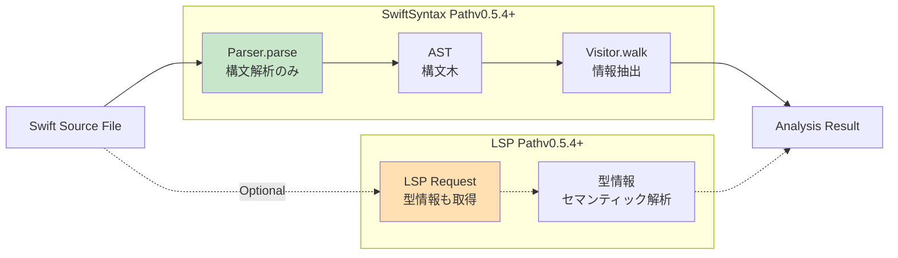
```mermaid
graph LR
    Input[Swift Source File]

    subgraph SwiftSyntaxPath["SwiftSyntax Pathv0.5.4+"]
        Parse[Parser.parse<br/>構文解析のみ]
        AST[AST<br/>構文木]
        Visitor[Visitor.walk<br/>情報抽出]
    end

    subgraph LSPPath["LSP Pathv0.5.4+"]
        LSPReq[LSP Request<br/>型情報も取得]
        TypeInfo[型情報<br/>セマンティック解析]
    end

    Result[Analysis Result]

    Input --> Parse
    Parse --> AST
    AST --> Visitor
    Visitor --> Result

    Input -.->|Optional| LSPReq
    LSPReq -.-> TypeInfo
    TypeInfo -.-> Result

    style Parse fill:#c8e6c9
    style LSPReq fill:#ffe0b2
```

**保証:**
- 構文が正しければSwiftSyntaxで解析可能
- ビルドエラー（型エラー等）は無視
- LSPは**オプション強化**（必須ではない）

---

### 6.2 グレースフルデグレード

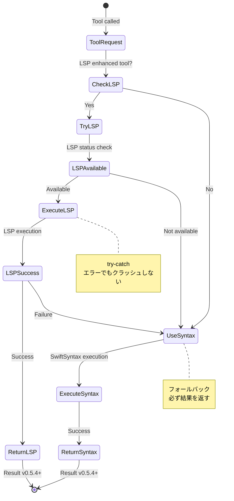
```mermaid
stateDiagram-v2
    [*] --> ToolRequest: Tool called

    ToolRequest --> CheckLSP: LSP enhanced tool?

    CheckLSP --> TryLSP: Yes
    CheckLSP --> UseSyntax: No

    TryLSP --> LSPAvailable: LSP status check

    LSPAvailable --> ExecuteLSP: Available
    LSPAvailable --> UseSyntax: Not available

    ExecuteLSP --> LSPSuccess: LSP execution
    LSPSuccess --> ReturnLSP: Success
    LSPSuccess --> UseSyntax: Failure

    UseSyntax --> ExecuteSyntax: SwiftSyntax execution
    ExecuteSyntax --> ReturnSyntax: Success

    ReturnLSP --> [*]: Result v0.5.4+
    ReturnSyntax --> [*]: Result v0.5.4+

    note right of UseSyntax
        フォールバック
        必ず結果を返す
    end note

    note right of ExecuteLSP
        try-catch
        エラーでもクラッシュしない
    end note
```

---

### 6.3 ローカル完結性

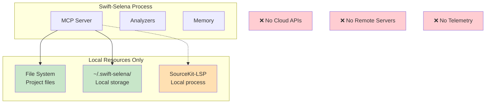
```mermaid
graph TB
    subgraph SwiftSelenaProcess["Swift-Selena Process"]
        Server[MCP Server]
        Analyzer[Analyzers]
        Memory[Memory]
    end

    subgraph LocalResourcesOnly["Local Resources Only"]
        FS[File System<br/>Project files]
        Storage[~/.swift-selena/<br/>Local storage]
        LSP[SourceKit-LSP<br/>Local process]
    end

    Server --> FS
    Server --> Storage
    Server -.-> LSP

    Note1["❌ No Cloud APIs"]
    Note2["❌ No Remote Servers"]
    Note3["❌ No Telemetry"]

    style Note1 fill:#ffcdd2
    style Note2 fill:#ffcdd2
    style Note3 fill:#ffcdd2
    style FS fill:#c8e6c9
    style Storage fill:#c8e6c9
    style LSP fill:#ffe0b2
```

**保証:**
- ネットワーク通信なし
- 全データはローカル保存
- プライバシー完全保護

---

## 7. パフォーマンス設計

### 7.1 キャッシュ戦略

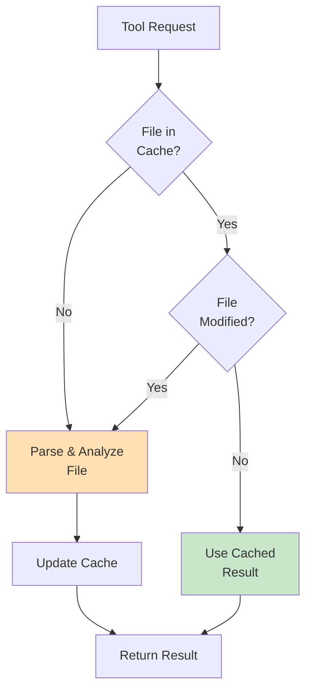
```mermaid
graph TB
    Request[Tool Request]
    Check{File in<br/>Cache?}
    Modified{File<br/>Modified?}
    UseCache[Use Cached<br/>Result]
    Analyze[Parse & Analyze<br/>File]
    Update[Update Cache]
    Return[Return Result]

    Request --> Check
    Check -->|No| Analyze
    Check -->|Yes| Modified

    Modified -->|No| UseCache
    Modified -->|Yes| Analyze

    Analyze --> Update
    Update --> Return
    UseCache --> Return

    style UseCache fill:#c8e6c9
    style Analyze fill:#ffe0b2
```

**キャッシュ種類:**
- fileIndex: ファイル変更検出
- symbolCache: シンボル定義キャッシュ
- importCache: Import情報
- typeConformanceCache: Protocol準拠情報

---

### 7.2 パフォーマンス最適化ポイント

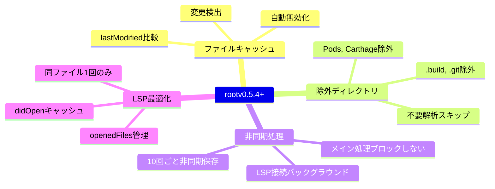
```mermaid
mindmap
  rootv0.5.4+
    ファイルキャッシュ
      lastModified比較
      変更検出
      自動無効化
    除外ディレクトリ
      .build, .git除外
      Pods, Carthage除外
      不要解析スキップ
    非同期処理
      LSP接続バックグラウンド
      メイン処理ブロックしない
      10回ごと非同期保存
    LSP最適化
      didOpenキャッシュ
      同ファイル1回のみ
      openedFiles管理
```

---

## 8. エラーハンドリング設計

### 8.1 エラー分類と対処

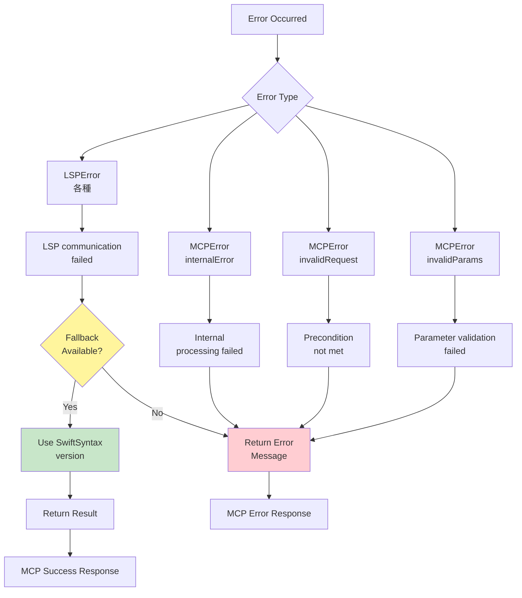
```mermaid
graph TD
    Error[Error Occurred]
    Type{Error Type}

    InvalidParams[MCPError<br/>invalidParams]
    InvalidRequest[MCPError<br/>invalidRequest]
    InternalError[MCPError<br/>internalError]
    LSPError[LSPError<br/>各種]

    HandleParams[Parameter validation<br/>failed]
    HandleRequest[Precondition<br/>not met]
    HandleInternal[Internal<br/>processing failed]
    HandleLSP[LSP communication<br/>failed]

    Fallback{Fallback<br/>Available?}
    UseFallback[Use SwiftSyntax<br/>version]
    ReturnError[Return Error<br/>Message]

    Error --> Type

    Type --> InvalidParams
    Type --> InvalidRequest
    Type --> InternalError
    Type --> LSPError

    InvalidParams --> HandleParams --> ReturnError
    InvalidRequest --> HandleRequest --> ReturnError
    InternalError --> HandleInternal --> ReturnError
    LSPError --> HandleLSP --> Fallback

    Fallback -->|Yes| UseFallback
    Fallback -->|No| ReturnError

    UseFallback --> Success[Return Result]
    ReturnError --> End[MCP Error Response]
    Success --> End2[MCP Success Response]

    style Fallback fill:#fff59d
    style UseFallback fill:#c8e6c9
    style ReturnError fill:#ffcdd2
```

---

### 8.2 エラーメッセージ設計

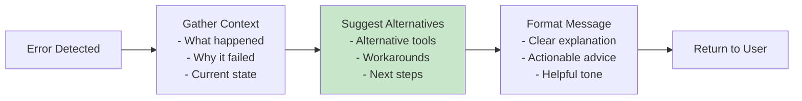
```mermaid
graph LR
    Error[Error Detected]
    Context[Gather Context<br/>- What happened<br/>- Why it failed<br/>- Current state]
    Suggest[Suggest Alternatives<br/>- Alternative tools<br/>- Workarounds<br/>- Next steps]
    Format[Format Message<br/>- Clear explanation<br/>- Actionable advice<br/>- Helpful tone]
    Return[Return to User]

    Error --> Context
    Context --> Suggest
    Suggest --> Format
    Format --> Return

    style Suggest fill:#c8e6c9
```

**例:**
```
❌ LSP not available.

This tool requires a buildable project with SourceKit-LSP.

💡 Alternatives:
- Use 'find_type_usages' for type-level reference search
- Use 'search_code' for text-based search
```

---

## 9. セキュリティ設計

### 9.1 ファイルアクセス制御

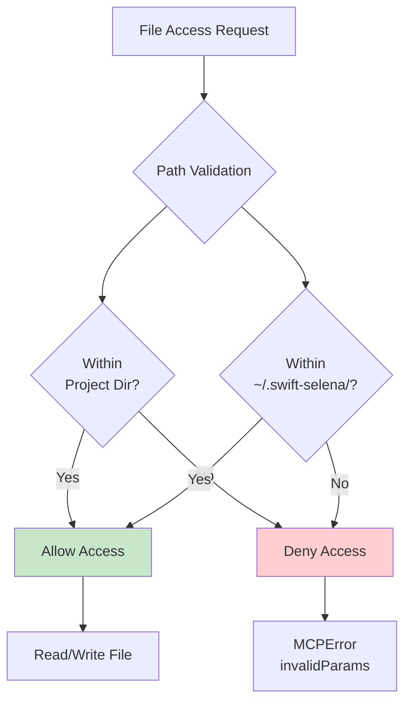
```mermaid
graph TD
    Request[File Access Request]
    Validate{Path Validation}
    InProject{Within<br/>Project Dir?}
    InStorage{Within<br/>~/.swift-selena/?}
    Allow[Allow Access]
    Deny[Deny Access]

    Request --> Validate
    Validate --> InProject
    Validate --> InStorage

    InProject -->|Yes| Allow
    InProject -->|No| Deny

    InStorage -->|Yes| Allow
    InStorage -->|No| Deny

    Allow --> Read[Read/Write File]
    Deny --> Error[MCPError<br/>invalidParams]

    style Allow fill:#c8e6c9
    style Deny fill:#ffcdd2
```

**アクセス可能:**
- ✅ プロジェクトディレクトリ配下
- ✅ ~/.swift-selena/（メタデータ、ログ）

**アクセス不可:**
- ❌ プロジェクト外
- ❌ システムファイル
- ❌ 他ユーザーディレクトリ

---

### 9.2 データプライバシー

```mermaid
graph LR
    Code[Source Code]
    Analysis[Local Analysis<br/>SwiftSyntax/LSP]
    Memory[Local Storage<br/>~/.swift-selena/]
    Result[Result to Claude]

    Code --> Analysis
    Analysis --> Memory
    Analysis --> Result

    style Analysis fill:#c8e6c9
    style Memory fill:#c8e6c9
```

---

## 10. デプロイメント

### 10.1 ビルド構成

```mermaid
graph TD
    Source[Source Code]

    Debug[Debug Build<br/>swift build]
    Release[Release Build<br/>swift build -c release]

    DebugBin[.build/debug/<br/>Swift-Selena]
    ReleaseBin[.build/release/<br/>Swift-Selena]

    DebugFeatures[+ DebugRunner<br/>+ Debug logs<br/>+ Assertions]
    ReleaseFeatures[- DebugRunner<br/>Optimized<br/>Size reduced]

    Source --> Debug
    Source --> Release

    Debug --> DebugBin
    Release --> ReleaseBin

    DebugBin --> DebugFeatures
    ReleaseBin --> ReleaseFeatures

    style DebugBin fill:#fff9c4
    style ReleaseBin fill:#c8e6c9
```

---

### 10.2 インストールフロー

```mermaid
sequenceDiagram
    participant Dev as Developer
    participant Script as Setup Script
    participant Config as MCP Config
    participant Claude as Claude App

    Dev->>Script: ./register-selena-to-claude-code.sh
    Script->>Script: Verify executable exists
    Script->>Config: Backup existing config
    Script->>Config: Add Swift-Selena entry
    Script->>Script: Set MCP_CLIENT_ID
    Script-->>Dev: ✅ Setup complete

    Dev->>Claude: Restart Claude Code
    Claude->>Config: Load MCP config
    Claude->>Claude: Spawn Swift-Selena process
    Claude->>Claude: ListTools request
    Claude-->>Dev: Swift-Selena tools available
```

---

### 10.3 複数クライアント対応

```mermaid
graph TB
    subgraph ClaudeCode["Claude Code"]
        CC[Claude Code<br/>MCP Client]
        CCProc[Swift-Selena<br/>Process]
        CCEnv[MCP_CLIENT_ID=<br/>claude-code]
    end

    subgraph ClaudeDesktop["Claude Desktop"]
        CD[Claude Desktop<br/>MCP Client]
        CDProc[Swift-Selena<br/>Process]
        CDEnv[MCP_CLIENT_ID=<br/>claude-desktop]
    end

    subgraph SharedStorage["Shared Storage"]
        Storage[~/.swift-selena/]
        CCData[clients/claude-code/<br/>projects/...]
        CDData[clients/claude-desktop/<br/>projects/...]
    end

    CC --> CCProc
    CCProc --> CCEnv
    CCEnv --> CCData

    CD --> CDProc
    CDProc --> CDEnv
    CDEnv --> CDData

    CCData --> Storage
    CDData --> Storage

    style CCData fill:#bbdefb
    style CDData fill:#c5cae9
```

**分離保証:**
- クライアントIDでディレクトリ分離
- 同じプロジェクトでも干渉しない

---

## 11. 将来の拡張性

### 11.1 アーキテクチャ拡張ポイント

```mermaid
graph TB
    Current[Current v0.5.3<br/>SwiftSyntax + LSP]

    V6[v0.6.0<br/>Code Header DB]
    V7[v0.7.0<br/>Vector Search]
    V8[v0.8.0<br/>Analytics]

    NL[NaturalLanguage<br/>形態素解析]
    ML[CreateML<br/>ベクトル埋め込み]
    Stats[Statistics<br/>メトリクス]

    Current --> V6
    V6 --> V7
    V7 --> V8

    V6 -.-> NL
    V7 -.-> ML
    V8 -.-> Stats

    style Current fill:#c8e6c9
    style V6 fill:#fff9c4
    style V7 fill:#ffe0b2
    style V8 fill:#ffccbc
```

---

### 11.2 拡張可能な設計

**新ツール追加:**
- MCPToolプロトコル準拠で簡単追加
- 15-30分/ツール

**新Visitor追加:**
- SyntaxVisitorパターンで統一
- 30-60分/Visitor

**新LSP API追加:**
- findReferencesv0.5.4+パターンを踏襲
- 30分/API

---

## 12. 制限事項

### 12.1 技術的制限

```mermaid
mindmap
  rootv0.5.4+
    SwiftSyntax
      型推論不可
      セマンティック解析限定的
      マクロ展開不可
    LSP
      ビルド可能が前提
      Swift Package推奨
      Xcodeプロジェクト非推奨
    スコープ
      単一プロジェクト
      クロスプロジェクト参照不可
      依存ライブラリ解析不可
```

---

## 13. 参照

**要件定義:**
- REQ-001: Swift-Selena全体要件
- REQ-002: LSP統合要件
- REQ-003: コア機能要件

**設計書:**
- DES-102: LSP統合設計
- DES-103: ツール実装設計

**計画:**
- PLAN.md: 開発計画（v0.5.x〜v1.0）
- HISTORY.md: リリース履歴
- CONVERSATION_HISTORY.md: 開発会話履歴

---

**Document Version**: 2.0
**Created**: 2025-10-24
**Last Updated**: 2025-10-24
**Status**: 承認待ち
**Changes**: mermaid図中心に再構成、コード例削減
**Supersedes**: Swift-Selena Design.md, Hybrid-Architecture-Plan.md（部分）
