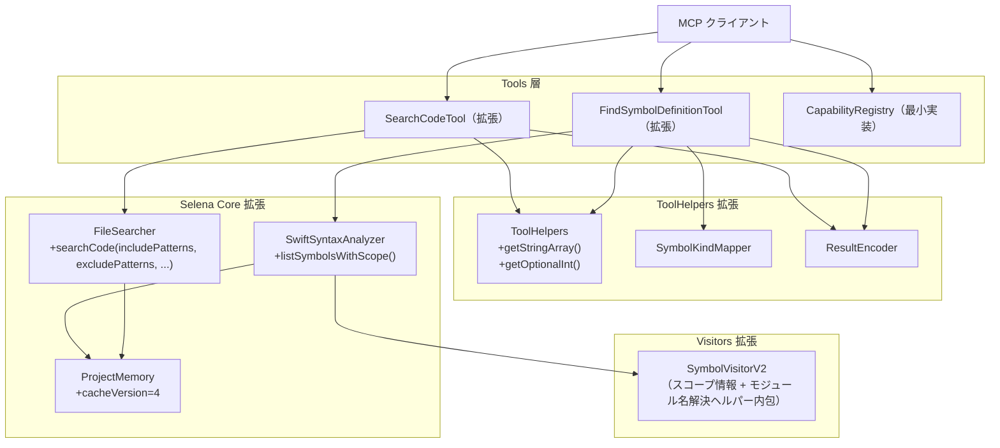
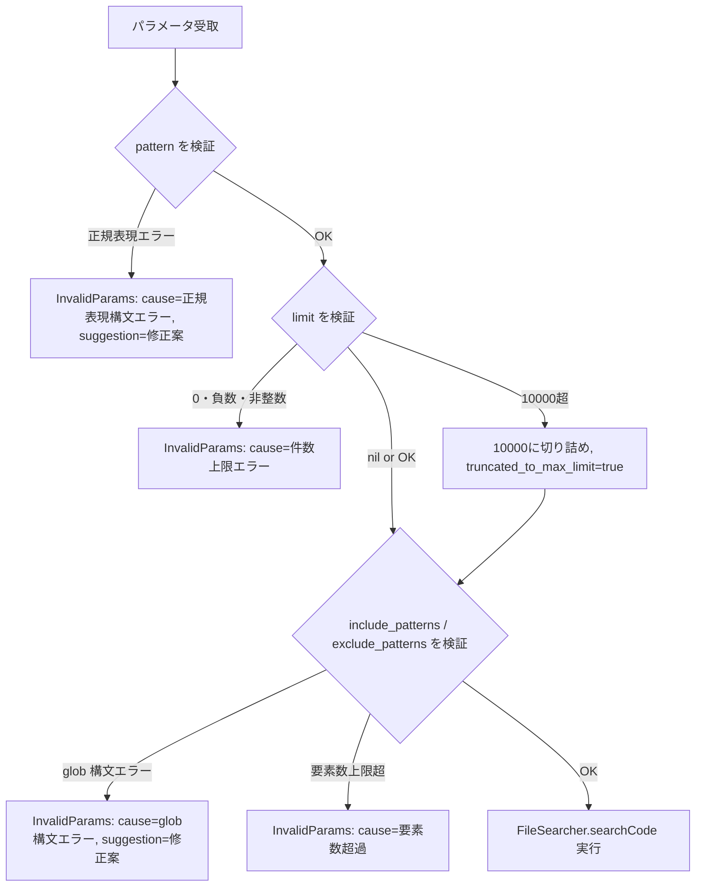
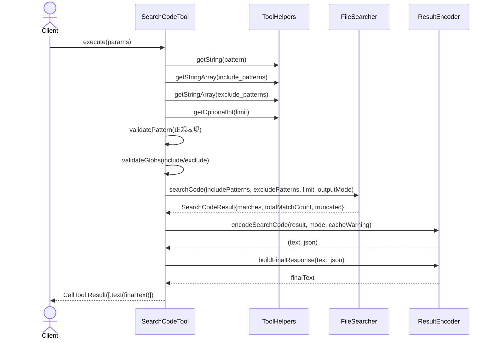
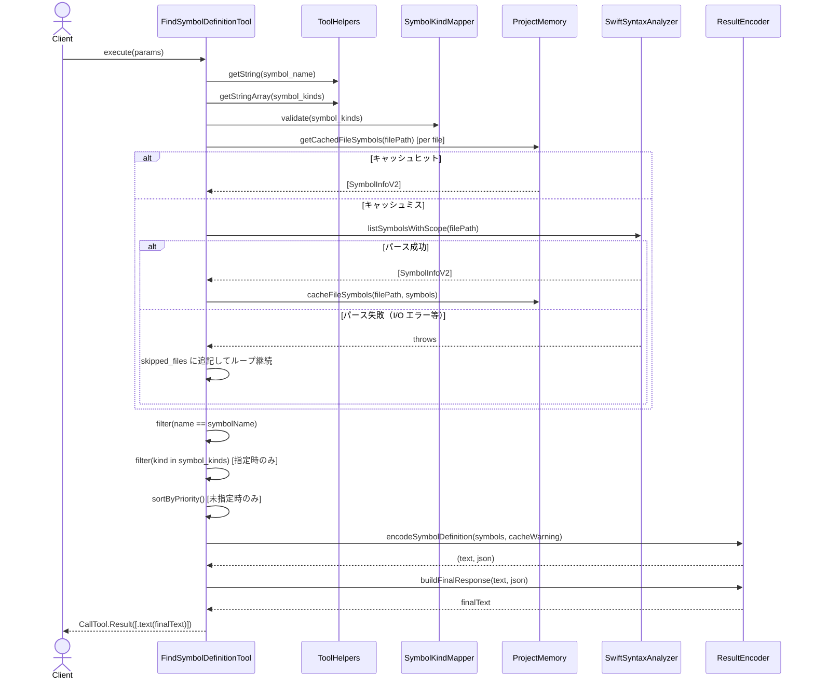

# DES-104 検索・シンボルツール強化 設計書

**設計ID**: DES-104
**関連要件**: REQ-003（search_code / find_symbol_definition 強化）
**ファイル**: design/DES-104_search_symbol_tools_enhancement_design.md

> ℹ️ **本設計書は旧 REQ-005（improve feature「検索・シンボルツール強化」）に対応する。** REQ-005 は v0.6.8 で実装完了し、その要件は REQ-003（コア機能要件）へ統合のうえ削除された（improve → main の spec マージ）。本書中の「REQ-005 §X.X」参照は統合前の要件節を指す歴史的記録であり、対応する現行要件は REQ-003 §2.2 search_code / §2.3 find_symbol_definition である。

## メタデータ

| 項目 | 値 |
|------|-----|
| 設計ID | DES-104 |
| 関連要件 | REQ-003（旧 REQ-005、v0.6.8 で統合） |
| 実装層 | Tools 層 / Selena Core 層 |
| 主要モジュール | |
| - Tool | SearchCodeTool, FindSymbolDefinitionTool |
| - Helper | ToolHelpers, SymbolKindMapper, ResultEncoder |
| - Core | FileSearcher, SwiftSyntaxAnalyzer, ProjectMemory |
| - Visitor | SymbolVisitorV2 |
| - Capability | CapabilityRegistry（最小実装） |
| 作成日 | 2026-05-04 |

※ MCP Server 設計のため、`design_format.md` テンプレートのカテゴリ（Service/Repository/Entity/DataStore 等）の代わりにプロジェクト固有カテゴリを使用する。対応関係: `Tool` = Service 相当、`Core` = DataStore/Repository 相当、`Helper` / `Visitor` / `Capability` = 補助コンポーネント相当。

---

## 1. 概要

`search_code` および `find_symbol_definition` の 2 ツールを強化する。
出力モード・件数上限・ファイルパターン複数指定・構造化結果・シンボル種別フィルタ・所属スコープ情報付与・ケーパビリティ通知に対応する。
既存の呼び出し互換性（後方互換）を維持しながら機能を拡張する方針を取る。

本設計は **REQ-005 が要求する範囲に厳密に対応する最小実装** を旨とする。先回り抽象化・将来拡張のためのインフラ整備（複雑な並行性制御・タイムアウト戦略・状態機械等）は本 Feature に含めない。

---

## 2. TBD 解決

本設計書で以下の未確定事項（REQ-005 §7）をすべて解決する。

### TBD-002: モジュール名取得の精度

**採用方針**: ベストエフォート（SwiftPM ターゲット名推定、`path:` 属性対応）

- `Package.swift` が存在するディレクトリを起点に SwiftPM ターゲット名を読み取る
- `Package.swift` のテキスト内から `.target(...)` / `.executableTarget(...)` / `.testTarget(...)` / `.plugin(...)` / `.binaryTarget(...)` / `.systemLibrary(...)` / `.macro(...)` の各ブロックを **括弧深度で抽出** し、ブロック内の最初の `name: "..."` と（あれば）`path: "..."` を取得する
- 各 target のルートディレクトリを以下で決定し、ファイルパスとの **最長プレフィックス一致** で target 名を返す
  - `path:` 指定あり → `{packageDir}/{path}/`（path が絶対パスならそのまま使用）
  - 未指定 → 規約通り `{packageDir}/Sources/{name}/`
- target ブロック抽出に失敗した場合は旧来の `Sources/{firstName}/` パターン照合へフォールバック
- 取得できない場合は `moduleName: nil` を返す（エラーとしない）
- SwiftPM 構造でない場合（Xcode Only プロジェクト等）も同様に `nil`
- 実装は `SymbolVisitorV2` 内のヘルパーメソッドとして配置し、独立モジュール化はしない

**path: 対応により改善されるケース**:
- ターゲット名とディレクトリ名が一致しない構成（例: `path: "Sources"` でルート直下を割り当てる Swift-Selena 自身）
- 複数 target が同じ親ディレクトリ配下に存在する構成（最長プレフィックスで一意化）
- 非標準パス（例: `path: "Custom/Foo"`）にターゲットを配置する構成

### TBD-004: 構造化結果の表現形式

**採用方針**: テキスト出力の末尾に JSON 構造化ブロックを付加

```
--- structured ---
{"matches":[...],"total":N,"truncated":false}
```

- 既存テキスト出力（行頭フォーマット維持）の後に `\n--- structured ---\n{JSON}` を追記
- クライアントが不要であれば `--- structured ---` セクションを無視できる
- JSON 生成失敗時はテキスト出力のみ返し `[structured output unavailable]` をテキスト末尾に付記

### TBD-005: 小文字スネーク値と表示用 kind 値の対応

`SymbolKindMapper` として実装する：

| 利用者指定値（小文字スネーク） | 表示用 kind 値（SymbolVisitor 出力） |
|-------------------------------|--------------------------------------|
| `struct`                      | `Struct`                             |
| `class`                       | `Class`                              |
| `enum`                        | `Enum`                               |
| `protocol`                    | `Protocol`                           |
| `actor`                       | `Actor`                              |
| `function`                    | `Function`                           |
| `variable`                    | `Variable`                           |
| `typealias`                   | `TypeAlias`                          |
| `extension`                   | `Extension`                          |

`Macro` 種別（`SymbolVisitor` が返す）は利用者指定可能な 9 区分に含まれないため、種別フィルタ未指定時は返却し、種別フィルタ指定時は除外する。

### TBD-006: 件数上限の既定値

**採用方針**: 未指定時は全件返す（無制限）を維持。後方互換のため。

### TBD-007: 解消済み（`file_pattern` 廃止により無効化）

REQ-005 §4.3 で `file_pattern` を本 Feature 廃止対象（破壊的変更）と確定したため解消。詳細は REQ-005 §4.3 / §4.6 を参照。

### TBD-009: 配列要素数上限方針

| 項目 | 上限 | 超過時の挙動 |
|------|------|-------------|
| `include_patterns` 要素数 | 20 件 | 入力エラー（`InvalidParams`） |
| `exclude_patterns` 要素数 | 20 件 | 入力エラー（`InvalidParams`） |
| `symbol_kinds` 要素数 | 9 件（全種別数） | 入力エラー（`InvalidParams`） |

### TBD-010: 件数上限の最大値超過時の挙動

**採用方針**: 内部上限への切り詰め通知方式

- 件数上限の最大値: **10,000**
- 10,000 を超える値が指定された場合: 10,000 に切り詰め、テキスト出力と構造化結果の `truncated_to_max_limit: true` で通知
- 0・負数・整数以外: 入力エラー（`InvalidParams`）として明示

---

## 3. アーキテクチャ概要



---

## 4. モジュール設計

### 4.0 設計原則

**入力検証の責務原則**: 全ツールにおいて、利用者入力（パラメータ）の検証は **Tool 層内で完結** させる。Core 層からの例外スロー経路にエラー検出を依存しない。

- 検証はパラメータ受領直後に実施し、不正値は `ResultEncoder.buildErrorResponse(cause:suggestion:)` で統一フォーマット（`InvalidParams`）として返す
- `SymbolKindMapper.validate()` のような検証ヘルパーも Tool 層ヘルパーとして配置する
- `FileSearcher` 等の Core 層は、Tool 層が検証済みパラメータを渡す前提で動作する

### 4.1 モジュール一覧

| モジュール | ファイルパス | 変更種別 | 責務 |
|-----------|------------|---------|------|
| `SearchCodeTool` | `Sources/Tools/FileSystem/SearchCodeTool.swift` | 変更 | 出力モード・件数上限・複数パターン対応 |
| `FindSymbolDefinitionTool` | `Sources/Tools/Symbols/FindSymbolDefinitionTool.swift` | 変更 | 種別フィルタ・所属スコープ情報付与 |
| `ToolHelpers` | `Sources/Tools/ToolProtocol.swift` | 変更 | 配列・Optional 整数パラメータ取得ヘルパー追加 |
| `SymbolKindMapper` | `Sources/Tools/Symbols/SymbolKindMapper.swift` | **新規** | 利用者指定値↔表示用 kind 値の変換・検証 |
| `ResultEncoder` | `Sources/Tools/ResultEncoder.swift` | **新規** | 構造化結果の JSON エンコード・テキスト整形 |
| `CapabilityRegistry` | `Sources/Tools/Meta/CapabilityRegistry.swift` | **新規** | 利用可能ツール一覧の提供（最小実装） |
| `FileSearcher` | `Sources/Selena/Core/FileSearcher.swift` | 変更 | include/exclude パターン配列対応 |
| `SwiftSyntaxAnalyzer` | `Sources/Selena/Core/SwiftSyntaxAnalyzer.swift` | 変更 | `SymbolInfoV2`（スコープ情報付き）追加 |
| `SymbolVisitorV2` | `Sources/Selena/Visitors/SymbolVisitorV2.swift` | **新規** | スコープ情報取得 + モジュール名解決ヘルパー内包 |
| `ProjectMemory` | `Sources/Selena/Core/ProjectMemory.swift` | 変更 | `cacheVersion=4`、`Memory.SymbolInfo` をスコープ付きに拡張 |
| `ParameterKeys` / `ErrorMessages` | `Sources/Constants.swift` | 変更 | 新規パラメータキー・エラーメッセージ追加 |

### 4.2 SymbolKindMapper の設計

**場所**: `Sources/Tools/Symbols/SymbolKindMapper.swift`

```
SymbolKindMapper（enum で十分。状態を持たない）
├── userInputToDisplayKind(_ input: String) -> String?
│   // 小文字スネーク → 表示用 kind 値。マッピング外は nil
├── displayKindToUserInput(_ kind: String) -> String?
│   // 表示用 kind 値 → 小文字スネーク。マッピング外は nil
├── validate(_ inputs: [String]) throws
│   // 未定義の種別文字列が 1 件でも含まれれば InvalidParams をスロー
│   // エラーメッセージには無効な値を列挙
├── priorityGroup(_ displayKind: String) -> Int
│   // 0: 優先返却対象 (Class/Struct/Enum/Protocol/Actor)
│   // 1: 非優先返却対象 (Function/Variable/TypeAlias/Extension)
│   // 2: 対象外 (Macro など)
└── validUserInputs: [String]  // 定義済み 9 区分の一覧
```

### 4.3 ToolHelpers の拡張設計

`Sources/Tools/ToolProtocol.swift` に追加：

```
ToolHelpers
├── getStringArray(from:key:maxCount:) throws -> [String]
│   // Value.array([.string(...)]) を抽出。maxCount 超過時は InvalidParams
│   // 空配列・省略・null は [] を返す（エラーにしない）
└── getOptionalInt(from:key:) throws -> Int?
    // フィールドが存在しない・null → nil（未指定扱い）
    // .int(v) または .string(s) で Int に変換可能 → Int?
    // フィールドが存在するが変換不可能（例: "abc"） → throws InvalidParams
    // ※省略（nil）と不正型入力（InvalidParams）を明確に区別する
```

### 4.4 FileSearcher の拡張設計

既存の `searchCode(in:pattern:filePattern:)` に加え、以下のオーバーロードを追加：

```swift
static func searchCode(
    in directory: String,
    pattern: String,
    includePatterns: [String],    // 含めるglob配列（空= Swift全体）
    excludePatterns: [String],    // 除くglob配列
    limit: Int?,                  // 件数上限（nil=無制限）
    outputMode: SearchOutputMode  // 出力モード
) throws -> SearchCodeResult
```

後方互換のため既存シグネチャは残し、内部的に新シグネチャへ委譲する。

`SearchOutputMode`（`enum`）:

| ケース | 説明 |
|--------|------|
| `matchDetail` | 既定。ファイル・行番号・マッチ内容を返す |
| `fileList` | ファイル一覧（重複排除）を返す |
| `countOnly` | 件数のみを返す |

`SearchCodeResult`（`struct`）:

| フィールド | 型 | 説明 |
|-----------|-----|------|
| `matches` | `[Match]` | `matchDetail` モードのマッチ結果 |
| `files` | `[String]` | `fileList` モード（重複排除済み） |
| `totalMatchCount` | `Int` | 上限適用前の総マッチ数 |
| `totalFileCount` | `Int` | 上限適用前のファイル数 |
| `truncated` | `Bool` | 件数上限超過フラグ |
| `truncatedToMaxLimit` | `Bool` | 最大値切り詰めフラグ |

`Match`（内部 struct）:

| フィールド | 型 | 説明 |
|-----------|-----|------|
| `file` | `String` | マッチしたファイルの絶対パス |
| `line` | `Int` | マッチした行番号 |
| `content` | `String` | マッチ行のテキスト内容 |

**ファイルパターン評価アルゴリズム**:

1. `includePatterns` が空（未指定・空配列・null） → `.swift` 拡張子一致（既定挙動）
2. `includePatterns` が 1 件以上 → `includePatterns` の OR 結合で対象ファイルを決定
3. `excludePatterns` が 1 件以上 → `excludePatterns` の OR 結合で合致するファイルを除外（include 優先度より除外優先）
4. glob パース失敗（`NSRegularExpression` 生成失敗）→ `InvalidParams` エラー

> **注**: 既存パラメータ `file_pattern` は本 Feature で廃止する破壊的変更（REQ-005 §4.3）。`file_pattern` キーが指定された場合は **未知パラメータとして無視する**（`InvalidParams` エラーは返さない）。代替手段は `include_patterns=["{glob}"]` を利用すること。

**glob パーサー**: 既存の `private static wildcardToRegex()` を `internal static` に変更し、`**/` パターン（サブディレクトリ再帰）をサポートする拡張を加える。

- **採用根拠**: 既存の `searchFilesWithoutPattern()` 等が同関数を継続利用しているため、`internal` 化により呼び出し元の変更なしで `SearchCodeTool` から直接呼び出せる。
- **`**` 変換の実装上の注意**: 現行 `wildcardToRegex()` は文字単位ループで実装されているため、`**` を文字単位で処理すると競合が発生する（先頭 `*` → `.*` 変換 → 後続 `*` がさらに `.*` 変換 → `.*.*`）。`Sources/**/*.swift` 等が意図どおり評価されない異常系が顕在化するため、`**` を事前にプレースホルダー（例: `\u{0001}DOUBLESTAR\u{0001}`）に置換してから文字単位ループを実行し、最後にプレースホルダーを `.*` に展開する実装、または 2 文字先読みによる実装を採用する。

### 4.5 SymbolVisitorV2 と SwiftSyntaxAnalyzer の拡張設計

**SymbolInfoV2**（`SwiftSyntaxAnalyzer` に追加する `struct`）:

| フィールド | 型 | 説明 |
|-----------|-----|------|
| `name` | `String` | シンボル名 |
| `kind` | `String` | 表示用 kind 値（`Class` / `Struct` 等） |
| `line` | `Int` | 宣言開始行 |
| `parentScope` | `String?` | ネスト親の型名（例: `Foo.Button` の `Foo`）。なければ `nil` |
| `extensionTarget` | `String?` | extension 内定義時の対象型名。なければ `nil` |
| `moduleName` | `String?` | SwiftPM ターゲット名（ベストエフォート）。なければ `nil` |

**SymbolVisitorV2**（`Sources/Selena/Visitors/SymbolVisitorV2.swift` 新規）:

- `SymbolVisitor` を継承せず独立実装する（スコープスタック管理の単純さを優先）
- スコープスタック `[(name: String, isExtension: Bool)]` を保持し、型宣言に入るたびに push、抜けるたびに pop
- `ExtensionDeclSyntax` の visit 時に extension 対象型を別途記録し、extension 自身も `kind="Extension"` のシンボルとして登録する（REQ-005 §4.4.1 受入基準）
- スタック push（スコープ管理）とシンボル登録（返却対象）は独立した処理として両立する

**訪問ハンドラ**:

| メソッド | 引数 | 動作 |
|---------|------|------|
| `visit` | `ClassDeclSyntax` 等の型宣言 | `push("TypeName", false)` → `SymbolInfoV2` を追加 → `.visitChildren` |
| `visit` | `ExtensionDeclSyntax` | `push(extendedType, true)` → `SymbolInfoV2(kind="Extension")` を追加 → `.visitChildren` |
| `visitPost` | 型宣言 / `ExtensionDeclSyntax` | スコープスタックを `pop` |

**parentScope / extensionTarget 決定規則**:

| フィールド | 決定規則 |
|-----------|---------|
| `parentScope` | スタックの直近の非 extension エントリ名（なければ `nil`） |
| `extensionTarget` | スタック内の直近の extension エントリ対象型（なければ `nil`） |

補足:
- `ClassDeclSyntax` 以外の型宣言（`Struct` / `Enum` / `Protocol` / `Actor`）も同様に `visit` で push、`visitPost` で pop
- extension 自体を `kind="Extension"` のシンボルとして登録する
- `ExtensionDeclSyntax` の下にある型定義は `extensionTarget = extendedType` として記録

**実装上の制約**:
- `visit` メソッドは必ず `.visitChildren` を返すこと（`.skipChildren` を返すと `visitPost` が呼ばれずスタック崩壊）
- スコープスタックの push/pop は **`visit` で push、`visitPost` で pop の一本化方針**を採用する。`defer { scopeStack.removeLast() }` 等の併用は二重 pop によるスタック崩壊を招くため行わない

**モジュール名解決ヘルパー**（`SymbolVisitorV2` 内のメソッドとして実装）:

- ファイルパスからプロジェクトルートを遡り `Package.swift` を発見
- `Package.swift` テキストから `.target(...)` / `.executableTarget(...)` / `.testTarget(...)` / `.plugin(...)` / `.binaryTarget(...)` / `.systemLibrary(...)` / `.macro(...)` の各ブロックを **括弧深度で抽出** し、各ブロック内の最初の `name: "..."` と `path: "..."` を取得
- 各 target のルートディレクトリ（`path:` 指定あり → `{packageDir}/{path}/`、未指定 → `{packageDir}/Sources/{name}/`）を計算し、ファイルパスとの **最長プレフィックス一致** で target 名を返す
- target ブロックが取得できない場合は旧来の `Sources/{firstName}/` パターン照合へフォールバック
- 発見・抽出失敗時はいずれも `nil` を返す（エラーとしない）
- **精度の制限**: 文字列リテラル内・コメント内に `(`/`)` を含む特殊 Package.swift では誤動作の可能性が残る（ベストエフォート、§2 TBD-002 採用方針参照）

### 4.6 ProjectMemory のキャッシュスキーマ更新

`SymbolInfoV2` フィールド追加に伴い、`ProjectMemory.Memory.SymbolInfo`（`Codable` 準拠 `struct`）のキャッシュスキーマを更新する。

| フィールド | 型 | 区分 | 説明 |
|-----------|-----|------|------|
| `name` | `String` | 既存 | シンボル名 |
| `kind` | `String` | 既存 | 表示用 kind 値 |
| `line` | `Int` | 既存 | 宣言開始行 |
| `parentScope` | `String?` | 追加 | ネスト親の型名 |
| `extensionTarget` | `String?` | 追加 | extension 対象型名 |
| `moduleName` | `String?` | 追加 | SwiftPM ターゲット名 |

- `cacheVersion` を **3 → 4** にインクリメント
- 旧バージョン（3 以前）キャッシュは起動時に **自動破棄・空再構築**（既存の再初期化ロジックを利用）
- `notes` を含む全フィールドを破棄する（バージョン移行時の部分復旧は行わない）

> **設計判断**: `notes` の保持機構は REQ-005 要件外。バージョン移行頻度は低く（spec バージョンごと）、シンプル全破棄が妥当。`notes` の永続化保証は別途独立 Feature として検討する場合のみ復活させる。

#### 4.6.1 v4 → v5 への bump（2026/05/16）

v4 リリース直後に発覚した「**同一 cacheVersion 内で SymbolInfo へフィールドを追加してしまった**」事象への是正措置として、`cacheVersion` を **4 → 5** にインクリメントする。

- 経緯: v4 移行時点でデコード可能だったのは `name` / `kind` / `line` の 3 フィールド構成のみだったが、その後 `parentScope` / `extensionTarget` / `moduleName` を追加した際に `cacheVersion` を据え置いたため、3 フィールド時代の v4 キャッシュが残った環境で新フィールドが `nil` のまま読み出される潜在不具合があった
- 対応: `cacheVersion = 5` に bump して既存 v4 キャッシュを全破棄・再構築させる（バージョン不一致時の既存ロジックを利用）
- 教訓: 永続化スキーマを変更する変更（フィールド追加 / 型変更 / 制約変更）は **必ず同一コミット内で `cacheVersion` を更新する**。フィールド追加でも例外なし

---

## 5. SearchCodeTool 拡張設計

### 5.1 パラメータ設計

| パラメータ名 | 型 | 既存/新規 | 説明 |
|-------------|-----|---------|------|
| `pattern` | `string` | 既存 | 正規表現パターン（必須） |
| `output_mode` | `string` | **新規** | `"match_detail"` / `"file_list"` / `"count_only"` |
| `limit` | `integer` | **新規** | 件数上限（1〜10,000）。`output_mode="count_only"` 時は非適用 |
| `include_patterns` | `array<string>` | **新規** | 含めるファイル glob 配列 |
| `exclude_patterns` | `array<string>` | **新規** | 除くファイル glob 配列 |

> **廃止パラメータ**: 既存 `file_pattern`（`string`）は本 Feature で廃止する破壊的変更（REQ-005 §4.3）。`file_pattern` キーが指定された場合の挙動は **未知パラメータとして無視する**（`InvalidParams` エラーは返さない）。理由: MCP クライアント側で旧スキーマがキャッシュされている可能性に対する寛容性を優先し、エラー連鎖を避けるため。代替手段は `include_patterns=["{glob}"]` を利用すること。

追加する `ParameterKeys` 定数:
- `outputMode = "output_mode"`
- `limit = "limit"`
- `includePatterns = "include_patterns"`
- `excludePatterns = "exclude_patterns"`

削除する `ParameterKeys` 定数:
- `filePattern = "file_pattern"`（`Sources/Constants.swift` の定数自体を削除。issue #34 で `SearchFilesWithoutPatternTool` も `include_patterns` / `exclude_patterns` へ移行完了したため、共有定数を廃止する。両ツールでの `file_pattern` キー指定は §5.1 の方針に従い未知パラメータとして無視される）

### 5.2 出力モード別テキスト出力フォーマット

**match_detail（既定、後方互換）**:
```
Found N matches:

path/to/File.swift:12: func example() {
path/to/File.swift:34: func example2() {
...
[Truncated: showing 100 of 250 matches]
```

**file_list**:
```
Found N files:

path/to/File.swift
path/to/Other.swift
...
```

**count_only**:
```
Matches: 250
Files: 12
```

### 5.3 入力検証フロー



**glob 検証の実施主体**:
`include_patterns` / `exclude_patterns` の glob 構文検証は `FileSearcher` 呼び出し前に `SearchCodeTool` 内で実施する（`wildcardToRegex()` + `NSRegularExpression` 生成テスト）。生成失敗時は `buildErrorResponse(cause:suggestion:)` を通して統一フォーマット（E3）で返す。

`pattern`（正規表現）の検証も同様に `SearchCodeTool` 内で事前実施する（§4.0 入力検証責務原則に従う）。`FileSearcher` 内の `NSRegularExpression(pattern:)` スローは二重防御として残すが、本来の検証責務は `SearchCodeTool` にある。

### 5.4 シーケンス図（match_detail モード、件数上限あり）



---

## 6. FindSymbolDefinitionTool 拡張設計

### 6.1 パラメータ設計

| パラメータ名 | 型 | 既存/新規 | 説明 |
|-------------|-----|---------|------|
| `symbol_name` | `string` | 既存 | シンボル名（必須） |
| `symbol_kinds` | `array<string>` | **新規** | 種別フィルタ配列（小文字スネーク 9 区分） |

追加する `ParameterKeys` 定数: `symbolKinds = "symbol_kinds"`

### 6.2 種別フィルタと優先返却設計

**種別フィルタ未指定時**:
1. 全 9 区分を返す
2. 優先返却順序: `Class`, `Struct`, `Enum`, `Protocol`, `Actor` → `Function`, `Variable`, `TypeAlias`, `Extension`
3. `SymbolKindMapper.priorityGroup()` でグループ分けし、グループ 0 を先頭に配置

**種別フィルタ指定時**:
1. `SymbolKindMapper.validate()` で未定義値を検証（1 件でも不正 → `InvalidParams`）
2. 指定された種別のみ（OR 結合）を返す
3. 優先返却順序は適用しない

### 6.3 所属スコープ情報の取得設計

`SymbolVisitorV2` を使用して `SymbolInfoV2` を取得する。

3 ケースの区別方法:
- (i) ルート定義（`Foo.Button` の `Button`）: `parentScope = nil`, `extensionTarget = nil`
- (ii) ネスト型（`enum Foo { struct Button }`）: `parentScope = "Foo"`, `extensionTarget = nil`
- (iii) extension 内定義（`extension Foo { struct Button }`）: `parentScope = nil`, `extensionTarget = "Foo"`

### 6.4 SymbolInfo 型の並存とキャッシュ互換性

本 Feature 完了後、`SwiftSyntaxAnalyzer` には `SymbolInfo`（3 フィールド、既存）と `SymbolInfoV2`（6 フィールド、新規）が並存する。`ProjectMemory.Memory.SymbolInfo` は `SymbolInfoV2` と **同フィールド構成だが別型** とする：

| 型 | フィールド | 配置 | 用途 |
|----|-----------|------|------|
| `SwiftSyntaxAnalyzer.SymbolInfo` | 3 | 既存 | 既存ツール（`list_symbols` 等）の解析結果型 |
| `SwiftSyntaxAnalyzer.SymbolInfoV2` | 6 | 新規 | 本 Feature の解析結果型（スコープ情報付き） |
| `ProjectMemory.Memory.SymbolInfo` | 6（V2 と同構成） | 新規 | キャッシュ永続化型（v4 以降） |

**変換責務の所在**: `Memory.SymbolInfo`（v4）↔ `SymbolInfoV2` は同フィールド構成のため、`FindSymbolDefinitionTool` 内のインライン変換（`map { SymbolInfoV2(...) }`）で行う。独立ヘルパー化はしない（変換ロジックが単純なため過剰抽象化を避ける）。

`list_symbols` 等の既存ツールは `Memory.SymbolInfo`（v4: 6 フィールド）から 3 フィールドのみ抽出して旧 `SymbolInfo` に変換する（追加フィールドは無視）。これは既存実装 `FindSymbolDefinitionTool.swift:81` の `map { SymbolInfo(name:kind:line:) }` パターンと同じ。

`cacheVersion` 不一致時は **既存の再初期化ロジックで自動破棄・空再構築**（§4.6）。移行コストは起動時の 1 回限りの再解析。

> **将来一本化**: `SwiftSyntaxAnalyzer.SymbolInfo` を `SymbolInfoV2` に統合する可能性があるが、本 Feature のスコープ外。トリガー条件は「`list_symbols` 等の既存ツールがスコープ情報を必要とするタイミング」。

### 6.5 テキスト出力フォーマット（所属スコープ情報付き）

```
Found N definition(s) for 'Button':

[Struct] Button
  File: /path/to/Views.swift
  Line: 42
  Scope: (root)

[Struct] Button
  File: /path/to/Foo.swift
  Line: 15
  Scope: parent=Foo

[Struct] Button
  File: /path/to/FooExtension.swift
  Line: 8
  Scope: extension=Foo
```

`moduleName` が取得できた場合: `Scope: parent=Foo (module=MyModule)`

### 6.6 シーケンス図



---

## 7. ResultEncoder と CapabilityRegistry の設計

### 7.1 ResultEncoder

**場所**: `Sources/Tools/ResultEncoder.swift`

`Sources/Tools/` 直下（`ToolProtocol.swift` と同階層）はツール共通ユーティリティの置き場とする。特定ツールカテゴリに依存しない共有ヘルパーは `Tools/` 直下に配置する。

**メソッド一覧**:

| メソッド | 引数 | 戻り値 | 責務 |
|---------|------|--------|------|
| `encodeSearchCode` | `result: SearchCodeResult, mode: SearchOutputMode, cacheWarning: Bool` | `(text: String, json: String)` | 検索結果をテキストと構造化 JSON に整形 |
| `encodeSymbolDefinition` | `symbols: [SymbolDefinitionResult], cacheWarning: Bool` | `(text: String, json: String)` | シンボル定義結果をテキストと JSON に整形 |
| `buildFinalResponse` | `_ text: String, _ json: String` | `String` | `text + "\n--- structured ---\n" + json` を結合 |
| `buildErrorResponse` | `cause: String, suggestion: String` | `String` | 統一エラーフォーマット生成 |

**`encodeSearchCode` のモード別 JSON スキーマ**（共通フィールド: `total_match_count` / `total_file_count` / `truncated` / `truncated_to_max_limit` / `cache_warning`）:

| モード | `matches` | `files` | 補足 |
|--------|----------|--------|------|
| `match_detail` | `[{"file":"...","line":1,"content":"..."}, ...]` | フィールドなし | 既定モード |
| `file_list` | `[]` | `["...", ...]`（重複排除済み） | ファイル一覧モード |
| `count_only` | `[]` | `[]` | 件数のみモード |

**`encodeSymbolDefinition` の `SymbolDefinitionResult` フィールド**（`Sources/Tools/Symbols/FindSymbolDefinitionTool.swift` 内で定義）:

| フィールド | 型 | 説明 |
|-----------|-----|------|
| `symbol_name` | `String` | シンボル名 |
| `kind` | `String` | 表示用 kind 値（`Class` / `Struct` 等） |
| `file` | `String` | 絶対パス |
| `line` | `Int` | 宣言開始行 |
| `parent_scope` | `String?` | ネスト親の型名 |
| `extension_target` | `String?` | extension 内定義時の対象型名 |
| `module_name` | `String?` | SwiftPM ターゲット名（ベストエフォート） |

**JSON 出力例**:

```
{"symbols":[{"symbol_name":"Button","kind":"Struct","file":"/path/to/Views.swift","line":42,"parent_scope":null,"extension_target":null,"module_name":"MyModule"}, ...],"total_count":N,"truncated":false,"cache_warning":false}
```

**エラーレスポンス形式**:

```
[Error]
cause: {原因}
suggestion: {修正案}
```

**file_list / count_only モードでの共通フィールド適用範囲**: REQ-005 §4.2「共通フィールド」のうち「ファイルパス・検索結果総数・省略フラグ」は全モードで提供する。「行番号・マッチ行内容」はモード特性上 file_list / count_only では提供対象外（`matches: []` を返す）。

### 7.2 CapabilityRegistry（最小実装）

**場所**: `Sources/Tools/Meta/CapabilityRegistry.swift`

REQ-005 §4.7.1 が要求するのは「ListTools 応答時点で動作可能なツールのみを返す」こと。本 Feature 対象のツール（`search_code` / `find_symbol_definition` / `list_symbols` 等）はすべて前提条件なし（常に動作可能）であるため、最小実装で十分である。

**実装方針**:

```swift
enum CapabilityRegistry {
    /// 現環境で動作可能なツール一覧を返す。
    /// 本 Feature の対象ツールはすべて無条件で利用可能。
    /// 将来、前提条件を持つツール（LSP 系等）を追加する際は、
    /// このメソッド内に条件分岐を追加する。
    static func availableTools() -> [MCPTool.Type] {
        return MetaToolRegistry.allTools
    }
}
```

- `actor` 化・タイムアウト・並列前提条件チェック・キャンセル戦略・状態機械等は **本 Feature では導入しない**（REQ-005 §4.5 で LSP 系ツールがスコープ外確定のため、複雑な前提条件を持つツールが本 Feature には存在しない）
- 将来 LSP 系ツール等を追加する際、前提条件チェックが必要になった時点で `availableTools()` を拡張する

**ListTools ハンドラ連携**:

`SwiftMCPServer` の `ListTools` / `list_available_tools` ハンドラは `CapabilityRegistry.availableTools()` の戻り値を `MetaToolRegistry.getToolDefinition(name:)` 経由で Tool 定義配列に変換して応答する。

**ケーパビリティ判定失敗時**: 本 Feature では前提条件チェックを持たないため、判定失敗のシナリオは存在しない。将来前提条件を導入する際は、§8.2 のフォーマット（`[CapabilityWarning]` プレフィックス）に従う。

---

## 8. エラーハンドリング設計（REQ-005 §4.7.2・§4.8）

### 8.1 入力検証エラーの統一形式

`ResultEncoder.buildErrorResponse(cause:suggestion:)` を使用：

```
[Error]
cause: {原因（機械的に区別可能）}
suggestion: {修正案（機械的に区別可能）}
```

**glob 構文エラーの `suggestion:` 固定文言**:

```
有効な glob パターン例: *.swift, Sources/**/*.swift, *Tests*
```

### 8.2 キャッシュ破損時の挙動

1. `ProjectMemory.init()` でキャッシュデコードが失敗した場合:
   - 自動的に空のメモリで再初期化（既存挙動を継続）
   - `cacheWarning = true` を設定
   - `SwiftMCPServer` のログに警告を記録
   - 次のツール呼び出し応答の構造化結果 JSON に `"cache_warning": true` フィールドを付加
2. ツール実行中にキャッシュ保存が失敗した場合:
   - 解析結果は正常に返す（既存挙動を継続）
   - `cacheWarning = true` を設定
   - 構造化結果に `"cache_warning": true` フィールドを付加

**`cache_warning` フラグの伝達経路**:

`ProjectMemory`（Swift `actor`）が保持する破損フラグを Tool 層から `ResultEncoder` まで伝達する：

| 要素 | 種別 | 内容 |
|------|------|------|
| `cacheWarning` | actor 内部プロパティ（`Bool`） | デコード失敗時に `init()` で `true` に設定 |
| `isCacheWarning() async -> Bool` | actor メソッド | 外部からフラグを取得（`await` 必須） |

**フロー**:

1. Tool が `ProjectMemory.shared.isCacheWarning()` を `await` で取得
2. Tool が解析結果と `cacheWarning` フラグを保持
3. Tool が `ResultEncoder.encodeXxx(...)` 呼び出し時に `cacheWarning` を引数として渡す
4. `ResultEncoder` が JSON 整形時に `"cache_warning": <Bool>` フィールドを付加

将来、ケーパビリティ判定失敗を通知する場合は以下のフォーマットを使用する（本 Feature では未使用）：

```
[CapabilityWarning] Capability check failed for: {tool_name}
Reason: {判定失敗の理由}
```

### 8.3 構造化結果の生成失敗時

`ResultEncoder.encodeSearchCode/encodeSymbolDefinition` が例外をスローした場合:
- テキスト出力のみを返す
- テキスト出力末尾に改行を 1 つ挿入し、続けて `[structured output unavailable]` を付記

### 8.4 所属スコープ情報の取得失敗時

`SymbolVisitorV2` がスコープ情報を取得できなかった場合:
- `parentScope: nil`, `extensionTarget: nil`, `moduleName: nil` として結果を返す
- テキスト出力の `Scope:` 行に `(scope resolution failed)` を付記

**ファイルパース失敗時の挙動**:

`SwiftSyntaxAnalyzer.listSymbolsWithScope()` がファイルパース自体に失敗した場合（不正 Swift ソース、I/O エラー等）:
- 当該ファイルをスキップし、残りのファイル処理を継続する
- 構造化結果の `skipped_files` フィールドに当該ファイルパスを列挙する（最大 100 件）

| フィールド | 型 | 説明 |
|-----------|-----|------|
| `skipped_files` | `[String]` | スキップされたファイルパス（最大 100 件） |
| `skipped_files_truncated` | `Bool` | 上限超過時に `true` |
| `total_skipped_count` | `Int` | 上限適用前の総スキップ件数 |

上限値は `Constants.swift` の定数 `maxSkippedFilesInResponse` に委ねる。

### 8.5 ディレクトリ列挙失敗時

`FileSearcher.searchCode()` がプロジェクトディレクトリの列挙に失敗した場合（アクセス権限エラー、パスが存在しない等で `FileManager.enumerator(atPath:)` が `nil` を返した場合）:

- `ResultEncoder.buildErrorResponse(cause:suggestion:)` で §8.1 の統一エラーフォーマットで返す
- `cause:` 例: `"Failed to enumerate project directory: {path}"`
- `suggestion:` 例: `"プロジェクトパスのアクセス権限を確認してください。"`

---

## 9. 後方互換設計（REQ-005 §4.6）

### 9.1 SearchCodeTool の後方互換

- `output_mode` 未指定 → `match_detail`（従来と同等の出力）
- `limit` 未指定 → 全件返す
- `include_patterns` / `exclude_patterns` 未指定 → `.swift` 拡張子一致（従来 `file_pattern` 未指定時と同等）
- テキスト出力の行頭フォーマット `<file>:<line>: <content>` は変更なし
- 構造化ブロック（`--- structured ---` 以降）は **追記** であり既存行に変更を加えない

**破壊的変更**:
- 既存パラメータ `file_pattern` は廃止。指定された場合は §5.1 の方針に従い未知パラメータとして無視される（旧クライアントは結果が「全 `.swift` ファイル対象」になるため、絞り込み再現には `include_patterns` への移行が必要）
- 後方互換例外として REQ-005 §4.6「破壊的変更（許容する範囲）」で許容済み

### 9.2 FindSymbolDefinitionTool の後方互換

- `symbol_kinds` 未指定 → 全 9 区分を返す（既存挙動と等価）
- 出力テキストの先頭部分 `[Kind] Name` / `File:` / `Line:` は変更なし
- `Scope:` 行は **追加行** として付記（既存行への変更なし）

---

## 10. 使用する既存コンポーネント

| コンポーネント | ファイルパス | 用途 |
|-------------|------------|------|
| `FileSearcher.searchCode()` | `Sources/Selena/Core/FileSearcher.swift:49` | 拡張の起点 |
| `FileSearcher.wildcardToRegex()` | `Sources/Selena/Core/FileSearcher.swift:154` | glob 変換ロジック再利用 |
| `SymbolVisitor` | `Sources/Selena/Visitors/SymbolVisitor.swift` | `SymbolVisitorV2` の実装参考 |
| `ExtensionVisitor.visit(ExtensionDeclSyntax)` | `Sources/Selena/Visitors/ExtensionVisitor.swift:20` | extension 対象型取得ロジック参考 |
| `ProjectMemory.cacheFileSymbols()` | `Sources/Selena/Core/ProjectMemory.swift:124` | キャッシュ保存インターフェイス |
| `ProjectMemory.getCachedFileSymbols()` | `Sources/Selena/Core/ProjectMemory.swift:137` | キャッシュ取得インターフェイス |
| `ToolHelpers.getString()` | `Sources/Tools/ToolProtocol.swift:45` | 拡張の起点 |
| `MetaToolRegistry.allTools` | `Sources/Tools/Meta/MetaToolRegistry.swift` | `CapabilityRegistry.availableTools()` の戻り値 |
| `ExcludedDirectories.shouldExclude()` | `Sources/Constants.swift:78` | ファイル検索時の除外ロジック継続使用 |

---

## 11. テストケース設計

### 11.1 SearchCodeTool テスト

**正常系**:
- `output_mode="match_detail"` 未指定時、従来と同等の出力が返る（後方互換）
- `output_mode="file_list"` 指定時、マッチを含むファイル一覧が重複排除で返る
- `output_mode="count_only"` 指定時、マッチ数とファイル数のみ返る
- `limit=5` 指定でマッチが 10 件のとき、5 件返し `truncated=true` が付く
- `include_patterns=["*.swift"]` と `exclude_patterns=["*Tests*"]` で Tests ファイルが除外される
- `include_patterns` / `exclude_patterns` を未指定で従来と同様 `.swift` ファイル全体が対象（既定挙動）
- 廃止済み `file_pattern="*.md"` を指定しても無視され、`include_patterns` 等が空なら既定挙動（`.swift` 全体）が適用（破壊的変更の検証）

**異常系**:
- `pattern` に不正な正規表現を指定 → エラー（`cause:` / `suggestion:` を含む）
- `limit=0` / `limit=-1` → エラー
- `limit=20000` → 10,000 に切り詰め、`truncated_to_max_limit=true`
- `include_patterns` に 21 件指定 → エラー
- 不正 glob 構文 → エラー
- include / exclude が同一ファイルにマッチ → 除くパターン優先

### 11.2 FindSymbolDefinitionTool テスト

**正常系**:
- `symbol_kinds` 未指定時、全 9 区分が返り `Class/Struct/Enum/Protocol/Actor` が先頭に来る
- `symbol_kinds=["struct"]` 指定時、Struct のシンボルのみ返る
- `symbol_kinds=["struct","class"]` 指定時、Struct と Class が OR 結合で返る
- ルートに `Button` があり、ネスト型に `Foo.Button` があるとき、所属スコープ情報で区別できる
- `extension Foo { struct Button }` 内の `Button` が `extensionTarget="Foo"` で返る
- SwiftPM プロジェクト配下のシンボルで `module_name` がターゲット名として返る
- Xcode Only 構造のファイルでは `module_name: nil` で返る

**異常系**:
- `symbol_kinds=["unknown_type"]` → エラー（無効な値を明示）
- `symbol_kinds=["struct","invalid"]` → エラー（部分的無視なし）

### 11.3 既存テストの後方互換検証

- `search_code` の既存呼び出し（`pattern` のみ指定）で行頭フォーマット `path:line: content` が変更されない
- `find_symbol_definition` の既存呼び出しで `[Kind] Name / File: / Line:` が維持される
- 構造化ブロック `--- structured ---` 以降の付加が既存行を変更しない
- v3 形式キャッシュファイル fixture を投入した状態で起動した場合、`cacheVersion=4` への更新時に旧キャッシュが破棄され空再構築されること

---

## 12. 要件トレーサビリティ

| REQ-005 節 | 対応する DES-104 節 |
| ---------- | ------------------- |
| §4.1 検索結果の量制御 | §5.1 パラメータ設計、§5.2 出力モード別フォーマット |
| §4.2 構造化された検索結果 | §7.1 ResultEncoder、§8.2 cache_warning |
| §4.3 ファイルパターンの複数指定 | §4.4 FileSearcher 拡張 |
| §4.4 シンボル定義検索の絞り込み強化 | §4.2 SymbolKindMapper、§4.5 SymbolVisitorV2、§6 FindSymbolDefinitionTool |
| §4.6 後方互換性 | §9 後方互換設計 |
| §4.7.1 ケーパビリティ通知 | §7.2 CapabilityRegistry |
| §4.7.2 運用性 | §8.1 入力検証エラーの統一形式、§5.3 入力検証フロー |
| §4.8 異常系要件 | §8.2 キャッシュ破損時、§8.3 構造化結果生成失敗時、§8.4 所属スコープ情報の取得失敗時、§8.5 ディレクトリ列挙失敗時 |

---

## 改定履歴

| 日付 | バージョン | 作成者 | 変更内容 |
|------|----------|--------|---------|
| 2026-05-04 | 1.0 | k2moons | 初版作成（REQ-005 §4.1〜§4.8 全 TBD 解決） |
| 2026-05-04 | 1.1 | k2moons | レビュー指摘修正 |
| 2026-05-04 | 1.2 | k2moons | テンプレート必須セクション補完 |
| 2026-05-05 | 1.3 | k2moons | REQ-005 `file_pattern` 廃止反映 |
| 2026-05-06 | 2.0 | k2moons | **大幅圧縮（拡大解釈の是正）**: ① CapabilityRegistry を最小実装に縮退（actor / 並列前提条件チェック / タイムアウト戦略 / キャンセル協調 / 状態機械を削除し、無条件で全ツール返す静的 enum 関数に変更）／② ProjectMemory v3→v4 移行時の notes 保持機構（LegacyNotesContainer による 2 段階デコード）を削除し全破棄方針に変更（REQ-005 要件外のため）／③ ModuleNameResolver を独立モジュールから SymbolVisitorV2 内のヘルパーメソッドに内包／④ §3.1 データフロー設計・§4.9 状態管理設計（§4.9.1 / §4.9.2）・§6.8 ユースケース設計・§12.1 テンプレートマッピングを削除（テンプレート準拠のための形式的セクションで実装に寄与しない）／⑤ §4.8 ListTools 切り替えシーケンス図を削除／⑥ §6.5 並存 3 型表を §6.4 に集約／⑦ 1193 行 → 833 行（約 30% 削減）に圧縮 |
| 2026-05-17 | 2.1 | k2moons | issue #34 対応反映: `SearchFilesWithoutPatternTool` も `file_pattern` を廃止し `include_patterns` / `exclude_patterns` へ統一。`Sources/Constants.swift` の `ParameterKeys.filePattern` 共有定数を完全削除。§5.1 の `file_pattern` 未知パラメータ無視方針は両ツールに適用される |
